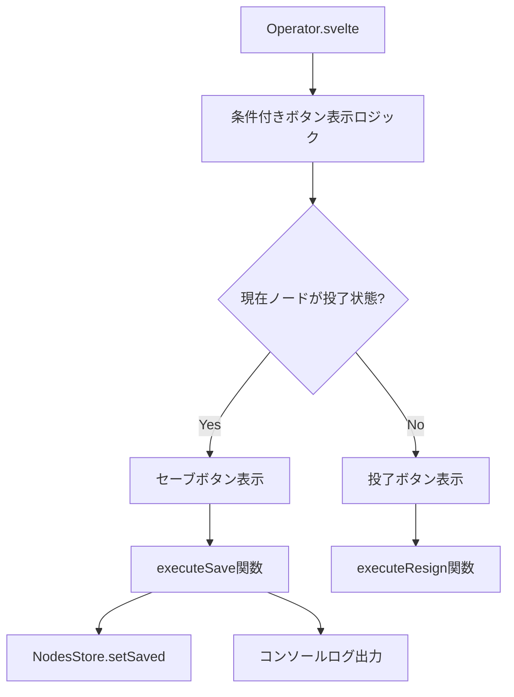
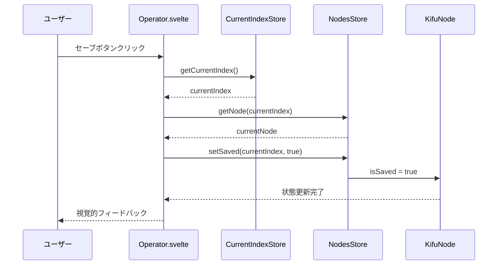
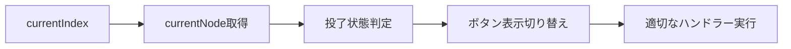
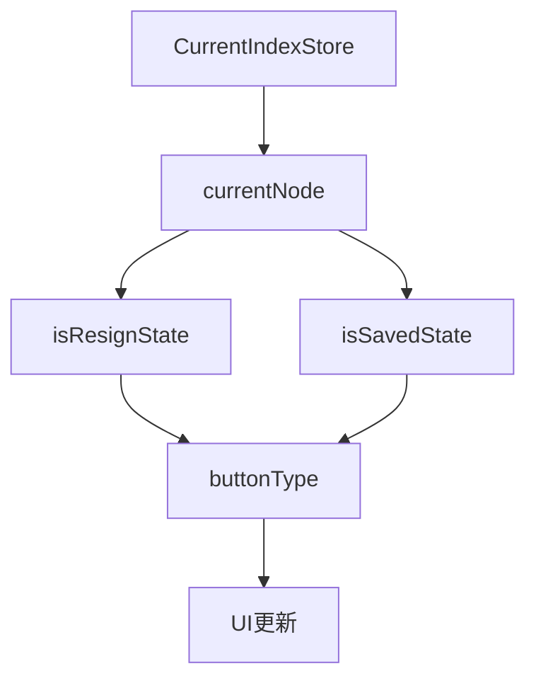
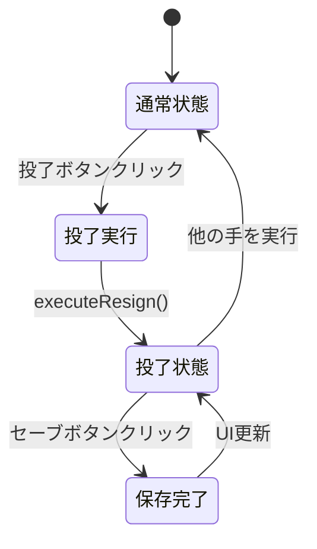

# 投了状態における条件付きボタン表示機能設計

## 概要

将棋アプリケーションの操作パネルにおいて、現在のノードが投了状態である場合に、投了ボタンの代わりにセーブボタンを表示する機能を追加します。この機能により、ユーザーは投了状態でのゲーム記録を明示的に保存できるようになります。

## 機能要件

### 表示条件

- 現在のKifuNodeのdisplayプロパティが「投了」の場合、投了ボタンの代わりにセーブボタンを表示する
- 投了状態でない場合は従来通り投了ボタンを表示する

### セーブボタンの動作

- ボタンクリック時にコンソールログを出力する
- 現在の投了ノードのisSavedフラグをtrueに設定する
- 保存後の視覚的フィードバックを提供する

## アーキテクチャ設計

### コンポーネント階層

### 状態管理フロー

現在のアプリケーションはSvelte 5の`$state`と`$derived`を使用したリアクティブ状態管理システムを採用しており、以下の状態管理パターンに従います：

## データモデル拡張

### KifuNode型の活用

既存のKifuNode型に含まれるisSavedフィールドを活用します：

| フィールド | 型      | 説明                                     |
| ---------- | ------- | ---------------------------------------- |
| isSaved    | boolean | 投了ノードが保存済みかどうかを示すフラグ |
| display    | string  | ノードの表示名（「投了」判定に使用）     |

### 状態判定ロジック

現在ノードの投了状態は以下の条件で判定されます：

| 条件                           | 判定結果 |
| ------------------------------ | -------- |
| currentNode.display === "投了" | 投了状態 |
| その他                         | 通常状態 |

## UIコンポーネント設計

### 条件付きレンダリング

Operator.svelteコンポーネントにて、$derivedを使用してリアクティブな状態判定を実装します：

### ボタン状態管理

| 状態                | ボタンテキスト | ハンドラー関数 | 有効性 |
| ------------------- | -------------- | -------------- | ------ |
| 投了状態 & 未保存   | セーブ         | executeSave    | 有効   |
| 投了状態 & 保存済み | セーブ         | executeSave    | 無効   |
| 通常状態            | 投了           | executeResign  | 有効   |

## セーブ機能実装仕様

### セーブ処理の流れ

1. **状態検証**: 現在ノードが投了状態であることを確認
2. **ログ出力**: 保存操作をコンソールに記録
3. **フラグ更新**: NodesStoreを通じてisSavedフラグを更新
4. **UI更新**: リアクティブシステムによる自動的なボタン状態更新

### セーブ関数の責務

| 責務               | 実装方法                      |
| ------------------ | ----------------------------- |
| ログ出力           | console.log()による操作記録   |
| 状態更新           | NodesStore.setSaved()呼び出し |
| エラーハンドリング | 投了状態でない場合の処理      |

## リアクティビティ設計

### 状態依存関係

### 導出状態の計算

アプリケーションは以下の導出状態を使用してUIを動的に制御します：

| 導出状態             | 依存関係            | 用途             |
| -------------------- | ------------------- | ---------------- |
| isResignState        | currentNode.display | 投了状態判定     |
| isSavedState         | currentNode.isSaved | 保存済み判定     |
| shouldShowSaveButton | isResignState       | ボタン表示制御   |
| isSaveButtonDisabled | isSavedState        | ボタン有効性制御 |

## ユーザーエクスペリエンス設計

### インタラクションフロー

### 視覚的フィードバック

| 状態       | ボタン外観         | インタラクション  |
| ---------- | ------------------ | ----------------- |
| セーブ可能 | 通常スタイル       | クリック可能      |
| 保存済み   | 無効スタイル       | クリック無効      |
| 通常状態   | 投了ボタンスタイル | executeResign実行 |

## 拡張性考慮事項

### 将来的な機能拡張

1. **複数保存形式対応**: JSON、PGN等の形式選択
2. **保存先選択**: ローカル/クラウド保存の選択
3. **保存履歴管理**: 保存タイムスタンプの記録
4. **自動保存機能**: 投了時の自動保存オプション

### 他ノード種別への応用

この設計パターンは以下の場面にも応用可能です：

- 千日手状態でのセーブ機能
- 持将棋状態でのセーブ機能
- 特定局面でのブックマーク機能

## 互換性保証

### 既存機能への影響

- 既存の投了機能は完全に保持される
- KifuNodeの既存フィールドを活用し、新規データ構造は追加しない
- Svelteのリアクティビティシステムとの完全な互換性を維持

### バックワード互換性

| 項目             | 対応方法                                     |
| ---------------- | -------------------------------------------- |
| 既存の投了ノード | isSavedフィールドのデフォルト値(false)で動作 |
| 既存のAPI        | NodesStore.setSaved()の追加のみ              |
| UI動作           | 投了状態以外では従来通りの動作               |

## UIコンポーネント設計

### 条件付きレンダリング

Operator.svelteコンポーネントにて、$derivedを使用してリアクティブな状態判定を実装します：

### ボタン状態管理

| 状態                | ボタンテキスト | ハンドラー関数 | 有効性 |
| ------------------- | -------------- | -------------- | ------ |
| 投了状態 & 未保存   | セーブ         | executeSave    | 有効   |
| 投了状態 & 保存済み | セーブ         | executeSave    | 無効   |
| 通常状態            | 投了           | executeResign  | 有効   |

## セーブ機能実装仕様

### セーブ処理の流れ

1. **状態検証**: 現在ノードが投了状態であることを確認
2. **ログ出力**: 保存操作をコンソールに記録
3. **フラグ更新**: NodesStoreを通じてisSavedフラグを更新
4. **UI更新**: リアクティブシステムによる自動的なボタン状態更新

### セーブ関数の責務

| 責務               | 実装方法                      |
| ------------------ | ----------------------------- |
| ログ出力           | console.log()による操作記録   |
| 状態更新           | NodesStore.setSaved()呼び出し |
| エラーハンドリング | 投了状態でない場合の処理      |

## リアクティビティ設計

### 状態依存関係

### 導出状態の計算

アプリケーションは以下の導出状態を使用してUIを動的に制御します：

| 導出状態             | 依存関係            | 用途             |
| -------------------- | ------------------- | ---------------- |
| isResignState        | currentNode.display | 投了状態判定     |
| isSavedState         | currentNode.isSaved | 保存済み判定     |
| shouldShowSaveButton | isResignState       | ボタン表示制御   |
| isSaveButtonDisabled | isSavedState        | ボタン有効性制御 |

## ユーザーエクスペリエンス設計

### インタラクションフロー

### 視覚的フィードバック

| 状態       | ボタン外観         | インタラクション  |
| ---------- | ------------------ | ----------------- |
| セーブ可能 | 通常スタイル       | クリック可能      |
| 保存済み   | 無効スタイル       | クリック無効      |
| 通常状態   | 投了ボタンスタイル | executeResign実行 |

## 拡張性考慮事項

### 将来的な機能拡張

1. **複数保存形式対応**: JSON、PGN等の形式選択
2. **保存先選択**: ローカル/クラウド保存の選択
3. **保存履歴管理**: 保存タイムスタンプの記録
4. **自動保存機能**: 投了時の自動保存オプション

### 他ノード種別への応用

この設計パターンは以下の場面にも応用可能です：

- 千日手状態でのセーブ機能
- 持将棋状態でのセーブ機能
- 特定局面でのブックマーク機能

## 互換性保証

### 既存機能への影響

- 既存の投了機能は完全に保持される
- KifuNodeの既存フィールドを活用し、新規データ構造は追加しない
- Svelteのリアクティビティシステムとの完全な互換性を維持

### バックワード互換性

| 項目             | 対応方法                                     |
| ---------------- | -------------------------------------------- |
| 既存の投了ノード | isSavedフィールドのデフォルト値(false)で動作 |
| 既存のAPI        | NodesStore.setSaved()の追加のみ              |
| UI動作           | 投了状態以外では従来通りの動作               |
