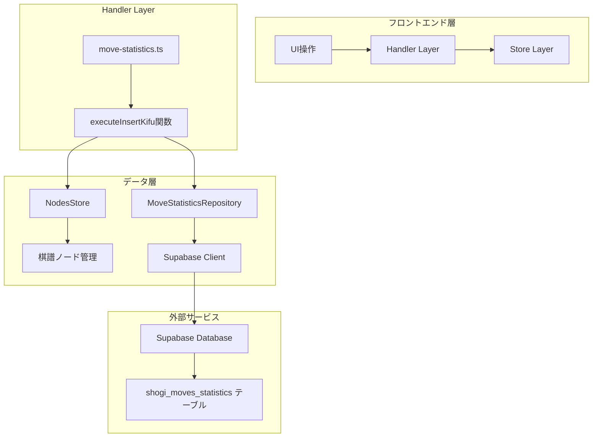
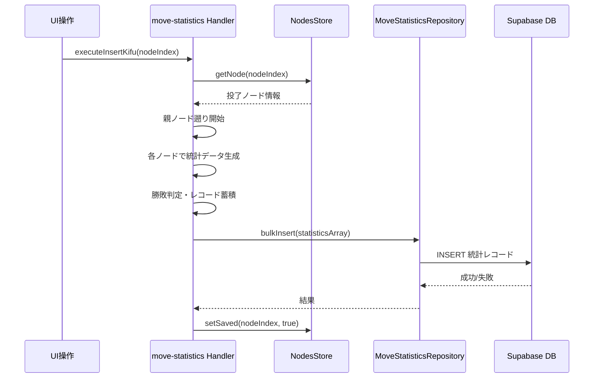
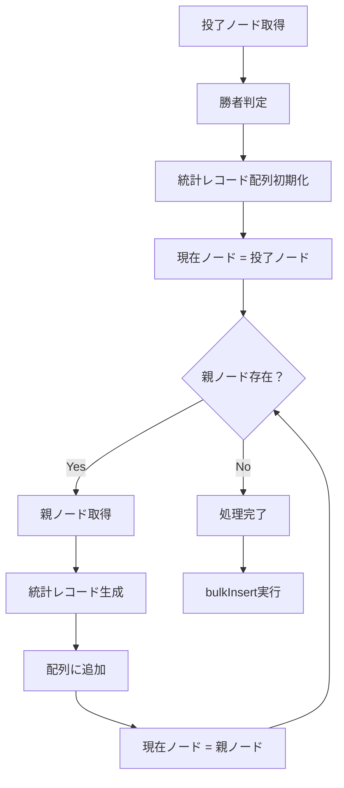
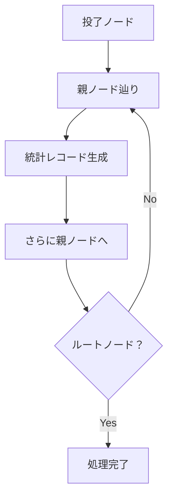
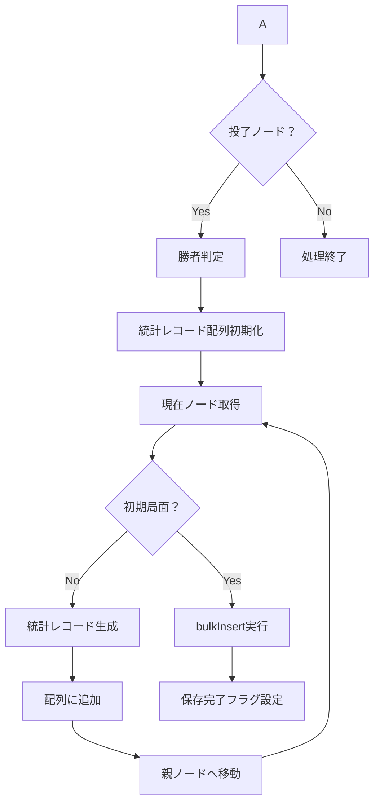
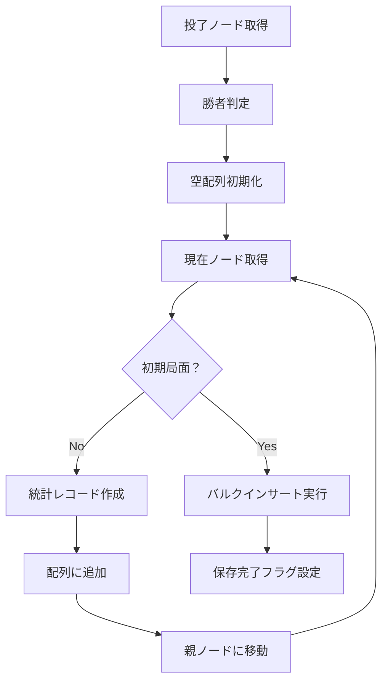
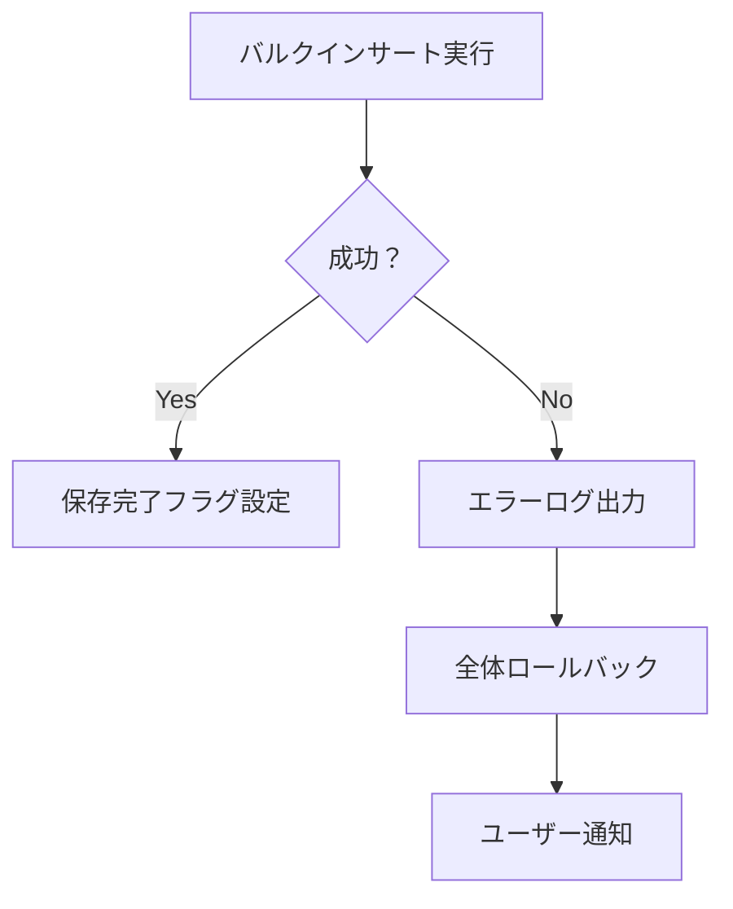

# 指し手統計レコード作成機能の設計

## 概要

将棋アプリケーションにおいて、投了時に棋譜の全局面から統計データを生成し、Supabaseの`shogi_moves_statistics`テーブルに一括保存する機能を設計します。末端の投了ノードから親ノードを遡りながら統計レコード配列を構築し、バルクインサートで効率的にデータベースに保存します。

**注意**: 本機能についてはテストを実装せず、シンプルな実装のみを行います。

## アーキテクチャ

### システム構成

### データフロー

## 核心機能の詳細設計

### executeInsertKifu機能の実装戦略

#### 入力検証

| 検証項目     | 条件                          | 処理                         |
| ------------ | ----------------------------- | ---------------------------- |
| ノード存在性 | nodeIndexが有効範囲内         | 無効な場合は早期リターン     |
| 投了状態     | currentNode.move === "resign" | 投了以外は警告メッセージ表示 |
| 保存済み状態 | currentNode.isSaved === false | 既保存の場合は処理スキップ   |

#### 遡り処理アルゴリズム

#### 処理効率の改善点

| 改善項目     | 従来方式          | 新方式         | 利点           |
| ------------ | ----------------- | -------------- | -------------- |
| メモリ使用量 | 全パス配列を生成  | 逐次処理       | メモリ効率向上 |
| 処理順序     | パス取得→統計生成 | 遡りながら生成 | 処理の単純化   |
| エラー処理   | 途中で全体失敗    | 早期検出可能   | 障害対応向上   |

#### 棋譜遡り処理

#### 勝敗判定ロジック

| 判定要素     | ロジック              | 結果                   |
| ------------ | --------------------- | ---------------------- |
| 投了手番     | resignNode.isSente    | 投了した側の判定       |
| 各局面の勝者 | !resignNode.isSente   | 投了していない側が勝者 |
| 統計レコード | 局面手番 === 勝者手番 | win=true, lose=false   |
| 統計レコード | 局面手番 !== 勝者手番 | win=false, lose=true   |

### データ変換処理

#### 遡り統計レコード生成

#### バルクインサート配列構築

#### 実装の要点

| 処理項目         | 実装方針                            | 理由                   |
| ---------------- | ----------------------------------- | ---------------------- |
| データ配列       | 遡りながら構築                      | メモリ効率の向上       |
| 勝敗判定         | 投了手番の逆が勝者                  | シンプルな判定ロジック |
| timeout          | false固定                           | 投了による終了のため   |
| バルクインサート | MoveStatisticsRepository.bulkInsert | 効率的なDB操作         |

#### レコード構造

| フィールド | 型          | 説明            | 値の例                                                            |
| ---------- | ----------- | --------------- | ----------------------------------------------------------------- |
| sfenx      | string      | 局面のSFENX表記 | "lnsgkgsnl/1r5b1/ppppppppp/9/9/9/PPPPPPPPP/1B5R1/LNSGKGSNL b - 1" |
| move       | string      | 指し手表記      | "7g7f"                                                            |
| win        | boolean     | 該当手番の勝利  | true/false                                                        |
| lose       | boolean     | 該当手番の敗北  | true/false                                                        |
| timeout    | boolean     | 時間切れ負け    | false（固定値）                                                   |
| user_id    | string/null | ユーザーID      | null（匿名データとして保存）                                      |

## データベース連携

### Supabaseテーブル設計

#### shogi_moves_statisticsテーブル

| カラム名   | 型          | 制約                                | 説明            |
| ---------- | ----------- | ----------------------------------- | --------------- |
| id         | bigint      | PK, AUTO_INCREMENT                  | レコードID      |
| created_at | timestamptz | NOT NULL, DEFAULT NOW()             | 作成日時        |
| sfenx      | text        | NOT NULL                            | 局面のSFENX表記 |
| move       | text        | NOT NULL                            | 指し手表記      |
| win        | boolean     | NOT NULL                            | 勝利フラグ      |
| lose       | boolean     | NOT NULL                            | 敗北フラグ      |
| timeout    | boolean     | NOT NULL                            | 時間切れフラグ  |
| user_id    | uuid        | NULLABLE, REFERENCES auth.users(id) | ユーザーID      |

### バルクインサート処理

#### Supabaseバルクインサートの特徴

| 特徴             | 詳細                         | 利点                             |
| ---------------- | ---------------------------- | -------------------------------- |
| 一括処理         | 配列として複数レコードを送信 | ネットワークラウンドトリップ削減 |
| トランザクション | 全件成功または全件失敗       | データ整合性保証                 |
| 処理制限         | 1回あたり1000件まで          | パフォーマンス最適化             |

#### エラーハンドリング

## エラーハンドリング

### 基本的なエラー処理

| エラー種別           | 発生場面               | 対処方法                          |
| -------------------- | ---------------------- | --------------------------------- |
| バリデーションエラー | 投了ノード以外での実行 | 警告メッセージ・早期リターン      |
| ノード不正           | 遡り中の不正なノード   | エラーログ・処理中断              |
| DB接続エラー         | バルクインサート時     | 例外スロー・呼び出し側でtry-catch |
