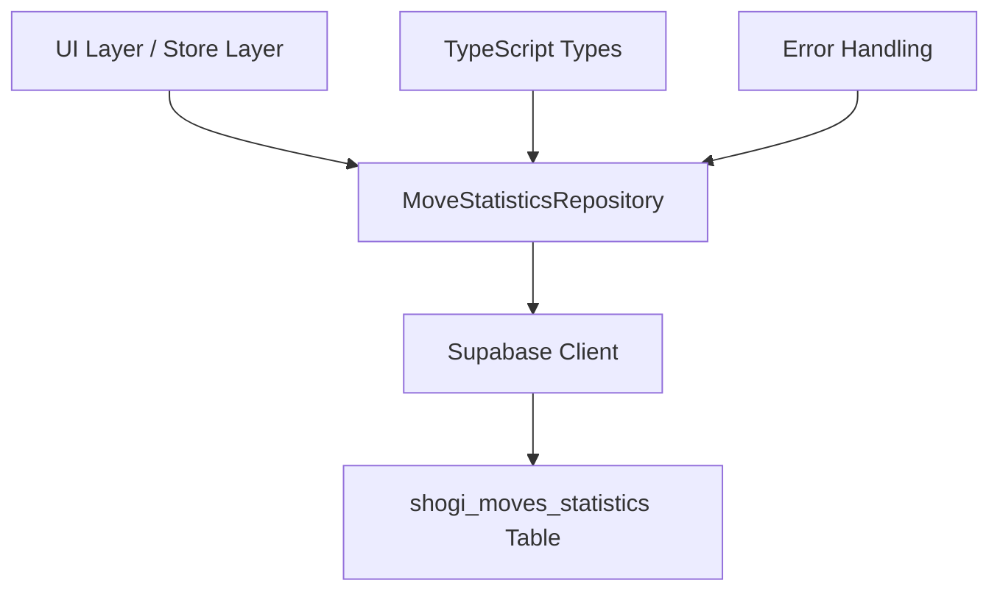
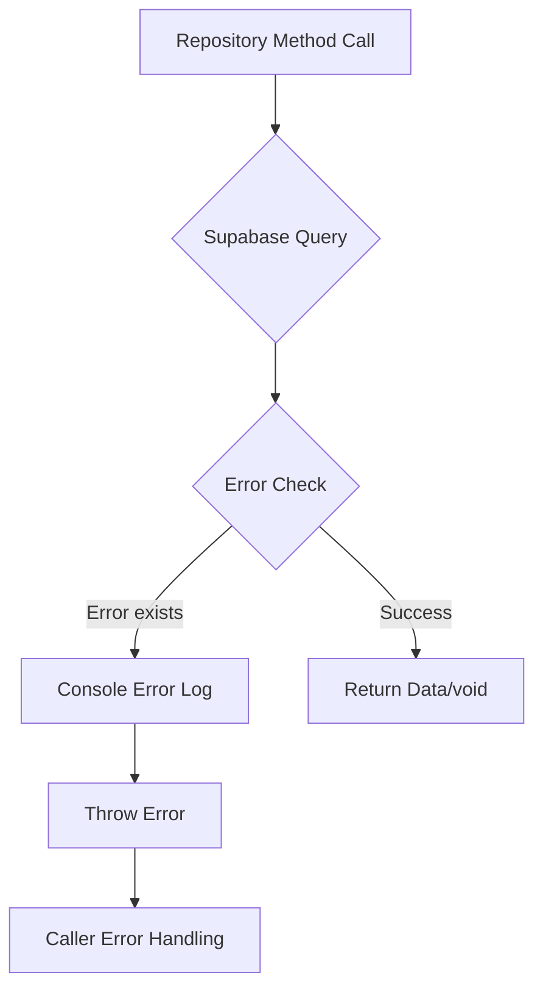

# Move Statistics Repository 設計文書

## 概要

本文書は、SvelteShogiプロジェクトにおける将棋手の統計情報を管理する`move-statistics.ts`リポジトリの設計について説明する。このリポジトリは、Supabaseデータベースの`shogi_moves_statistics`テーブルに対する型安全なCRUD操作を提供し、将棋の手に関する勝敗統計やタイムアウト情報を管理する。

## アーキテクチャ

### レイヤー構成



### 設計パターン

- **Repositoryパターン**: データアクセス層を抽象化し、ビジネスロジックから分離
- **Static Classアプローチ**: 既存のFavoriteMovesRepositoryと同様の設計に準拠
- **型安全性**: Supabase生成型を活用した完全な型安全性を保証

## データモデル

### shogi_moves_statistics テーブル構造

| カラム名   | データ型                 | 制約                                | 説明                 |
| ---------- | ------------------------ | ----------------------------------- | -------------------- |
| id         | bigint                   | PRIMARY KEY, AUTO INCREMENT         | レコードの一意識別子 |
| created_at | timestamp with time zone | DEFAULT now()                       | レコード作成日時     |
| sfenx      | text                     | NOT NULL                            | 局面のSFENX表記      |
| move       | text                     | NOT NULL                            | 手の表記             |
| win        | boolean                  | NOT NULL                            | 勝利フラグ           |
| lose       | boolean                  | NOT NULL                            | 敗北フラグ           |
| timeout    | boolean                  | NOT NULL                            | タイムアウトフラグ   |
| user_id    | uuid                     | NULLABLE, REFERENCES auth.users(id) | ユーザー識別子       |

### 型定義

Supabase自動生成型を使用：

```
MoveStatisticsRow = Database["public"]["Tables"]["shogi_moves_statistics"]["Row"]
MoveStatisticsInsert = Database["public"]["Tables"]["shogi_moves_statistics"]["Insert"]
MoveStatisticsUpdate = Database["public"]["Tables"]["shogi_moves_statistics"]["Update"]
```

## リポジトリAPI設計

### MoveStatisticsRepository クラス

#### fetch メソッド

**目的**: 指定された局面と手の統計情報を取得

**シグネチャ**:

```
static async fetch(sfenx: string, move?: string, userId?: string): Promise<MoveStatisticsRow[]>
```

**パラメータ**:

- `sfenx`: 対象局面のSFENX表記（必須）
- `move`: 特定の手の表記（オプション、指定時はその手のみ取得）
- `userId`: ユーザーID（オプション、未指定時は匿名データのみ取得）

**フィルタリングロジック**:

- `sfenx`で局面を特定
- `move`が指定された場合は該当する手のみ
- `userId`の有無により認証済み/匿名データを区別

**戻り値**: 統計情報レコードの配列

#### insert メソッド

**目的**: 新しい統計情報レコードを挿入

**シグネチャ**:

```
static async insert(params: MoveStatisticsInsertParams): Promise<void>
```

**パラメータオブジェクト**:

```
interface MoveStatisticsInsertParams {
  sfenx: string;
  move: string;
  win: boolean;
  lose: boolean;
  timeout: boolean;
  userId?: string;
}
```

**挿入データ変換**:

- パラメータをSupabase Insert型に適合
- `user_id`の適切な設定（null許可）

#### delete メソッド

**目的**: 指定条件の統計情報レコードを削除

**シグネチャ**:

```
static async delete(sfenx: string, move?: string, userId?: string): Promise<void>
```

**パラメータ**:

- `sfenx`: 対象局面のSFENX表記（必須）
- `move`: 特定の手の表記（オプション、指定時はその手のみ削除）
- `userId`: ユーザーID（オプション、権限制御に使用）

**削除ロジック**:

- 基本的に`sfenx`で局面を特定
- `move`が指定された場合は該当する手のみ削除
- RLSポリシーによりユーザー権限を自動適用

## エラーハンドリング戦略

### エラータイプ

1. **データベースエラー**: Supabaseクライアントからのエラー
2. **権限エラー**: RLSポリシー違反
3. **バリデーションエラー**: 入力データの形式不正
4. **ネットワークエラー**: 接続障害

### エラー処理フロー



### エラーメッセージ設計

- コンソールログ: 詳細なエラー情報を開発者向けに出力
- スロー: 呼び出し元で適切にハンドリングできるようSupabaseエラーをそのまま投げる

## セキュリティ考慮事項

### Row Level Security (RLS) 準拠

- **読み取り**: `auth.uid() = user_id OR user_id IS NULL`
- **挿入/更新/削除**: ユーザー認証状態に基づく自動制御
- 匿名データ（`user_id IS NULL`）は全ユーザーから読み取り可能

### ユーザー権限分離

- 認証済みユーザー: 自身のデータのみアクセス可能
- 匿名ユーザー: 匿名データの読み取りのみ可能
- データベースレベルでの強制的な権限制御

## パフォーマンス考慮事項

### インデックス活用

- `user_id`カラムのインデックス（`idx_moves_statistics_user_id`）を活用
- 頻繁なクエリパターンに対応したインデックス設計

### クエリ最適化

- 必要最小限のカラムのみ選択
- 適切なフィルタリング条件の適用
- バッチ操作の考慮（将来的な拡張）

## テスト戦略

### 単体テスト対象

1. **fetchメソッド**:
   - 局面指定での統計取得
   - 手指定での絞り込み
   - ユーザー権限による結果分離

2. **insertメソッド**:
   - 正常な統計情報の挿入
   - 各結果フラグの組み合わせ
   - ユーザーIDの適切な設定

3. **deleteメソッド**:
   - 条件指定での削除
   - 権限制御の動作確認

### エラーケーステスト

- 無効なSFENX形式
- データベース接続エラー
- 権限違反エラー

## 実装指針

### コードスタイル

- 既存のFavoriteMovesRepositoryと統一された命名規則
- TypeScript strict modeに準拠
- ESLint/Prettierルールに従った整形

### 依存関係

- Supabaseクライアント（`./client`）
- 型定義（`./types`）
- エラーハンドリングパターンの統一

### 拡張性考慮

- 将来的な統計項目追加への対応
- バッチ操作APIの追加余地
- リアルタイム購読機能への拡張可能性
