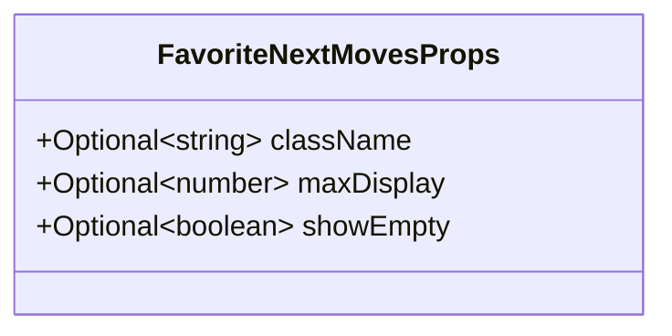
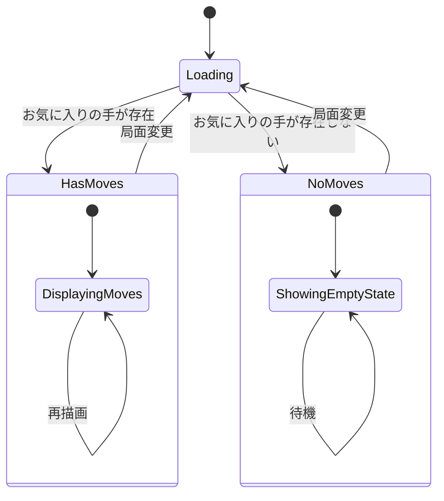
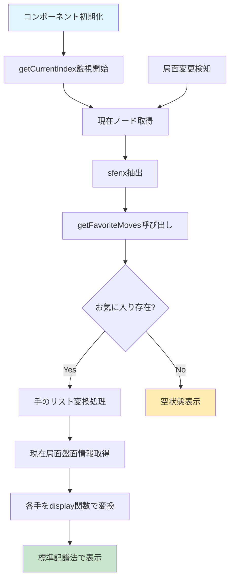
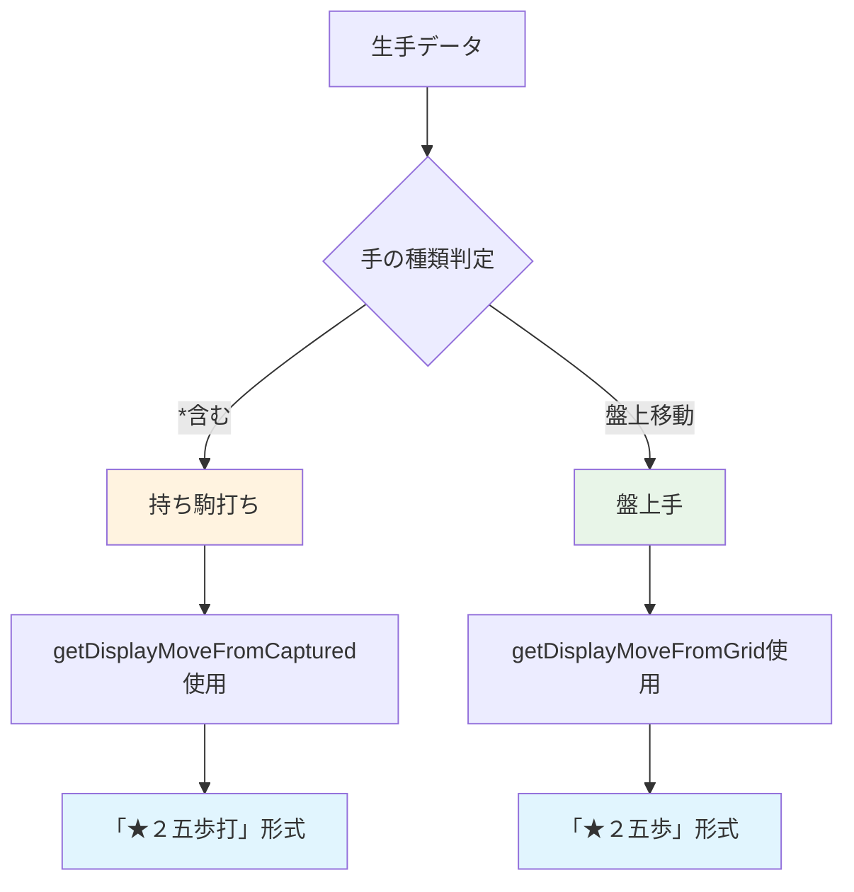
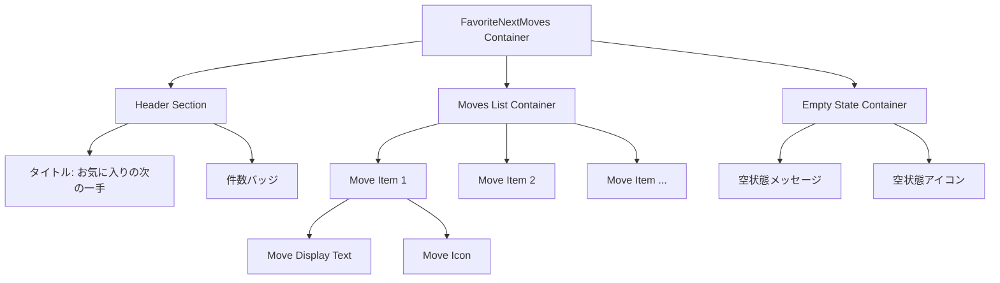
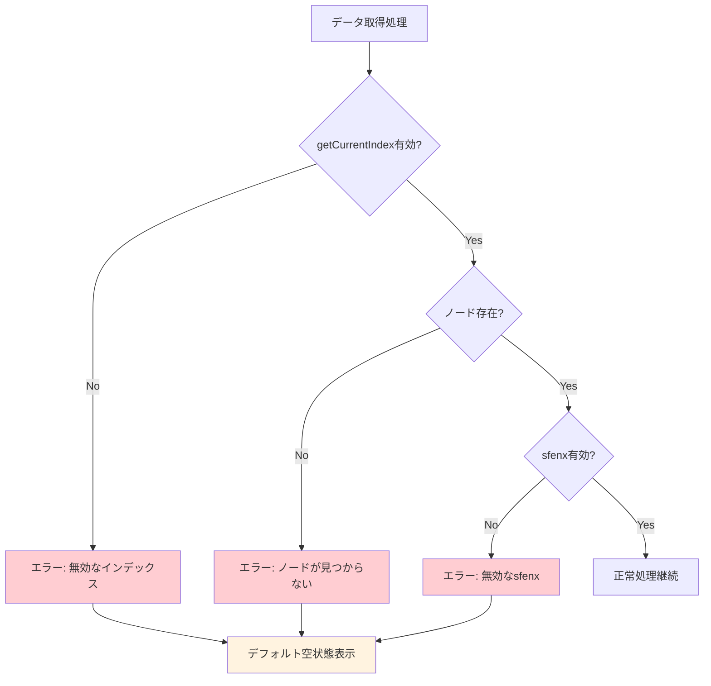
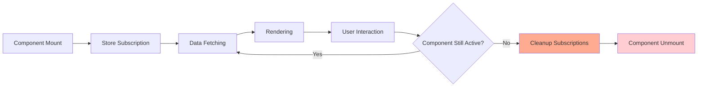
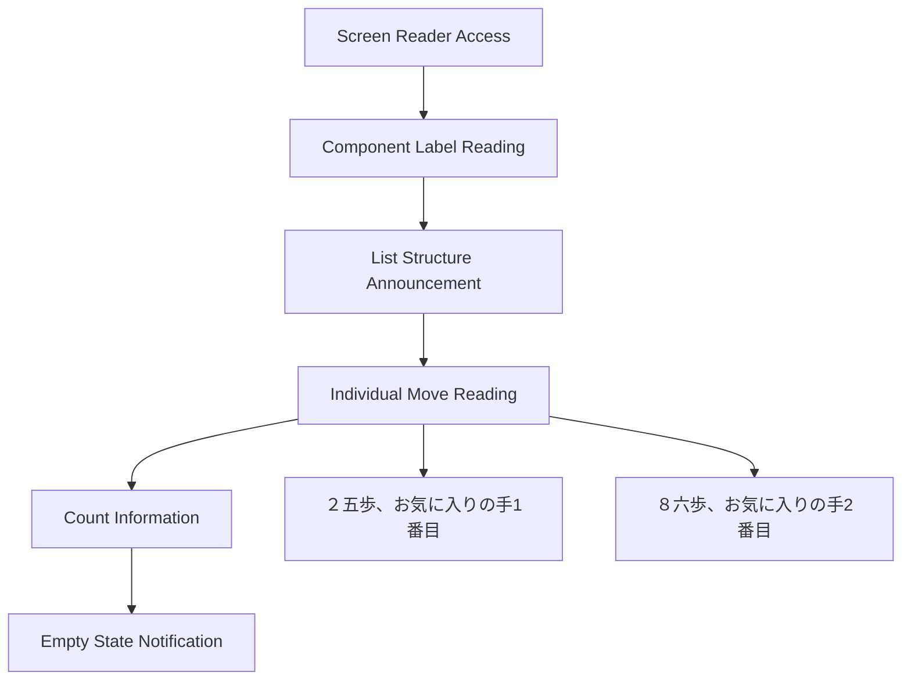
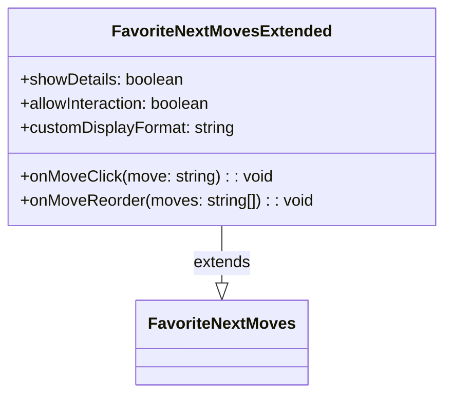

# お気に入り次の一手表示コンポーネント設計

## 概要

現在の局面（sfenx）に対応するお気に入りの次の一手を視覚的に表示するUIコンポーネントの設計。ユーザーが事前に登録したお気に入りの手を、標準的な将棋記譜法（２五歩形式）で表示し、学習や復習を支援する。

## 技術スタック & 依存関係

### 使用技術

- **フレームワーク**: Svelte 5 (Composition API パターン)
- **状態管理**: Svelte reactive store pattern
- **型安全性**: TypeScript strict mode
- **スタイリング**: Scoped CSS (コンポーネント内)

### 依存する既存モジュール

| モジュール                   | 用途                        | インポートパス                  |
| ---------------------------- | --------------------------- | ------------------------------- |
| `getFavoriteMoves`           | お気に入り手の取得          | `@/store/favorite-moves.svelte` |
| `getNode`                    | 現在ノード情報の取得        | `@/store/kifu-node.svelte`      |
| `getCurrentIndex`            | 現在ノードインデックス      | `@/store/kifu-node.svelte`      |
| `getDisplayMoveFromGrid`     | 盤上手の表示形式変換        | `@/domain/display`              |
| `getDisplayMoveFromCaptured` | 持ち駒手の表示形式変換      | `@/domain/display`              |
| `getGrid`                    | 盤面状態の取得              | `@/store/game-board.svelte`     |
| `sfenxToShogiBoard`          | SFENX形式から将棋盤面へ変換 | `@/domain/sfenx`                |

## データ処理の詳細仕様

### お気に入り手データの前提

- storeに格納されている手データは未変換の生データ
- "2g2f", "8c8d"等の座標形式で保存
- 表示時にdisplay関数で「２五歩」形式に変換が必要
- fetchやAPI呼び出しは事前に完了済み

## コンポーネント定義

### コンポーネント名

`FavoriteNextMoves.svelte`

### Props インターフェース

| プロパティ   | 型         | デフォルト値 | 説明               |
| ------------ | ---------- | ------------ | ------------------ |
| `className`  | `string?`  | `undefined`  | 追加CSSクラス      |
| `maxDisplay` | `number?`  | `5`          | 最大表示件数       |
| `showEmpty`  | `boolean?` | `true`       | 空の場合の表示制御 |

### 内部状態管理

## データフロー設計

### リアクティブデータ取得

### データ変換フロー

| ステップ | 入力                 | 出力             | 処理内容                         |
| -------- | -------------------- | ---------------- | -------------------------------- |
| 1        | `currentIndex`       | `KifuNode`       | ノード情報取得                   |
| 2        | `KifuNode.sfenx`     | `string`         | 局面文字列抽出                   |
| 3        | `sfenx`              | `string[]?`      | お気に入り手配列取得（生データ） |
| 4        | `string[]`           | `string[]`       | display関数で標準記譜法に変換    |
| 5        | `current node sfenx` | `grid, captured` | 現在局面の盤面情報取得           |

## 手データ変換ロジック

### 変換処理の詳細

生の手データ（"2g2f", "P\*2d"等）を標準記譜法に変換するための処理フロー：

### 必要なパラメータ

| 関数                         | 必要パラメータ                           | 取得元                   |
| ---------------------------- | ---------------------------------------- | ------------------------ |
| `getDisplayMoveFromGrid`     | `grid`, `from`, `to`, `lastPos`          | 現在局面から算出         |
| `getDisplayMoveFromCaptured` | `grid`, `row`, `col`, `piece`, `isSente` | 手データをパースして取得 |

### 手データパーシング例

| 入力    | 種類       | 出力例      |
| ------- | ---------- | ----------- |
| "2g2f"  | 盤上移動   | "★２六歩"   |
| "P\*2d" | 持ち駒打ち | "★２四歩打" |
| "8c8d"  | 盤上移動   | "☆８四歩"   |

### 基本レイアウト構造

### 表示項目設計

#### ヘッダーセクション

- **タイトル**: "お気に入りの次の一手"
- **件数表示**: "（3件）" 形式
- **視覚的区切り**: 下線または枠線

#### 手の一覧表示

- **表示形式**: "２五歩", "８六歩", "７六歩" など標準記譜法
- **アイコン**: ⭐ または 👍 でお気に入りを表現
- **順序**: データベース登録順で表示
- **制限**: maxDisplay件数まで表示

#### 空状態表示

- **メッセージ**: "この局面にお気に入りの手は登録されていません"
- **アイコン**: 📝 または ➕
- **説明**: "手を指した後、お気に入りボタンで登録できます"

### レスポンシブ対応

| 画面サイズ   | レイアウト特性 | 調整内容    |
| ------------ | -------------- | ----------- |
| デスクトップ | 横並び表示     | 最大5件表示 |
| タブレット   | 縦並び表示     | 最大3件表示 |
| モバイル     | 縦並び表示     | 最大3件表示 |

## エラーハンドリング & エッジケース

### エラーシナリオ対応

### エラー状態の表示方針

| エラータイプ       | 表示内容                     | ユーザーアクション |
| ------------------ | ---------------------------- | ------------------ |
| データ取得失敗     | "情報を取得できませんでした" | リロード推奨       |
| 無効な局面         | "現在の局面が不正です"       | ゲーム再開始推奨   |
| ネットワークエラー | "接続エラーが発生しました"   | 再試行ボタン表示   |

## パフォーマンス最適化

### レンダリング最適化戦略

1. **リアクティブ更新の最小化**
   - currentIndexの変更時のみ再計算
   - sfenxが同一の場合はキャッシュ利用

2. **メモ化によるパフォーマンス向上**
   - Svelte derived storeでの中間計算結果キャッシュ
   - 重複するsfenxクエリの回避

3. **DOM更新の効率化**
   - 仮想スクロールは不要（最大5件のため）
   - シンプルなリスト再描画で対応

### メモリ管理

## アクセシビリティ要件

### WAI-ARIA対応

| 要素        | 属性         | 値                     | 目的           |
| ----------- | ------------ | ---------------------- | -------------- |
| Container   | `role`       | `region`               | セクション識別 |
| Container   | `aria-label` | "お気に入りの次の一手" | 領域の説明     |
| Move List   | `role`       | `list`                 | リスト構造     |
| Move Item   | `role`       | `listitem`             | リスト項目     |
| Empty State | `aria-live`  | `polite`               | 状態変更通知   |

### キーボードナビゲーション

- **Tab移動**: 各手項目への順次移動
- **Enter/Space**: 項目選択（将来的な機能拡張用）
- **Escape**: フォーカス解除

### スクリーンリーダー対応

## 将来の拡張可能性

### 想定される機能追加

1. **手の詳細情報表示**
   - ホバー時の追加情報
   - 評価値や過去の戦績

2. **インタラクティブ機能**
   - クリックでその手を実行
   - ドラッグ&ドロップでの順序変更

3. **カスタマイズ機能**
   - 表示件数の動的変更
   - 表示形式の切り替え（詳細/簡易）

### 拡張時の設計考慮点

