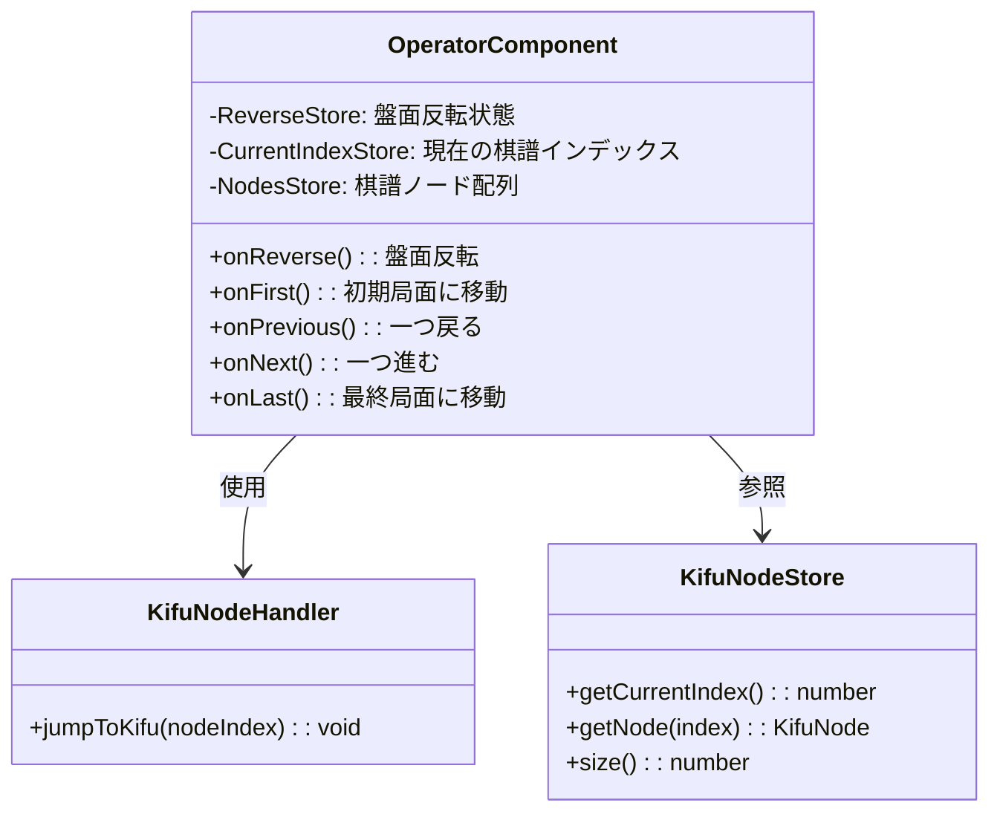
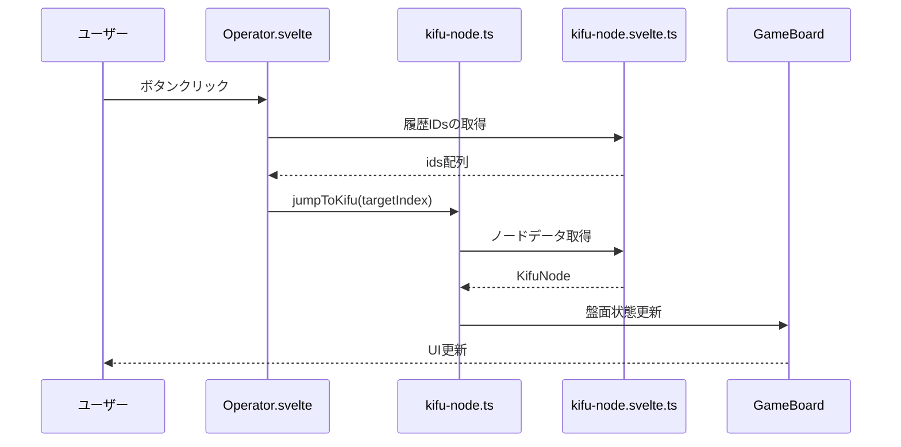
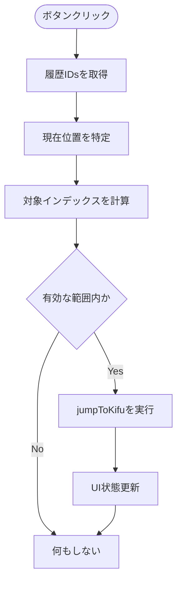
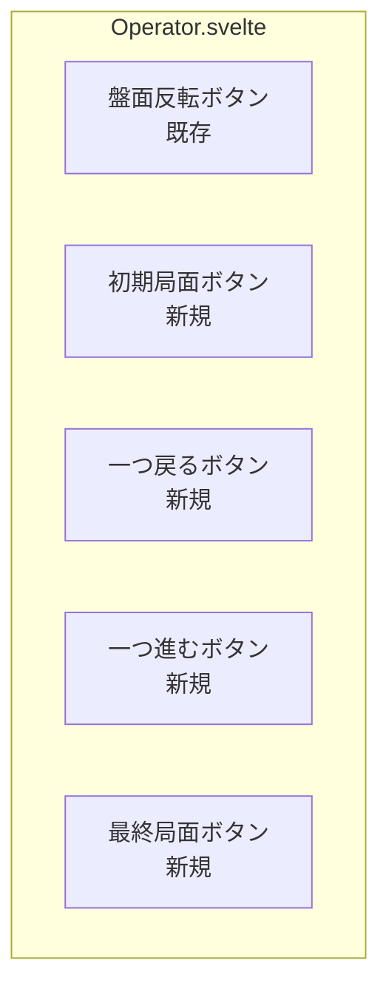

# Operator.svelte 履歴ナビゲーションボタン追加設計

## 概要

Operator.svelteコンポーネントに棋譜履歴をナビゲートするための4つのボタンを追加する機能設計です。現在のOperator.svelteには盤面反転ボタンのみが実装されており、ここに履歴操作ボタンを追加することで、ユーザーが棋譜の履歴を効率的にナビゲートできるようになります。

## 技術スタック & 依存関係

### 既存の技術要素

- **Svelte 5**: リアクティブなUI構築
- **TypeScript**: 型安全な開発
- **Svelte Stores**: 状態管理（kifu-node.svelte.ts）
- **Mermaid**: 設計図の可視化

### 既存の依存関係

- `@/store/kifu-node.svelte`: 棋譜ノードの状態管理
- `@/handler/kifu-node`: 棋譜ナビゲーション処理
- `@/store/game-board.svelte`: 盤面反転状態管理

## アーキテクチャ

### コンポーネント構成

### データフロー

## 機能仕様

### ボタン機能定義

| ボタン   | 機能             | 対象インデックス    | 説明           |
| -------- | ---------------- | ------------------- | -------------- |
| 初期局面 | 最初の局面に移動 | ids[0]              | 棋譜の開始地点 |
| 一つ戻る | 前の局面に移動   | ids[currentPos - 1] | 1手戻る        |
| 一つ進む | 次の局面に移動   | ids[currentPos + 1] | 1手進む        |
| 最終局面 | 最後の局面に移動 | ids[ids.length - 1] | 棋譜の終了地点 |

### 状態管理ロジック

### ボタン状態制御

各ボタンの有効/無効状態は現在位置に基づいて動的に決定されます：

| 条件           | 初期局面 | 一つ戻る | 一つ進む | 最終局面 |
| -------------- | -------- | -------- | -------- | -------- |
| 初期局面にいる | 無効     | 無効     | 有効     | 有効     |
| 中間局面にいる | 有効     | 有効     | 有効     | 有効     |
| 最終局面にいる | 有効     | 有効     | 無効     | 無効     |
| 履歴が空       | 無効     | 無効     | 無効     | 無効     |

## UIコンポーネント設計

### レイアウト構造

既存のOperator.svelteの構造を拡張し、盤面反転ボタンと履歴ナビゲーションボタンを併存させます。

### ボタンデザイン仕様

各ボタンは統一されたスタイリングを持ち、視覚的に機能が分かりやすいアイコンを使用します：

| ボタン   | アイコン表現 | 色彩設計 |
| -------- | ------------ | -------- |
| 初期局面 | ⏮ または ⇤  | 基本色   |
| 一つ戻る | ⏪ または ◀ | 基本色   |
| 一つ進む | ⏩ または ▶ | 基本色   |
| 最終局面 | ⏭ または ⇥  | 基本色   |

### アクセシビリティ配慮

- **aria-label**: 各ボタンに適切なラベルを設定
- **キーボード操作**: tabindexによるフォーカス管理
- **スクリーンリーダー対応**: ボタンの状態と機能を音声で説明
- **無効状態**: disabled属性による視覚的・機能的制御

## 実装戦略

### Phase 1: 基本機能実装

1. 既存のOperator.svelteに履歴ナビゲーション関数を追加
2. 4つのボタンのマークアップとイベントハンドラを実装
3. 基本的なスタイリングを適用

### Phase 2: 状態管理強化

1. ボタンの有効/無効状態を動的に制御
2. 現在位置に基づく条件分岐ロジックを実装
3. エラーハンドリングの追加

### Phase 3: UI/UX改善

1. アイコンまたは記号による視覚的表現の改善
2. ホバー効果やアニメーションの追加
3. レスポンシブデザインの調整

## 技術的考慮事項

### パフォーマンス

- `$derived`を使用したリアクティブな状態計算により、不要な再計算を防止
- `ids`配列の取得は効率的なノード走査により実現

### メモリ管理

- 既存のstore構造を活用し、追加のメモリオーバーヘッドを最小限に抑制
- イベントリスナーの適切なクリーンアップ

### 型安全性

- TypeScriptの型定義を活用した安全な実装
- KifuNode型との整合性を保持

## 統合テスト戦略

設計段階ではテストコードの実装は対象外ですが、以下の検証ポイントを定義します：

### 機能テスト項目

- 各ボタンの基本動作確認
- 境界条件での動作検証（空の履歴、単一ノード等）
- 既存の盤面反転機能との共存確認

### ユーザビリティテスト項目

- ボタン配置の使いやすさ
- 視覚的フィードバックの明確性
- キーボードナビゲーションの流暢性

## リスク分析

### 技術的リスク

- **既存機能への影響**: 盤面反転ボタンとの競合可能性 → 独立した実装により回避
- **パフォーマンス劣化**: 追加の状態計算負荷 → 効率的なderived使用により軽減

### ユーザー体験リスク

- **操作性の複雑化**: ボタン数の増加によるUI混乱 → 直感的なアイコン設計により対応
- **学習コストの増加**: 新機能の習得負荷 → 既存のキーボードナビゲーションとの一貫性確保

## 将来的な拡張可能性

### 機能拡張

- ショートカットキーとの連携強化
- 履歴ナビゲーションのアニメーション効果
- カスタマイズ可能なボタン配置

### アーキテクチャ発展

- 他のコンポーネントとの統合API
- プラグイン機構による機能拡張
- 設定可能なナビゲーション動作
