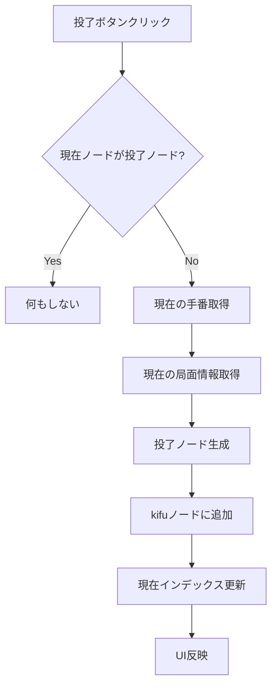
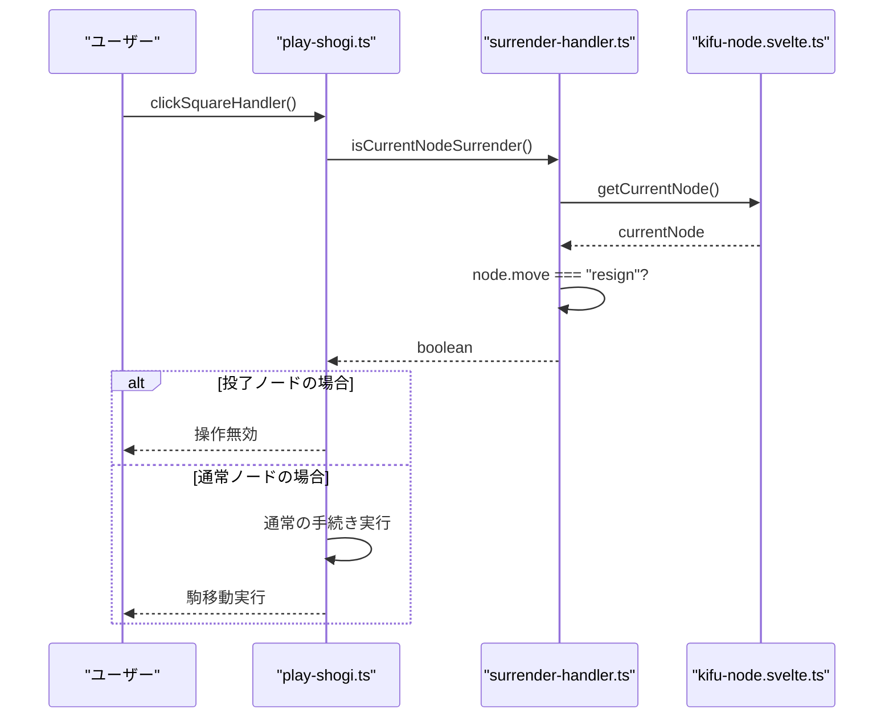
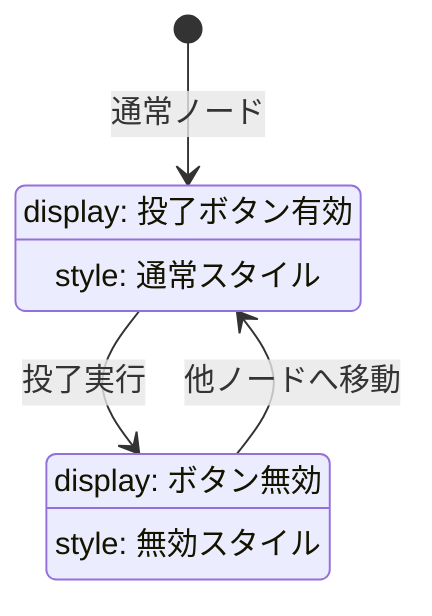

# 投了ボタン機能設計

## 概要

将棋アプリケーションのOperatorコンポーネントに投了ボタンを追加し、投了ノードを生成・管理する機能を設計します。投了ノード到達時には盤面でのプレイ継続を防止し、ゲーム終了状態を適切に管理します。

## 投了システムアーキテクチャ

```mermaid
graph TB
    subgraph "UI Layer"
        A[Operator.svelte]
        B[MainView]
    end

    subgraph "Handler Layer"
        C[surrender-handler.ts]
        D[execute-move.ts]
        E[play-shogi.ts]
    end

    subgraph "Store Layer"
        F[kifu-node.svelte.ts]
        G[game-board.svelte.ts]
        H[play-game.svelte.ts]
    end

    A --> C : "投了ボタンクリック"
    C --> F : "投了ノード追加"
    C --> G : "ゲーム状態更新"
    D --> C : "投了ノード検証"
    E --> C : "プレイ可能性確認"

    F --> A : "投了状態通知"
    G --> A : "手番状態"
    H --> E : "プレイ制限"
```

## 投了ノードデータモデル

投了ノードは既存のKifuNodeインターフェースを使用し、特定の属性値で識別します：

| 属性       | 投了ノードでの値   | 説明                            |
| ---------- | ------------------ | ------------------------------- |
| display    | "投了"             | 棋譜表示用テキスト              |
| move       | "resign"           | 投了を示す特別な移動識別子      |
| sfenx      | 現在の局面         | 投了時点の盤面状態              |
| isSente    | 投了者の手番       | true: 先手投了, false: 後手投了 |
| next       | -1                 | 投了後は次の手なし              |
| br_next    | 自身のインデックス | 分岐なし                        |
| isFavorite | false              | お気に入り設定なし              |

## 投了機能実装設計

### 投了ハンドラー

投了処理を管理する専用ハンドラーを作成します：



### プレイ制限メカニズム

投了ノード検出時のプレイ制限実装：



## Operatorコンポーネント拡張

### ボタン配置設計

既存のナビゲーションボタンと反転ボタンの間に投了ボタンを配置：

| ボタン順序 | 機能     | 有効条件                         |
| ---------- | -------- | -------------------------------- |
| 1          | 最初へ   | 履歴あり且つ現在位置が初期でない |
| 2          | 前へ     | 履歴あり且つ現在位置が初期でない |
| 3          | 次へ     | 履歴あり且つ次の手が存在         |
| 4          | 最後へ   | 履歴あり且つ次の手が存在         |
| 5          | **投了** | **現在ノードが投了ノードでない** |
| 6          | 反転     | 常時有効                         |

### 投了ボタン状態管理



## ゲーム状態制御

### 投了状態判定ロジック

投了ノードの識別と状態管理：

| 判定条件               | 結果       | 影響範囲           |
| ---------------------- | ---------- | ------------------ |
| node.move === "resign" | 投了ノード | プレイ制限、UI表示 |
| node.move !== "resign" | 通常ノード | 通常プレイ継続     |

### プレイ継続制限

投了ノード到達時の制限事項：

| 制限対象   | 制限内容               | 実装箇所             |
| ---------- | ---------------------- | -------------------- |
| 駒選択     | クリック無効化         | clickSquareHandler   |
| 駒台操作   | クリック無効化         | clickCapturedHandler |
| 成り選択   | 選択無効化             | 成り処理関数         |
| 新規手追加 | pushOrJumpToKifu無効化 | execute-move.ts      |

## UI/UXデザイン仕様

### 投了ボタンデザイン

暫定的なボタンデザイン仕様：

| 要素       | 設定値  | 説明             |
| ---------- | ------- | ---------------- |
| ベース色   | #ffebee | 薄い赤系背景     |
| ボーダー色 | #e57373 | 赤系ボーダー     |
| テキスト色 | #d32f2f | 濃い赤系テキスト |
| ホバー色   | #ffcdd2 | より濃い赤系     |
| 無効時色   | #f5f5f5 | グレー系         |

### アイコンデザイン

投了ボタン用SVGアイコン仕様：

| 属性     | 値           | 説明             |
| -------- | ------------ | ---------------- |
| サイズ   | 24x24        | 他ボタンと統一   |
| 色       | currentColor | テキスト色に連動 |
| デザイン | 旗アイコン   | 投了・降参を表現 |

## エラーハンドリング

### 例外シナリオ対応

| エラーケース           | 対応方法           | ユーザー影響       |
| ---------------------- | ------------------ | ------------------ |
| 投了ノード重複         | 無視（何もしない） | 操作継続           |
| 無効ノードインデックス | エラーログ出力     | フォールバック表示 |
| ストア更新失敗         | 状態復元           | 元状態維持         |

### デバッグサポート

開発時のデバッグ支援機能：

| 機能           | 実装方法         | 用途       |
| -------------- | ---------------- | ---------- |
| 投了ログ       | console.log出力  | 動作確認   |
| ノード状態表示 | 開発者ツール連携 | デバッグ   |
| 状態検証       | アサーション追加 | 整合性確認 |

## パフォーマンス考慮事項

### 状態更新最適化

| 最適化項目       | 手法                 | 効果               |
| ---------------- | -------------------- | ------------------ |
| 不要な再計算回避 | $derived使用         | レンダリング効率化 |
| ノード検索最適化 | インデックス直接参照 | 検索処理高速化     |
| UI更新最小化     | 状態変更時のみ更新   | 画面描画負荷軽減   |

### メモリ使用量管理

投了ノード追加によるメモリ影響を最小化：

| 管理対象         | 手法             | 利点         |
| ---------------- | ---------------- | ------------ |
| ノード配列       | 軽量オブジェクト | メモリ効率   |
| 文字列データ     | 定数使用         | 重複排除     |
| リアクティブ変数 | 必要最小限       | 監視負荷軽減 |

## 将来拡張性

### 投了システム拡張可能性

今後の機能拡張に向けた設計考慮：

| 拡張項目     | 設計配慮             | 実装準備           |
| ------------ | -------------------- | ------------------ |
| 投了理由記録 | move属性拡張可能     | データ構造柔軟性   |
| 投了時刻記録 | ノード属性追加容易   | タイムスタンプ対応 |
| 投了統計管理 | 既存統計システム連携 | API統合準備        |

### インターフェース拡張

他のゲーム終了条件への対応準備：

| 終了条件 | 識別方法          | 統一インターフェース |
| -------- | ----------------- | -------------------- |
| 詰み     | move: "checkmate" | 共通終了処理         |
| 持将棋   | move: "draw"      | 統一状態管理         |
| 時間切れ | move: "timeout"   | 同一UI制御           |
