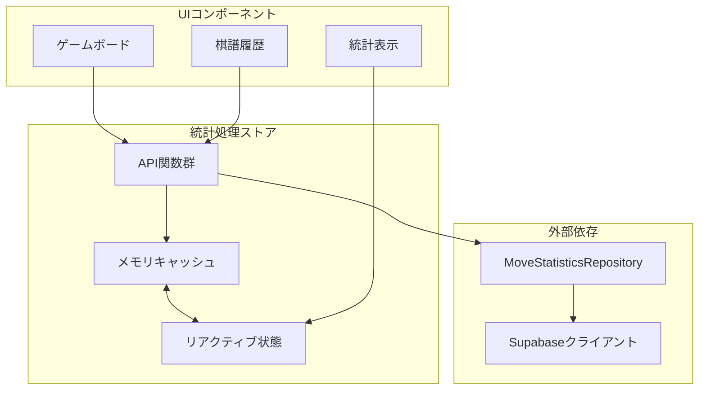
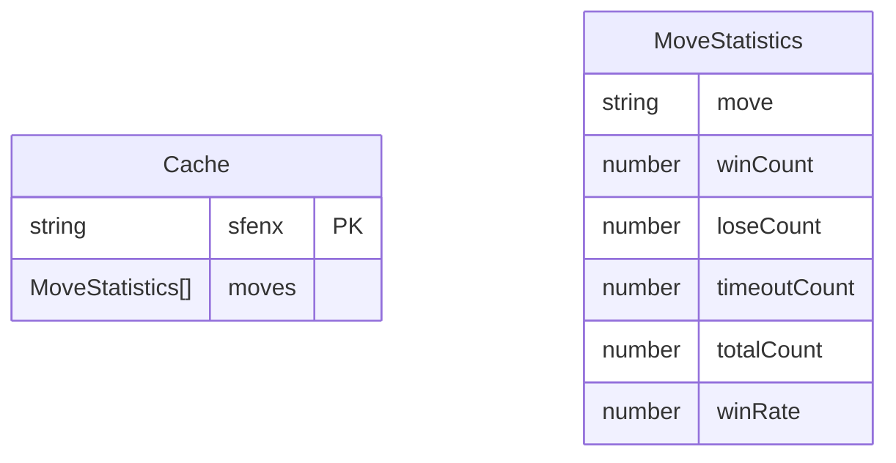
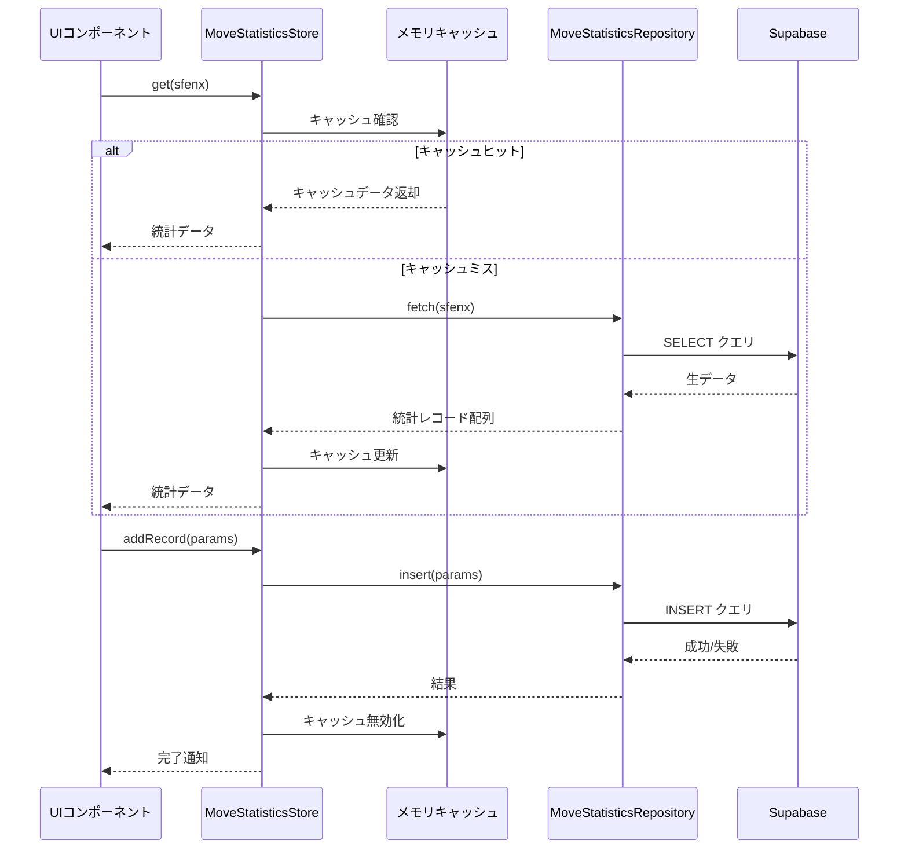
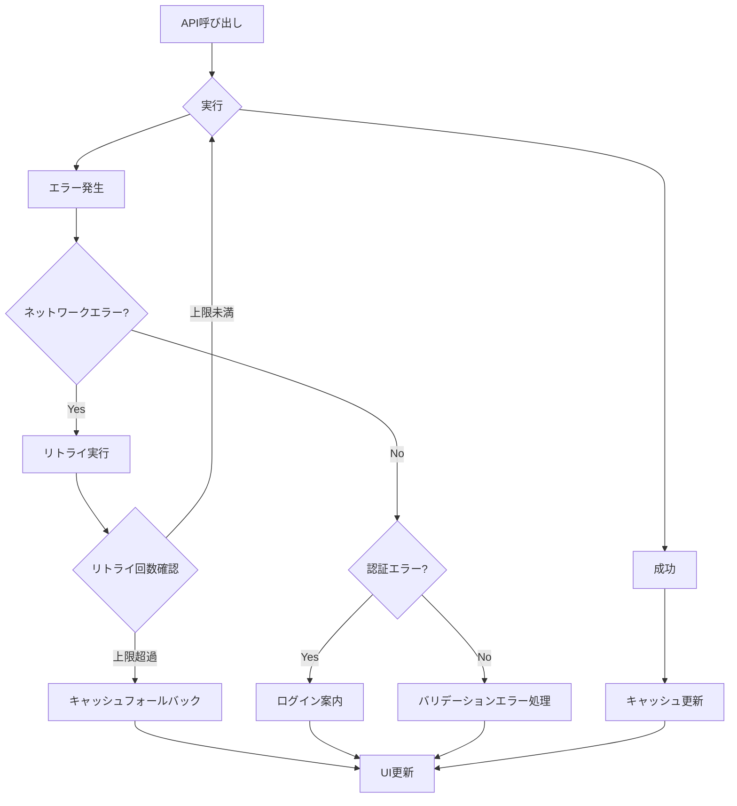
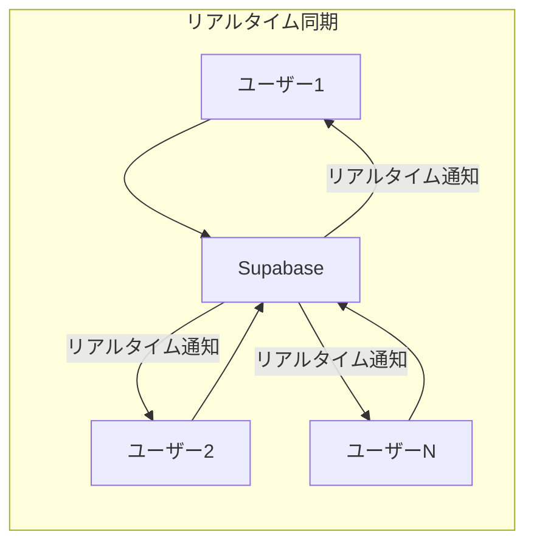

# 統計処理ストア設計

## 概要

本ドキュメントは、将棋アプリ「SvelteShogi」における統計データ管理ストア `move-statistics.svelte.ts` の設計について詳述します。このストアは、局面と手の勝敗統計情報をリアクティブに管理し、Supabaseとの連携によって永続化機能を提供します。

## アーキテクチャ

### 設計原則

統計処理ストアは以下の設計原則に基づいて構築されます：

- **リアクティブ状態管理**: Svelte 5の `$state` を活用した効率的な状態管理
- **キャッシュ最適化**: 頻繁にアクセスされる統計データのメモリキャッシュ
- **非同期データ同期**: Supabaseとの非同期通信による永続化
- **型安全性**: TypeScriptによる型安全な実装
- **エラーハンドリング**: 堅牢なエラー処理とログ出力

### コンポーネント構成

## データ構造

### 統計データモデル

統計データは以下の構造で管理されます：

| フィールド | 型             | 説明                           |
| ---------- | -------------- | ------------------------------ |
| sfenx      | string         | 局面のSFENX表記                |
| move       | string         | 手の表記                       |
| win        | boolean        | 勝利フラグ                     |
| lose       | boolean        | 敗北フラグ                     |
| timeout    | boolean        | 時間切れフラグ                 |
| user_id    | string \| null | ユーザーID（匿名の場合はnull） |

### キャッシュ構造

メモリキャッシュは効率的なデータアクセスを実現するため、以下の構造を採用します：

### 状態管理構造

リアクティブ状態は局面単位でグループ化され、UIコンポーネントが効率的に統計情報を取得できるよう設計されています。

## API設計

### ストアクラス仕様

#### MoveStatisticsStore

統計データの管理を担当するメインクラスです。

**主要メソッド**

| メソッド                               | 説明                                 | パラメータ                        | 戻り値               |
| -------------------------------------- | ------------------------------------ | --------------------------------- | -------------------- |
| `get(sfenx: string)`                   | 指定局面の統計データ取得             | sfenx: 局面表記                   | 統計データ配列       |
| `getMove(sfenx: string, move: string)` | 特定の手の統計データ取得             | sfenx: 局面表記 move: 手の表記 | 統計データまたはnull |
| `loadFromDatabase(sfenx: string)`      | データベースからの統計データ読み込み | sfenx: 局面表記                   | Promise\<void\>      |
| `addRecord(params: AddRecordParams)`   | 新しい統計レコード追加               | params: レコード追加パラメータ    | Promise\<void\>      |
| `clearCache(sfenx?: string)`           | キャッシュクリア                     | sfenx: 対象局面（省略時は全体）   | void                 |

**パラメータ型定義**

| 型名            | フィールド                           | 説明            |
| --------------- | ------------------------------------ | --------------- |
| AddRecordParams | sfenx: string                        | 局面のSFENX表記 |
|                 | move: string                         | 手の表記        |
|                 | result: 'win' \| 'lose' \| 'timeout' | 結果            |
|                 | userId?: string                      | ユーザーID      |

### データフロー

統計データの処理フローは以下の通りです：

## 統計計算ロジック

### 集計処理

統計データは以下のロジックで集計されます：

1. **勝率計算**: `winCount / (winCount + loseCount + timeoutCount)`
2. **総手数計算**: `winCount + loseCount + timeoutCount`
3. **結果別カウント**: 勝利、敗北、時間切れの各カウント

### パフォーマンス最適化

- **遅延読み込み**: 必要な局面の統計データのみをオンデマンドで読み込み
- **バッチ処理**: 複数の統計レコード追加を一括処理
- **メモリ効率**: 使用頻度の低いキャッシュデータの自動削除

## エラーハンドリング

### エラー分類

| エラータイプ       | 説明                | 対処方法                     |
| ------------------ | ------------------- | ---------------------------- |
| ネットワークエラー | Supabase接続失敗    | リトライ機構、オフライン対応 |
| 認証エラー         | ユーザー認証失敗    | ログイン画面への誘導         |
| データ整合性エラー | 不正なSFENX形式など | バリデーション強化           |
| 権限エラー         | RLSポリシー違反     | 適切な権限設定の案内         |

### エラー処理戦略

## 統合戦略

### 既存ストアとの連携

統計処理ストアは他のストアと以下のように連携します：

- **GameBoardStore**: 局面変更時の統計データ更新
- **KifuNodeStore**: 棋譜履歴と統計データの同期
- **PlayGameStore**: 対局結果の統計レコード追加

### リアルタイム更新

Supabaseのリアルタイム機能を活用し、他のユーザーの統計データ更新を即座に反映する仕組みを実装します。

## セキュリティ考慮事項

### データ保護

- **RLSポリシー遵守**: Supabaseの行レベルセキュリティ機能を活用
- **入力値検証**: 不正なSFENX形式や手の表記の検証
- **認証状態管理**: ユーザー認証状態に応じたアクセス制御

### プライバシー保護

- **匿名データ対応**: 未認証ユーザーの統計データ匿名保存
- **データ分離**: ユーザー別データの適切な分離
- **削除権限**: 自身の統計データの削除権限管理
