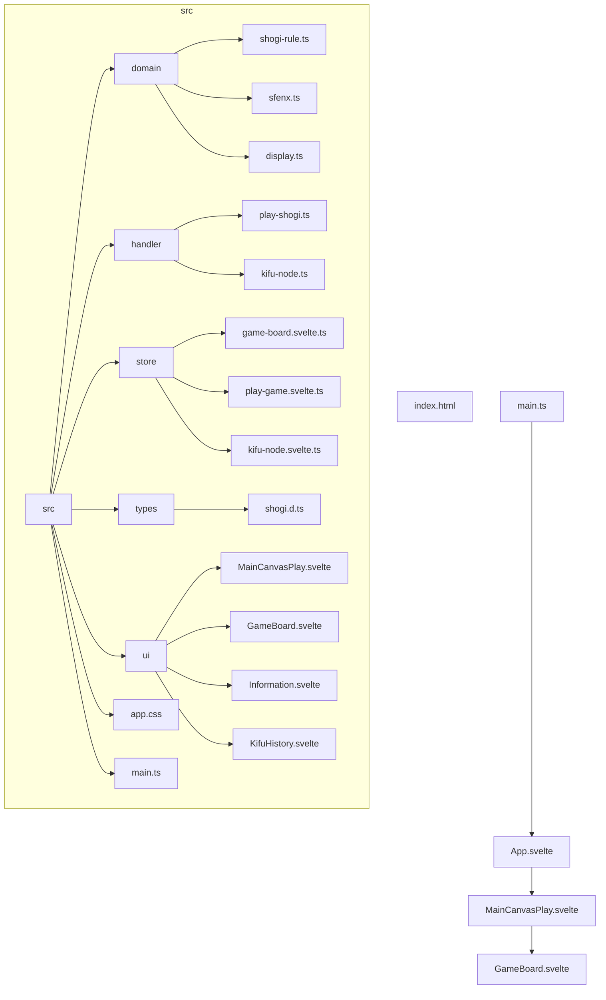
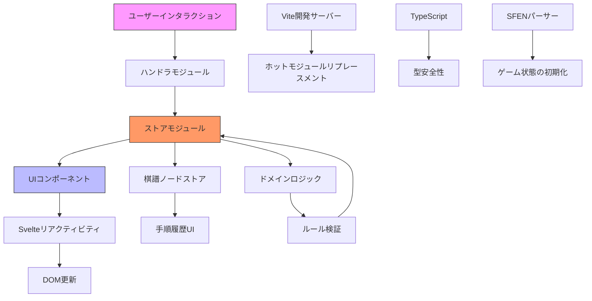
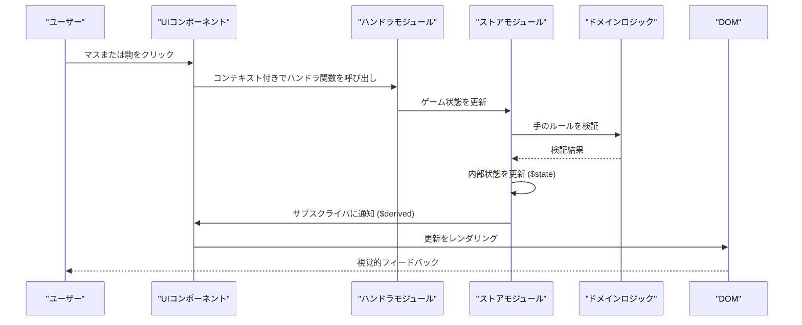

# アーキテクチャ概要

<cite>
**このドキュメントで参照されるファイル**   
- [main.ts](file://src/main.ts)
- [App.svelte](file://src/App.svelte)
- [MainCanvasPlay.svelte](file://src/ui/main-canvas/MainCanvasPlay.svelte)
- [GameBoard.svelte](file://src/ui/main-canvas/game-board/GameBoard.svelte)
- [game-board.svelte.ts](file://src/store/game-board.svelte.ts)
- [play-game.svelte.ts](file://src/store/play-game.svelte.ts)
- [play-shogi.ts](file://src/handler/play-shogi.ts)
- [shogi.d.ts](file://src/types/shogi.d.ts)
- [shogi-rule.ts](file://src/domain/shogi-rule.ts)
- [sfenx.ts](file://src/domain/sfenx.ts)
- [kifu-node.svelte.ts](file://src/store/kifu-node.svelte.ts)
- [kifu-node.ts](file://src/handler/kifu-node.ts)
</cite>

## 更新概要

**変更内容**

- 棋譜管理の中心が `kifu-history` から `kifu-node` に移行したため、関連するセクションを更新
- `kifu-history.ts` が削除され、`kifu-node.ts` が棋譜ノード管理の主要ハンドラとして導入されたことを反映
- データフローやイベントハンドリングの説明を新しい構造に合わせて修正
- 古くなっていたファイル参照を削除し、新しいモジュール構造を正確に反映

## 目次

1. [はじめに](#はじめに)
2. [プロジェクト構造](#プロジェクト構造)
3. [コアコンポーネント](#コアコンポーネント)
4. [アーキテクチャ概要](#アーキテクチャ概要)
5. [詳細なコンポーネント分析](#詳細なコンポーネント分析)
6. [データフローとリアクティビティ](#データフローとリアクティビティ)
7. [ストアシステムと状態管理](#ストアシステムと状態管理)
8. [ドメインロジックとルールの適用](#ドメインロジックとルールの適用)
9. [イベントハンドリングとユーザーインタラクション](#イベントハンドリングとユーザーインタラクション)
10. [UIコンポーネント階層](#uiコンポーネント階層)
11. [システムコンテキストとビルド構成](#システムコンテキストとビルド構成)
12. [スケーラビリティと将来の拡張](#スケーラビリティと将来の拡張)

## はじめに

SvelteShogiアプリケーションは、伝統的な日本のボードゲーム将棋をデジタル化したものです。このドキュメントは、コンポーネント構造、リアクティビティモデル、状態管理、およびインタラクションパターンに焦点を当てた包括的なアーキテクチャ概要を提供します。アプリケーションはSvelte 5の強化されたリアクティビティシステムを活用しており、`$state` と `$derived` を使用して効率的なUI更新を実現し、レスポンシブでパフォーマンスの高いユーザー体験を保証しています。アーキテクチャは、ドメインロジック、イベントハンドリング、状態ストア、UIコンポーネント間で明確な関心の分離を遵守しています。

## プロジェクト構造



**図の出典**

- [main.ts](file://src/main.ts)
- [App.svelte](file://src/App.svelte)
- [project_structure](file://.)

**このセクションの出典**

- [main.ts](file://src/main.ts)
- [App.svelte](file://src/App.svelte)

## コアコンポーネント

SvelteShogiアプリケーションは、関心の分離を強化するいくつかのコアコンポーネントカテゴリを中心に構成されています：

- **エントリポイント**: `main.ts` はSvelteアプリケーションを初期化し、ルート `App` コンポーネントをマウントします。
- **ルートコンポーネント**: `App.svelte` はゲームキャンバスと棋譜（手順履歴）パネルを含む主要なUIレイアウトを調整します。
- **ゲームキャンバス**: `MainCanvasPlay.svelte` は対話型のゲーム盤、駒の移動の可視化、リアルタイムフィードバックを管理します。
- **盤面コンポーネント**: `GameBoard.svelte` は9x9の将棋盤、駒、および捕獲された駒をレンダリングし、ユーザー入力イベントを処理します。
- **状態ストア**: Svelteモジュールストア（`game-board.svelte.ts`、`play-game.svelte.ts`、`kifu-node.svelte.ts`）は、集中型のリアクティブ状態管理を提供します。
- **イベントハンドラ**: ハンドラモジュール（`play-shogi.ts`、`kifu-node.ts`）はユーザーのインタラクションを処理し、それに応じて状態を更新します。
- **ドメインロジック**: ドメインモジュール（`shogi-rule.ts`、`sfenx.ts`）はゲームルールと表記の解析をカプセル化します。

これらのコンポーネントは、ユーザーのインタラクションがハンドラをトリガーし、ストアを更新し、SvelteのリアクティビティシステムによってUIの更新を駆動する一方向のデータフローを通じて協働します。

**このセクションの出典**

- [main.ts](file://src/main.ts)
- [App.svelte](file://src/App.svelte)
- [MainCanvasPlay.svelte](file://src/ui/main-canvas/MainCanvasPlay.svelte)
- [GameBoard.svelte](file://src/ui/main-canvas/game-board/GameBoard.svelte)

## アーキテクチャ概要

SvelteShogiアプリケーションは、プレゼンテーション、状態管理、ビジネスロジック、データ処理間で関心を分離するレイヤードアーキテクチャに従っています。システムはSvelte 5のリアクティビティモデルに基づいて構築されており、`$state` を可変状態に、`$derived` を計算値に使用することで、オーバーヘッドを最小限に抑えた効率的な更新を可能にしています。



**図の出典**

- [main.ts](file://src/main.ts)
- [App.svelte](file://src/App.svelte)
- [game-board.svelte.ts](file://src/store/game-board.svelte.ts)
- [play-game.svelte.ts](file://src/store/play-game.svelte.ts)
- [play-shogi.ts](file://src/handler/play-shogi.ts)

## 詳細なコンポーネント分析

### メインアプリケーションエントリポイント

アプリケーションは `main.ts` で開始され、ルート `App` コンポーネントをIDが `app` のDOM要素にマウントします。このファイルは、アプリケーション全体のブートストラップとして機能します。

```ts
import { mount } from "svelte";
import "./app.css";
import App from "./App.svelte";

const app = mount(App, {
  target: document.getElementById("app")!,
});

export default app;
```

この最小限のエントリポイントは、Svelte 5の `mount` 関数をコンポーネントのインスタンス化に利用しており、将来のサーバーサイドレンダリングなどへの柔軟な統合を可能にしています。

**このセクションの出典**

- [main.ts](file://src/main.ts#L1-L10)

### ルートAppコンポーネント

`App.svelte` コンポーネントは、CSS Flexboxを使用してゲームキャンバスと棋譜履歴を並べたトップレベルのUI構造を定義します。`GameCanvas` をゲームプレイ用、`KifuHistory` を手順追跡用にインポートして構成しています。

```svelte
<script lang="ts">
  import GameCanvas from './ui/main-canvas/MainCanvasPlay.svelte';
  import KifuHistory from './ui/kifu-history/KifuHistory.svelte';
</script>

<main>
  <div class="container">
    <GameCanvas />
    <KifuHistory />
  </div>
</main>
```

このコンポーネントは、ゲームキャンバスが利用可能なスペースを占有し、棋譜履歴が300pxの固定幅を維持するようにレスポンシブスタイリングを使用しています。

**このセクションの出典**

- [App.svelte](file://src/App.svelte#L1-L30)

### ゲームキャンバスと盤面インタラクション

`MainCanvasPlay.svelte` コンポーネントは、有効な手、成り、直前の手の表示など、ゲームプレイの主なインターフェースとして機能します。Svelteのリアクティビティを使用して、DOM要素から位置データを導出します。

```svelte
<script lang="ts">
  import { getCanMove, getLastPos, getPromotionPos } from '@/store/play-game.svelte';
  import { clickSquareHandler, clickCapturedHandler, clickPromotionHandler } from '@/handler/play-shogi';
  import { getHandPiece } from '@/store/game-board.svelte';

  let squareElements: HTMLDivElement[] = $state([]);
  let capturedSenteElements: { piece: PieceType; element: HTMLDivElement }[] = $state([]);
  let capturedGoteElements: { piece: PieceType; element: HTMLDivElement }[] = $state([]);
  let canvasElement: HTMLDivElement | undefined = $state();

  let relativeSquarePositions = $derived(() => {
    return squareElements.map(el => getRelativePosition(el));
  });
</script>
```

このコンポーネントは `GameBoard` コンポーネントからのDOM要素にバインドし、それらの位置を使用して、無効な手のマス（半透明の赤）、成りの領域、直前の手のハイライトなど、ゲーム状態の視覚的インジケータをオーバーレイ表示します。

**このセクションの出典**

- [MainCanvasPlay.svelte](file://src/ui/main-canvas/MainCanvasPlay.svelte#L1-L318)

### 盤面コンポーネント

`GameBoard.svelte` コンポーネントは、9x9の将棋盤に駒と捕獲された駒をレンダリングします。Svelteの `$props()` を使用して設定とコールバックを受け入れ、`$bindable` をDOM参照の双方向バインディングに使用しています。

```svelte
<script lang="ts">
  import { getSquare, getCaptured, getHandPiece } from '@/store/game-board.svelte';

  let {
    squareWidth = 55,
    squareHeight = 60,
    pieceScale = 0.9,
    fontSize = 38,
    reverse = $bindable(false),
    squareElements = $bindable([]),
    capturedSenteElements = $bindable([]),
    capturedGoteElements = $bindable([]),
    clickSquareHandler = () => {},
    clickCapturedHandler = () => {},
  } = $props();
</script>
```

このコンポーネントは、盤面の向き（`reverse`）に基づいて捕獲された駒を条件付きでレンダリングし、プレイヤーがどちら側からでも盤面を見られるようにします。また、駒の正しい重ね合わせを保証するためにz-indexの順序も管理しています。

**このセクションの出典**

- [GameBoard.svelte](file://src/ui/main-canvas/game-board/GameBoard.svelte#L1-L212)

## データフローとリアクティビティ

アプリケーションは、ユーザーのインタラクションがシステムを通じて伝播する一方向のデータフローパターンを実装しています：



**図の出典**

- [MainCanvasPlay.svelte](file://src/ui/main-canvas/MainCanvasPlay.svelte)
- [play-shogi.ts](file://src/handler/play-shogi.ts)
- [game-board.svelte.ts](file://src/store/game-board.svelte.ts)
- [shogi-rule.ts](file://src/domain/shogi-rule.ts)

Svelte 5のリアクティビティシステムにより、状態の変更時に必要なコンポーネントのみが更新されます。`MainCanvasPlay.svelte` の `$derived` 関数は、DOM要素が更新されると自動的に位置データを再計算し、視覚的インジケータの正確なオーバーレイ配置を可能にします。

## ストアシステムと状態管理

アプリケーションは、集中型の状態管理にSvelteのモジュールコンテキストストアを使用しており、3つの主要なストアモジュールがあります：

### 盤面ストア

`game-board.svelte.ts` ストアは、盤面グリッド、捕獲された駒、手番情報など、コアゲーム状態を管理します。

```ts
let grid: (PlayerPiece | null)[] = $state(initGrid());
let capturedSente: { piece: PieceType; num: number }[] = $state([]);
let capturedGote: { piece: PieceType; num: number }[] = $state([]);
let handPiece: HandPieceFrom | null = $state(null);
let isSenteTurn = $state(true);
```

このストアは、カプセル化を維持しつつリアクティブな更新を可能にする、制御された状態アクセスのためのgetterおよびsetter関数をエクスポートします。

### ゲームプレイストア

`play-game.svelte.ts` ストアは、有効な手、直前の手の位置、成りの状態など、ゲームプレイ状態を管理します。

```ts
export function getCanMove(row: number, col: number): boolean {
  const handPiece = getHandPiece();
  if (!handPiece) return false;

  if (handPiece.position) {
    return isValidMove(
      handPiece.position.row,
      handPiece.position.col,
      row,
      col,
      handPiece.isSente
    );
  } else {
    return canPlaceCapturedPiece(handPiece.piece, row, col, handPiece.isSente);
  }
}
```

このストアは、盤面ストアとドメインルールから状態を導出し、UIフィードバックのための計算値を提供します。

### 棋譜ノードストア

`kifu-node.svelte.ts` ストアは、手順履歴を管理し、リプレイや分析機能を可能にします。

```ts
let nodes: KifuNode[] = $state([]);
let currentIndex = $state(-1);
let branches: number[] = $state([]);
```

このストアは、手順のメタデータとともに時系列で記録を維持し、ゲーム履歴のナビゲーションをサポートします。

**このセクションの出典**

- [game-board.svelte.ts](file://src/store/game-board.svelte.ts#L1-L166)
- [play-game.svelte.ts](file://src/store/play-game.svelte.ts)
- [kifu-node.svelte.ts](file://src/store/kifu-node.svelte.ts)

## ドメインロジックとルールの適用

ドメイン層には、将棋のゲームプレイに関するビジネスロジックが含まれています：

### 将棋ルールモジュール

`shogi-rule.ts` モジュールは、駒の移動ルール、捕獲メカニズム、勝利条件を実装します。駒の種類、位置、ゲーム状態に基づいて手を検証します。

### SFENパーサー

`sfenx.ts` モジュールは、SFEN（将棋フォルシスエドワーズ表記）の解析とシリアル化を処理し、ゲーム状態のインポート/エクスポートと永続化を可能にします。

### 表示ユーティリティ

`display.ts` モジュールは、手順表記と駒の表現のためのフォーマット関数を提供し、棋譜履歴とUI表示をサポートします。

これらのドメインモジュールは、独立してテスト可能な純粋な関数であり、信頼性の高いゲームメカニクスを保証します。

**このセクションの出典**

- [shogi-rule.ts](file://src/domain/shogi-rule.ts)
- [sfenx.ts](file://src/domain/sfenx.ts)
- [display.ts](file://src/domain/display.ts)

## イベントハンドリングとユーザーインタラクション

ハンドラモジュールは、ユーザーのインタラクションを処理し、状態の更新を調整します：

### 将棋プレイハンドラ

`play-shogi.ts` モジュールには、以下のイベントハンドラが含まれています：

- `clickSquareHandler`: 盤面のマスのクリックを処理
- `clickCapturedHandler`: 捕獲された駒のクリックを処理
- `clickPromotionHandler`: 成りの選択を処理

これらのハンドラは、ドメインロジックを通じてアクションを検証した後、ストアを更新します。

### 棋譜ノードハンドラ

`kifu-node.ts` モジュールは、手順履歴のナビゲーションを処理し、棋譜ノードストアと統合します。

ハンドラ層は、イベント処理を状態管理から抽象化し、関心の分離とテスト性を促進します。

**このセクションの出典**

- [play-shogi.ts](file://src/handler/play-shogi.ts)
- [kifu-node.ts](file://src/handler/kifu-node.ts)

## UIコンポーネント階層

UIは、階層的な構成パターンに従います：

```mermaid
tree
App
├── GameCanvas (MainCanvasPlay.svelte)
│ ├── GameBoard
│ │ ├── Grid
│ │ ├── Piece
│ │ └── Captured
│ ├── Promote
│ └── Information
└── KifuHistory
```

**図の出典**

- [App.svelte](file://src/App.svelte)
- [MainCanvasPlay.svelte](file://src/ui/main-canvas/MainCanvasPlay.svelte)
- [GameBoard.svelte](file://src/ui/main-canvas/game-board/GameBoard.svelte)

各コンポーネントには特定の責任があります：

- **App**: レイアウトの調整
- **GameCanvas**: ゲームプレイの可視化
- **GameBoard**: 盤面のレンダリングとインタラクション
- **Grid**: 盤面の線と座標
- **Piece**: 個々の駒のレンダリング
- **Captured**: 捕獲された駒の表示
- **Promote**: 成り選択インターフェース
- **Information**: オーバーレイデータの表示
- **KifuHistory**: 手順履歴パネル

## システムコンテキストとビルド構成

アプリケーションは、現代的な開発ツールを活用しています：

### Vite統合

`vite.config.ts` ファイルは、以下を備えた高速開発のためのViteを構成します：

- ホットモジュールリプレースメント（HMR）
- TypeScriptサポート
- Svelteの前処理
- 最適化された本番ビルド

### TypeScript構成

`tsconfig.json` および関連ファイルは、以下により型安全性を提供します：

- 厳格な型チェック
- Svelte固有の型
- `@/` エイリアスのモジュール解決

### 開発体験

Viteは、ほぼ即時の起動とリフレッシュ時間を可能にし、開発ワークフローを迅速化します。一方、TypeScriptはコンパイル時にエラーを検出し、コード品質と保守性を向上させます。

**このセクションの出典**

- [vite.config.ts](file://vite.config.ts)
- [tsconfig.json](file://tsconfig.json)
- [tsconfig.app.json](file://tsconfig.app.json)
- [svelte.config.js](file://svelte.config.js)

## スケーラビリティと将来の拡張

現在のアーキテクチャは、いくつかの潜在的な拡張をサポートしています：

### AI統合

ゲーム状態とルールの明確な分離により、同じドメインロジックを使用する手生成AIを追加することが現実的になります。

### マルチプレイヤー対応

状態管理システムは、WebSocketや同様の技術を使用してクライアント間でゲーム状態を同期するように拡張できます。

### 強化された分析

`MainCanvasPlay.svelte` の `statisticsArrows` データ構造は、手の頻度や勝率の可視化の可能性を示唆しています。

### ゲームのインポート/エクスポート

SFENパーサーは、PGNのようなファイルのインポート/エクスポート機能の基盤を提供します。

モジュール設計により、これらの機能を既存コードへの最小限の混乱で追加でき、アプリケーションの保守性とテスト性を維持します。

**このセクションの出典**

- [sfenx.ts](file://src/domain/sfenx.ts)
- [MainCanvasPlay.svelte](file://src/ui/main-canvas/MainCanvasPlay.svelte)
- [play-game.svelte.ts](file://src/store/play-game.svelte.ts)
