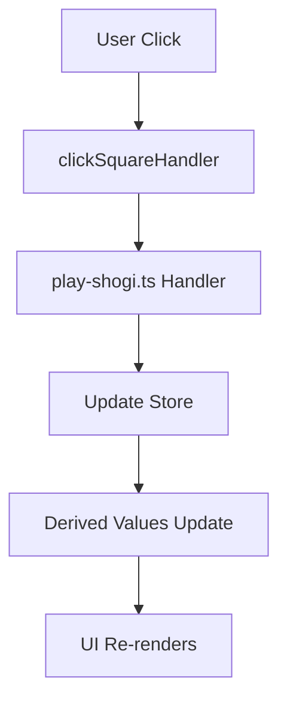

# Component Hierarchy

<cite>
**Referenced Files in This Document**   
- [main.ts](file://src/main.ts#L1-L10)
- [App.svelte](file://src/App.svelte#L1-L30)
- [MainCanvasPlay.svelte](file://src/ui/main-canvas/MainCanvasPlay.svelte#L1-L318)
- [GameBoard.svelte](file://src/ui/main-canvas/game-board/GameBoard.svelte#L1-L212)
- [Piece.svelte](file://src/ui/main-canvas/game-board/Piece.svelte#L1-L107)
- [Captured.svelte](file://src/ui/main-canvas/game-board/Captured.svelte)
- [Promote.svelte](file://src/ui/main-canvas/game-board/Promote.svelte)
- [Information.svelte](file://src/ui/main-canvas/information/Information.svelte)
- [KifuHistory.svelte](file://src/ui/kifu-history/KifuHistory.svelte)
- [game-board.svelte.ts](file://src/store/game-board.svelte.ts)
- [play-game.svelte.ts](file://src/store/play-game.svelte.ts)
- [play-shogi.ts](file://src/handler/play-shogi.ts)
</cite>

## Table of Contents
1. [Introduction](#introduction)
2. [Entry Point: main.ts](#entry-point-main.ts)
3. [Root Component: App.svelte](#root-component-app.svelte)
4. [Primary Orchestrator: MainCanvasPlay.svelte](#primary-orchestrator-maincanvasplay.svelte)
5. [Interactive Game Board: GameBoard.svelte](#interactive-game-board-gameboard.svelte)
6. [Visual Representation: Piece.svelte](#visual-representation-piece.svelte)
7. [Hand Piece Display: Captured.svelte](#hand-piece-display-captured.svelte)
8. [Promotion Selection: Promote.svelte](#promotion-selection-promote.svelte)
9. [Game Status Display: Information.svelte](#game-status-display-information.svelte)
10. [Move History Management: KifuHistory.svelte](#move-history-management-kifuhistory.svelte)
11. [Data Flow and Reactivity](#data-flow-and-reactivity)
12. [Component Reuse and Styling](#component-reuse-and-styling)
13. [Accessibility Considerations](#accessibility-considerations)

## Introduction
This document provides a comprehensive overview of the component hierarchy in the SvelteShogi application, a Shogi (Japanese chess) game built using Svelte 5. The architecture follows a clear parent-child structure starting from `main.ts` as the entry point, mounting the root `App` component. The UI is orchestrated primarily by `MainCanvasPlay.svelte`, which manages gameplay logic and layout. Key components such as `GameBoard.svelte`, `KifuHistory.svelte`, and auxiliary elements like `Piece.svelte` and `Captured.svelte` work together to deliver an interactive and responsive user experience. This documentation details component relationships, data flow via props and bindings, and how Svelte 5’s reactivity system enables seamless updates across the component tree.

**Section sources**
- [main.ts](file://src/main.ts#L1-L10)
- [App.svelte](file://src/App.svelte#L1-L30)

## Entry Point: main.ts
The application begins execution in `main.ts`, which serves as the entry point. It imports the `mount` function from Svelte to instantiate the root `App` component and attaches it to the DOM element with the ID `app`. This file also imports global styles from `app.css`.

```ts
import { mount } from 'svelte'
import './app.css'
import App from './App.svelte'

const app = mount(App, {
  target: document.getElementById('app')!,
})

export default app
```

This setup follows standard Svelte application initialization, ensuring that the entire UI is rendered within the designated container in `index.html`.

**Section sources**
- [main.ts](file://src/main.ts#L1-L10)

## Root Component: App.svelte
The `App.svelte` component is the top-level container that defines the overall layout of the application. It imports two primary components: `GameCanvas` (aliased as `MainCanvasPlay`) and `KifuHistory`, arranging them side by side using a flexbox layout.

```svelte
<script lang="ts">
  import GameCanvas from './ui/main-canvas/MainCanvasPlay.svelte';
  import KifuHistory  from './ui/kifu-history/KifuHistory.svelte';
</script>

<main>
  <div class="container">
    <GameCanvas />
    <KifuHistory />
  </div>
</main>
```

The `.container` class ensures responsive spacing and alignment, allocating flexible width to the game canvas and a fixed 300px width to the move history panel. This structure enables a clean separation between gameplay and historical navigation.

**Section sources**
- [App.svelte](file://src/App.svelte#L1-L30)

## Primary Orchestrator: MainCanvasPlay.svelte
`MainCanvasPlay.svelte` acts as the central orchestrator for gameplay and UI rendering. It imports and integrates several subcomponents: `GameBoard`, `Promote`, and `Information`. It also manages state variables such as board orientation (`reverse`), DOM references for squares and captured pieces, and derived positions for visual overlays.

Key responsibilities include:
- Managing click handlers for squares and captured pieces via `clickSquareHandler` and `clickCapturedHandler`
- Binding DOM elements for layout calculations
- Displaying visual indicators for invalid moves, last move, and promotion prompts
- Passing positional data to the `Information` component for statistical overlays

The component uses Svelte's `$derived` to compute relative positions of squares and captured pieces, enabling accurate placement of overlays and animations.

```svelte
<div class="canvas" bind:this={canvasElement}>
  <GameBoard 
    squareWidth={SQUARE_WIDTH}
    squareHeight={SQUARE_HEIGHT}
    fontSize={FONT_SIZE}
    pieceScale={PIECE_SCALE}
    bind:reverse={reverse}
    clickSquareHandler={clickSquareHandler}
    clickCapturedHandler={clickCapturedHandler}
    bind:squareElements={squareElements}
    bind:capturedSenteElements={capturedSenteElements}
    bind:capturedGoteElements={capturedGoteElements}
  />
  {#if squareElements.length > 0 && canvasElement}
    <!-- Visual overlays -->
    <div class="can-move">...</div>
    <div class="last-move">...</div>
    <div class="promotion-square">...</div>
    <div class="information">
      <Information {relativeSquarePositions} ... />
    </div>
  {/if}
</div>
```

**Section sources**
- [MainCanvasPlay.svelte](file://src/ui/main-canvas/MainCanvasPlay.svelte#L1-L318)

## Interactive Game Board: GameBoard.svelte
`GameBoard.svelte` encapsulates the interactive Shogi board, rendering the grid, pieces, and captured pieces. It receives props for dimensions, scaling, and event handlers, and uses two-way binding (`$bindable`) to share DOM references with its parent.

It conditionally renders the opponent's captured pieces at the top and the player's at the bottom, flipping layout based on the `reverse` flag. The `Grid` component handles square rendering and click detection, while `Piece` components are absolutely positioned using calculated relative coordinates.

```svelte
{#each {length: 9}, row}
  {#each {length: 9}, col}
    {@const square = getSquare(row, col)}
    {#if square}
      <div class="piece-wrapper" style="top: {y}px; left: {x}px;">
        <Piece 
          fontSize={fontSize} 
          width={squareWidth}  
          height={squareHeight} 
          scale={pieceScale} 
          reverse={reverse? square.isSente: !square.isSente}
          character={square.piece}
          isHanded={handPiece && handPiece.position ? handPiece.position.row === row && handPiece.position.col === col : false}
        />
      </div>
    {/if}
  {/each}
{/each}
```

The component also includes a "Reverse Board" button that toggles the `reverse` state, allowing players to view the board from their perspective.

**Section sources**
- [GameBoard.svelte](file://src/ui/main-canvas/game-board/GameBoard.svelte#L1-L212)

## Visual Representation: Piece.svelte
`Piece.svelte` is responsible for visually rendering individual Shogi pieces. It accepts props for character, orientation, scale, and styling, and uses CSS to create a stylized pentagon shape with wood-textured background and drop shadows.

The component supports accessibility via `role="button"` and `tabindex="0"`, making pieces keyboard-navigable. The piece character is centered and rotated based on the `reverse` prop, ensuring correct orientation for both players.

```svelte
<div class="piece {reverse ? 'reversed' : ''}">
  <span class="piece-character">{character}</span>
</div>
```

Styling includes hover effects and transformations for "handed" pieces (currently being moved), enhancing user feedback during gameplay.

**Section sources**
- [Piece.svelte](file://src/ui/main-canvas/game-board/Piece.svelte#L1-L107)

## Hand Piece Display: Captured.svelte
`Captured.svelte` displays the pieces captured by each player (the "hand"). It receives a list of captured pieces and renders them using the `Piece` component. It supports reverse layout and click interaction for dropping captured pieces back onto the board.

The component binds its internal DOM elements to allow parent components to calculate positioning for visual overlays. It conditionally highlights the currently selected hand piece using the `handPiece` prop.

```svelte
{#each capturedPieces, piece}
  <Piece 
    character={piece}
    reverse={reverse}
    clickHandler={() => clickHandler(piece)}
  />
{/each}
```

This modular design enables reuse in both the top (opponent) and bottom (player) sections of the board.

**Section sources**
- [Captured.svelte](file://src/ui/main-canvas/game-board/Captured.svelte)

## Promotion Selection: Promote.svelte
`Promote.svelte` provides a modal interface for selecting whether to promote a piece upon reaching the promotion zone. It appears conditionally when a move triggers a promotion opportunity.

It renders two options—promote or not—using styled buttons and handles user selection via `clickHandler`. The component is absolutely positioned within the `MainCanvasPlay` overlay layer, ensuring it appears above the board.

Though not fully shown in provided code, its integration within `MainCanvasPlay.svelte` confirms it receives the current piece type and forwards user decisions to the game logic handler.

**Section sources**
- [Promote.svelte](file://src/ui/main-canvas/game-board/Promote.svelte)

## Game Status Display: Information.svelte
`Information.svelte` overlays statistical and favorite move indicators on the board. It receives arrays of `favoriteArrows` and `statisticsArrows`, which define source and target positions for visual cues.

Using the relative position data passed from `MainCanvasPlay`, it renders arrows or highlights on specific squares to indicate common or high-win-rate moves. This enhances strategic decision-making by providing data-driven insights.

The component is layered at the highest z-index to ensure visibility over other elements.

**Section sources**
- [Information.svelte](file://src/ui/main-canvas/information/Information.svelte)

## Move History Management: KifuHistory.svelte
`KifuHistory.svelte` manages the display and navigation of move history (Kifu). It allows users to step forward and backward through the game, enabling analysis and review.

It likely connects to the `kifu-history.svelte.ts` store to retrieve move records and current position in the sequence. While not fully visible in provided snippets, its presence in `App.svelte` confirms it operates independently of the main canvas, providing a dedicated UI for historical navigation.

**Section sources**
- [KifuHistory.svelte](file://src/ui/kifu-history/KifuHistory.svelte)

## Data Flow and Reactivity
The application leverages Svelte 5’s reactivity model through stores (`game-board.svelte.ts`, `play-game.svelte.ts`) and derived values. Changes in game state automatically propagate through the component tree.

For example:
- `$derived(getHandPiece())` in `MainCanvasPlay` updates when the store changes
- `relativeSquarePositions` recalculates whenever `squareElements` or `gameBoardElement` changes
- Event handlers like `clickSquareHandler` dispatch actions that update stores, triggering UI updates

This declarative approach minimizes manual state management and ensures consistency across components.



**Diagram sources**
- [play-shogi.ts](file://src/handler/play-shogi.ts)
- [game-board.svelte.ts](file://src/store/game-board.svelte.ts)
- [MainCanvasPlay.svelte](file://src/ui/main-canvas/MainCanvasPlay.svelte#L1-L318)

**Section sources**
- [play-shogi.ts](file://src/handler/play-shogi.ts)
- [game-board.svelte.ts](file://src/store/game-board.svelte.ts)

## Component Reuse and Styling
Components are designed for reuse and composability:
- `Piece.svelte` is used in both `GameBoard` and `Captured`
- `Captured.svelte` is instantiated twice with different props
- Layout logic is abstracted using Svelte’s `bind:this` and `$derived`

Global styles are defined in `app.css`, while component-specific styles use scoped CSS. Visual effects like drop shadows and transitions enhance usability without sacrificing performance.

**Section sources**
- [app.css](file://src/app.css)
- [Piece.svelte](file://src/ui/main-canvas/game-board/Piece.svelte#L1-L107)
- [Captured.svelte](file://src/ui/main-canvas/game-board/Captured.svelte)

## Accessibility Considerations
The application includes several accessibility features:
- `role="button"` and `tabindex="0"` on interactive pieces
- Semantic HTML structure with proper container hierarchy
- Keyboard navigability through focusable elements
- Visual feedback for hover and selection states
- High-contrast text and drop shadows for readability

These practices ensure the game is usable for a wide range of players, including those relying on assistive technologies.

**Section sources**
- [Piece.svelte](file://src/ui/main-canvas/game-board/Piece.svelte#L1-L107)
- [GameBoard.svelte](file://src/ui/main-canvas/game-board/GameBoard.svelte#L1-L212)