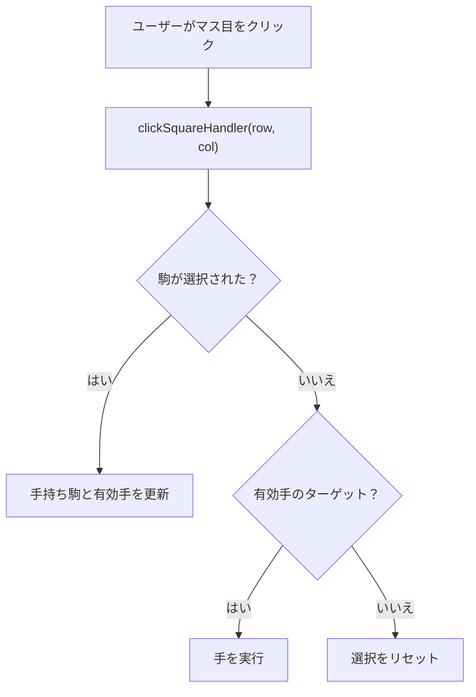
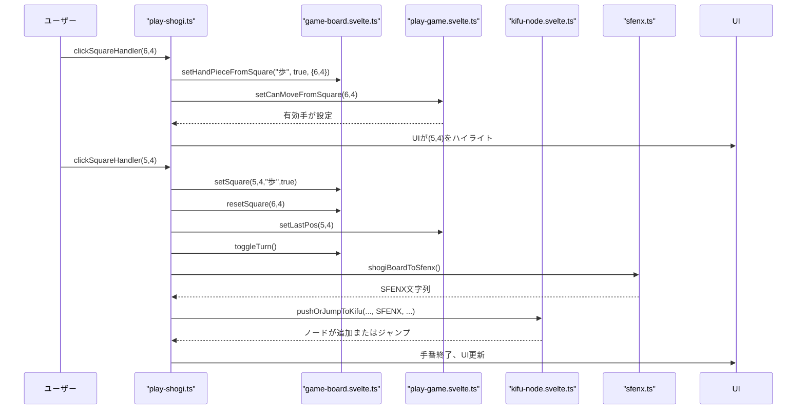

# データフロー

<cite>
**このドキュメントで参照されるファイル**   
- [play-shogi.ts](file://src/handler/play-shogi.ts) - *最近のコミットで更新*
- [kifu-node.ts](file://src/handler/kifu-node.ts) - *kifu-history.ts から移行、新規中心モジュール*
- [game-board.svelte.ts](file://src/store/game-board.svelte.ts)
- [play-game.svelte.ts](file://src/store/play-game.svelte.ts)
- [kifu-node.svelte.ts](file://src/store/kifu-node.svelte.ts) - *kifu-history.svelte.ts に代わる新規ストア*
- [sfenx.ts](file://src/domain/sfenx.ts)
- [shogi-rule.ts](file://src/domain/shogi-rule.ts)
- [shogi.d.ts](file://src/types/shogi.d.ts)
</cite>

## 更新サマリー

**更新内容**

- 棋譜管理の中心が `kifu-history` から `kifu-node` に移行したため、関連するハンドラとストアの記述を更新
- `kifu-history.ts` の削除と `kifu-node.ts` の導入に伴い、データフローの説明を再構成
- `pushOrJumpToKifu` 関数の重複防止ロジックを詳細に記述
- 図式およびセクションの参照ファイルを最新のファイル構成に合わせて修正

## 目次

1. [データフロー概要](#データフロー概要)
2. [ユーザー操作とイベント処理](#ユーザー操作とイベント処理)
3. [ストア管理と状態更新](#ストア管理と状態更新)
4. [Svelteの$stateと$derivedによるUIリアクティビティ](#svelteのstateとderivedによるuiリアクティビティ)
5. [手の実行フローの例](#手の実行フローの例)
6. [SFENXによるゲーム状態のシリアル化](#sfenxによるゲーム状態のシリアル化)
7. [状態の一貫性とアトミック更新](#状態の一貫性とアトミック更新)
8. [パフォーマンスに関する考慮事項](#パフォーマンスに関する考慮事項)

## データフロー概要

SvelteShogiは、ユーザー操作がハンドラを介して中央集権的なリアクティブストアを更新する、一方向データフローのアーキテクチャを採用しています。これらのストアの更新は、Svelteのリアクティビティシステムを通じて自動的にUIに反映され、一貫性があり応答性の高い視覚的フィードバックを保証します。このフローに関与する主要なコンポーネントは以下の通りです。

- **ハンドラ**: ユーザー入力（例：マス目クリック）をキャプチャ
- **ストア**: アプリケーションの状態（盤面、有効手、ゲーム履歴）を管理
- **ドメインロジック**: ゲームルールやデータ変換（例：SFENXシリアル化）をカプセル化
- **UIコンポーネント**: 状態変更にリアクティブにレンダリング

このアーキテクチャにより、関心の分離、予測可能な状態遷移、効率的なレンダリングが実現されています。

**セクションの出典**

- [play-shogi.ts](file://src/handler/play-shogi.ts#L1-L270)
- [game-board.svelte.ts](file://src/store/game-board.svelte.ts#L1-L166)

## ユーザー操作とイベント処理

「マス目をクリック」や「駒台の駒を選択」などのユーザー操作は、`play-shogi.ts` および `kifu-node.ts` 内の関数によって処理されます。これらのハンドラは、すべての対局操作のエントリーポイントとして機能します。

### クリックハンドラ

主な操作ポイントは以下の通りです。

- `clickSquareHandler(row, col)`: 盤上のクリックを処理
- `clickCapturedHandler(piece, isSente)`: 駒台の駒選択を処理
- `clickPromotionHandler(getPromote)`: 成否の決定を処理
- `jumpToKifu(nodeIndex)`: 棋譜の特定の手に移動

これらのハンドラは、DOMや状態を直接操作するのではなく、ストアの更新関数を呼び出すことで、入力処理と状態ロジックの明確な分離を維持しています。



**図式の出典**

- [play-shogi.ts](file://src/handler/play-shogi.ts#L150-L270)

**セクションの出典**

- [play-shogi.ts](file://src/handler/play-shogi.ts#L150-L270)
- [kifu-node.ts](file://src/handler/kifu-node.ts#L1-L82) - _棋譜ナビゲーションの新規実装_

## ストア管理と状態更新

アプリケーションの状態は、`src/store/` ディレクトリにあるSvelteストアによって管理されています。これらのストアは、リアクティビティにSvelteの `$state` を使用し、状態ロジックをカプセル化するgetter/setter関数を公開しています。

### 主要なストア

| ストア                 | 担当                                                                        |
| ---------------------- | --------------------------------------------------------------------------- |
| `game-board.svelte.ts` | 盤面グリッド、駒台、手番、選択中の手持ち駒                                  |
| `play-game.svelte.ts`  | 有効手の表示、直前の手の位置、成りの状態                                    |
| `kifu-node.svelte.ts`  | リンクされたノード構造としての棋譜履歴（`kifu-history.svelte.ts` に代わる） |

各ストアは内部の `$state` 変数を保持し、それらを読み書きするためのエクスポートされた関数を提供します。例えば：

```ts
// game-board.svelte.ts 内
let grid: (Square | null)[] = $state(initGrid());
export function getSquare(row: number, col: number): Square | null {
  return grid[row * 9 + col];
}
export function setSquare(
  row: number,
  col: number,
  piece: PieceType,
  isSente: boolean
) {
  grid[row * 9 + col] = { piece, isSente };
}
```

このパターンにより、すべての状態変更が明確に定義された関数を経由し、不整合な状態を防ぎます。

```mermaid
classDiagram
class GameBoardStore {
+getSquare(row, col) Square | null
+setSquare(row, col, piece, isSente)
+resetSquare(row, col)
+getGrid() (Square | null)[]
+setGrid(newGrid)
+getCaptured(isSente) CapturedPiece[]
+incrementCaptured(piece, isSente)
+decrementCaptured(piece, isSente)
+getHandPiece() HandPieceFrom | null
+setHandPieceFromSquare(piece, isSente, pos)
+getIsSenteTurn() boolean
+toggleTurn()
}
class PlayGameStore {
+getCanMove(row, col) boolean
+setCanMoveSquare(row, col)
+resetCanMoveAll()
+getPromotionPos() {row, col} | null
+setPromotionPos(row, col)
+getLastPos() {row, col} | null
+setLastPos(row, col)
}
class KifuNodeStore {
+pushKifuNode(display, sfenx, prev, br_next, isSente, move, isFavorite)
+getNode(index) KifuNode
+setCurrentIndex(index)
+getCurrentIndex() number
+setChildNode(parIndex, childIndex)
+setBranchNode(preIndex, nexIndex)
+setBranches(baseNodeIndex)
+getBranches() number[]
}
GameBoardStore <.. PlayGameStore : "使用"
GameBoardStore <.. KifuNodeStore : "使用"
PlayGameStore <.. KifuNodeStore : "使用"
```

**図式の出典**

- [game-board.svelte.ts](file://src/store/game-board.svelte.ts#L1-L166)
- [play-game.svelte.ts](file://src/store/play-game.svelte.ts#L1-L50)
- [kifu-node.svelte.ts](file://src/store/kifu-node.svelte.ts#L1-L77) - _新規棋譜管理ストア_

**セクションの出典**

- [game-board.svelte.ts](file://src/store/game-board.svelte.ts#L1-L166)
- [play-game.svelte.ts](file://src/store/play-game.svelte.ts#L1-L50)
- [kifu-node.svelte.ts](file://src/store/kifu-node.svelte.ts#L1-L77)

## Svelteの$stateと$derivedによるUIリアクティビティ

Svelteの組み込みリアクティビティシステム（`$state`, `$derived`）により、ストアの状態の変更が自動的にUIの更新をトリガーします。`getSquare()` や `getCanMove()` などのストア値を参照するコンポーネントは、その依存関係が変更された場合にのみ再レンダリングされます。

例えば、盤面コンポーネントは `getSquare(row, col)` を使用して表示する駒を決定します。`setSquare()` が呼び出されると、基盤となる `$state` が更新され、Svelteが自動的に影響を受けるセルを再レンダリングします。

同様に、有効手の表示は `getCanMove(row, col)` を使用してハイライトスタイルを条件付きで適用します。`setCanMoveFromSquare()` が呼び出された後、UIは直ちに新しい手の選択肢を反映します。

この細粒度のリアクティビティにより、不要な再レンダリングが最小限に抑えられ、低スペックデバイスでも高いパフォーマンスが保証されます。

**セクションの出典**

- [game-board.svelte.ts](file://src/store/game-board.svelte.ts#L1-L166)
- [play-game.svelte.ts](file://src/store/play-game.svelte.ts#L1-L50)

## 手の実行フローの例

完全な手の実行フローを追跡します：プレイヤーが歩を選び、前に進める場合。

1. **ユーザー操作**: (6,4) の歩をクリック。
2. **ハンドラ**: `clickSquareHandler(6, 4)` が呼び出される。
3. **ストア更新**:
   - `setHandPieceFromSquare("歩", true, {row: 6, col: 4})`
   - `setCanMoveFromSquare(6, 4)` で有効な移動先を計算。
4. **UI更新**: 有効手のマス目がハイライトされる。
5. **ユーザー操作**: 有効な移動先 (5,4) をクリック。
6. **ハンドラ**: `clickSquareHandler(5, 4)` が有効手を検出。
7. **手の実行**:
   - `setSquare(5, 4, "歩", true)`
   - `resetSquare(6, 4)`
   - `setLastPos(5, 4)`
8. **手番管理**: `toggleTurn()` で後手に切り替える。
9. **履歴更新**: `pushOrJumpToKifu()` でSFENX形式で手を記録。
10. **UI更新**: 盤面が新しい位置を反映。棋譜リストに新しい手が表示される。



**図式の出典**

- [play-shogi.ts](file://src/handler/play-shogi.ts#L150-L270)
- [game-board.svelte.ts](file://src/store/game-board.svelte.ts#L1-L166)
- [play-game.svelte.ts](file://src/store/play-game.svelte.ts#L1-L50)
- [kifu-node.svelte.ts](file://src/store/kifu-node.svelte.ts#L1-L77)
- [sfenx.ts](file://src/domain/sfenx.ts#L1-L240)

**セクションの出典**

- [play-shogi.ts](file://src/handler/play-shogi.ts#L150-L270)

## SFENXによるゲーム状態のシリアル化

`sfenx.ts` モジュールは、メモリ内のゲーム状態とSFENX文字列形式の間の双方向変換を扱い、履歴記録や永続化に使用されます。

### SFENXフォーマット

SFENXは、駒台の駒をASCII文字でコンパクトに符号化するためにSFENを拡張しています。例：

- `"r...gbsk/...p.../..." aaab"` は盤面と駒台を表す。

### 主な関数

- `shogiBoardToSfenx(grid, capturedSente, capturedGote)` → `string`
- `sfenxToShogiBoard(sfenx)` → `{grid, capturedSente, capturedGote}`

各手の終了時、`turnEnd()` は `shogiBoardToSfenx()` を呼び出して現在の状態をシリアル化し、`pushOrJumpToKifu()` を介して履歴に格納します。

これにより以下の機能が可能になります。

- `jumpToKifu()` によるアンドゥ/リドゥ
- ゲーム状態のインポート/エクスポート
- 分岐するゲームツリー

**セクションの出典**

- [sfenx.ts](file://src/domain/sfenx.ts#L1-L240)
- [play-shogi.ts](file://src/handler/play-shogi.ts#L130-L140)

## 状態の一貫性とアトミック更新

競合状態や古くなった状態を防ぐため、SvelteShogiは各ユーザー操作がストア更新のアトミックなシーケンスとなるように保証しています。`turnEnd()` 関数は、ターン終了時のすべての操作をカプセル化しています。

```ts
function turnEnd(display: string, move: string) {
  toggleTurn();
  resetCanMoveAll();
  resetPromotionPos();
  resetHandPiece();
  const sfenx = shogiBoardToSfenx(
    getGrid(),
    getCaptured(true),
    getCaptured(false)
  );
  pushOrJumpToKifu(display, sfenx, getIsSenteTurn(), move);
}
```

この関数は以下の処理を行います。

- 手番状態の更新
- 一時的なUI状態（手持ち駒、有効手）のクリア
- 現在の位置のシリアル化
- 履歴へのアトミックな記録

Svelteの `$state` は同期的であり、更新は単一のティック内でバッチ処理されるため、各手の後にUIは一貫した状態を反映します。

さらに、`setCanMoveFromCaptured()` 内で駒の配置ルール（例：二歩）が強制されるため、違法な配置が防止されます。

**セクションの出典**

- [play-shogi.ts](file://src/handler/play-shogi.ts#L130-L145)
- [game-board.svelte.ts](file://src/store/game-board.svelte.ts#L1-L166)

## パフォーマンスに関する考慮事項

SvelteShogiは、応答性と最小限の再レンダリングを最適化しています。

### 効率的な状態サブスクリプション

- ストアは細かい `$state` 変数（例：`canMove`, `grid`）を使用。
- コンポーネントは必要な値にのみサブスクライブ（例：単一セルの `getSquare()`）。

### 再レンダリングの最小化

- Svelteのコンパイラはリアクティビティを静的に解析し、仮想DOMのオーバーヘッドを回避。
- `resetCanMoveAll()` と `setCanMoveAll()` はO(1)の配列変更に `fill()` を使用。

### 最適化された手の妥当性検証

- 滑る駒の移動（例：`角`, `飛`）は早期ループ終了を使用。
- 駒台の配置ルール（例：二歩）は選択ごとに1回だけ計算。

### メモリ効率

- SFENXエンコーディングにより履歴ノードのサイズが削減。
- 履歴ノードは `prev`, `next`, `br_*` ポインタを持つリンク構造で、分岐の効率的な管理を可能に。

これらの最適化により、深く複雑な局面や大きなゲームツリーでもスムーズなプレイが保証されます。

**セクションの出典**

- [play-game.svelte.ts](file://src/store/play-game.svelte.ts#L1-L50)
- [game-board.svelte.ts](file://src/store/game-board.svelte.ts#L1-L166)
- [sfenx.ts](file://src/domain/sfenx.ts#L1-L240)
