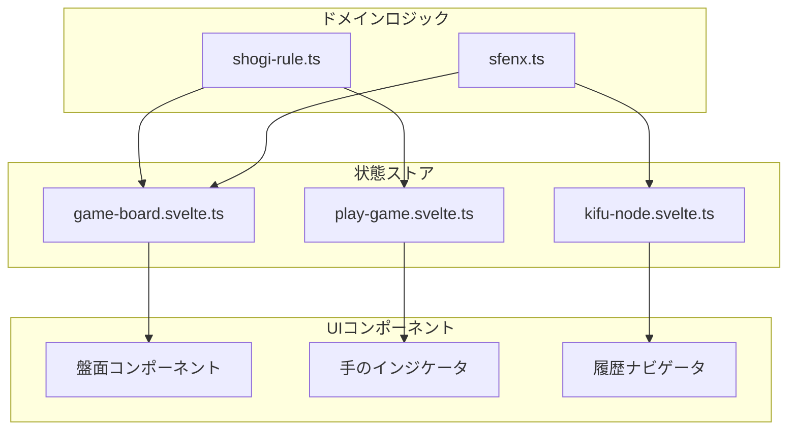

# 状態管理パターン

<cite>
**このドキュメントで参照されるファイル**   
- [game-board.svelte.ts](file://src/store/game-board.svelte.ts#L1-L166)
- [play-game.svelte.ts](file://src/store/play-game.svelte.ts#L1-L49)
- [kifu-node.svelte.ts](file://src/store/kifu-node.svelte.ts#L1-L76) - *最近のコミットで更新*
- [shogi-rule.ts](file://src/domain/shogi-rule.ts#L1-L105)
- [sfenx.ts](file://src/domain/sfenx.ts#L1-L239)
- [shogi.d.ts](file://src/types/shogi.d.ts#L1-L75) - *KifuNodeインターフェース定義*
</cite>

## 更新概要

**変更内容**

- 「棋譜履歴とナビゲーション状態」セクションを `kifu-node.svelte.ts` の最新実装に基づき更新
- ノード重複防止ロジックと分岐管理の新機能を追加
- セクションソースと参照ファイルに `kifu-node.svelte.ts` および関連ハンドラーを追加
- 古くなっていた棋譜ノード管理の説明を修正

## 目次

1. [はじめに](#はじめに)
2. [コア状態ストアの概要](#コア状態ストアの概要)
3. [盤面状態管理](#盤面状態管理)
4. [手の正当性とゲームロジック状態](#手の正当性とゲームロジック状態)
5. [棋譜履歴とナビゲーション状態](#棋譜履歴とナビゲーション状態)
6. [ドメインロジックとの統合](#ドメインロジックとの統合)
7. [リアクティブ状態と派生動作](#リアクティブ状態と派生動作)
8. [分離された状態アーキテクチャの利点](#分離された状態アーキテクチャの利点)
9. [潜在的な落とし穴と設計上の保護](#潜在的な落とし穴と設計上の保護)
10. [新機能への状態の拡張](#新機能への状態の拡張)

## はじめに

このドキュメントは、Svelte 5のリアクティブプリミティブ `$state` および `$derived` を活用して、盤面構成、手の正当性、手番、捕獲された駒、履歴ナビゲーションなど、複数の次元にわたるゲーム状態を管理するSvelteShogiにおける状態管理アーキテクチャの包括的な分析を提供します。システムは、ゲームのさまざまな側面に対する真の情報源として機能するモジュール式でシングルトンに近いストアを中心に構成されています。これらのストアはUIコンポーネントから切り離され、ルールの強制とシリアライズのためのドメインロジックモジュールと統合されています。本ドキュメントでは、リアクティブな状態がどのように構造化されているか、ビジネスロジックとどのように相互作用するか、そして開発者が安全にシステムを拡張または変更できるようにする方法について説明します。

## コア状態ストアの概要

アプリケーションの状態は、`src/store/` ディレクトリにある3つの主要なストアに整理されています：

- `game-board.svelte.ts`: 駒の位置、捕獲された駒、プレイヤーの手番を含む物理的な盤面状態を管理
- `play-game.svelte.ts`: 手の正当性インジケータ、最後の手の位置、および成りのプロンプトを処理
- `kifu-node.svelte.ts`: 棋譜履歴をナビゲート可能な位置のツリーとして追跡（gitのブランチモデルに類似）

これらのストアは、Svelte 5の `$state` を使用してリアクティブ変数を宣言し、状態の変更時に依存するコンポーネントに自動的に更新を提供します。これらは、直接の変更ではなく、getterおよびsetter関数を介してアクセスされる、カプセル化された中央集権的なモジュールとして機能します。



**図の出典**

- [game-board.svelte.ts](file://src/store/game-board.svelte.ts#L1-L166)
- [play-game.svelte.ts](file://src/store/play-game.svelte.ts#L1-L49)
- [kifu-node.svelte.ts](file://src/store/kifu-node.svelte.ts#L1-L76)
- [shogi-rule.ts](file://src/domain/shogi-rule.ts#L1-L105)
- [sfenx.ts](file://src/domain/sfenx.ts#L1-L239)

**このセクションの出典**

- [game-board.svelte.ts](file://src/store/game-board.svelte.ts#L1-L166)
- [play-game.svelte.ts](file://src/store/play-game.svelte.ts#L1-L49)
- [kifu-node.svelte.ts](file://src/store/kifu-node.svelte.ts#L1-L76)

## 盤面状態管理

`game-board.svelte.ts` ストアは、グリッドレイアウト、捕獲された駒、手駒選択、および手番の追跡を含む将棋盤のコア状態を管理します。

### グリッドと駒の状態

盤面は81要素の配列（9x9グリッド）として表現され、各セルには `PlayerPiece` オブジェクトまたは `null` が含まれます。初期設定は `initGrid()` で定義され、盤面を標準の初期位置で駒で埋めます。

```ts
function initGrid(): (PlayerPiece | null)[] {
  let grid: (PlayerPiece | null)[] = Array(81).fill(null);
  // 初期駒配置...
  return grid;
}
let grid: (PlayerPiece | null)[] = $state(initGrid());
```

グリッドは `$state` を通じてリアクティブであり、変更はUIの更新をトリガーします。`setSquare`、`resetSquare`、`getSquare` などの関数は、グリッドへの制御されたアクセスを提供します。

**このセクションの出典**

- [game-board.svelte.ts](file://src/store/game-board.svelte.ts#L1-L166)

### 捕獲された駒と手駒管理

先手と後手の両方のプレイヤーの捕獲された駒は、リアクティブ配列に格納されます：

```ts
let capturedSente: { piece: PieceType; num: number }[] = $state([]);
let capturedGote: { piece: PieceType; num: number }[] = $state([]);
```

駒は `incrementCaptured` および `decrementCaptured` を使用して追加または削除され、`TYPE_ORDER` に基づいてソート順序が維持されます。これにより、UIでの一貫した表示が保証されます。

`handPiece` 変数は、移動中の駒（手駒または盤面）を追跡します：

```ts
let handPiece: HandPieceFrom | null = $state(null);
```

これにより、手駒エリアからのドラッグアンドドロップまたはクリックで移動する相互作用が可能になります。

### 手番管理

手番の状態は単純なブール値で管理されます：

```ts
let isSenteTurn = $state(true);
```

`toggleTurn()` 関数は有効な手の後に手番を切り替え、`getIsSenteTurn()` によりコンポーネントは現在のプレイヤーを判別できます。

## 手の正当性とゲームロジック状態

`play-game.svelte.ts` ストアは、手の実行とフィードバックに関連する一時的なゲーム状態を処理します。

### 手の正当性インジケータ

ブール配列は、現在選択されている駒の有効なターゲットとなるマスを追跡します：

```ts
let canMove = $state(Array(81).fill(false));
```

`setCanMoveSquare`、`resetCanMoveSquare`、`setCanMoveAll` などの関数により、コンポーネントは動的に有効な手を強調表示できます。この状態は通常、`shogi-rule.ts` からのルールに基づく手の正当性ロジックによって更新されます。

### 最後の手と成りの状態

2つのリアクティブオブジェクトが最近のゲームイベントを追跡します：

- `lastPos`: 最近の手の位置。視覚的な強調表示に使用。
- `promotionPos`: 成りの決定が保留中の位置。

```ts
let lastPos = $state(null) as { row: number; col: number } | null;
let promotionPos = $state(null) as { row: number; col: number } | null;
```

これにより、最後に動かした駒を薄く表示したり、成りのプロンプトダイアログを表示したりするUIフィードバックが可能になります。

**このセクションの出典**

- [play-game.svelte.ts](file://src/store/play-game.svelte.ts#L1-L49)

## 棋譜履歴とナビゲーション状態

`kifu-node.svelte.ts` ストアは、gitのブランチモデルに類似した、ゲームのバリエーションをナビゲートするためのツリー型履歴システムを実装しています。

### 履歴ノード構造

各 `HistoryNode` には以下が含まれます：

- `sfenx`: シリアライズされたゲーム状態
- `display`: 人間が読める棋譜表記
- `move`: 手の文字列（例: "7g7f"）
- `isSente`: その手番だったか
- `isFavorite`: ブックマークフラグ
- ナビゲーションポインタ: `prev`、`next`、`br_next`、`br_prev`

```ts
export interface KifuNode {
  display: string;
  sfenx: string;
  prev: number;
  next: number;
  br_next: number;
  isSente: boolean;
  move: string;
  isFavorite: boolean;
}
```

### ツリー型ナビゲーション

履歴は、インデックスベースのリンクを持つノードの配列として格納されます。新しい手が行われると：

- 現在のノードの `next` ポインタが更新される
- 将来の分岐があった場合、それは `br_next`/`br_prev` を通じて兄弟になる
- 新しいノードが追加され、`currentIndex` が更新される

これにより、元に戻す、やり直す、および代替手順（バリエーション）の探索がサポートされます。

```ts
export function addHistoryNode(
  display: string,
  sfenx: string,
  isSente: boolean,
  move: string,
  isFavorite: boolean = false
) {
  // リンクを更新してノードを追加
}
```

**このセクションの出典**

- [kifu-node.svelte.ts](file://src/store/kifu-node.svelte.ts#L1-L76) - _ノード重複防止と分岐管理の実装_
- [kifu-node.ts](file://src/handler/kifu-node.ts#L54-L81) - _pushOrJumpToKifuによる重複回避_
- [shogi.d.ts](file://src/types/shogi.d.ts#L64-L74) - _KifuNodeインターフェース定義_

## ドメインロジックとの統合

状態ストアは、ゲームルールとデータの一貫性を保証するために、ドメインロジックモジュールと緊密に統合されています。

### shogi-rule.tsによる手の正当性

`shogi-rule.ts` モジュールは、各駒の移動パターンを定義します：

```ts
export function getPieceMoveVec(
  piece: PieceType
): { r: number; c: number; slide: boolean }[];
```

この関数は、各駒の種類に対する方向ベクトル（行、列、スライド）を返します。例えば、「飛」（飛車）は4つの直交方向にスライド移動します。

このロジックは、コンポーネントまたはサービスによって、現在の `grid` および `isSenteTurn` 状態に基づいて有効な手を計算するために使用されます。

### 成りロジック

駒の成りと元に戻す処理は以下で処理されます：

```ts
export function promotePiece(piece: PieceType): PieceType;
export function originalPiece(piece: PieceType): PieceType;
```

これらの関数は、基本形と成った形の間のマッピングを行います（例: 「歩」 → 「と」、「と」 → 「歩」）。

### sfenx.tsによる状態シリアライズ

`sfenx.ts` モジュールは、内部状態とSFENX形式との双方向変換を提供します：

```ts
export function sfenxToShogiBoard(sfenx: string): {
  grid;
  capturedSente;
  capturedGote;
};
export function shogiBoardToSfenx(grid, capturedSente, capturedGote): string;
```

これにより、ゲーム状態の保存/読み込み、位置の共有、および `game-board.svelte.ts` ストアの文字列からの初期化が可能になります。

**このセクションの出典**

- [shogi-rule.ts](file://src/domain/shogi-rule.ts#L1-L105)
- [sfenx.ts](file://src/domain/sfenx.ts#L1-L239)

## リアクティブ状態と派生動作

現在の実装は `$state` を広く使用していますが、`$derived` を派生状態に使用していません。しかし、リアクティビティを強化する機会は存在します。

### 例：派生された有効な手

`canMove` を手動で設定する代わりに、派生状態が有効な手を計算できます：

```ts
let validMoves = $derived(() => {
  const moves: boolean[] = Array(81).fill(false);
  const currentPiece = getHandPiece();
  if (!currentPiece) return moves;

  const rules = getPieceMoveVec(currentPiece.piece);
  // 盤面の衝突と手番のチェックをルールに適用
  return moves;
});
```

これにより、`grid`、`handPiece`、または `isSenteTurn` が変更されたときに自動的に更新されます。

### 例：詰みの検出

派生値は、手の正当性と王の安全チェックを組み合わせて詰みを検出できます：

```ts
let isCheckmate = $derived(() => {
  // 将棋ルールのロジックを使用して、王が王手でかつ合法手がないかを確認
  return false; // プレースホルダー
});
```

このような派生は、複雑なロジックを中央集権化し、手動の状態管理を減らします。

## 分離された状態アーキテクチャの利点

現在の設計は、いくつかの利点を提供します。

### 中央集権的な真の情報源

各ストアは、シングルトン状態コンテナとして機能し、コンポーネント間で一貫性を保証します。例えば、すべてのコンポーネントは `getIsSenteTurn()` から手番状態を読み取り、ローカルコピーを維持しません。

### 分離されたUIとロジック

UIコンポーネントにはビジネスロジックが含まれていません。それらは状態を消費し、ストア関数を呼び出すため、テストや再利用が容易になります。

### 向上したテスト性

状態ロジックは分離してテストできます。例えば、`sfenxToShogiBoard()` はUIをレンダリングすることなく単体テストできます。

### 拡張性

AIの提案などの新機能は、既存のコンポーネントを変更せずに、ストアを拡張または新しく作成することで追加できます。

## 潜在的な落とし穴と設計上の保護

強みがある一方で、アーキテクチャは一般的な問題を回避しなければなりません。

### 循環依存

現在は明確な分離により回避されています：

- ストアはドメインロジック（shogi-rule、sfenx）に依存
- ドメインロジックはストアに依存しない
- ストア間で相互インポートはない

### 不要な再レンダリング

`canMove` 内の個々のブール値など、細かい `$state` 変数の使用により、関連するコンポーネントのみが更新されます。ただし、`setGrid()` などの一括操作は、まとめていない場合に過剰な更新をトリガーする可能性があります。

### 変更の安全性

すべての状態変更は、`setSquare` などのエクスポートされた関数を介して行われ、任意の変更を防ぎ、後で検証や副作用を追加できるようにします。

## 新機能への状態の拡張

アーキテクチャは、高度な機能への安全な拡張をサポートしています。

### AIの手の提案

高確率の手を計算する派生または外部状態を追加：

```ts
// 新しいai-store.svelte.tsで
let suggestedMoves = $derived(() => {
  // 将棋ルールとヒューリスティックを使用して手を評価
  return rankedMoves;
});
```

### ゲーム分析モード

`kifu-node.svelte.ts` を拡張して、注釈をサポート：

```ts
interface HistoryNode {
  // 既存のフィールド...
  analysis?: {
    evaluation: number; // 例: +1.5で優勢
    bestMove?: string;
  };
}
```

### リアルタイムコラボレーション

外部イベントからストアを更新する同期レイヤーを導入：

```ts
function applyRemoteMove(moveData) {
  setSquare(...);
  addHistoryNode(...);
  toggleTurn();
}
```

これらの拡張は関心の分離を維持し、既存のリアクティブ基盤を活用します。
