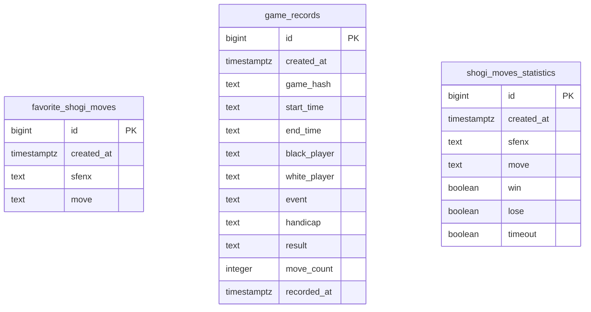
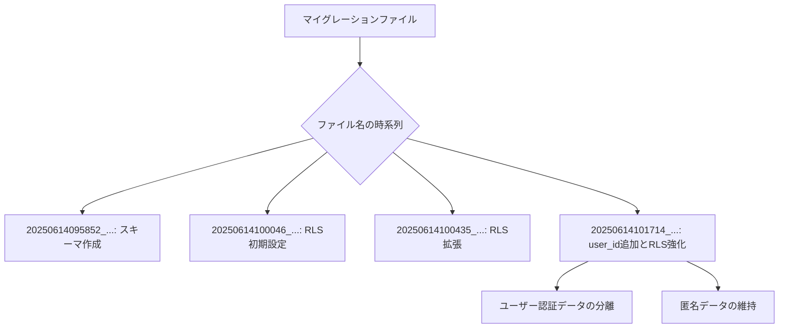

# バックエンド統合

<cite>
**このドキュメントで参照されるファイル**  
- [config.toml](file://supabase/config.toml)
- [20250614095852_remote_schema.sql](file://supabase/migrations/20250614095852_remote_schema.sql)
- [20250614100046_remote_schema.sql](file://supabase/migrations/20250614100046_remote_schema.sql)
- [20250614100435_remote_schema.sql](file://supabase/migrations/20250614100435_remote_schema.sql)
- [20250614101714_add_user_id_to_tables.sql](file://supabase/migrations/20250614101714_add_user_id_to_tables.sql)
- [package.json](file://package.json)
</cite>

## 目次
1. [概要](#概要)
2. [構成ファイルの詳細](#構成ファイルの詳細)
3. [マイグレーションの管理](#マイグレーションの管理)
4. [フロントエンドからのAPI連携](#フロントエンドからのapi連携)
5. [実用的な例](#実用的な例)
6. [トラブルシューティング](#トラブルシューティング)

## 概要

本ドキュメントは、将棋アプリ「SvelteShogi」におけるSupabaseを用いたバックエンド統合について、目的、構成、データベースマイグレーション、API連携パターンを詳細に解説します。このプロジェクトはSvelteをフロントエンドに用い、Supabaseをバックエンドとしており、将棋の棋譜記録、手の統計、お気に入りの手の保存といった機能を提供します。

SupabaseはオープンソースのBaaS（Backend as a Service）であり、PostgreSQLデータベース、認証、ストレージ、リアルタイム機能を提供します。本プロジェクトでは、将棋のゲームデータを永続化し、ユーザーごとのデータ管理を可能にするためにSupabaseが採用されています。

**Section sources**
- [package.json](file://package.json#L1-L26)

## 構成ファイルの詳細

`supabase/config.toml` は、ローカル開発環境におけるSupabaseの設定を定義する主要な構成ファイルです。以下に主要な設定項目を解説します。

### API設定
- **`port`**: APIサーバーが使用するポート（54321）
- **`schemas`**: APIエンドポイントを公開するスキーマ（`public`, `storage`, `graphql_public`）
- **`max_rows`**: 範囲指定なしで返される最大行数（1000行）

### データベース設定
- **`port`**: ローカルデータベースのポート（54322）
- **`major_version`**: 使用するPostgreSQLのメジャーバージョン（15）

### Studio設定
- **`port`**: Supabase Studioのポート（54323）
- **`api_url`**: フロントエンドが接続するAPIの外部URL（http://127.0.0.1:54321）

### 認証設定
- **`site_url`**: 認証リダイレクトの許可リスト（http://localhost:5173）
- **`jwt_expiry`**: JWTトークンの有効期限（3600秒 = 1時間）
- **`enable_signup`**: 新規ユーザー登録の可否（true）

### ストレージ設定
- **`file_size_limit`**: アップロード可能な最大ファイルサイズ（50MiB）

### リアルタイム設定
- **`enabled`**: リアルタイム機能の有効化（true）

この構成により、開発者はローカル環境で本番と同等のSupabase環境を再現でき、API、認証、データベースを統合的に管理できます。

**Section sources**
- [config.toml](file://supabase/config.toml#L1-L127)

## マイグレーションの管理

Supabaseでは、データベースのスキーマ変更はSQLファイルによるマイグレーションで管理されます。`supabase/migrations/` ディレクトリに格納されたSQLファイルは、時系列に適用され、データベースの状態をバージョン管理します。

### 初期スキーマの作成
`20250614095852_remote_schema.sql` は初期スキーマを定義しています。以下の3つのテーブルが作成されます：

- **`favorite_shogi_moves`**: ユーザーのお気に入りの手
- **`game_records`**: 将棋ゲームの記録
- **`shogi_moves_statistics`**: 手の勝敗統計

各テーブルには、`id`（自動採番）と`created_at`（作成日時）が共通して存在します。



**Diagram sources**
- [20250614095852_remote_schema.sql](file://supabase/migrations/20250614095852_remote_schema.sql#L1-L449)

### RLS（行レベルセキュリティ）ポリシーの設定
`20250614100046_remote_schema.sql` と `20250614100435_remote_schema.sql` では、すべてのユーザーがすべてのデータにアクセスできるポリシーが設定されています（`USING (true)`）。これは開発初期段階の簡易的な設定です。

### ユーザーIDの追加とRLSの強化
`20250614101714_add_user_id_to_tables.sql` は、データをユーザーと関連付ける重要な変更を含みます。

1. **`user_id` カラムの追加**: 各テーブルに `UUID REFERENCES auth.users(id)` を追加し、Supabaseの認証システムと連携。
2. **インデックスの作成**: `user_id` での検索性能を向上。
3. **旧ポリシーの削除**: 開発用の全公開ポリシーを削除。
4. **新RLSポリシーの作成**:
   - `auth.uid() = user_id OR user_id IS NULL`: ユーザーは自分のデータまたは匿名データにアクセス可能。
   - `user_id IS NULL`: 匿名データの公開読み取りを許可。

この変更により、ユーザー認証済みのデータと匿名データを明確に分離し、セキュリティを強化しています。



**Diagram sources**
- [20250614101714_add_user_id_to_tables.sql](file://supabase/migrations/20250614101714_add_user_id_to_tables.sql#L1-L57)

**Section sources**
- [20250614095852_remote_schema.sql](file://supabase/migrations/20250614095852_remote_schema.sql#L1-L449)
- [20250614100046_remote_schema.sql](file://supabase/migrations/20250614100046_remote_schema.sql#L1-L10)
- [20250614100435_remote_schema.sql](file://supabase/migrations/20250614100435_remote_schema.sql#L1-L18)
- [20250614101714_add_user_id_to_tables.sql](file://supabase/migrations/20250614101714_add_user_id_to_tables.sql#L1-L57)

## フロントエンドからのAPI連携

フロントエンド（Svelte）は、SupabaseのJavaScriptクライアントライブラリを用いてバックエンドと通信します。`package.json` に `supabase` が開発依存として記載されていることから、SDKの利用が確認できます。

### 基本的な連携パターン
1. **クライアントの初期化**:
   ```ts
   import { createClient } from '@supabase/supabase-js'
   const supabase = createClient(SUPABASE_URL, SUPABASE_ANON_KEY)
   ```

2. **認証済みユーザーの取得**:
   ```ts
   const { data: { user } } = await supabase.auth.getUser()
   ```

3. **データの読み書き**:
   ```ts
   // 読み取り（匿名データ）
   const { data, error } = await supabase
     .from('game_records')
     .select('*')
     .is('user_id', null)

   // 書き込み（認証済みユーザー）
   const { data, error } = await supabase
     .from('favorite_shogi_moves')
     .insert({ sfenx: '...', move: '7g7f', user_id: user.id })
   ```

### 実装の考慮点
- **RLSの遵守**: クエリはRLSポリシーに従う必要がある。`user_id` を含む操作では、認証済みセッションが必要。
- **リアルタイム購読**: `supabase.channel()` を用いて、特定のデータ変更をリアルタイムで監視可能。
- **エラーハンドリング**: `error` オブジェクトを常にチェックし、ネットワークエラー、権限エラー、バリデーションエラーを適切に処理。

**Section sources**
- [package.json](file://package.json#L1-L26)

## 実用的な例

### お気に入りの手を保存するフロー
1. ユーザーが将棋盤上で手を選択。
2. SFENX形式の局面と手の情報を取得。
3. Supabaseクライアントで認証状態を確認。
4. `favorite_shogi_moves` テーブルに挿入。
   ```ts
   const { data, error } = await supabase
     .from('favorite_shogi_moves')
     .insert([
       { 
         sfenx: currentSfenx, 
         move: selectedMove,
         user_id: currentUser ? currentUser.id : null // 匿名でも保存可能
       }
     ])
   ```
5. 成功時：UIに通知。失敗時：エラーメッセージ表示。

### 過去の対局を検索するクエリ
```ts
const { data, error } = await supabase
  .from('game_records')
  .select('game_hash, black_player, white_player, result, recorded_at')
  .or(`black_player.ilike.*${query}*,white_player.ilike.*${query}*`)
  .order('recorded_at', { ascending: false })
  .range(0, 19) // ページネーション
```

## トラブルシューティング

### 1. データの読み取りができない（401 Unauthorized）
- **原因**: 認証されていない状態で `user_id` が設定された行を読み取ろうとしている。
- **解決策**: 
  - 匿名データのみを対象にする場合は `.is('user_id', null)` を追加。
  - 認証済みユーザーのデータを読み取る場合は、ログイン済みであること、およびRLSポリシーが `auth.uid() = user_id` を許可していることを確認。

### 2. データの挿入ができない（403 Forbidden）
- **原因**: RLSポリシーによって挿入が拒否されている。
- **解決策**:
  - `user_id` を `null` にする（匿名）か、`supabase.auth.getUser()` で取得したユーザーIDを設定。
  - マイグレーションスクリプトで正しいRLSポリシーが適用されているか確認（`20250614101714_add_user_id_to_tables.sql`）。

### 3. Supabase Studioに接続できない
- **原因**: ローカルSupabase開発サーバーが起動していない。
- **解決策**: ターミナルで `supabase start` を実行し、すべてのコンテナが正常に起動しているか確認。

### 4. APIエンドポイントが見つからない
- **原因**: `config.toml` の `schemas` にテーブルのスキーマが含まれていない。
- **解決策**: `config.toml` で `public` スキーマが `schemas` リストに含まれていることを確認。