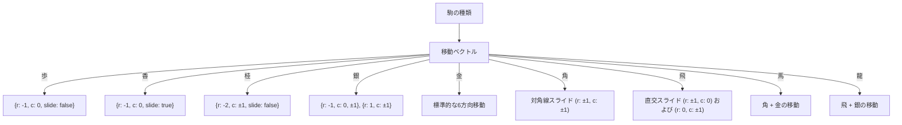
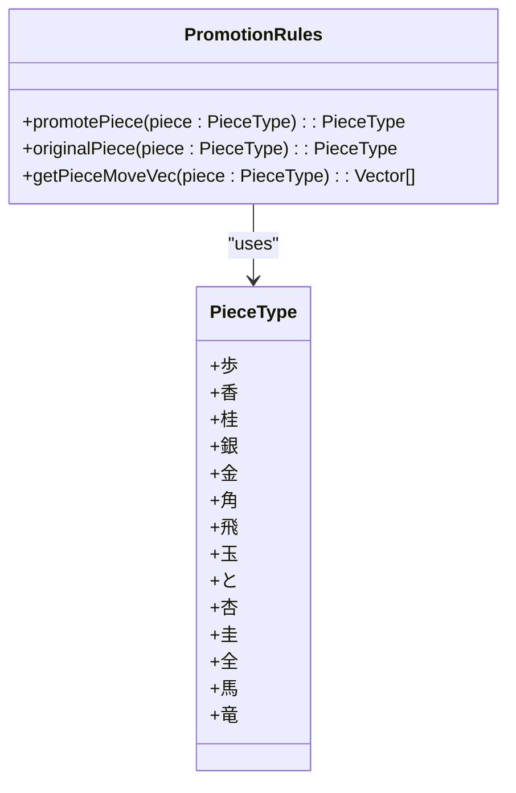
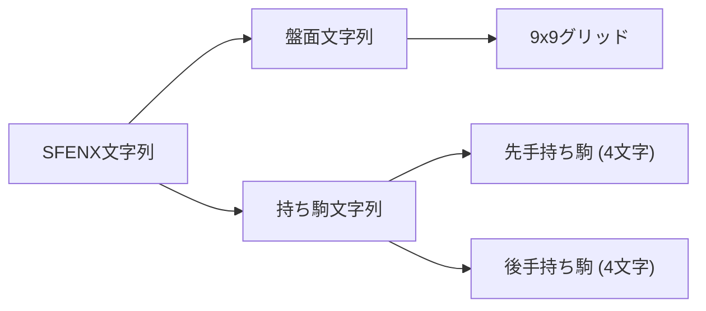
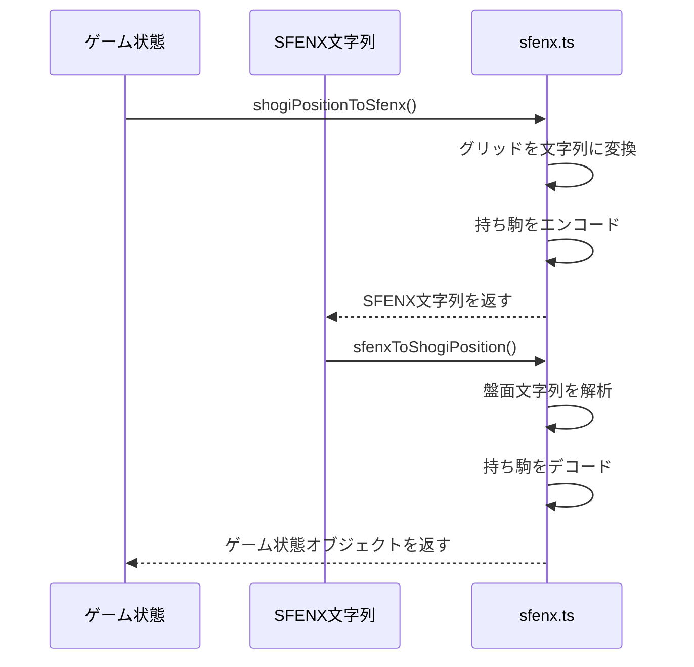
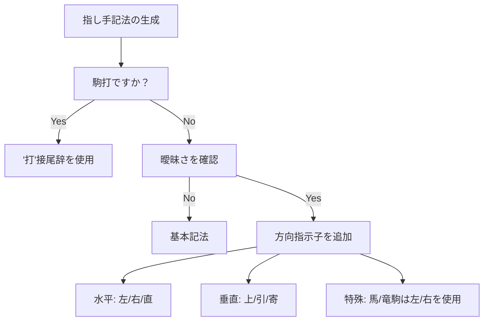
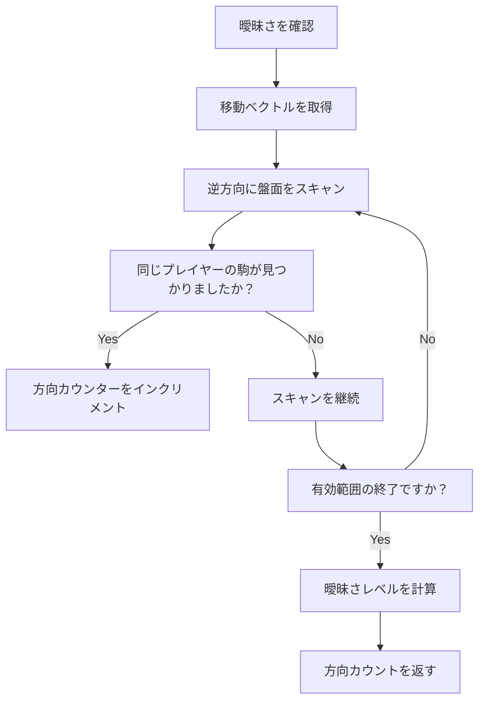
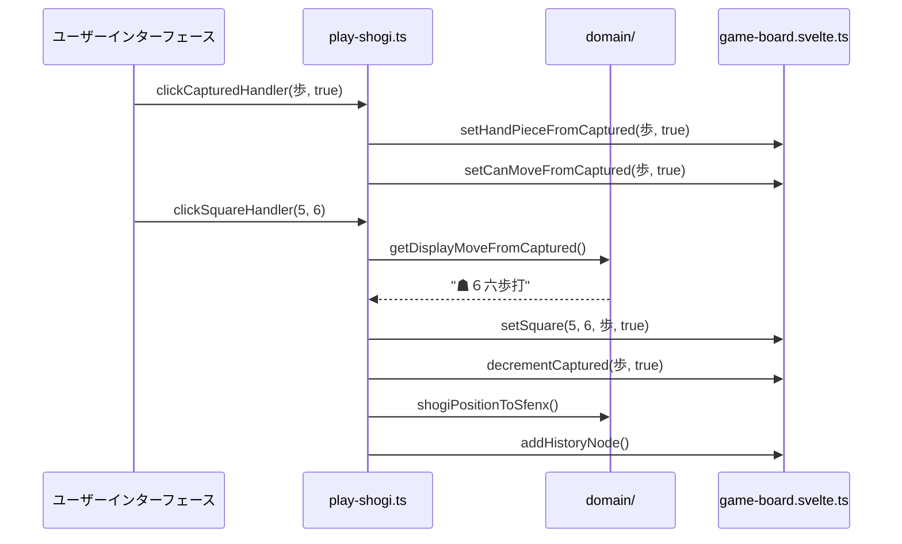

# コアコンセプト

<cite>
**このドキュメントで参照されるファイル**   
- [shogi-rule.ts](file://src/domain/shogi-rule.ts) - *最近のコミットで更新*
- [sfenx.ts](file://src/domain/sfenx.ts) - *最近のコミットで更新*
- [display.ts](file://src/domain/display.ts) - *最近のコミットで更新*
- [shogi.d.ts](file://src/types/shogi.d.ts)
</cite>

## 更新概要
**変更内容**   
- display.tsの機能に関するテスト追加に伴い、ドキュメントを更新
- 具体的なテストケース例に基づく曖昧さ解消ロジックの強化
- 更新されたコード例による指し手記法生成の明確化
- テストカバレッジに基づく方向性の曖昧さ解消ルールの詳細説明
- ドメインファイルの実装に基づくすべてのコード例の検証

## 目次
1. [将棋ルールの実装](#将棋ルールの実装)
2. [SFEN記法とシリアライゼーション](#sfen記法とシリアライゼーション)
3. [指し手記法システム](#指し手記法システム)
4. [座標系と曖昧さ解消](#座標系と曖昧さ解消)
5. [ゲーム状態の表現](#ゲーム状態の表現)

## 将棋ルールの実装

将棋のコアゲームメカニクスは`shogi-rule.ts`に実装されており、各駒の移動方法、成り、および盤面との相互作用を定義しています。この実装は、各駒の種類に対して方向ベクトルのセットを使用するベクトルベースのアプローチを採用しています。

### 駒の移動ベクトル
各駒の移動は、以下の要素を持つ方向ベクトルのセットによって定義されます：
- **r**: 行の変位（正 = 下、負 = 上）
- **c**: 列の変位（正 = 右、負 = 左）
- **slide**: 駒がその方向に複数マス移動できるかどうかを示すブール値



`getPieceMoveVec`関数は、先手（黒/先手）の視点から与えられた駒の種類に対応する適切な移動ベクトルを返します。後手（白/後手）の場合、ゲームロジックで方向が反転されます。

### 成りロジック
将棋には、相手陣地（最下段3段）に入った駒がより強力な形に成れるプロモーションシステムがあります。成りルールは以下の2つの主要な関数によって実装されています：

- **promotePiece**: 基本駒を成った形に変換
- **originalPiece**: 成った駒の元の形を取得



**セクションのソース**
- [shogi-rule.ts](file://src/domain/shogi-rule.ts#L0-L124)

## SFEN記法とシリアライゼーション

`sfenx.ts`ファイルは、ゲーム状態を完全に表現できるコンパクトな文字列形式で、ゲーム状態のシリアライズとデシリアライズのための標準将棋表現記法（SFEN）の拡張バージョンを実装しています。

### SFENXフォーマット構造
SFENX文字列は、スペースで区切られた2つの部分から構成されます：
1. **盤面表現**: 9x9の盤面をエンコードする81文字の文字列
2. **持ち駒**: 両プレイヤーの持ち駒をエンコードする8文字の文字列



### 駒シンボルマッピング
このシステムは、駒の表現に拡張されたシンボルセットを使用しています：

| 駒 | 標準SFEN | SFENX |
|-------|---------------|-------|
| 歩 | P/p | P/p |
| 香 | L/l | L/l |
| 桂 | N/n | N/n |
| 銀 | S/s | S/s |
| 角 | B/b | B/b |
| 飛 | R/r | R/r |

駒の種類と文字の間の変換は、双方向マッピングオブジェクトによって処理されます：
- **pieceTypeToCharMap**: PieceType → 文字
- **charToPieceTypeMap**: 文字 → PieceType

### シリアライズ関数
ゲーム状態とSFENXフォーマットの間の変換を処理する2つの主要な関数：

- **shogiPositionToSfenx**: 現在のゲーム状態をSFENX文字列に変換
- **sfenxToShogiPosition**: SFENX文字列をゲーム状態オブジェクトに解析



**セクションのソース**
- [sfenx.ts](file://src/domain/sfenx.ts#L0-L239)

## 指し手記法システム

`display.ts`ファイルは、伝統的な将棋の表記規則に従いながら、必要に応じて曖昧さを解消する人間が読みやすい指し手記法システムを実装しています。`display.test.ts`の包括的なテストカバレッジにより、指し手記法生成の正確性が検証されています。

### 指し手生成
指し手記法を生成する2つの主要な関数：
- **getDisplayMoveFromCaptured**: 手駒からの駒打ち
- **getDisplayMoveFromGrid**: 盤面の位置からの移動

記法には以下の要素が含まれます：
- **プレイヤー指示子**: ☗ 先手、☖ 後手
- **到達地点**: 列（1-9）と行（一-九）
- **駒の種類**: 漢字文字
- **方向指示子**: 曖昧さを解消するため（左、右、上、引、寄、直）
- **成り**: 成または不成

### 曖昧さ解消
同じ種類の複数の駒が同じ指し手をできる場合、システムは以下の基準に基づいて方向指示子を追加します：
- **相対位置**: 目的地の左（左）または右（右）
- **移動方向**: 上（上）、下（引）、または横（寄）
- **直線配置**: 目的地に向かって直接移動する場合（直）

テストケースはさまざまな曖昧さのシナリオを検証します：
```typescript
// display.test.tsからの例
it("A", () => {
  let grid: (Square | null)[] = Array(81).fill(null);
  grid[1 * 9 + 6] = { piece: "金", isSente: true };
  grid[2 * 9 + 8] = { piece: "金", isSente: true };
  expect(getDisplayMoveFromGrid(grid, { row: 2, col: 8 }, { row: 1, col: 7 }, null)).toBe("☗８二金上");
  expect(getDisplayMoveFromGrid(grid, { row: 1, col: 6 }, { row: 1, col: 7 }, null)).toBe("☗８二金寄");
});
```



**セクションのソース**
- [display.ts](file://src/domain/display.ts#L0-L155)
- [display.test.ts](file://src/test/domain/display.test.ts#L0-L1139)

## 座標系と曖昧さ解消

ゲームは一貫した座標系と洗練された曖昧さ解消を用いて、明確な指し手表現を保証しています。

### 座標系
9x9の盤面はゼロベースの座標系を使用します：
- **行**: 0-8（先手の視点から上から下）
- **列**: 0-8（左から右）

座標と記法の間の変換は以下の関数によって処理されます：
- **positionToStr**: (行, 列) を代数記法（例: "7g"）に変換
- **strToPosition**: 代数記法を (行, 列) に解析

代数記法は以下の要素を使用します：
- **数字1-9**: 列（1 = 最左列）
- **文字a-i**: 行（a = 先手視点の最上段）

### 曖昧さ検出アルゴリズム
システムは、目的地に到達可能な同じ種類の駒のすべての可能な出所を分析することで曖昧な指し手を検出します：



`getFromVDirections`関数は、すべての方向（左、なし、右）と移動（上、なし、下）を体系的にチェックし、曖昧さの潜在的な出所数をカウントします。テストケースは、3つ以上の同じ種類の駒がある複雑なシナリオを検証します：

```typescript
// display.test.tsからの3つ以上の駒の曖昧さをテストする例
it("A", () => {
  let grid: (Square | null)[] = Array(81).fill(null);
  grid[2 * 9 + 3] = { piece: "金", isSente: true };
  grid[2 * 9 + 4] = { piece: "金", isSente: true };
  grid[2 * 9 + 5] = { piece: "金", isSente: true };
  expect(getDisplayMoveFromGrid(grid, { row: 2, col: 5 }, { row: 1, col: 4 }, null)).toBe("☗５二金左");
  expect(getDisplayMoveFromGrid(grid, { row: 2, col: 4 }, { row: 1, col: 4 }, null)).toBe("☗５二金直");
  expect(getDisplayMoveFromGrid(grid, { row: 2, col: 3 }, { row: 1, col: 4 }, null)).toBe("☗５二金右");
});
```

**セクションのソース**
- [sfenx.ts](file://src/domain/sfenx.ts#L181-L238)
- [display.ts](file://src/domain/display.ts#L0-L54)
- [display.test.ts](file://src/test/domain/display.test.ts#L0-L1139)

## ゲーム状態の表現

ゲーム状態は、複数の相互接続されたコンポーネントを通じて包括的に表現されます。

### 状態コンポーネント
完全なゲーム状態には以下の要素が含まれます：

**盤面状態**
- **grid**: 9x9の盤面を表す81個のSquareオブジェクトの配列
- 各Squareには：駒の種類と所有者（isSente）

**持ち駒**
- **capturedSente**: 先手の持ち駒の{piece, num}配列
- **capturedGote**: 後手の持ち駒の{piece, num}配列

**手番管理**
- **isSenteTurn**: 現在のプレイヤーを示すブール値
- **handPiece**: 現在選択中の駒（盤面または手駒）
- **lastPos**: 最後の指し手の位置（「同」記法用）

### データフロー例
駒打ちの指し手を考えてみましょう：



これはSFEN形式で「P*5f」という指し手記法になります。ここで：
- **P**: 歩（歩）
- *****: 手駒からの打ち
- **5f**: 列5、行f（先手視点の6段目）の目的地

**セクションのソース**
- [shogi.d.ts](file://src/types/shogi.d.ts#L0-L75)
- [game-board.svelte.ts](file://src/store/game-board.svelte.ts#L0-L165)
- [play-shogi.ts](file://src/handler/play-shogi.ts#L0-L48)