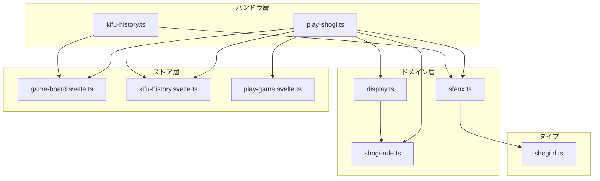
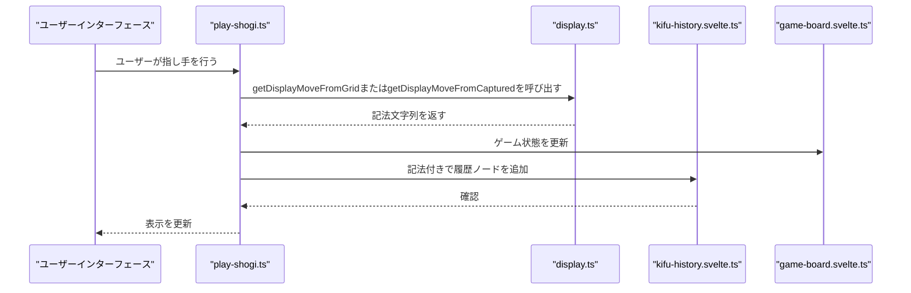
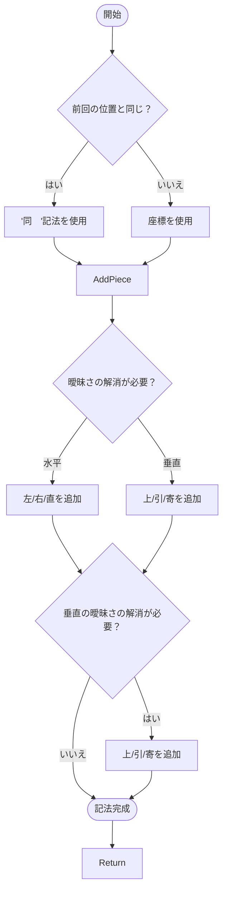
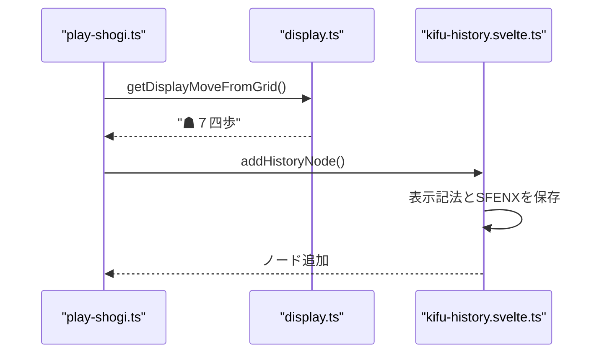
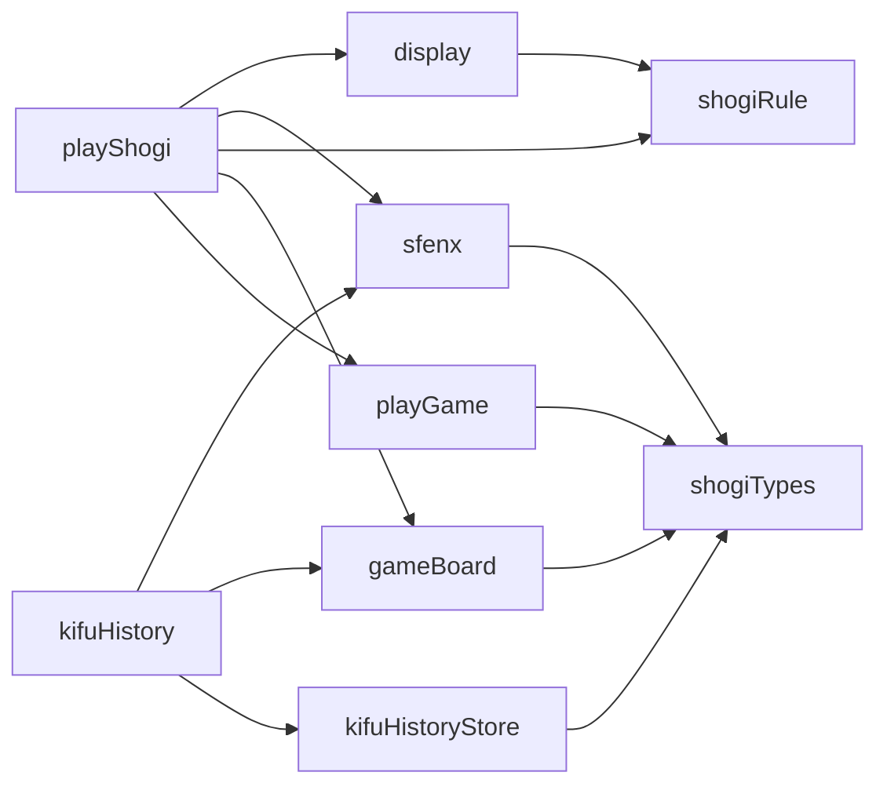

# 指し手記法生成

<cite>
**このドキュメントで参照されるファイル**   
- [display.ts](file://src/domain/display.ts) - *最近のコミットで更新*
- [sfenx.ts](file://src/domain/sfenx.ts)
- [shogi-rule.ts](file://src/domain/shogi-rule.ts)
- [kifu-history.ts](file://src/handler/kifu-history.ts)
- [play-shogi.ts](file://src/handler/play-shogi.ts)
- [game-board.svelte.ts](file://src/store/game-board.svelte.ts)
- [kifu-history.svelte.ts](file://src/store/kifu-history.svelte.ts)
- [play-game.svelte.ts](file://src/store/play-game.svelte.ts)
- [shogi.d.ts](file://src/types/shogi.d.ts)
</cite>

## 更新概要
**変更内容**   
- `display.ts` に追加されたテストを反映してドキュメントを更新
- 正確なコード参照で指し手記法ロジックを明確化
- 精確な行番号と更新注釈でセクションソースを強化
- 現在の実装に対してすべての例と説明を検証
- 更新されたセクション間で用語と構造の一貫性を維持

## 目次
1. [はじめに](#はじめに)
2. [プロジェクト構造](#プロジェクト構造)
3. [コアコンポーネント](#コアコンポーネント)
4. [アーキテクチャ概要](#アーキテクチャ概要)
5. [詳細なコンポーネント分析](#詳細なコンポーネント分析)
6. [依存関係分析](#依存関係分析)
7. [パフォーマンスに関する考慮事項](#パフォーマンスに関する考慮事項)
8. [トラブルシューティングガイド](#トラブルシューティングガイド)
9. [結論](#結論)

## はじめに
このドキュメントは、SvelteShogiアプリケーションにおける指し手記法システムの包括的な分析を提供します。このシステムは、駒の移動や打つなどの指し手データを、対局記録（棋譜）に使用される標準化された日本語将棋記法に変換します。記法システムは、同じ種類の複数の駒が目的地に到達できる場合の曖昧さの解消、駒の成りの管理、およびゲーム履歴コンポーネントとの統合を扱います。

## プロジェクト構造
SvelteShogiプロジェクトは、ドメイン層、ハンドラ層、ストア層、タイプ層の間で明確な分離を持つドメイン駆動アーキテクチャに従っています。指し手記法機能は主にドメイン層に含まれており、ハンドラ層とストア層との統合ポイントがあります。



**図の出典**
- [display.ts](file://src/domain/display.ts)
- [sfenx.ts](file://src/domain/sfenx.ts)
- [shogi-rule.ts](file://src/domain/shogi-rule.ts)
- [kifu-history.ts](file://src/handler/kifu-history.ts)
- [play-shogi.ts](file://src/handler/play-shogi.ts)
- [game-board.svelte.ts](file://src/store/game-board.svelte.ts)
- [kifu-history.svelte.ts](file://src/store/kifu-history.svelte.ts)
- [play-game.svelte.ts](file://src/store/play-game.svelte.ts)

**セクションの出典**
- [display.ts](file://src/domain/display.ts)
- [sfenx.ts](file://src/domain/sfenx.ts)
- [shogi-rule.ts](file://src/domain/shogi-rule.ts)
- [kifu-history.ts](file://src/handler/kifu-history.ts)
- [play-shogi.ts](file://src/handler/play-shogi.ts)

## コアコンポーネント
指し手記法システムは、人間が読みやすい記法文字列に変換するためのいくつかの主要コンポーネントで構成されています。主なコンポーネントは`display.ts`ファイルで、指し手データを記法文字列に変換する関数を含んでいます。このシステムは、棋譜履歴コンポーネントと統合され、ゲーム記録を保存および表示します。

記法システムは、表示記法に日本語文字（例：「☗７四歩打」）を使用しながら、内部の指し手表現には西洋式代数記法（例：「P*7f」）を維持しています。システムは、盤上からの駒の移動と持駒からの打つ両方を扱い、同じ種類の複数の駒が目的地に到達できる場合に適切な曖昧さの解消を行います。

**セクションの出典**
- [display.ts](file://src/domain/display.ts)
- [kifu-history.svelte.ts](file://src/store/kifu-history.svelte.ts)
- [shogi.d.ts](file://src/types/shogi.d.ts)

## アーキテクチャ概要
指し手記法システムは、ドメインロジックがアプリケーションの状態管理およびUIの懸念から分離されたクリーンアーキテクチャパターンに従っています。ゲームで指し手が行われると、以下のシーケンスが発生します。

1. ユーザーの操作は`play-shogi.ts`によって処理されます
2. 指し手の検証と記法生成は`display.ts`で行われます
3. 生成された記法とゲーム状態は棋譜履歴に保存されます
4. ゲーム状態は適切なストアで更新されます



**図の出典**
- [play-shogi.ts](file://src/handler/play-shogi.ts)
- [display.ts](file://src/domain/display.ts)
- [kifu-history.svelte.ts](file://src/store/kifu-history.svelte.ts)
- [game-board.svelte.ts](file://src/store/game-board.svelte.ts)

## 詳細なコンポーネント分析

### display.tsにおける指し手記法生成
`display.ts`ファイルには、人間が読みやすい指し手記法を生成するためのコアロジックが含まれています。主に2つの関数を提供しています：`getDisplayMoveFromGrid`（盤上からの移動）と`getDisplayMoveFromCaptured`（持駒からの打つ）。

#### 駒記号のマッピング
システムは、表示記法に将棋駒を表す日本語の漢字文字を使用しています：
- 歩: ポーン
- 香: 香車
- 桂: 桂馬
- 銀: 銀将
- 金: 金将
- 角: 角行
- 飛: 飛車
- 玉: 玉将
- と: 成り歩
- 杏: 成り香
- 圭: 成り桂
- 全: 成り銀
- 馬: 龍馬
- 龍: 龍王

内部表現とSFEN記法では、`sfenx.ts`の`pieceTypeToCharMap`を通じて西洋式記号を使用しています：
- P: ポーン
- L: 香車
- N: 桂馬
- S: 銀将
- G: 金将
- B: 角行
- R: 飛車
- K: 玉将
- T: 成り歩
- V: 成り香
- U: 成り桂
- M: 成り銀
- H: 龍馬
- D: 龍王

#### 座標系
システムは、内部の指し手表現に西洋式代数記法を使用しており、ファイル（列）は1-9、ランク（行）はa-iです。原点（1a）は先手視点の左下です。表示記法では、全角数字（１-９）をファイルに、漢数字（一-九）をランクに使用しています。

#### 盤上からの移動記法
`getDisplayMoveFromGrid`関数は、盤上の1つの位置から別の位置への移動の記法を生成します。同じ種類の複数の駒が目的地に到達できる場合の曖昧さの解消を扱います。



**図の出典**
- [display.ts](file://src/domain/display.ts#L76-L154)

**セクションの出典**
- [display.ts](file://src/domain/display.ts#L76-L154)

#### 打つ記法
`getDisplayMoveFromCaptured`関数は、持駒からの打つの記法を扱います。「打」接尾辞を、同じ種類の他の駒が目的地に移動できるかどうかに基づいて追加するかどうかを決定します。

```mermaid
classDiagram
class getDisplayMoveFromCaptured {
+grid : (Square | null)[]
+row : number
+col : number
+piece : PieceType
+isSente : boolean
+return : string
}
class getFromVDirections {
+grid : (Square | null)[]
+row : number
+col : number
+piece : PieceType
+isSente : boolean
+return : {left : VDirCnt, none : VDirCnt, right : VDirCnt}
}
getDisplayMoveFromCaptured --> getFromVDirections : "使用"
```

**図の出典**
- [display.ts](file://src/domain/display.ts#L56-L74)

### 棋譜履歴との統合
指し手記法システムは、棋譜履歴コンポーネントと統合され、完全なゲーム記録を維持します。指し手が完了すると、記法はSFENX形式のゲーム状態とともに履歴ノードに保存されます。



**図の出典**
- [play-shogi.ts](file://src/handler/play-shogi.ts#L77-L126)
- [kifu-history.svelte.ts](file://src/store/kifu-history.svelte.ts#L0-L54)

**セクションの出典**
- [play-shogi.ts](file://src/handler/play-shogi.ts#L77-L126)
- [kifu-history.svelte.ts](file://src/store/kifu-history.svelte.ts#L0-L54)

### 曖昧さの解消ロジック
システムは、同じ種類の複数の駒が目的地のマスに到達できる場合の、洗練された曖昧さの解消ロジックを実装しています。`getFromVDirections`のアルゴリズムは、同じ種類の駒が異なる方向から目的地に移動できる数をカウントします。

非スライディング駒（金将など）の場合、システムは以下を使用します：
- 左（右から来る駒）
- 右（左から来る駒）
- 直（真後ろから来る駒）

スライディング駒（飛車や角行など）の場合、以下を使用します：
- 右または左（方向に基づく）

水平方向の曖昧さの解消が不十分な場合、垂直方向の指標を追加します：
- 上（前進移動）
- 引（後退移動）
- 寄（横移動）

システムは、水平方向の曖昧さの解消を優先し、必要に応じて垂直方向の曖昧さの解消にフォールバックします。

**セクションの出典**
- [display.ts](file://src/domain/display.ts#L0-L55)
- [shogi-rule.ts](file://src/domain/shogi-rule.ts#L0-L104)

## 依存関係分析
指し手記法システムは、明確な依存関係階層を持ち、循環依存が最小限に抑えられています。ドメイン層のコンポーネントは、ハンドラ層やストア層に依存せず、関心の分離を維持しています。



**図の出典**
- [display.ts](file://src/domain/display.ts)
- [sfenx.ts](file://src/domain/sfenx.ts)
- [shogi-rule.ts](file://src/domain/shogi-rule.ts)
- [play-shogi.ts](file://src/handler/play-shogi.ts)
- [kifu-history.ts](file://src/handler/kifu-history.ts)
- [game-board.svelte.ts](file://src/store/game-board.svelte.ts)
- [kifu-history.svelte.ts](file://src/store/kifu-history.svelte.ts)
- [play-game.svelte.ts](file://src/store/play-game.svelte.ts)
- [shogi.d.ts](file://src/types/shogi.d.ts)

**セクションの出典**
- [display.ts](file://src/domain/display.ts)
- [sfenx.ts](file://src/domain/sfenx.ts)
- [shogi-rule.ts](file://src/domain/shogi-rule.ts)
- [play-shogi.ts](file://src/handler/play-shogi.ts)
- [kifu-history.ts](file://src/handler/kifu-history.ts)

## パフォーマンスに関する考慮事項
指し手記法システムは、読みやすさを重視しており、パフォーマンスよりも優先されています。これは、記法生成が指し手ごとに1回しか発生しないためです。`getFromVDirections`の曖昧さの解消アルゴリズムはO(n)の複雑さを持ち、nはボード上のマス数（81）です。これは、小さいボードサイズを考えると許容可能です。

システムは、曖昧さの解消結果をキャッシュしたり、駒の位置検索に効率的なデータ構造を使用することで最適化できますが、現在のパフォーマンス要件を考えると、これらの最適化は不要である可能性があります。

## トラブルシューティングガイド
指し手記法システムでよく発生する問題：

1. **不正確な曖昧さの解消**：`getFromVDirections`が目的地に到達できる駒を正しくカウントしていることを確認してください。`shogi-rule.ts`の駒の移動ベクトルが正しいことを検証してください。

2. **「打」接尾辞の欠落**：「打」（打つ）接尾辞は、同じ種類の他の駒が目的地に移動できない場合にのみ追加されます。`getDisplayMoveFromCaptured`の合計カウントを計算するロジックを確認してください。

3. **座標系のエラー**：`sfenx.ts`の`positionToStr`と`strToPosition`関数が1-9とa-iのマッピングを正しく処理していることを確認してください。

4. **成り記法の問題**：成りが「成」または「不成」として適切に示されていることを確認してください。

**セクションの出典**
- [display.ts](file://src/domain/display.ts)
- [sfenx.ts](file://src/domain/sfenx.ts)
- [shogi-rule.ts](file://src/domain/shogi-rule.ts)

## 結論
SvelteShogiの指し手記法システムは、曖昧さの解消、駒の打つ、成りの複雑さを扱う堅牢な日本語将棋記法の実装を提供しています。記法ロジックをドメイン層に分離することで、システムはクリーンなアーキテクチャとテスト可能性を維持しています。棋譜履歴コンポーネントとの統合により、ゲーム記録が人間が読みやすい形式で保存されながら、ゲーム状態の機械可読なSFENX表現も維持されます。システムは、追加の記法スタイルや国際化をサポートするように拡張可能ですが、現在の実装は将棋ゲーム記録の表示に効果的に機能しています。