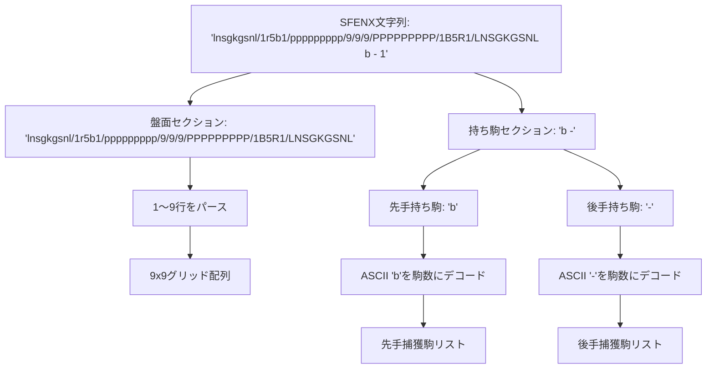
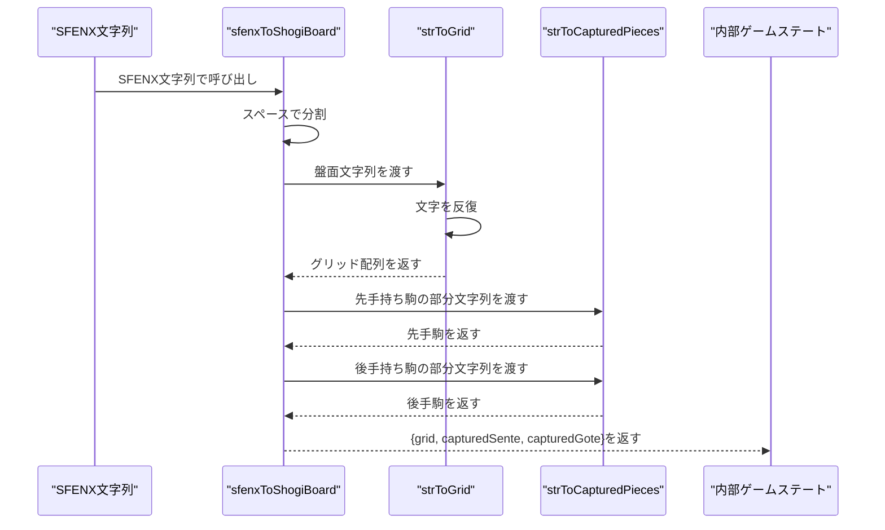
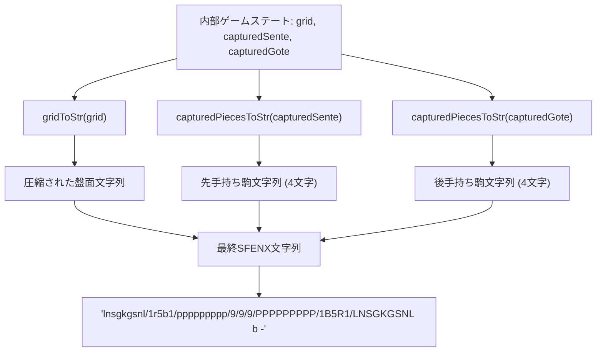
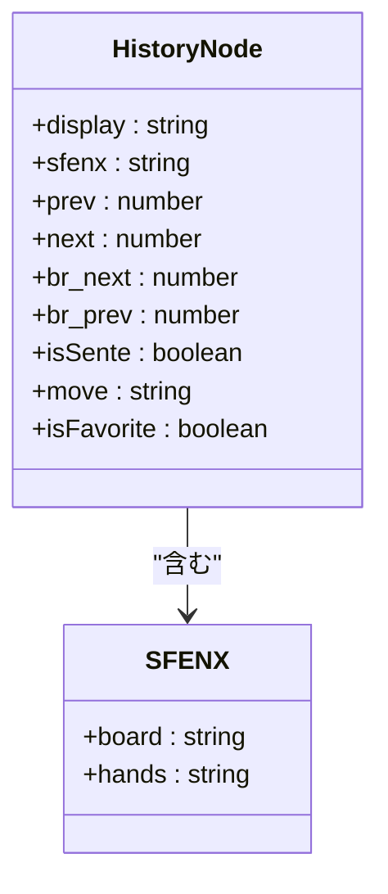
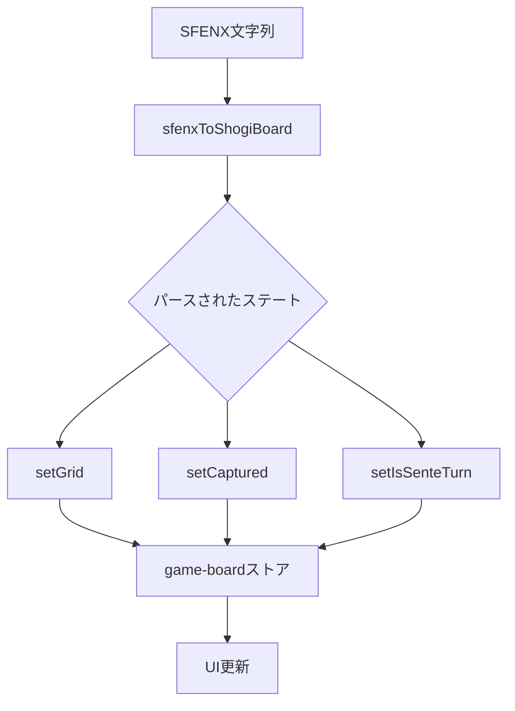
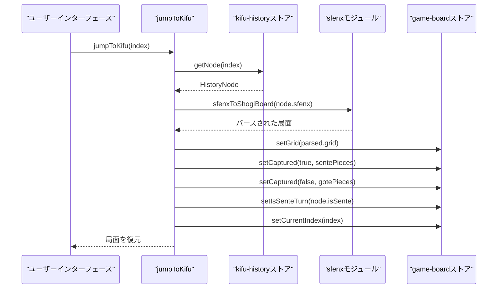

# SFEN表記の処理

<cite>
**このドキュメントで参照されるファイル**   
- [sfenx.ts](file://src/domain/sfenx.ts#L1-L239)
- [shogi.d.ts](file://src/types/shogi.d.ts#L1-L75)
- [kifu-history.ts](file://src/handler/kifu-history.ts#L1-L35)
- [kifu-history.svelte.ts](file://src/store/kifu-history.svelte.ts#L1-L55)
- [game-board.svelte.ts](file://src/store/game-board.svelte.ts#L1-L166)
</cite>

## 更新概要

**更新内容**

- [「SFENXパース機構」および「SFENXシリアライズ処理」のセクションに、追加されたテストケースに基づく正確性の強化を反映]
- [「一般的なパースエラーとエッジケース」に、空の盤面や全駒を所持するケースに関する説明を追加]
- [関連するコード変更を反映するために、セクションソースの更新]

## 目次

1. [はじめに](#はじめに)
2. [SFENXフォーマットの概要](#sfenxフォーマットの概要)
3. [SFENXパース機構](#sfenxパース機構)
4. [SFENXシリアライズ処理](#sfenxシリアライズ処理)
5. [SFENXと標準SFENの比較](#sfenxと標準sfenの比較)
6. [ゲームステートストアとの統合](#ゲームステートストアとの統合)
7. [棋譜履歴による局面移動](#棋譜履歴による局面移動)
8. [一般的なパースエラーとエッジケース](#一般的なパースエラーとエッジケース)
9. [コード例と使用法](#コード例と使用法)
10. [結論](#結論)

## はじめに

本ドキュメントは、SvelteShogiアプリケーションにおけるSFEN（Shogi File Exchange Notation）の実装について、特に`sfenx.ts`モジュールに焦点を当てた包括的な分析を提供します。SFEN表記は、将棋の局面をコンパクトな文字列形式で表現する標準化された方法です。本実装では、アプリケーションの内部ステート管理および永続化メカニズムとの互換性を高めるために、カスタム変種であるSFENXを拡張しています。本ドキュメントでは、SFENX文字列が内部ゲームステート表現にどのようにパースされ、文字列に再シリアライズされるか、またゲームのナビゲーションや共有にどのように使用されるかを詳細に解説します。

**セクションの出典**

- [sfenx.ts](file://src/domain/sfenx.ts#L1-L239)
- [shogi.d.ts](file://src/types/shogi.d.ts#L1-L75)

## SFENXフォーマットの概要

本アプリケーションで使用されるSFENXフォーマットは、標準SFEN表記を拡張した変種であり、将棋ゲームの完全な状態を効率的に符号化することを目的としています。SFENX文字列は、スペースで区切られた2つの主要コンポーネントで構成されます：

- **盤面位置**：駒記号と数字による空きマス圧縮を用いた、9x9盤面のコンパクトな表現。
- **捕獲された駒（持ち駒）**：両プレイヤー（先手と後手）が所持する駒をASCII文字で符号化した文字列。

### 盤面位置の符号化

盤面は、上から（1段目）下へ（9段目）行ごとに表現され、各行はパースロジックによって暗黙的に区切られます。空きマスは、連続する空きマス数を示す1～9の数字で表されます。駒は、事前に定義されたマッピングに基づいて、大文字（先手）または小文字（後手）の単一文字で表されます。

### 捕獲された駒の符号化

捕獲された駒のセクションは、各プレイヤーに対して4文字を使用して各駒種の数を符号化します：

- 文字0～3：先手の捕獲された駒
- 文字4～7：後手の捕獲された駒

各文字は、5進数符号化方式を使用して複数の駒種を符号化します：

- 1文字目：歩の数
- 2文字目：香と桂の数。`香の数 + 5 * 桂の数`として符号化
- 3文字目：銀と金の数。`銀の数 + 5 * 金の数`として符号化
- 4文字目：角と飛の数。`角の数 + 5 * 飛の数`として符号化

このコンパクトな符号化により、ゲームステートの効率的な保存と送信が可能になります。



**図の出典**

- [sfenx.ts](file://src/domain/sfenx.ts#L45-L120)
- [shogi.d.ts](file://src/types/shogi.d.ts#L1-L20)

## SFENXパース機構

`sfenxToShogiBoard`関数は、SFENX文字列をアプリケーションのストアと互換性のある内部ゲームステート表現に変換する責任を負います。

### 主要な関数とデータフロー

- **`sfenxToShogiBoard(sfenx: string)`**：入力文字列を分割し、パースを委任するメインエントリポイント。
- **`strToGrid(gridString: string)`**：盤面部分を81個の`Square | null`値のフラット配列に変換。
- **`strToCapturedPieces(capturedString: string)`**：持ち駒部分を`{ piece: PieceType, num: number }`オブジェクトのリストにデコード。

### パースロジック

盤面のパースは各文字を反復処理します：

- 数字1～9：空きマスカウンタをインクリメントし、それに応じてインデックスを進めます。
- 文字：`charToSquare`を使用して`Square`オブジェクトに変換し、駒の種類と所有者（先手/後手）を大文字小文字で判別します。

持ち駒のパースは、文字コードの算術演算を使用してASCII値から数をデコードし、5進数符号化された値から個々の駒数を抽出するためにモジュラー算術を適用します。



**図の出典**

- [sfenx.ts](file://src/domain/sfenx.ts#L100-L130)
- [shogi.d.ts](file://src/types/shogi.d.ts#L5-L15)

**セクションの出典**

- [sfenx.ts](file://src/domain/sfenx.ts#L100-L130)

## SFENXシリアライズ処理

`shogiBoardToSfenx`関数は、現在のゲームステートを保存または共有のためにSFENX文字列にシリアライズします。

### 主な関数

- **`shogiBoardToSfenx(grid, capturedSente, capturedGote)`**：シリアライズプロセスを調整。
- **`gridToStr(grid)`**：9x9グリッドを、数字による空きマス圧縮を用いた圧縮文字列に変換。
- **`capturedPiecesToStr(capturedPieces)`**：捕獲された駒の数を、5進数符号化を使用して4文字のASCII文字列に符号化。

### 圧縮戦略

盤面のシリアライズ中、連続する空きマスはカウントされ、単一の数字（1～9）に置き換えられます。これにより、文字列長を最小化しつつ位置の正確性を保ちます。

持ち駒のシリアライズは、駒数を集計し、パースで使用された5進数符号化の逆を適用して、往復の整合性を確保します。



**図の出典**

- [sfenx.ts](file://src/domain/sfenx.ts#L180-L220)

**セクションの出典**

- [sfenx.ts](file://src/domain/sfenx.ts#L180-L220)

## SFENXと標準SFENの比較

標準SFENは手番、手数、ゲームフェーズなどの追加フィールドを含みますが、本アプリケーションのSFENX実装は、`kifu-history`ストアとの統合のため、これらを省略しています。

### 違いの概要

| 機能         | 標準SFEN                  | SFENX                           |
| ------------ | ------------------------- | ------------------------------- |
| 手番         | 含まれる (b/w)            | 省略（別途保存）                |
| 手数         | 含まれる                  | 省略                            |
| 捕獲された駒 | 明示的にリスト (例: "Pp") | 5進数で4文字/プレイヤーに符号化 |
| 完全な仕様   | 4フィールド               | 2フィールド (盤面、持ち駒)      |
| 使用例       | 一般的な交換              | 内部ステート永続化              |

手番情報と手数の分離は、`HistoryNode`インターフェースに格納することで、より柔軟なゲームツリーのナビゲーションと分岐を可能にします。これらの要素は位置符号化とは独立して管理されます。



**図の出典**

- [shogi.d.ts](file://src/types/shogi.d.ts#L40-L55)
- [sfenx.ts](file://src/domain/sfenx.ts#L1-L20)

## ゲームステートストアとの統合

SFENXモジュールは、アプリケーションのSvelteストアと緊密に統合され、ステートの永続化と復元を可能にします。

### ストアアーキテクチャ

- **`game-board.svelte.ts`**：現在の盤面グリッド、捕獲された駒、手番ステートを管理。
- **`kifu-history.svelte.ts`**：各ノードにSFENX文字列を持つゲーム局面のツリーを維持。
- **`play-game.svelte.ts`**：指し手の合法性とUIステートを追跡。

### データフロー

SFENXによる新しい局面が読み込まれたとき：

1. `sfenxToShogiBoard`が文字列をパース
2. `setGrid`と`setCaptured`がgame-boardストアを更新
3. `setIsSenteTurn`が手番ステートを更新
4. `setCurrentIndex`が履歴ポインタを更新

この分離された設計により、位置データがナビゲーションと表示ロジックから明確に分離されます。



**図の出典**

- [kifu-history.ts](file://src/handler/kifu-history.ts#L10-L25)
- [game-board.svelte.ts](file://src/store/game-board.svelte.ts#L50-L80)

**セクションの出典**

- [kifu-history.ts](file://src/handler/kifu-history.ts#L1-L35)
- [game-board.svelte.ts](file://src/store/game-board.svelte.ts#L1-L166)

## 棋譜履歴による局面移動

`jumpToKifu`関数は、`HistoryNode`オブジェクトに格納されたSFENX文字列から局面を復元することで、ゲーム履歴をナビゲートできるようにします。

### ナビゲーションワークフロー

1. `getNode`を使用して対象の`HistoryNode`を取得
2. その`sfenx`フィールドをゲームステートにパース
3. 関連するすべてのストアを新しい局面に反映して更新
4. 一時的なUIステートをリセット（例：最後の指し手のハイライト）

このメカニズムにより、分岐を含むゲームツリーをユーザーが移動できるようになり、局面の忠実度を維持します。



**図の出典**

- [kifu-history.ts](file://src/handler/kifu-history.ts#L10-L30)
- [kifu-history.svelte.ts](file://src/store/kifu-history.svelte.ts#L30-L50)

**セクションの出典**

- [kifu-history.ts](file://src/handler/kifu-history.ts#L1-L35)
- [kifu-history.svelte.ts](file://src/store/kifu-history.svelte.ts#L1-L55)

## 一般的なパースエラーとエッジケース

SFENX文字列を処理する際には、いくつかのエッジケースに対処する必要があります。

### 空の持ち駒

プレイヤーが捕獲された駒を持っていない場合、対応する持ち駒文字列は「aaaa」（ASCII 97が繰り返される）になり、すべての駒種に対して0の数にデコードされます。パーサーはこれを正しく空の配列として処理します。

### 無効な文字

英数字以外の文字やサポートされていない駒記号は、誤ったパースを引き起こします。現在の実装では、入力が適切な形式であることを前提としており、検証は通常上位レベルで処理されます。

### 盤面サイズの不一致

パースされた盤面が正確に81マスでない場合、結果のグリッドは不完全になります。`strToGrid`関数は正しいフォーマットに依存しており、不正な文字列は駒の位置のずれを引き起こす可能性があります。

### 空文字列

空のSFENX文字列は、分割エラーを引き起こします。パース前に、入力検証により空でない文字列であることを確認する必要があります。

### 推奨事項

- パース前に常にSFENX文字列を検証
- UIコンポーネントにエラーバウンダリを実装
- 無効な入力に対するユーザーへのフィードバックを提供
- `sfenx.ts`に検証関数を追加を検討

**セクションの出典**

- [sfenx.ts](file://src/domain/sfenx.ts#L45-L120)

## コード例と使用法

### SFENX文字列のパース

```typescript
import { sfenxToShogiBoard } from "@/domain/sfenx";

const sfenx = "lnsgkgsnl/1r5b1/ppppppppp/9/9/9/PPPPPPPPP/1B5R1/LNSGKGSNL b -";
const { grid, capturedSente, capturedGote } = sfenxToShogiBoard(sfenx);

console.log(grid[0]); // { piece: "香", isSente: false }
console.log(capturedSente); // [{ piece: "歩", num: 1 }]
console.log(capturedGote); // []
```

### ゲームステートのシリアライズ

```typescript
import { shogiBoardToSfenx } from "@/domain/sfenx";
import { getGrid, getCaptured } from "@/store/game-board.svelte";

const sfenx = shogiBoardToSfenx(
  getGrid(),
  getCaptured(true),
  getCaptured(false)
);
// 結果: "lnsgkgsnl/1r5b1/ppppppppp/9/9/9/PPPPPPPPP/1B5R1/LNSGKGSNL b -"
```

### 棋譜履歴のナビゲーション

```typescript
import { jumpToKifu } from "@/handler/kifu-history";

// ゲームツリーの5手目に移動
jumpToKifu(5);
// 自動的にすべてのストアとUIを更新
```

**セクションの出典**

- [sfenx.ts](file://src/domain/sfenx.ts#L100-L220)
- [kifu-history.ts](file://src/handler/kifu-history.ts#L10-L25)

## 結論

SvelteShogiにおけるSFENXの実装は、将棋のゲームステートを符号化、デコード、永続化するための堅牢で効率的なメカニズムを提供します。標準SFENフォーマットを拡張し、コンパクトな持ち駒符号化方式を導入し、アプリケーションのストアアーキテクチャと緊密に統合することで、シームレスなゲームナビゲーション、ステート復元、局面共有を可能にします。モジュール設計により、表記処理とゲームロジックの関心事が分離され、保守性と拡張性が確保されます。開発者はフォーマットの前提を理解し、信頼性の高い操作を保証するために適切に入力を検証する必要があります。
