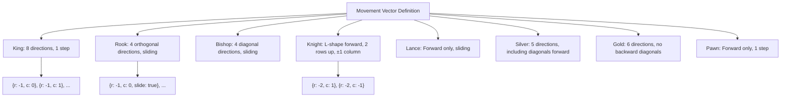
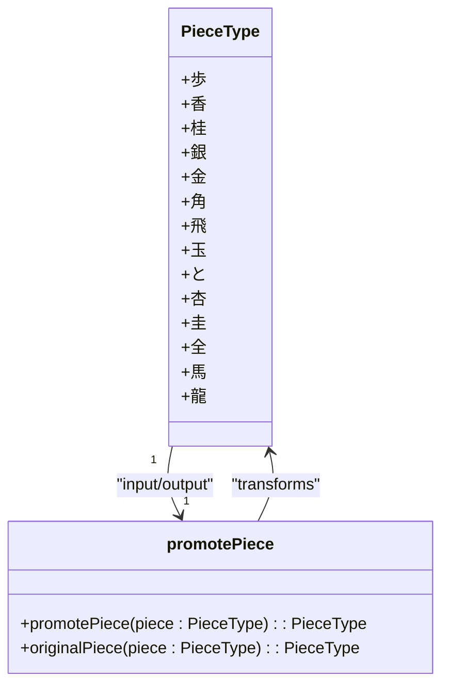
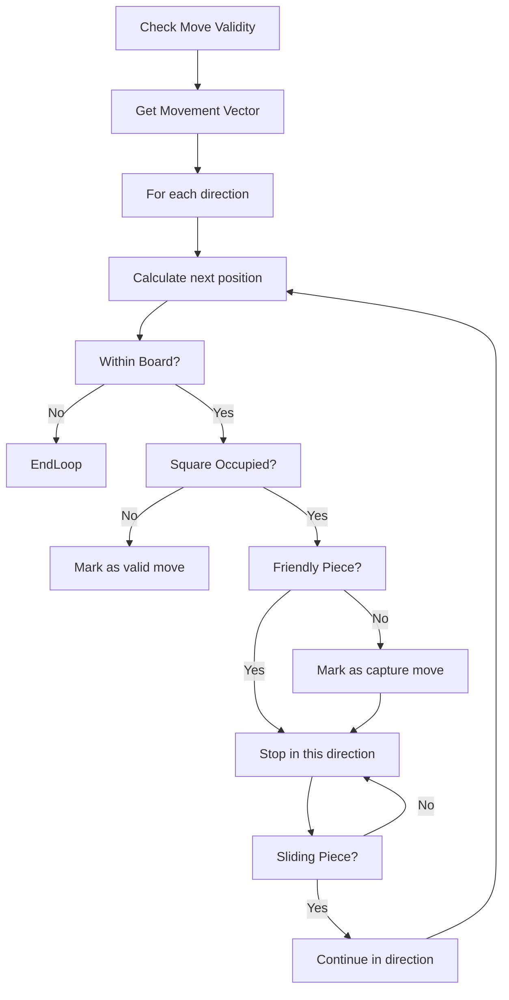
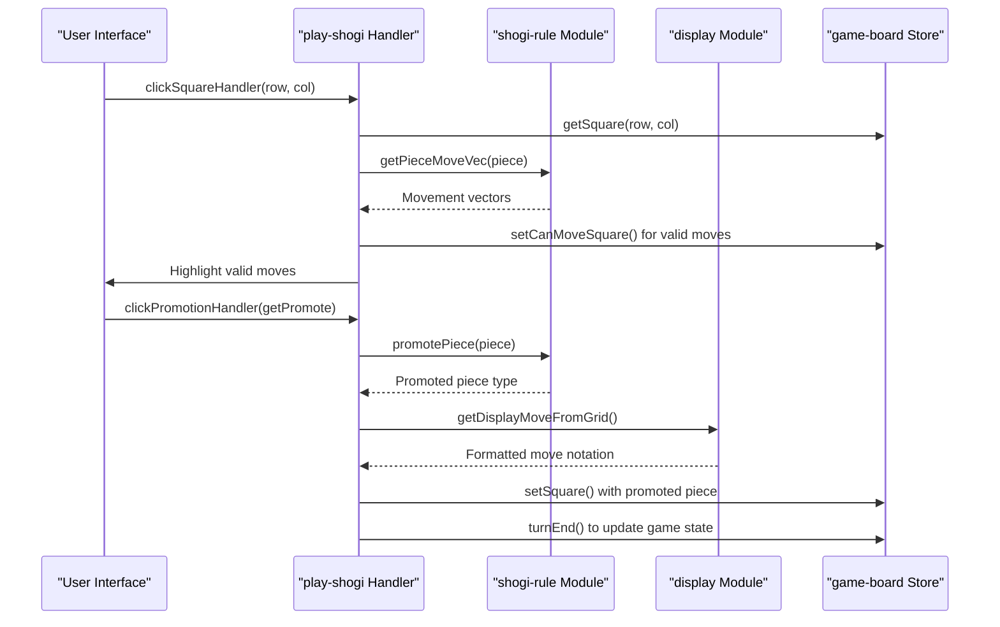

# Shogi Rules Implementation

<cite>
**Referenced Files in This Document**   
- [shogi-rule.ts](file://src/domain/shogi-rule.ts) - *Updated in recent commit*
- [play-shogi.ts](file://src/handler/play-shogi.ts) - *Updated in recent commit*
- [game-board.svelte.ts](file://src/store/game-board.svelte.ts)
- [display.ts](file://src/domain/display.ts) - *Added in recent commit*
- [shogi.d.ts](file://src/types/shogi.d.ts)
</cite>

## Update Summary
**Changes Made**   
- Added new section on Move Notation and Display Logic to document the `display.ts` module
- Updated integration section to include move notation functionality
- Enhanced source tracking with new file references
- Added references to display-related functionality in existing sections

## Table of Contents
1. [Introduction](#introduction)
2. [Piece Movement Vectors](#piece-movement-vectors)
3. [Promotion Rules](#promotion-rules)
4. [Move Validation and Obstruction Handling](#move-validation-and-obstruction-handling)
5. [Drop Rules and Restrictions](#drop-rules-and-restrictions)
6. [Move Notation and Display Logic](#move-notation-and-display-logic)
7. [Integration with Game State and Handlers](#integration-with-game-state-and-handlers)
8. [Conclusion](#conclusion)

## Introduction
This document provides a comprehensive analysis of the Shogi game rules implementation in the `shogi-rule.ts` file. It details how piece movements, promotions, and move validations are implemented within the SvelteShogi application. The system enforces official Shogi mechanics through directional vectors, step limits, and domain logic that integrates tightly with the game board state and user interaction handlers. This documentation is designed to be accessible to beginners while offering technical depth for developers.

## Piece Movement Vectors
The core of Shogi's rule enforcement lies in the definition of movement vectors for each piece type. These vectors define the relative row and column offsets a piece can move, along with whether the piece can slide (move multiple squares in a direction).

### Movement Vector Structure
Each movement vector is an object with three properties:
- **r**: Row offset (positive values move down from sente's perspective)
- **c**: Column offset (positive values move right)
- **slide**: Boolean indicating if the piece can move multiple squares in this direction



**Diagram sources**
- [shogi-rule.ts](file://src/domain/shogi-rule.ts#L0-L105)

**Section sources**
- [shogi-rule.ts](file://src/domain/shogi-rule.ts#L0-L105)

### Specific Piece Movement Patterns
The `getPieceMoveVec` function returns the appropriate movement vectors for each piece type from sente's (first player's) perspective. Gote's movements are automatically reversed in the handler logic.

#### King (玉)
The king moves one square in any direction:
```typescript
{r: -1, c: 0}, {r: 0, c: 1}, {r: 0, c: -1}, {r: 1, c: 0},
{r: -1, c: 1}, {r: -1, c: -1}, {r: 1, c: 1}, {r: 1, c: -1}
```

#### Rook (飛) and Bishop (角)
These are ranging pieces that can slide any number of squares:
```typescript
// Rook - orthogonal directions
{r: 1, c: 0, slide: true}, {r: -1, c: 0, slide: true},
{r: 0, c: 1, slide: true}, {r: 0, c: -1, slide: true}

// Bishop - diagonal directions
{r: 1, c: 1, slide: true}, {r: 1, c: -1, slide: true},
{r: -1, c: 1, slide: true}, {r: -1, c: -1, slide: true}
```

#### Knight (桂)
The knight has a unique L-shaped movement, jumping two rows forward and one column left or right:
```typescript
{r: -2, c: 1}, {r: -2, c: -1}
```
Note: The knight cannot move backward or to the sides.

#### Pawn (歩)
The pawn moves one square forward:
```typescript
{r: -1, c: 0}
```

#### Silver General (銀)
The silver general moves one square in five directions: forward, diagonally forward, and diagonally backward:
```typescript
{r: -1, c: 0}, {r: -1, c: 1}, {r: -1, c: -1},
{r: 1, c: 1}, {r: 1, c: -1}
```

#### Gold General (金)
The gold general moves one square in six directions: forward, backward, left, right, and diagonally forward:
```typescript
// Implemented via getGoldMoveVec()
{r: 1, c: 0}, {r: 0, c: 1}, {r: 0, c: -1},
{r: -1, c: 0}, {r: -1, c: 1}, {r: -1, c: -1}
```

## Promotion Rules
Promotion in Shogi allows certain pieces to gain enhanced movement capabilities when they enter the promotion zone (the last three ranks from the player's perspective).

### Promotion Zone Logic
The promotion zone consists of:
- For sente (first player): Rows 0, 1, 2 (top three rows)
- For gote (second player): Rows 6, 7, 8 (bottom three rows)

Promotion is triggered when a promotable piece either:
1. Moves from outside the promotion zone to inside it
2. Moves from inside the promotion zone to anywhere (including staying within)

### Promotable Pieces and Their Promoted Forms
The `promotePiece` function handles the transformation of pieces:

| Original Piece | Promoted Piece | Japanese Name | Movement Change |
|----------------|----------------|---------------|-----------------|
| 歩 (Pawn) | と (Tokin) | to | Gains gold general movement |
| 香 (Lance) | 杏 (Narikyo) | narikyo | Gains gold general movement |
| 桂 (Knight) | 圭 (Narikei) | narikei | Gains gold general movement |
| 銀 (Silver) | 全 (Narigin) | narigin | Gains gold general movement |
| 角 (Bishop) | 馬 (Horse) | uma | Gains king's orthogonal moves |
| 飛 (Rook) | 龍 (Dragon) | ryu | Gains king's diagonal moves |



**Diagram sources**
- [shogi-rule.ts](file://src/domain/shogi-rule.ts#L51-L104)
- [shogi.d.ts](file://src/types/shogi.d.ts#L0-L74)

**Section sources**
- [shogi-rule.ts](file://src/domain/shogi-rule.ts#L51-L104)

### Promotion Implementation
When a piece enters the promotion zone, the system checks if promotion is possible:

```typescript
if (
  isSenteTurn
    ? handPiecePos.row < 3 || row < 3
    : handPiecePos.row > 5 || row > 5
) {
  const promotedPiece = promotePiece(handPiece.piece);
  if (promotedPiece !== handPiece.piece) {
    setPromotionPos(row, col);
    return;
  }
}
```

This logic in `play-shogi.ts` determines whether to prompt the user for promotion. The actual promotion decision is made in `clickPromotionHandler`.

### Reverse Promotion (Original Piece)
The `originalPiece` function allows the system to determine what piece a promoted piece was before promotion, which is essential for capturing logic:

```typescript
export function originalPiece(piece: PieceType): PieceType {
  switch (piece) {
    case "と": return "歩";
    case "杏": return "香";
    case "圭": return "桂";
    case "全": return "銀";
    case "馬": return "角";
    case "龍": return "飛";
    default: return piece;
  }
}
```

## Move Validation and Obstruction Handling
The system validates moves by calculating all possible destinations based on movement vectors and checking for obstructions.

### Range and Boundary Checking
All moves are validated against the 9x9 board boundaries (rows 0-8, columns 0-8). The movement algorithm stops when it reaches the edge of the board.

### Obstruction Handling
The move validation logic handles obstructions differently based on piece type:



**Diagram sources**
- [play-shogi.ts](file://src/handler/play-shogi.ts#L45-L75)

**Section sources**
- [play-shogi.ts](file://src/handler/play-shogi.ts#L45-L75)

### Implementation in setCanMoveFromSquare
The `setCanMoveFromSquare` function implements the obstruction logic:

```typescript
function setCanMoveFromSquare(row: number, col: number) {
  resetCanMoveAll();
  const square = getSquare(row, col);
  const vec = getPieceMoveVec(square.piece);
  for (const { r, c, slide } of vec) {
    const rv = square.isSente ? r : -r;
    const cv = c;
    let nr = row + rv;
    let nc = col + cv;
    while (nr >= 0 && nr < 9 && nc >= 0 && nc < 9) {
      const targetSquare = getSquare(nr, nc);
      if (targetSquare) {
        if (targetSquare.isSente !== square.isSente) {
          setCanMoveSquare(nr, nc); // Can capture opponent's piece
        }
        break; // Stop at any occupied square
      } else {
        setCanMoveSquare(nr, nc); // Empty square can be moved to
      }
      if (!slide) break; // Non-sliding pieces stop after one step
      nr += rv;
      nc += cv;
    }
  }
}
```

Key aspects:
- **Friendly pieces block movement**: The `break` statement stops further movement in that direction
- **Opponent pieces can be captured**: Marked as valid moves but stop further sliding
- **Empty squares are valid destinations**: Marked as potential move targets
- **Non-sliding pieces move only one step**: The `if (!slide) break` ensures single-step movement

## Drop Rules and Restrictions
In Shogi, captured pieces can be dropped back onto the board as your own pieces. The system enforces several restrictions on drops.

### General Drop Rules
When dropping a piece from hand, all empty squares are initially considered valid, then restrictions are applied:

```typescript
function setCanMoveFromCaptured(piece: PieceType, isSente: boolean) {
  setCanMoveAll();
  // Reset moves for occupied squares
  for (let r = 0; r < 9; r++) {
    for (let c = 0; c < 9; c++) {
      if (getSquare(r, c)) resetCanMoveSquare(r, c);
    }
  }
  // Apply specific restrictions
  // ...
}
```

### Piece-Specific Drop Restrictions

#### Pawn (歩) Drop Rules
Pawns cannot be dropped on:
1. The last rank (row 0 for sente, row 8 for gote)
2. A file (column) that already contains another unpromoted pawn of the same player (**nifu** rule)

```typescript
if (piece === "歩") {
  for (let c = 0; c < 9; c++) {
    resetCanMoveSquare(isSente ? 0 : 8, c); // Last rank
    let nifu = false;
    for (let r = 0; r < 9; r++) {
      const square = getSquare(r, c);
      if (square && square.isSente === isSente && square.piece === "歩") {
        nifu = true;
        break;
      }
    }
    if (nifu) {
      for (let r = 0; r < 9; r++) resetCanMoveSquare(r, c);
    }
  }
}
```

#### Lance (香) Drop Rules
Lances cannot be dropped on the last rank, as they would have no legal moves:

```typescript
if (piece === "香") {
  for (let c = 0; c < 9; c++) resetCanMoveSquare(isSente ? 0 : 8, c);
}
```

#### Knight (桂) Drop Rules
Knights cannot be dropped on the last two ranks, as their forward jump would take them off the board:

```typescript
if (piece === "桂") {
  for (let c = 0; c < 9; c++) {
    resetCanMoveSquare(isSente ? 0 : 8, c);
    resetCanMoveSquare(isSente ? 1 : 7, c);
  }
}
```

## Move Notation and Display Logic
The system implements Shogi move notation according to official recording standards, determining how moves are displayed based on piece position and ambiguity.

### Ambiguity Resolution Rules
When multiple identical pieces can move to the same destination, the system uses positional indicators to disambiguate:

- **Vertical movement**: Uses 上 (up), 引 (down), 寄 (horizontal)
- **Horizontal positioning**: Uses 左 (left), 右 (right), 直 (direct)
- **Special cases**: For gold and silver generals in specific configurations, uses 直 (direct) when moving straight up

### Implementation in getDisplayMoveFromGrid
The `getDisplayMoveFromGrid` function analyzes the board state to determine the appropriate notation:

```typescript
export function getDisplayMoveFromGrid(
  grid: (Square | null)[],
  from: { row: number; col: number },
  to: { row: number; col: number },
  lastPos: { row: number; col: number } | null
): string {
  const fromSquare = grid[from.row * 9 + from.col];
  if (!fromSquare)
    throw new Error(`fromSquare is null {from: ${from.col},${from.row}}`);
  const dr = fromSquare.isSente ? to.row - from.row : from.row - to.row;
  const dc = fromSquare.isSente ? to.col - from.col : from.col - to.col;
  const myRelPos = dc < 0 ? "left" : dc > 0 ? "right" : "none";
  const myMove = dr < 0 ? "up" : dr > 0 ? "down" : "none";

  let dirCnt = getFromVDirections(
    grid,
    to.row,
    to.col,
    fromSquare.piece,
    fromSquare.isSente
  );
  dirCnt[myRelPos][myMove]--;
  
  // Apply notation rules based on ambiguity
  if (hSum > 0) {
    if (fromSquare.piece === "飛" || fromSquare.piece === "角" || 
        fromSquare.piece === "竜" || fromSquare.piece === "馬") {
      display += dirCnt.left[myMove] > 0 ? "右" : "左";
    } else {
      switch (myRelPos) {
        case "left": display += "左"; break;
        case "right": display += "右"; break;
        case "none": display += "直"; useVertical = false; break;
      }
    }
  }
  // Add vertical movement indicator if needed
  if ((useVertical && vSum > 0) || (hSum === 0 && total > 0)) {
    switch (myMove) {
      case "up": display += "上"; break;
      case "down": display += "引"; break;
      case "none": display += "寄"; break;
    }
  }
  return display;
}
```

**Section sources**
- [display.ts](file://src/domain/display.ts#L76-L154) - *Added in recent commit*
- [display.test.ts](file://src/test/domain/display.test.ts#L0-L1139) - *Added in recent commit*

## Integration with Game State and Handlers
The Shogi rules are integrated into the game flow through the `play-shogi.ts` handler, which coordinates between the rule logic, game state, and user interface.

### Control Flow Overview


**Diagram sources**
- [play-shogi.ts](file://src/handler/play-shogi.ts#L128-L269)
- [shogi-rule.ts](file://src/domain/shogi-rule.ts#L51-L104)
- [game-board.svelte.ts](file://src/store/game-board.svelte.ts#L35-L103)
- [display.ts](file://src/domain/display.ts#L76-L154) - *Added in recent commit*

**Section sources**
- [play-shogi.ts](file://src/handler/play-shogi.ts#L128-L269)

### Key Integration Points

#### Movement Vector Usage
The `getPieceMoveVec` function from `shogi-rule.ts` is imported and used directly in the move validation logic:

```typescript
import { getPieceMoveVec } from "@/domain/shogi-rule";

// Used in setCanMoveFromSquare
const vec = getPieceMoveVec(square.piece);
```

#### Promotion Integration
The promotion functions are called when a piece enters the promotion zone:

```typescript
import { promotePiece, originalPiece } from "@/domain/shogi-rule";

// In clickPromotionHandler
setSquare(
  row,
  col,
  getPromote ? promotePiece(fromSquare.piece) : fromSquare.piece,
  fromSquare.isSente
);
```

#### Move Notation Integration
The display module is used to generate proper move notation:

```typescript
import { getDisplayMoveFromGrid, getDisplayMoveFromCaptured } from "@/domain/display";

// In clickSquareHandler
const display = getDisplayMoveFromGrid(
  getGrid(),
  handPiecePos,
  { row, col },
  getLastPos()
);
```

#### Game State Updates
After a valid move, the game state is updated and the turn is advanced:

```typescript
function turnEnd(display: string, move: string) {
  toggleTurn();
  resetCanMoveAll();
  resetPromotionPos();
  resetHandPiece();
  const sfenx = shogiPositionToSfenx(
    getGrid(),
    getCaptured(true),
    getCaptured(false)
  );
  addHistoryNode(display, sfenx, getIsSenteTurn(), move, false);
}
```

This function:
- Toggles the turn using `toggleTurn()`
- Resets move indicators
- Generates an SFEN-X representation of the current position
- Adds the move to the game history

## Conclusion
The Shogi rules implementation in `shogi-rule.ts` provides a robust foundation for enforcing the complex movement and promotion rules of Shogi. By defining movement vectors for each piece type and implementing comprehensive validation logic, the system accurately models the traditional Japanese chess game. The integration with the `play-shogi` handler and game board store ensures that these rules are enforced during gameplay, providing a valid and authentic Shogi experience. The code demonstrates a clean separation of concerns, with domain logic isolated in `shogi-rule.ts` and game state management handled by the Svelte stores. This architecture makes the rules easy to understand, maintain, and extend if needed.