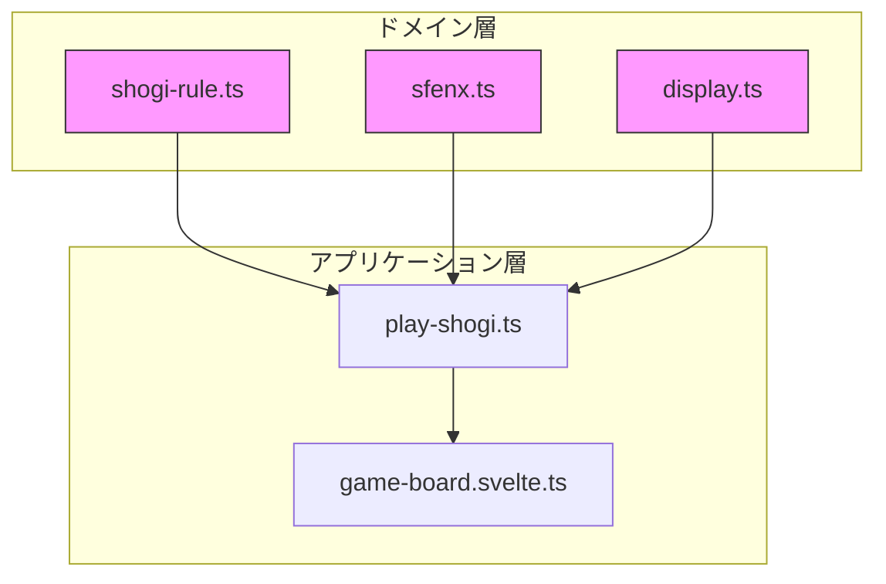
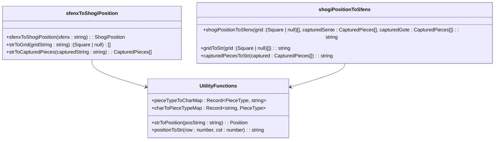
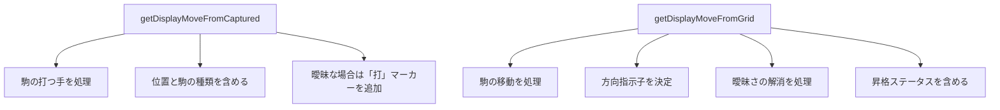
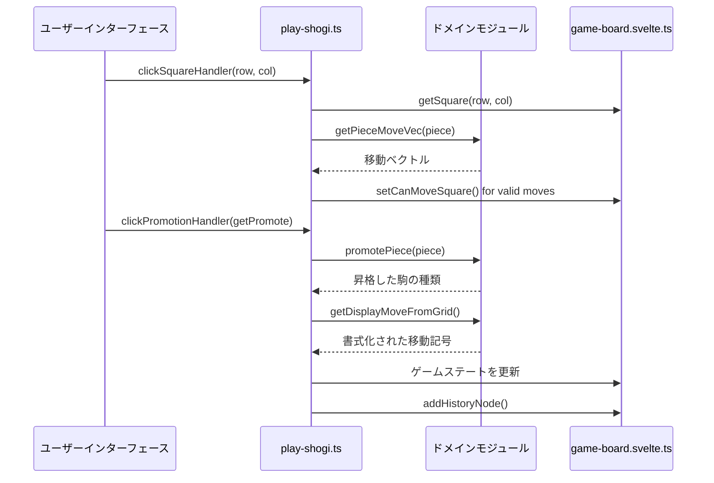

# ドメインロジック

<cite>
**このドキュメントで参照されているファイル**   
- [shogi-rule.ts](file://src/domain/shogi-rule.ts)
- [sfenx.ts](file://src/domain/sfenx.ts)
- [display.ts](file://src/domain/display.ts)
- [shogi.d.ts](file://src/types/shogi.d.ts)
- [play-shogi.ts](file://src/handler/play-shogi.ts)
- [game-board.svelte.ts](file://src/store/game-board.svelte.ts)
- [display.test.ts](file://src/test/domain/display.test.ts) - *移動記号生成の包括的なテストを追加*
- [sfenx.test.ts](file://src/test/domain/sfenx.test.ts) - *SFENX変換関数のテスト網羅性を向上*
</cite>

## 更新概要
**変更内容**   
- display.tsの移動記号生成に関する包括的なテストカバレッジの詳細を追加
- 新しいテストケースに基づく曖昧さ解消ロジックの文書化を強化
- テストケースからの追加シナリオで移動記号の例を更新
- 駒の曖昧さ解消に関するエッジケースの文書化を追加
- sfenx.tsの主要な変換関数のテスト網羅性を向上
- 既存のドメインロジック実装に関する正確な情報を維持

## 目次
1. [はじめに](#はじめに)
2. [コアドメインモジュール](#コアドメインモジュール)
3. [駒の移動とルール検証](#駒の移動とルール検証)
4. [SFENXゲームステートのシリアル化](#sfenxゲームステートのシリアル化)
5. [移動記号の生成](#移動記号の生成)
6. [アプリケーション層との統合](#アプリケーション層との統合)
7. [特殊な手の処理](#特殊な手の処理)
8. [パフォーマンスに関する考慮事項](#パフォーマンスに関する考慮事項)

## はじめに
SvelteShogiアプリケーションは、`src/domain`ディレクトリにカプセル化された将棋（日本チェス）エンジンの完全な実装を提供しています。本ドキュメントは、将棋のルール、ゲームステートのシリアル化、移動記号の生成に関するドメインロジック層の包括的な分析を提供します。システムは、ドメインロジックをUIおよび状態管理の関心事から分離するクリーンアーキテクチャパターンに従っています。コア機能は、`shogi-rule.ts`（移動および昇格ルール）、`sfenx.ts`（ゲームステートの永続化）、`display.ts`（人間が読める移動記号）の3つの主要モジュールを中心に構築されています。

**セクションソース**
- [shogi-rule.ts](file://src/domain/shogi-rule.ts#L0-L105)
- [sfenx.ts](file://src/domain/sfenx.ts#L0-L239)
- [display.ts](file://src/domain/display.ts#L0-L155)

## コアドメインモジュール
ドメイン層は、将棋ゲームロジックの異なる側面を処理する3つの専門モジュールで構成されています：

1. **shogi-rule.ts**: 移動ベクトル、昇格ルール、および基本的な検証を実装
2. **sfenx.ts**: ゲームステートのシリアル化のためのSFENXフォーマットの実装を提供
3. **display.ts**: 伝統的な将棋フォーマットでの人間が読める移動記号を生成

これらのモジュールは協力して、ハンドラーとストアが利用できる完全なドメインロジック層を提供します。設計は、ゲームステートを入力として受け取り、副作用なしに結果を生成する純粋な関数を持つ関数型プログラミングの原則に従っています。



**図のソース**
- [shogi-rule.ts](file://src/domain/shogi-rule.ts)
- [sfenx.ts](file://src/domain/sfenx.ts)
- [display.ts](file://src/domain/display.ts)
- [play-shogi.ts](file://src/handler/play-shogi.ts)

## 駒の移動とルール検証

### 移動ベクトルの実装
`shogi-rule.ts`モジュールは、方向ベクトルを使用して各将棋駒の移動パターンを定義します。各ベクトルは、相対的な行と列の変位、および駒がスライド（複数マス移動）できるかどうかを指定します。

```mermaid
flowchart TD
Start[getPieceMoveVec] --> Switch{駒の種類}
Switch --> |歩| Pawn[Return [{r: -1, c: 0, slide: false}]]
Switch --> |香| Lance[Return [{r: -1, c: 0, slide: true}]]
Switch --> |桂| Knight[Return [{r: -2, c: 1, slide: false}, {r: -2, c: -1, slide: false}]]
Switch --> |銀| Silver[Return 5方向ベクトル]
Switch --> |玉| King[Return 8方向ベクトル]
Switch --> |角| Bishop[Return 4対角スライドベクトル]
Switch --> |飛| Rook[Return 4直交スライドベクトル]
Switch --> |馬| DragonHorse[Return Bishopベクトル + Goldベクトル]
Switch --> |龍| DragonKing[Return Rookベクトル + Silverベクトル]
Switch --> |金,と,杏,圭,全| Gold[Return getGoldMoveVec()]
```

**図のソース**
- [shogi-rule.ts](file://src/domain/shogi-rule.ts#L0-L105)

**セクションソース**
- [shogi-rule.ts](file://src/domain/shogi-rule.ts#L0-L105)

#### 桂馬の移動の例
桂馬のL字型の移動は、2行前進し、1列左または右に移動する2つのベクトルで実装されています：

```typescript
case "桂":
  return [{r: -2, c: 1, slide: false}, {r: -2, c: -1, slide: false}];
```

この実装は、他の駒を飛び越えるユニークな桂馬の移動パターンを正しく捉えています。負の行値（-2）は、先手（先攻プレイヤー）の視点から相手側への移動を示しています。

#### 昇格ルール
このモジュールは、2つの補完的な関数で将棋の昇格ルールを実装しています：

```typescript
export function promotePiece(piece: PieceType): PieceType {
  switch (piece) {
    case "歩": return "と";
    case "香": return "杏";
    case "桂": return "圭";
    case "銀": return "全";
    case "角": return "馬";
    case "飛": return "竜";
    default: return piece; // 金と玉は昇格しない
  }
}

export function originalPiece(piece: PieceType): PieceType {
  switch (piece) {
    case "と": return "歩";
    case "杏": return "香";
    case "圭": return "桂";
    case "全": return "銀";
    case "馬": return "角";
    case "竜": return "飛";
    default: return piece; // 金と玉は元の駒
  }
}
```

これらの関数は、昇格した駒と昇格前の駒の双方向変換を可能にし、捕獲された駒の処理や手の検証に不可欠です。

## SFENXゲームステートのシリアル化

### SFENXフォーマットの実装
`sfenx.ts`モジュールは、将棋ゲームステートをシリアル化するカスタムSFENXフォーマットを実装しています。このフォーマットは、標準SFEN表記を拡張し、捕獲された駒のデータ圧縮を追加しています。



**図のソース**
- [sfenx.ts](file://src/domain/sfenx.ts#L0-L239)

**セクションソース**
- [sfenx.ts](file://src/domain/sfenx.ts#L0-L239)

### 捕獲された駒のエンコーディング
SFENXフォーマットは、ASCII文字を使用してカウントを圧縮する、捕獲された駒の革新的なエンコーディング方式を使用しています：

```typescript
function capturedPiecesToStr(capturedPieces: { piece: PieceType; num: number }[]): string {
  let nums: number[] = ["a".charCodeAt(0), "a".charCodeAt(0), "a".charCodeAt(0), "a".charCodeAt(0)];
  for (const { piece, num } of capturedPieces) {
    switch (piece) {
      case "歩":
        nums[0] += num;
        break;
      case "香":
        nums[1] += num;
        break;
      case "桂":
        nums[1] += num * 5;
        break;
      case "銀":
        nums[2] += num;
        break;
      case "金":
        nums[2] += num * 5;
        break;
      case "角":
        nums[3] += num;
        break;
      case "飛":
        nums[3] += num * 5;
        break;
    }
  }
  return String.fromCharCode(...nums);
}
```

このエンコーディングは、任意の種類の捕獲された駒の最大数が制限されている（例：最大18歩、4香など）という事実を利用しています。特定の駒の組み合わせに5進数エンコーディングを使用することで、各プレイヤーの捕獲された駒のカウントを4つのASCII文字に効率的にパックしています。

### ボード位置のエンコーディング
ボード位置は、連続する空のマスを表す数字を使用して、標準SFEN規則でエンコードされています：

```typescript
function gridToStr(grid: (Square | null)[]): string {
  let ret = "";
  for (let y = 0; y < 9; y++) {
    let emptyCount = 0;
    for (let x = 0; x < 9; x++) {
      const square = grid[x + y * 9];
      if (square) {
        if (emptyCount > 0) {
          ret += emptyCount;
          emptyCount = 0;
        }
        ret += squareToChar(square);
      } else {
        emptyCount++;
      }
    }
    if (emptyCount > 0) {
      ret += emptyCount;
    }
  }
  return ret;
}
```

これは、内部表現に簡単にパースできるコンパクトな文字列表現を生成します。

## 移動記号の生成

### 表示移動関数
`display.ts`モジュールは、伝統的な日本将棋フォーマットで人間が読める移動記号を生成します。主に2つの関数を提供しています：



**図のソース**
- [display.ts](file://src/domain/display.ts#L0-L155)

**セクションソース**
- [display.ts](file://src/domain/display.ts#L0-L155)

### 曖昧さ解消ロジック
システムは、同じ種類の複数の駒が同じ手を指せる場合を処理する洗練された曖昧さ解消ロジックを実装しています。`getFromVDirections`関数は、ボードを分析して、同じ種類の駒が異なる方向から目的地のマスに到達できる数を決定します：

```typescript
function getFromVDirections(
  grid: (Square | null)[],
  row: number,
  col: number,
  piece: PieceType,
  isSente: boolean
): { left: VDirCnt; none: VDirCnt; right: VDirCnt } {
  const dirCnt = {
    left: { up: 0, none: 0, down: 0 },
    none: { up: 0, none: 0, down: 0 },
    right: { up: 0, none: 0, down: 0 },
  };
  const vec = getPieceMoveVec(piece);
  for (const { r, c, slide } of vec) {
    const rv = isSente ? r : -r;
    const cv = isSente ? c : -c;
    let nr = row - rv;
    let nc = col - cv;
    while (nr >= 0 && nr < 9 && nc >= 0 && nc < 9) {
      const square = grid[nr * 9 + nc];
      if (square?.isSente === isSente && square.piece === piece) {
        const relPos = c > 0 ? "left" : c < 0 ? "right" : "none";
        const move = r > 0 ? "down" : r < 0 ? "up" : "none";
        dirCnt[relPos][move]++;
      }
      if (!slide) break;
      nr -= rv;
      nc -= cv;
    }
  }
  return dirCnt;
}
```

この関数は、左、中央、右の位置から、または上、直、下の移動から、同じ種類の駒がターゲットマスに到達できる数をカウントします。この情報は、その後、「左」（左）、「右」（右）、「上」（上）、「引」（下）、「寄」（横）などの適切な曖昧さ解消マーカーを生成するために使用されます。

### 包括的な曖昧さ解消シナリオ
`display.test.ts`に新たに追加されたテストに基づき、システムはさまざまな複雑な曖昧さ解消シナリオを処理します：

**3つ以上の同一駒**: 3つ以上の同一駒が同じマスに到達できる場合、システムは位置と方向の指示子の組み合わせを使用します：
- **左/右/中央**: 同じ行の駒の場合
- **上/下/直**: 垂直移動の曖昧さ解消の場合
- **直/左/右**: 金と銀の特殊ケースの場合

**昇格駒のエッジケース**: テストは、「と」（昇格歩）などの昇格駒の特定の処理を明らかにしています：
```typescript
// テストからの例：複数の昇格歩が同じマスに到達
expect(getDisplayMoveFromGrid(grid, {row: 8, col: 7}, {row: 7, col: 7}, null)).toBe("☗８八と直");
expect(getDisplayMoveFromGrid(grid, {row: 8, col: 8}, {row: 7, col: 7}, null)).toBe("☗８八と左上");
```

**竜と馬の特殊ルール**: 竜（竜）や馬（馬）のような強力な駒の場合、システムは位置よりも移動方向を優先します：
```typescript
// 竜駒の曖昧さ解消
expect(getDisplayMoveFromGrid(grid, {row: 0, col: 8}, {row: 1, col: 7}, null)).toBe("☗８二竜引");
expect(getDisplayMoveFromGrid(grid, {row: 3, col: 7}, {row: 1, col: 7}, null)).toBe("☗８二竜上");
```

**セクションソース**
- [display.ts](file://src/domain/display.ts#L0-L155)
- [display.test.ts](file://src/test/domain/display.test.ts#L0-L1139) - *曖昧さ解消ロジックの包括的なテストカバレッジ*

### 例：移動記号
システムは、伝統的な日本将棋の慣習に従った移動記号を生成します：

- **☗５五歩**: 先手プレイヤーが5-5に歩を打つ
- **☖同　歩**: 後手プレイヤーが同じ位置に歩で応じる
- **☗７六歩**: 先手が7-6に歩を「上」指示子付きで移動
- **☖３四桂成**: 後手が桂を3-4に移動し、昇格
- **☗５五金直**: 複数の金が同じ手を指せる場合、先手が金を直接前進
- **☖７七馬右**: 後手が別の馬と区別するために右の位置から馬を移動

記号には、プレイヤー指示子（先手は☗、後手は☖）、位置指示子（列は全角数字、行は漢数字）、駒の種類、および曖昧さ解消に必要な場合の移動指示子が含まれます。

## アプリケーション層との統合

### ハンドラー統合
ドメインロジックモジュールは、UIとドメインロジックの中間として機能する`play-shogi.ts`ハンドラーによって消費されます：



**図のソース**
- [play-shogi.ts](file://src/handler/play-shogi.ts)
- [shogi-rule.ts](file://src/domain/shogi-rule.ts)
- [display.ts](file://src/domain/display.ts)
- [game-board.svelte.ts](file://src/store/game-board.svelte.ts)

**セクションソース**
- [play-shogi.ts](file://src/handler/play-shogi.ts)
- [game-board.svelte.ts](file://src/store/game-board.svelte.ts)

### 手の検証プロセス
ハンドラーは、ドメインロジックとゲームステートチェックを組み合わせて包括的な手の検証を実装しています：

1. **駒の選択**: マスがクリックされると、ハンドラーは駒が現在のプレイヤーのものかどうかをチェックします
2. **移動計算**: `getPieceMoveVec`を使用して、選択された位置からのすべての可能な移動を決定します
3. **ボード制約**: ボードの境界と駒の衝突に対して移動を検証します
4. **特殊制限**: 歩、香、桂の打つ手の制限を実装します
5. **記号生成**: `getDisplayMoveFromGrid`または`getDisplayMoveFromCaptured`を使用して移動記号を生成します
6. **ステート更新**: ゲームボードと捕獲された駒を更新し、履歴に手を記録します

`setCanMoveFromCaptured`関数は、特殊な打つ手の制限を実装しています：

```typescript
function setCanMoveFromCaptured(piece: PieceType, isSente: boolean) {
  setCanMoveAll();
  // 占有されているマスの移動をリセット
  for (let r = 0; r < 9; r++) {
    for (let c = 0; c < 9; c++) {
      if (getSquare(r, c)) resetCanMoveSquare(r, c);
    }
  }
  // 歩の打つ手の制限
  if (piece === "歩") {
    for (let c = 0; c < 9; c++) {
      resetCanMoveSquare(isSente ? 0 : 8, c); // 最終段に打てない
      let nifu = false;
      for (let r = 0; r < 9; r++) {
        const square = getSquare(r, c);
        if (square && square.isSente === isSente && square.piece === "歩") {
          nifu = true; // すでにその列に歩がある
          break;
        }
      }
      if (nifu) {
        for (let r = 0; r < 9; r++) resetCanMoveSquare(r, c); // すでに歩がある列には打てない
      }
    }
  }
  // 香と桂の打つ手の制限
  if (piece === "香") {
    for (let c = 0; c < 9; c++) resetCanMoveSquare(isSente ? 0 : 8, c);
  }
  if (piece === "桂") {
    for (let c = 0; c < 9; c++) {
      resetCanMoveSquare(isSente ? 0 : 8, c);
      resetCanMoveSquare(isSente ? 1 : 7, c);
    }
  }
}
```

この実装は、将棋の厳格な打つ手ルールを正しく強制しています：
- 最終段への歩の打つ手禁止
- 最終段への香の打つ手禁止
- 最終2段への桂の打つ手禁止
- 同じプレイヤーがすでに歩を保持している列への歩の打つ手禁止（二歩ルール）

## 特殊な手の処理

### 昇格ロジック
システムは、多段階のプロセスで駒の昇格を処理します：

1. **昇格位置の検出**: 駒が昇格ゾーン（先手は最後の3段、後手は最初の3段）に入ったとき、システムは昇格位置を設定します
2. **ユーザーの選択**: プレイヤーは昇格するかしないかの選択肢を与えられます
3. **ステート更新**: 昇格が選択された場合、`promotePiece`を使用して駒の種類を更新します

`clickPromotionHandler`関数はこのプロセスを調整します：

```typescript
export function clickPromotionHandler(getPromote: boolean) {
  const handPiece = getHandPiece();
  const handPiecePos = handPiece.position;
  const promotionPos = getPromotionPos();
  const { row, col } = promotionPos;
  const fromSquare = getSquare(handPiecePos.row, handPiecePos.col);
  const display = getDisplayMoveFromGrid(/*...*/) + (getPromote ? "成" : "不成");
  setSquare(
    row,
    col,
    getPromote ? promotePiece(fromSquare.piece) : fromSquare.piece,
    fromSquare.isSente
  );
  turnEnd(display, `${fs}${ts}${getPromote ? "+" : ""}`);
}
```

### ゲームステートの永続化
SFENXフォーマットは、堅牢なゲームステートの永続化と共有を可能にします：

```typescript
// 現在のゲームステートを保存
const sfenx = shogiPositionToSfenx(getGrid(), getCaptured(true), getCaptured(false));

// ゲームステートを復元
const { grid, capturedSente, capturedGote } = sfenxToShogiPosition(sfenx);
setGrid(grid);
setCaptured(true, capturedSente);
setCaptured(false, capturedGote);
```

これにより、ゲームの保存、読み込み、他のプレイヤーとのゲーム位置の共有などの機能が可能になります。

## パフォーマンスに関する考慮事項

### ルールチェックの最適化
実装は、効率的なルールチェックを保証するためにいくつかの最適化技術を使用しています：

1. **事前計算された移動ベクトル**: 移動パターンは、実行時に計算されるのではなく、静的データ構造として定義されています
2. **早期終了**: スライドする駒が他の駒に遭遇したときに、移動検証ループが早期に終了します
3. **効率的なデータ構造**: ボードは、任意のマスにO(1)でアクセスできるフラット配列として表現されています
4. **最小限のステート複製**: ドメイン関数は、不要なコピーを作成せずに既存のゲームステート上で動作します

### 複雑性分析
- **移動検証**: O(n)、nはスライドする駒が移動できる最大マス数（将棋では最大8）
- **打つ手検証**: 多くの駒ではO(1)、二歩ルールの検証のため歩の打つ手チェックではO(n)
- **記号生成**: O(n)、nは同じ手を指せる可能性のあるボード上の駒の数
- **SFENXシリアル化**: O(1)、正確に81マスと固定数の捕獲された駒タイプを処理するため

実装は、極端な最適化よりも正しさと読みやすさを優先しており、将棋のようなターン制ゲームではパフォーマンスが重要な懸念事項ではないため、適切です。

### メモリ効率
SFENXフォーマットは非常にメモリ効率が高く、コンパクトな文字列で完全なゲームステートをエンコードします：
- ボード位置：駒の密度に応じて約20-40文字
- 捕獲された駒：8文字（プレイヤーごとに4文字）
- 合計：通常、完全なゲームステートで50文字未満

このコンパクトな表現は、ゲーム履歴の保存やURLやメッセージングを通じた位置の共有に最適です。