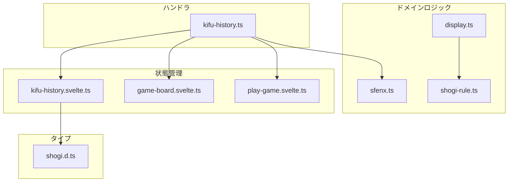
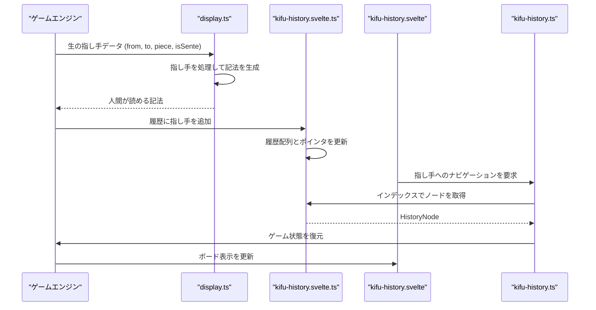
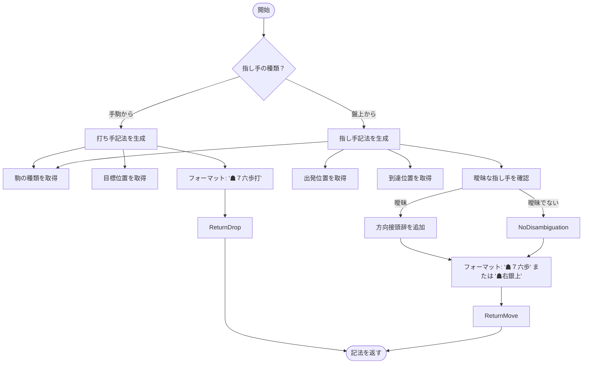
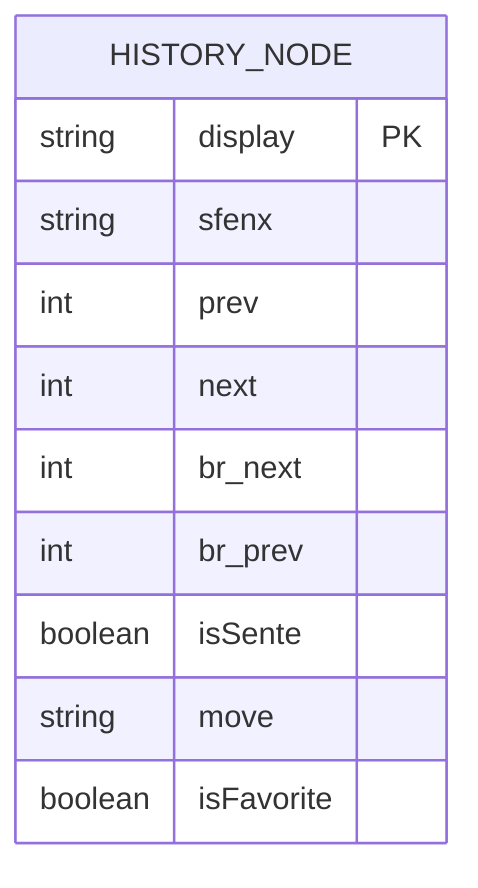
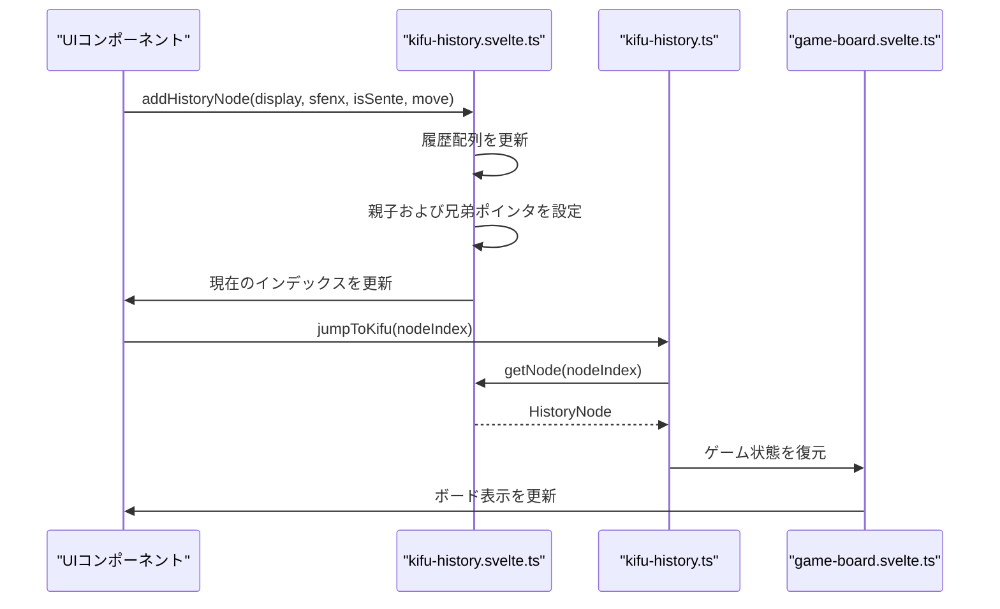
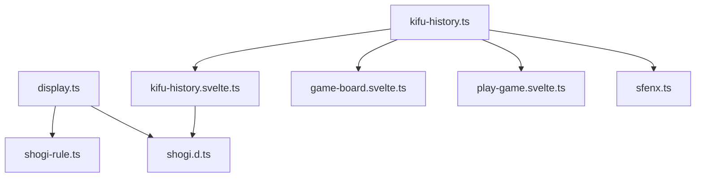

# 指し手記法の生成

<cite>
**このドキュメントで参照されるファイル**   
- [display.ts](file://src/domain/display.ts#L1-L155) - *最近のコミットでテストが追加された*
- [kifu-history.svelte.ts](file://src/store/kifu-history.svelte.ts#L1-L55)
- [kifu-history.ts](file://src/handler/kifu-history.ts#L1-L35)
- [shogi.d.ts](file://src/types/shogi.d.ts#L1-L75)
- [display.test.ts](file://src/test/domain/display.test.ts#L1-L1139) - *最近のコミットで追加された*
</cite>

## 更新概要

**変更内容**

- 指し手記法生成のための新しく追加されたテストカバレッジを反映するようドキュメントを更新
- テストケースに基づいた曖昧さ解消ロジックの詳細な説明を追加
- テストスイートからの特定のシナリオで例を拡充
- 駒の曖昧さ解消におけるエッジケースの動作を明確化
- ドキュメントの正確性を保証するためにテストファイルへの参照を追加

## 目次

1. [はじめに](#はじめに)
2. [プロジェクト構造](#プロジェクト構造)
3. [コアコンポーネント](#コアコンポーネント)
4. [アーキテクチャ概要](#アーキテクチャ概要)
5. [詳細なコンポーネント分析](#詳細なコンポーネント分析)
6. [依存関係分析](#依存関係分析)
7. [パフォーマンスに関する考慮事項](#パフォーマンスに関する考慮事項)
8. [トラブルシューティングガイド](#トラブルシューティングガイド)
9. [結論](#結論)

## はじめに

このドキュメントは、SvelteShogiアプリケーションにおける指し手記法生成システムの包括的な分析を提供します。主な焦点は、内部のゲームアクションを人間が読める将棋記法（棋譜記録で使用される）に変換する`display.ts`モジュールにあります。このシステムは、曖昧さの解消ロジック、特殊な指し手の種類（打つ、成る）、ローカライゼーション、およびナビゲート可能な指し手リストのための棋譜履歴コンポーネントとの統合をサポートしています。ドキュメントは、座標指定や同じマスに到達できる複数の駒がある場合の相対位置付けを含め、生の指し手データが標準的な記法に変換される方法を説明しています。

## プロジェクト構造

SvelteShogiプロジェクトは、関心の分離が明確なモジュール構造に従っています。指し手記法生成のコア機能は`src/domain`ディレクトリに存在し、状態管理とUIコンポーネントは`src/store`および他のディレクトリに整理されています。



**図の出典**

- [display.ts](file://src/domain/display.ts#L1-L155)
- [kifu-history.svelte.ts](file://src/store/kifu-history.svelte.ts#L1-L55)
- [kifu-history.ts](file://src/handler/kifu-history.ts#L1-L35)

## コアコンポーネント

指し手記法システムは以下の主要コンポーネントで構成されています：

- `display.ts`: 人間が読める指し手記法を生成するコアモジュール
- `kifu-history.svelte.ts`: ゲーム履歴を管理する状態ストア
- `kifu-history.ts`: ゲーム履歴のナビゲーションを処理するハンドラ
- `shogi.d.ts`: 将棋ゲームエンティティの型定義

これらのコンポーネントは協調して、内部のゲーム状態を標準化された記法に変換し、ナビゲート可能な指し手の履歴を維持します。

**このセクションの出典**

- [display.ts](file://src/domain/display.ts#L1-L155)
- [kifu-history.svelte.ts](file://src/store/kifu-history.svelte.ts#L1-L55)
- [kifu-history.ts](file://src/handler/kifu-history.ts#L1-L35)
- [shogi.d.ts](file://src/types/shogi.d.ts#L1-L75)

## アーキテクチャ概要

指し手記法生成システムは、ドメインロジックと状態管理およびUIの懸念事項が分離されたクリーンアーキテクチャパターンに従っています。フローは、ゲームエンジンからの生の指し手データから始まり、displayモジュールによって記法が生成され、適切なメタデータとともに棋譜履歴に保存されます。



**図の出典**

- [display.ts](file://src/domain/display.ts#L1-L155)
- [kifu-history.svelte.ts](file://src/store/kifu-history.svelte.ts#L1-L55)
- [kifu-history.ts](file://src/handler/kifu-history.ts#L1-L35)

## 詳細なコンポーネント分析

### 指し手記法生成ロジック

`display.ts`モジュールには、生の指し手データを人間が読める将棋記法に変換するコアロジックが含まれています。これは、通常の指し手と駒の打ち手の両方を処理し、同じ種類の複数の駒が同じマスに到達できる場合に曖昧さを解消する特別なロジックを持っています。

#### 記法生成プロセス



**図の出典**

- [display.ts](file://src/domain/display.ts#L1-L155)

#### 曖昧さ解消ロジック

同じ種類の複数の駒が同じマスに到達できる場合、システムは相対的な位置関係を使用して指し手を区別します。ロジックは、駒の間の水平（左/右）および垂直（上/下）の関係の両方を考慮します。

```mermaid
classDiagram
class getFromVDirections {
+grid : (PlayerPiece | null)[]
+row : number
+col : number
+piece : PieceType
+isSente : boolean
+return : VDirCnt
+getPieceMoveVec(piece) : MoveVector[]
}
class getDisplayMoveFromGrid {
+grid : (PlayerPiece | null)[]
+from : {row, col}
+to : {row, col}
+piece : PieceType
+isSente : boolean
+lastPos : {row, col} | null
+return : string
}
class getDisplayMoveFromCaptured {
+grid : (PlayerPiece | null)[]
+row : number
+col : number
+piece : PieceType
+isSente : boolean
+return : string
}
class Constants {
+KANJI_NUM : string[9]
+ZENKAKU_NUM : string[9]
}
getDisplayMoveFromGrid --> getFromVDirections : "使用"
getDisplayMoveFromCaptured --> getFromVDirections : "使用"
getDisplayMoveFromGrid --> Constants : "使用"
getDisplayMoveFromCaptured --> Constants : "使用"
```

**図の出典**

- [display.ts](file://src/domain/display.ts#L1-L155)

**このセクションの出典**

- [display.ts](file://src/domain/display.ts#L1-L155)
- [display.test.ts](file://src/test/domain/display.test.ts#L1-L1139)

### 棋譜履歴管理

棋譜履歴システムは、ゲーム中の指し手の順序を管理し、ゲーム状態のナビゲーションと再生を可能にします。

#### 履歴データ構造



**図の出典**

- [shogi.d.ts](file://src/types/shogi.d.ts#L1-L75)

#### 履歴操作



**図の出典**

- [kifu-history.svelte.ts](file://src/store/kifu-history.svelte.ts#L1-L55)
- [kifu-history.ts](file://src/handler/kifu-history.ts#L1-L35)

**このセクションの出典**

- [kifu-history.svelte.ts](file://src/store/kifu-history.svelte.ts#L1-L55)
- [kifu-history.ts](file://src/handler/kifu-history.ts#L1-L35)

## 依存関係分析

指し手記法システムは、循環依存が最小限の明確な依存階層を持っています。



**図の出典**

- [display.ts](file://src/domain/display.ts#L1-L155)
- [kifu-history.svelte.ts](file://src/store/kifu-history.svelte.ts#L1-L55)
- [kifu-history.ts](file://src/handler/kifu-history.ts#L1-L35)

## パフォーマンスに関する考慮事項

指し手記法生成システムは、典型的なゲーム長に対して効率的に設計されています。ただし、以下のパフォーマンスに関する考慮事項があります：

- **指し手の曖昧さ解消**: `getFromVDirections`関数は各指し手に対して盤面全体をスキャンするため、O(n)の複雑さを持ちます（nはマスの数、標準将棋では81）。これは個々の指し手には許容可能ですが、長いゲーム履歴ではコストが高くなる可能性があります。
- **履歴の保存**: 棋譜履歴は各局面の完全なSFENX文字列を保存するため、正確な状態復元が可能ですが、指し手のみを保存するよりもメモリ消費が大きくなります。
- **冗長な計算**: システムは生成された記法文字列をキャッシュしないため、必要になるたびに再生成されます。

最適化戦略には以下が含まれます：

- HistoryNodeに生成された記法文字列をキャッシュする
- 完全な局面のシリアル化ではなく、インクリメンタルなSFENX更新を実装する
- 頻繁にアクセスされる曖昧さ解消計算にメモ化を使用する

## トラブルシューティングガイド

一般的な問題とその解決策：

**問題**: 指し手記法の曖昧さ解消が正しくない

- **原因**: `getFromVDirections`関数が、マスに到達できるすべての駒を正しく考慮していない可能性がある
- **解決策**: `getPieceMoveVec`がすべての駒種類に対して完全な移動ベクトルを返すことを確認し、`display.test.ts`のテストケースで期待される動作を確認する

**問題**: 履歴のナビゲーションが正しいゲーム状態を復元できない

- **原因**: SFENX文字列が誤って形成されているか不完全である可能性がある
- **解決策**: SFENXフォーマットを検証し、すべてのゲーム状態コンポーネントがシリアル化されていることを確認する

**問題**: 長いゲームでパフォーマンスが低下する

- **原因**: 履歴配列の線形探索と曖昧さ解消のための完全な盤面スキャン
- **解決策**: 履歴アクセスのためのインデックスを実装し、曖昧さ解消結果をキャッシュする

**このセクションの出典**

- [display.ts](file://src/domain/display.ts#L1-L155)
- [kifu-history.svelte.ts](file://src/store/kifu-history.svelte.ts#L1-L55)
- [kifu-history.ts](file://src/handler/kifu-history.ts#L1-L35)

## 結論

SvelteShogiの指し手記法生成システムは、曖昧さを適切に解消しながら、生のゲームアクションを人間が読める将棋記法に効果的に変換します。アーキテクチャは、記法生成、履歴管理、状態復元の懸念事項を分離しており、システムを保守可能で拡張可能にしています。棋譜履歴コンポーネントとの統合により、完全なゲーム再生機能が可能になります。現在の実装は機能的ですが、キャッシュやインクリメンタルな状態更新によるパフォーマンス最適化の余地があります。日本語文字を使用したローカライゼーションをサポートしており、最小限の変更で西洋記法スタイルをサポートするように拡張可能です。`display.test.ts`に包括的なテストが追加されたことで、さまざまな曖昧さ解消シナリオにおける記法生成ロジックの信頼性が保証されています。
