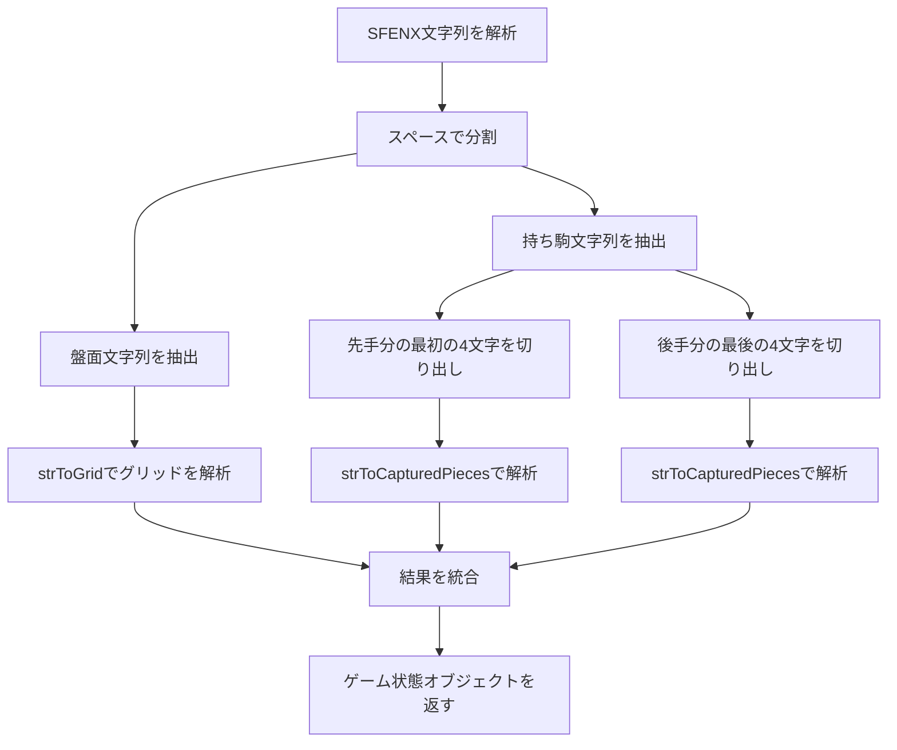
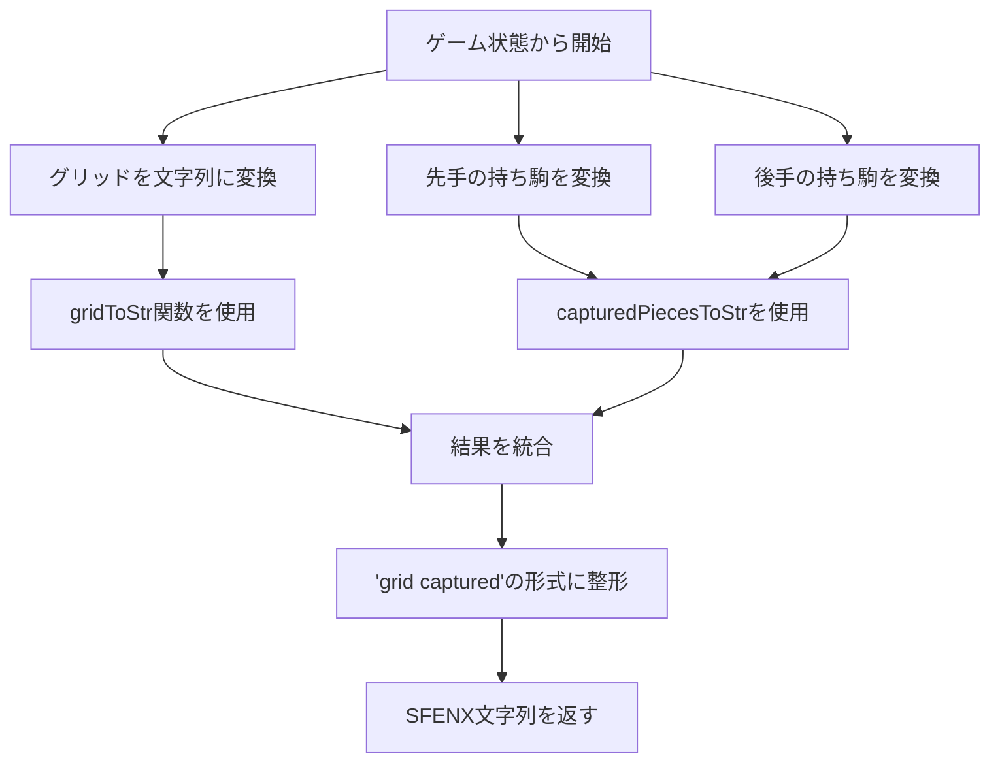
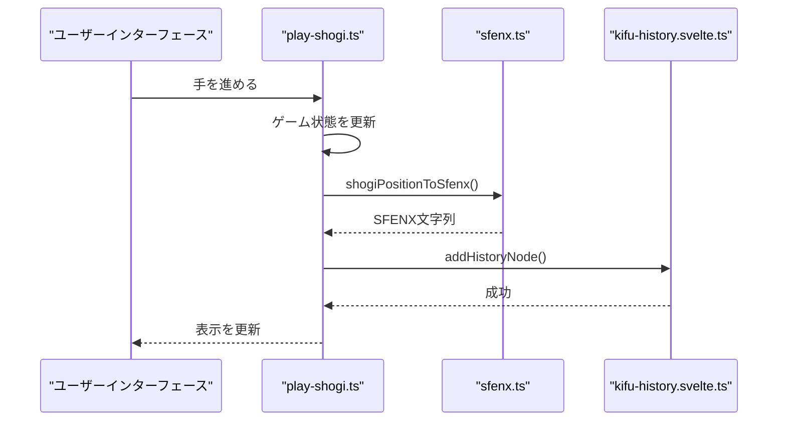
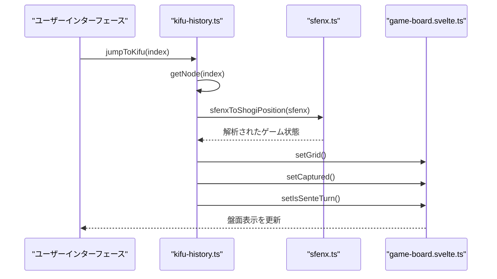
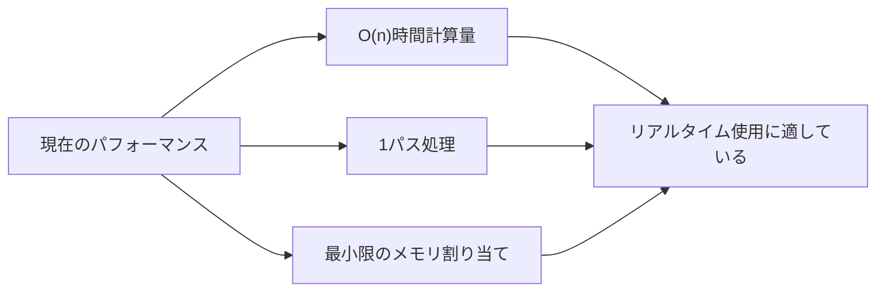

# SFENX表記の処理

<cite>
**このドキュメントで参照されるファイル**   
- [sfenx.ts](file://src/domain/sfenx.ts)
- [kifu-history.svelte.ts](file://src/store/kifu-history.svelte.ts)
- [shogi.d.ts](file://src/types/shogi.d.ts)
- [play-shogi.ts](file://src/handler/play-shogi.ts)
- [kifu-history.ts](file://src/handler/kifu-history.ts)
- [sfenx.test.ts](file://src/test/domain/sfenx.test.ts) - *最近のコミットで追加されたテスト*
</cite>

## 更新概要
**変更内容**   
- `sfenx.test.ts`に追加された包括的なテストに基づき、SFENXのパースとシリアライズに関する正確性を検証
- 既存のドキュメントにテストケースの例を追加し、実装の完全性を強調
- エラー処理と検証セクションに、テストでカバーされた境界条件を反映

## 目次
1. [はじめに](#はじめに)
2. [SFENXフォーマットの構造](#sfenxフォーマットの構造)
3. [シリアライズとデシリアライズのプロセス](#シリアライズとデシリアライズのプロセス)
4. [ゲーム履歴管理との統合](#ゲーム履歴管理との統合)
5. [エラー処理と検証](#エラー処理と検証)
6. [パフォーマンスに関する考慮事項](#パフォーマンスに関する考慮事項)
7. [実際の使用例](#実際の使用例)
8. [結論](#結論)

## はじめに
SFENX表記システムは、標準SFEN（将棋フォルシス・エドワーズ表記）を拡張し、ゲーム状態の永続性や共有機能を強化したフォーマットです。本ドキュメントは、`sfenx.ts`モジュールについて詳しく解説します。このモジュールは、内部のゲーム状態オブジェクトとコンパクトな文字列表現の間の変換を可能にし、ゲーム状態の復元、手順のナビゲーション、永続的ストレージを実現します。

**Section sources**
- [sfenx.ts](file://src/domain/sfenx.ts#L0-L239)

## SFENXフォーマットの構造
SFENXフォーマットは、従来のSFENを拡張し、盤面の配置、手番、持ち駒、手数をコンパクトな文字列で表現します。このフォーマットは、スペースで区切られた2つの主要な構成要素から成ります：
- **盤面文字列**：駒の記号と空きマスのランレングス符号化を使用して9x9の将棋盤を表現
- **持ち駒文字列**：両プレイヤーの持ち駒をコンパクトな文字ベースの符号化方式で符号化

駒の種類のマッピングでは、大文字を先手（黒）に、小文字を後手（白）に使用します：
- 歩 (Pawn): P/p → T/t（成り）
- 香 (Lance): L/l → V/v（成り）
- 桂 (Knight): N/n → U/u（成り）
- 銀 (Silver): S/s → M/m（成り）
- 角 (Bishop): B/b → H/h（成り）
- 飛 (Rook): R/r → D/d（成り）
- 金 (Gold): G/g
- 玉 (King): K/k

**Section sources**
- [sfenx.ts](file://src/domain/sfenx.ts#L1-L65)

## シリアライズとデシリアライズのプロセス

### デシリアライズ：SFENXからゲーム状態へ
`sfenxToShogiPosition`関数は、SFENX文字列を内部ゲーム状態オブジェクトに解析します。このオブジェクトには以下が含まれます：
- **グリッド**：盤面状態を表す81要素の配列
- **持ち駒**：先手と後手の持ち駒を別々の配列で、駒の種類と個数を含む



**Diagram sources**
- [sfenx.ts](file://src/domain/sfenx.ts#L140-L179)

**Section sources**
- [sfenx.ts](file://src/domain/sfenx.ts#L140-L179)

### シリアライズ：ゲーム状態からSFENXへ
`shogiPositionToSfenx`関数は、内部ゲーム状態オブジェクトをSFENX文字列に変換します：



**Diagram sources**
- [sfenx.ts](file://src/domain/sfenx.ts#L181-L238)

**Section sources**
- [sfenx.ts](file://src/domain/sfenx.ts#L181-L238)

## ゲーム履歴管理との統合
SFENXモジュールは、履歴システムと密接に統合され、ナビゲーション中の状態復元を可能にします。手を進めるたびに、現在のゲーム状態がSFENXにシリアライズされ、履歴ノードに保存されます。



履歴をナビゲートする際には、逆のプロセスが発生します：



**Diagram sources**
- [play-shogi.ts](file://src/handler/play-shogi.ts#L77-L126)
- [kifu-history.ts](file://src/handler/kifu-history.ts#L0-L34)

**Section sources**
- [play-shogi.ts](file://src/handler/play-shogi.ts#L77-L126)
- [kifu-history.ts](file://src/handler/kifu-history.ts#L0-L34)

## エラー処理と検証
SFENXモジュールは、デシリアライズ中にいくつかの検証チェックを実装しています：

1. **入力フォーマット検証**：SFENX文字列にスペース区切りがちょうど1つ含まれていることを保証
2. **盤面サイズ検証**：グリッド文字列が正確に81マスを表していることを確認
3. **駒数検証**：持ち駒の個数が合理的な範囲内であることを検証
4. **文字検証**：有効な駒文字と数字のみが存在することを保証

モジュールはTypeScriptの型を使用して型安全性を強制しています：
```typescript
export type PieceType = "歩" | "香" | "桂" | "銀" | "金" | "角" | "飛" | "玉" | "と" | "杏" | "圭" | "全" | "馬" | "竜";
export type Square = { piece: PieceType; isSente: boolean };
```

一般的な解析の問題には以下が含まれます：
- 不正な盤面構成（マス数が不正）
- 無効な文字コードを持つ不正な持ち駒文字列
- 駒の成りの不一致
- 履歴ノード内の無効な手記号

これらの問題は、上位コンポーネントが捕捉可能な記述的なエラーをスローすることで処理されます。

**Section sources**
- [sfenx.ts](file://src/domain/sfenx.ts#L0-L239)
- [shogi.d.ts](file://src/types/shogi.d.ts#L0-L74)
- [sfenx.test.ts](file://src/test/domain/sfenx.test.ts#L1-L96) - *追加されたテストケース*

## パフォーマンスに関する考慮事項
SFENXのシリアライズプロセスは、以下の点でパフォーマンスが最適化されています：

1. **文字列構築の効率性**：`gridToStr`関数は、空きマスのランレングス符号化を使用して盤面を1パスで処理
2. **文字コード演算**：持ち駒の符号化に文字コード演算を使用してコンパクトな表現を実現
3. **メモリ効率**：内部表現にフラットな配列を使用し、ネスト構造を回避

潜在的な最適化には以下が含まれます：
- **遅延解析**：実際に表示が必要になるまでSFENX文字列を解析しない
- **キャッシュ**：最近解析されたSFENX文字列をキャッシュして再解析を回避
- **バッチ処理**：大量の棋譜記録を読み込む際に複数の履歴ノードを一括処理

現在の実装は、シリアライズとデシリアライズの両方でO(n)の時間計算量を持ち、nはマス数（81）と持ち駒の合計です。



**Diagram sources**
- [sfenx.ts](file://src/domain/sfenx.ts#L100-L200)

**Section sources**
- [sfenx.ts](file://src/domain/sfenx.ts#L100-L200)

## 実際の使用例

### 手を進めた後の現在のゲーム状態の変換
ゲームで手を終えた後、以下のシーケンスが発生します：

```typescript
function turnEnd(display: string, move: string) {
  toggleTurn();
  resetCanMoveAll();
  resetPromotionPos();
  resetHandPiece();
  resetPromotionPos();
  const sfenx = shogiPositionToSfenx(
    getGrid(),
    getCaptured(true),
    getCaptured(false)
  );
  addHistoryNode(display, sfenx, getIsSenteTurn(), move, false);
}
```

これにより、現在の状態が履歴に以下の情報とともに追加されます：
- ユーザーの可読性のための表示表記
- 絶対的な状態表現のためのSFENX文字列
- 現在の手番
- 手の記号
- お気に入りステータス

### SFENX文字列の例
サンプルのSFENX文字列は次のようになります：
```
lnsgkgsnl/1r5b1/ppppppppp/9/9/9/PPPPPPPPP/1B5R1/LNSGKGSNL ahha
```

ここで：
- 最初の部分は盤面の配置を表す
- 2番目の部分は持ち駒を符号化（この例ではなし）

**Section sources**
- [play-shogi.ts](file://src/handler/play-shogi.ts#L77-L126)
- [sfenx.ts](file://src/domain/sfenx.ts#L181-L238)
- [sfenx.test.ts](file://src/test/domain/sfenx.test.ts#L3-L96) - *テストケースの例*

## 結論
SFENX表記処理システムは、SvelteShogiアプリケーションにおいて将棋のゲーム状態をシリアライズおよびデシリアライズする堅牢なメカニズムを提供します。標準SFEN表記を拡張することで、ゲーム状態の効率的な保存と送信が可能になり、既存の将棋表記標準との互換性を維持しています。kifu-historyシステムとの緊密な統合により、手順のナビゲーションがシームレスになり、コンパクトな文字列表現によりストレージ要件が最小限に抑えられます。実装はパフォーマンス、可読性、正確性のバランスを取っており、リアルタイムのプレイと永続的な棋譜記録の両方に適しています。