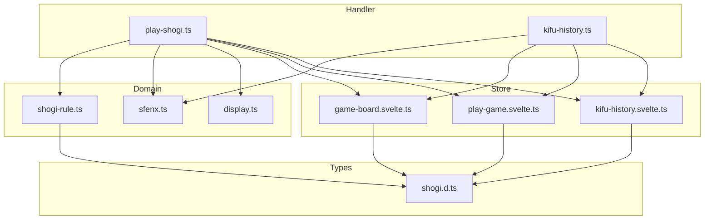
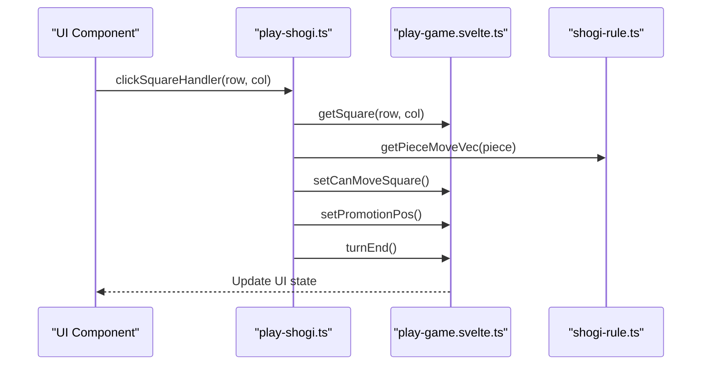
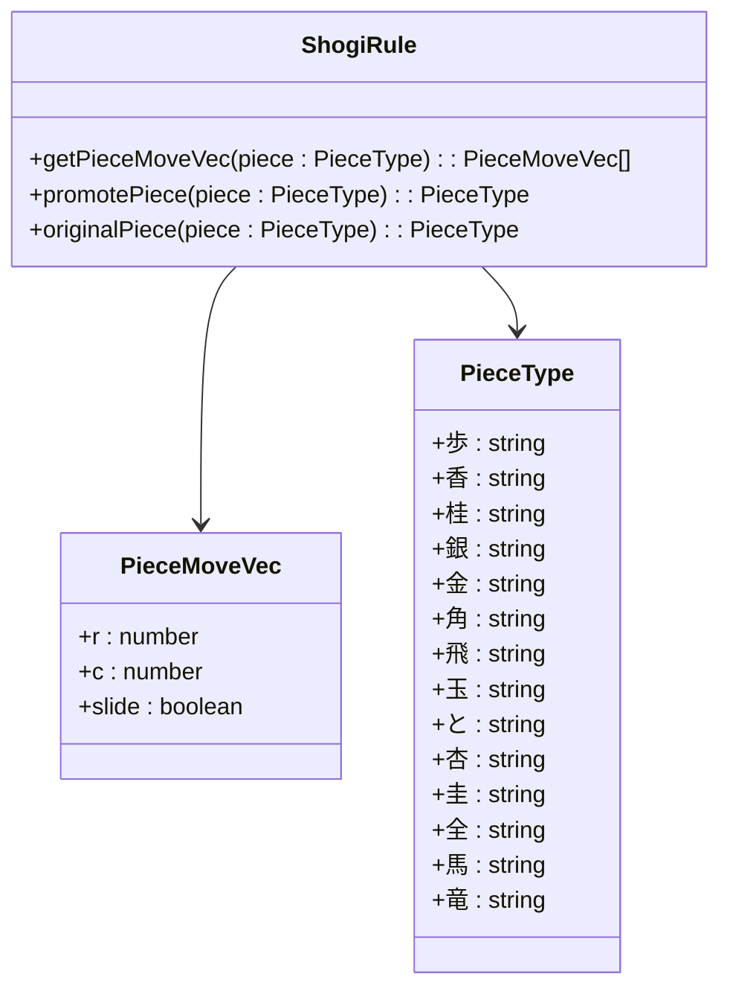
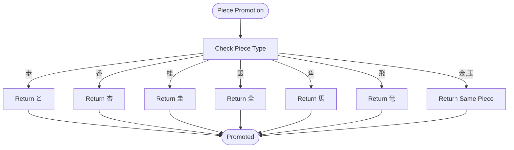
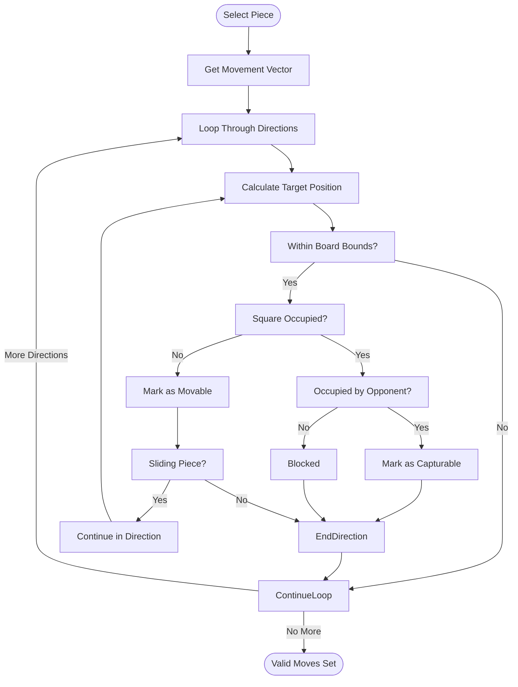
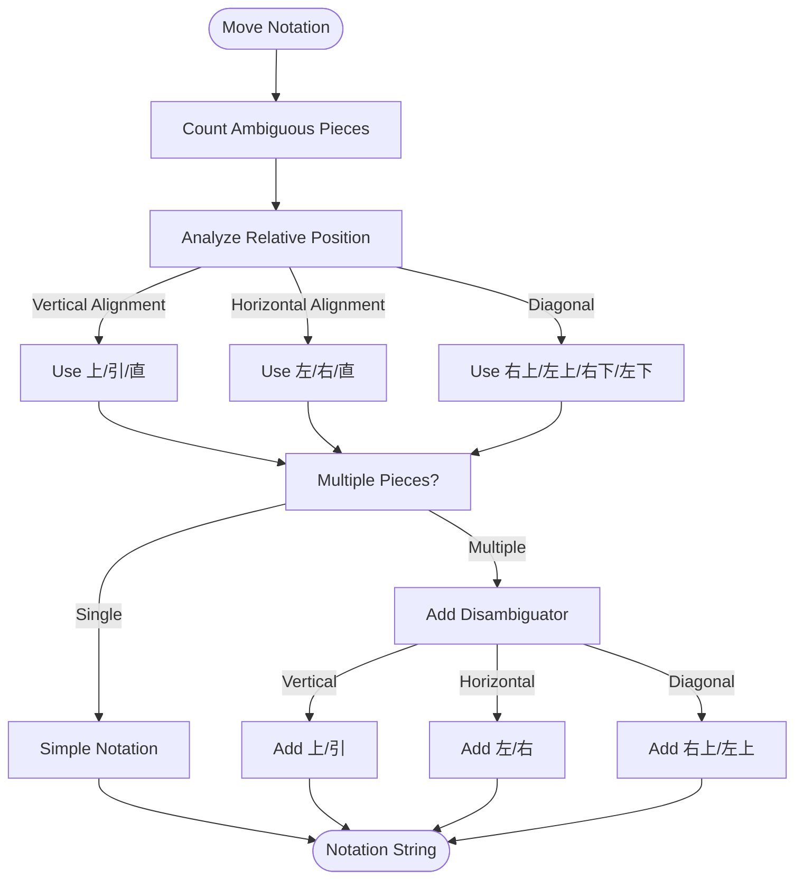
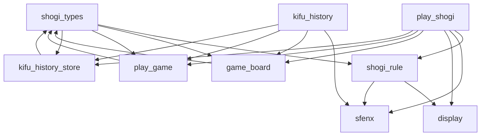

# Shogi Rules Implementation

<cite>
**Referenced Files in This Document**   
- [shogi-rule.ts](file://src/domain/shogi-rule.ts)
- [play-shogi.ts](file://src/handler/play-shogi.ts)
- [play-game.svelte.ts](file://src/store/play-game.svelte.ts)
- [shogi.d.ts](file://src/types/shogi.d.ts)
- [display.ts](file://src/domain/display.ts)
- [sfenx.ts](file://src/domain/sfenx.ts)
- [game-board.svelte.ts](file://src/store/game-board.svelte.ts)
- [kifu-history.svelte.ts](file://src/store/kifu-history.svelte.ts)
</cite>

## Update Summary
**Changes Made**   
- Updated documentation to reflect the integration between move validation and display notation systems
- Added detailed explanation of how getPieceMoveVec is used in ambiguity resolution for move notation
- Enhanced section on move validation with additional context from display.ts implementation
- Added new section on display notation ambiguity resolution with concrete examples
- Updated diagram sources to include display.ts functionality

## Table of Contents
1. [Introduction](#introduction)
2. [Project Structure](#project-structure)
3. [Core Components](#core-components)
4. [Architecture Overview](#architecture-overview)
5. [Detailed Component Analysis](#detailed-component-analysis)
6. [Dependency Analysis](#dependency-analysis)
7. [Performance Considerations](#performance-considerations)
8. [Troubleshooting Guide](#troubleshooting-guide)
9. [Conclusion](#conclusion)

## Introduction
This document provides a comprehensive analysis of the Shogi game rules implementation in the SvelteShogi application. It details how the core mechanics of Shogi are implemented, focusing on piece movement, promotion logic, and move validation. The system enforces game rules through a modular architecture that separates domain logic from UI state management and user interaction handling.

## Project Structure
The project follows a clean, modular structure with distinct layers for domain logic, handlers, and stores. The domain layer contains pure game logic, handlers manage user interactions, and stores maintain application state.



**Diagram sources**
- [shogi-rule.ts](file://src/domain/shogi-rule.ts)
- [play-shogi.ts](file://src/handler/play-shogi.ts)
- [play-game.svelte.ts](file://src/store/play-game.svelte.ts)
- [game-board.svelte.ts](file://src/store/game-board.svelte.ts)
- [kifu-history.svelte.ts](file://src/store/kifu-history.svelte.ts)
- [shogi.d.ts](file://src/types/shogi.d.ts)

**Section sources**
- [shogi-rule.ts](file://src/domain/shogi-rule.ts)
- [play-shogi.ts](file://src/handler/play-shogi.ts)
- [play-game.svelte.ts](file://src/store/play-game.svelte.ts)

## Core Components
The core components of the Shogi implementation are centered around three main modules: the domain rules, the game state stores, and the interaction handlers. The `shogi-rule.ts` module defines the fundamental game mechanics, including piece movement patterns and promotion rules. The store modules manage the application state, while the handler modules process user interactions and enforce game rules.

**Section sources**
- [shogi-rule.ts](file://src/domain/shogi-rule.ts)
- [play-game.svelte.ts](file://src/store/play-game.svelte.ts)
- [game-board.svelte.ts](file://src/store/game-board.svelte.ts)

## Architecture Overview
The application architecture follows a unidirectional data flow pattern where user interactions trigger handlers that update stores, which in turn affect the UI. The domain logic is kept separate from the UI state, allowing for clear separation of concerns.



**Diagram sources**
- [play-shogi.ts](file://src/handler/play-shogi.ts)
- [play-game.svelte.ts](file://src/store/play-game.svelte.ts)
- [shogi-rule.ts](file://src/domain/shogi-rule.ts)

## Detailed Component Analysis

### Piece Movement System
The piece movement system is implemented through directional vectors that define how each piece can move on the board. Each movement vector contains row (r), column (c), and slide properties that determine the direction and range of movement.



**Diagram sources**
- [shogi-rule.ts](file://src/domain/shogi-rule.ts)
- [shogi.d.ts](file://src/types/shogi.d.ts)

#### Movement Vector Implementation
The `getPieceMoveVec` function maps each piece type to its unique movement pattern using directional objects. For non-sliding pieces, the `slide` property is false, limiting movement to a single step. For sliding pieces like 角 (Bishop) and 飛 (Rook), the `slide` property is true, allowing movement along a direction until blocked.

**Section sources**
- [shogi-rule.ts](file://src/domain/shogi-rule.ts#L0-L104)

### Promotion Logic
The promotion system handles the transformation between unpromoted and promoted piece forms. The `promotePiece` function returns the promoted form of a piece, while `originalPiece` returns the unpromoted form.



**Diagram sources**
- [shogi-rule.ts](file://src/domain/shogi-rule.ts#L51-L104)

#### Promotion Rules Implementation
The promotion logic correctly handles edge cases such as kings (玉) and gold generals (金) which cannot be promoted. The system uses a switch statement to map each piece to its promoted form, with a default case that returns the piece unchanged for non-promotable pieces.

**Section sources**
- [shogi-rule.ts](file://src/domain/shogi-rule.ts#L51-L104)

### Move Validation System
The move validation system prevents illegal actions by calculating valid moves before execution. The `setCanMoveFromSquare` function determines all valid destinations for a selected piece.



**Diagram sources**
- [play-shogi.ts](file://src/handler/play-shogi.ts#L45-L75)

#### Move Validation Implementation
The move validation implementation in `play-shogi.ts` uses the movement vectors from `shogi-rule.ts` to determine valid moves. For each direction in the piece's movement vector, it calculates positions along that direction, marking empty squares as movable and opponent-occupied squares as capturable. The loop terminates when it encounters an occupied square or reaches the board edge.

**Section sources**
- [play-shogi.ts](file://src/handler/play-shogi.ts#L45-L75)

### Display Notation Ambiguity Resolution
The system implements sophisticated logic to resolve ambiguity in move notation when multiple identical pieces can reach the same destination. The `getDisplayMoveFromGrid` function in `display.ts` uses movement vectors from `shogi-rule.ts` to determine positional relationships between pieces.



**Diagram sources**
- [display.ts](file://src/domain/display.ts#L0-L155)
- [shogi-rule.ts](file://src/domain/shogi-rule.ts)

#### Ambiguity Resolution Implementation
The ambiguity resolution system uses movement vectors to determine how pieces can reach a destination square. For each potential moving piece, it calculates the direction of movement (up, down, left, right) and compares it with other pieces of the same type that could reach the same destination. Special rules apply for sliding pieces like Rook (飛) and Bishop (角), and for edge cases where pieces are aligned horizontally.

**Section sources**
- [display.ts](file://src/domain/display.ts#L0-L155)
- [shogi-rule.ts](file://src/domain/shogi-rule.ts)

### Integration with Game State
The Shogi rules module integrates with the game state stores to provide a complete gameplay experience. The `play-game.svelte.ts` store manages UI state such as valid moves and promotion positions.

```mermaid
classDiagram
class PlayGameStore {
+canMove : boolean[81]
+promotionPos : {row, col} | null
+lastPos : {row, col} | null
+getCanMove(row, col) : boolean
+setCanMoveSquare(row, col)
+resetCanMoveAll()
+setPromotionPos(row, col)
+resetPromotionPos()
+getLastPos() : {row, col} | null
+setLastPos(row, col)
}
class GameBoardStore {
+grid : (Square | null)[]
+capturedSente : {piece, num}[]
+capturedGote : {piece, num}[]
+getSquare(row, col) : Square | null
+setSquare(row, col, piece, isSente)
+resetSquare(row, col)
+getCaptured(isSente) : {piece, num}[]
+incrementCaptured(piece, isSente)
+decrementCaptured(piece, isSente)
}
class KifuHistoryStore {
+history : HistoryNode[]
+currentIndex : number
+addHistoryNode(display, sfenx, isSente, move, isFavorite)
+getCurrentIndex() : number
+getNode(index) : HistoryNode
}
PlayGameStore --> GameBoardStore
PlayGameStore --> KifuHistoryStore
```

**Diagram sources**
- [play-game.svelte.ts](file://src/store/play-game.svelte.ts)
- [game-board.svelte.ts](file://src/store/game-board.svelte.ts)
- [kifu-history.svelte.ts](file://src/store/kifu-history.svelte.ts)

#### Integration Implementation
The integration between the rules module and game state stores enables the full gameplay flow. When a user clicks on a square, the `clickSquareHandler` in `play-shogi.ts` coordinates with multiple stores to validate moves, update state, and record history.

**Section sources**
- [play-shogi.ts](file://src/handler/play-shogi.ts#L128-L229)
- [play-game.svelte.ts](file://src/store/play-game.svelte.ts)
- [game-board.svelte.ts](file://src/store/game-board.svelte.ts)

## Dependency Analysis
The Shogi rules implementation has a clear dependency hierarchy with minimal circular dependencies. The domain layer is independent of the handler and store layers, allowing for easy testing and maintenance.



**Diagram sources**
- [shogi-rule.ts](file://src/domain/shogi-rule.ts)
- [play-shogi.ts](file://src/handler/play-shogi.ts)
- [play-game.svelte.ts](file://src/store/play-game.svelte.ts)
- [game-board.svelte.ts](file://src/store/game-board.svelte.ts)
- [kifu-history.svelte.ts](file://src/store/kifu-history.svelte.ts)
- [shogi.d.ts](file://src/types/shogi.d.ts)

## Performance Considerations
The Shogi rules implementation demonstrates several performance optimizations:

1. **Pre-defined Movement Vectors**: Movement patterns are defined as static arrays, eliminating the need for runtime calculation of valid moves.
2. **Efficient State Management**: The use of Svelte's $state for reactive variables ensures minimal re-renders.
3. **Direct Array Access**: Board positions are accessed using row*9+col indexing, providing O(1) access time.
4. **Early Loop Termination**: The move validation loops terminate as soon as a blocking condition is encountered.

The system avoids expensive operations by using simple object comparisons and direct array manipulations. The movement vector lookups are constant time operations, making the overall move validation efficient even for sliding pieces.

**Section sources**
- [shogi-rule.ts](file://src/domain/shogi-rule.ts)
- [play-shogi.ts](file://src/handler/play-shogi.ts)
- [play-game.svelte.ts](file://src/store/play-game.svelte.ts)

## Troubleshooting Guide
Common issues and their solutions:

1. **Invalid Moves Allowed**: Ensure that `setCanMoveFromSquare` is called after selecting a piece and that the movement vectors in `shogi-rule.ts` are correctly defined.
2. **Promotion Not Triggering**: Verify that the promotion condition (entering or moving within the promotion zone) is correctly implemented in `clickSquareHandler`.
3. **State Synchronization Issues**: Check that all store updates are properly coordinated through the handler layer.
4. **Piece Movement Incorrect**: Validate that the directional vectors account for player perspective (先手 vs. 後手) by reversing the row direction for 後手 pieces.
5. **Ambiguous Move Notation**: Ensure that `getPieceMoveVec` is correctly used in `display.ts` to resolve ambiguity when multiple identical pieces can reach the same destination.

**Section sources**
- [play-shogi.ts](file://src/handler/play-shogi.ts)
- [shogi-rule.ts](file://src/domain/shogi-rule.ts)
- [play-game.svelte.ts](file://src/store/play-game.svelte.ts)
- [display.ts](file://src/domain/display.ts)

## Conclusion
The Shogi rules implementation in SvelteShogi provides a robust and efficient system for enforcing game mechanics. By separating domain logic from UI state management, the architecture enables clear, maintainable code. The movement vector system accurately represents Shogi piece movements, including the complex sliding patterns of pieces like the Bishop and Rook. The promotion logic correctly handles all piece transformations while respecting game rules that prevent kings and gold generals from promoting. The integration with the handler and store layers ensures that move validation occurs before execution, preventing illegal actions. The addition of display notation ambiguity resolution demonstrates how the movement vector system is leveraged beyond basic validation to provide accurate game notation. Overall, the implementation demonstrates good software engineering practices with its modular design, clear dependencies, and performance optimizations.