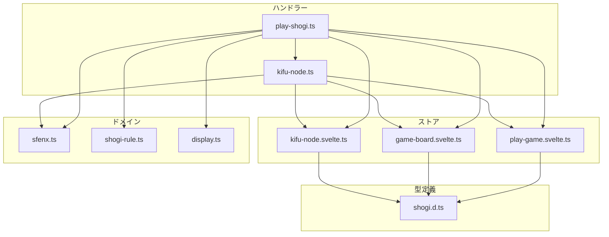
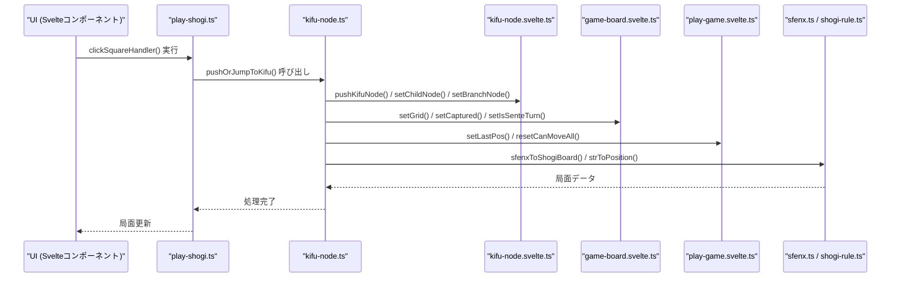
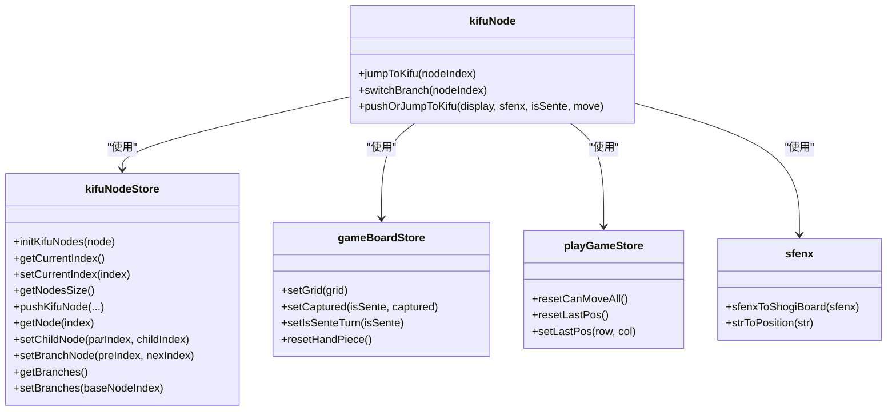

# Kifu Node Handler

<cite>
**このドキュメントで参照されるファイル**  
- [kifu-node.ts](file://src/handler/kifu-node.ts)
- [play-shogi.ts](file://src/handler/play-shogi.ts)
- [kifu-node.svelte.ts](file://src/store/kifu-node.svelte.ts)
- [shogi.d.ts](file://src/types/shogi.d.ts)
</cite>

## 目次

1. [概要](#概要)
2. [プロジェクト構造](#プロジェクト構造)
3. [コアコンポーネント](#コアコンポーネント)
4. [アーキテクチャ概要](#アーキテクチャ概要)
5. [詳細なコンポーネント分析](#詳細なコンポーネント分析)
6. [依存関係分析](#依存関係分析)
7. [パフォーマンスに関する考慮事項](#パフォーマンスに関する考慮事項)
8. [トラブルシューティングガイド](#トラブルシューティングガイド)
9. [結論](#結論)

## 概要

本ドキュメントは、将棋アプリケーションにおける棋譜ノードの管理と操作を担当する `Kifu Node Handler` の包括的な解説を提供します。このハンドラーは、将棋の局面遷移、分岐処理、履歴管理の中心的な役割を果たしており、ユーザーが棋譜を再生・編集・探索できるようにする基盤を提供します。主な機能として、ノードの追加、分岐の切り替え、特定の局面への移動などが含まれます。

## プロジェクト構造

`Kifu Node Handler` は `src/handler/kifu-node.ts` に実装されており、他のモジュールと密接に連携しています。主要な依存関係は以下の通りです。

**図の出典**

- [kifu-node.ts](file://src/handler/kifu-node.ts)
- [play-shogi.ts](file://src/handler/play-shogi.ts)
- [kifu-node.svelte.ts](file://src/store/kifu-node.svelte.ts)
- [shogi.d.ts](file://src/types/shogi.d.ts)

**このセクションの出典**

- [kifu-node.ts](file://src/handler/kifu-node.ts)
- [play-shogi.ts](file://src/handler/play-shogi.ts)

## コアコンポーネント

`Kifu Node Handler` は、将棋の局面履歴を木構造で管理するための関数群で構成されています。主な関数は `jumpToKifu`、`switchBranch`、`pushOrJumpToKifu` です。これらの関数は、ストア (`kifu-node.svelte.ts`) を通じてノードの状態を更新し、UIに反映される局面を制御します。また、SFENX形式の文字列を用いて、各局面の状態を一意に表現しています。

**このセクションの出典**

- [kifu-node.ts](file://src/handler/kifu-node.ts#L1-L82)
- [kifu-node.svelte.ts](file://src/store/kifu-node.svelte.ts#L1-L77)

## アーキテクチャ概要

`Kifu Node Handler` は、Svelteのリアクティブストアと連携し、将棋の進行状況を管理するコアロジックを提供します。以下の図は、主要なコンポーネント間のデータフローと依存関係を示しています。

**図の出典**

- [kifu-node.ts](file://src/handler/kifu-node.ts#L1-L82)
- [play-shogi.ts](file://src/handler/play-shogi.ts#L1-L272)
- [kifu-node.svelte.ts](file://src/store/kifu-node.svelte.ts#L1-L77)

## 詳細なコンポーネント分析

### setCurrentNode 関数

`setCurrentNode` 関数は、指定されたノードインデックスに対応する将棋の局面を現在の状態として設定します。これは、棋譜の再生や分岐切り替えの基本操作です。

#### 目的

- 指定されたノードの局面情報をストアに反映する。
- 手番、駒台、直前の移動位置などの状態を同期する。

#### 引数

- **nodeIndex**: 設定するノードのインデックス（数値）

#### 戻り値

- なし（`void`）

#### 呼び出しシーケンス

1. `getNode(nodeIndex)` でノードを取得。
2. `sfenxToShogiBoard(node.sfenx)` でSFENX文字列を盤面データに変換。
3. `setGrid()`、`setCaptured()` で盤面と駒台を更新。
4. `node.move` が存在する場合、`strToPosition()` で移動元位置を解析し、`setLastPos()` で直前の移動位置を設定。
5. `setCurrentIndex(nodeIndex)` で現在のノードインデックスを更新。
6. `resetCanMoveAll()`、`resetHandPiece()` で選択状態をリセット。

#### エラーハンドリング

- 特に例外を投げませんが、`strToPosition` が不正な文字列を受けると内部でエラーになる可能性があります（ただし、SFENXが正しい前提）。

**このセクションの出典**

- [kifu-node.ts](file://src/handler/kifu-node.ts#L15-L39)

### jumpToKifu 関数

`jumpToKifu` 関数は、指定されたノードに直接移動し、その局面を現在の状態として設定します。

#### 目的

- 棋譜の任意の位置にジャンプする。
- 手番と分岐情報を更新する。

#### 引数

- **nodeIndex**: ジャンプ先のノードインデックス（数値）

#### 戻り値

- なし（`void`）

#### 呼び出しシーケンス

1. `setCurrentNode(nodeIndex)` を呼び出して局面を設定。
2. `getNode(nodeIndex).isSente` から手番を取得し、`setIsSenteTurn()` で更新。
3. `setBranches(nodeIndex)` で現在のノードから分岐するノードのリストを更新。

#### エラーハンドリング

- `setCurrentNode` 内の処理に依存。`nodeIndex` が無効な場合、`getNode` がエラーを投げる可能性があります。

**このセクションの出典**

- [kifu-node.ts](file://src/handler/kifu-node.ts#L41-L47)

### switchBranch 関数

`switchBranch` 関数は、現在のノードから分岐した別の手順に切り替えます。

#### 目的

- 分岐ノードに移動し、その親ノードの子ノードとして登録する。
- 初期局面（ノード0）には適用されません。

#### 引数

- **nodeIndex**: 切り替える分岐ノードのインデックス（数値）

#### 戻り値

- なし（`void`）

#### 呼び出しシーケンス

1. `setCurrentNode(nodeIndex)` を呼び出して局面を設定。
2. `nodeIndex` が0でない場合、`getNode(nodeIndex).prev` を親ノードとして、`setChildNode(親, nodeIndex)` を呼び出し、親ノードの子ノードを更新。

#### エラーハンドリング

- `setCurrentNode` と同様。`nodeIndex` が無効な場合に問題が発生します。

**このセクションの出典**

- [kifu-node.ts](file://src/handler/kifu-node.ts#L49-L55)

### pushOrJumpToKifu 関数

`pushOrJumpToKifu` 関数は、新しい手を追加するか、既存の手にジャンプするかを判断して処理を行います。これは、棋譜の編集や重複手の回避に重要です。

#### 目的

- 新しい局面を追加する。
- 同じ表示（`display`）を持つ既存のノードがあれば、そちらにジャンプする。

#### 引数

- **display**: 表示用の棋譜文字列（例: "7六歩"）
- **sfenx**: 局面を表すSFENX形式の文字列
- **isSente**: 手番（先手なら `true`）
- **move**: 移動を表す文字列（例: "7g7f"）

#### 戻り値

- なし（`void`）

#### 呼び出しシーケンス

1. `getCurrentIndex()` で現在のノードインデックスを取得。
2. `getNodesSize()` で次のノードインデックスを計算。
3. `curNextIndex`（現在のノードの子ノード）が存在する場合、ループで兄弟ノードを走査。
4. 既存のノードで `display` が一致するものがあれば、`setChildNode()` で親を更新し、`setCurrentIndex()` で現在位置を変更して関数を終了。
5. 一致するノードがなければ、`pushKifuNode()` で新しいノードを追加し、`setChildNode()` で親ノードの子を更新。

#### エラーハンドリング

- 特に例外を投げませんが、ストアの状態が不正な場合に内部エラーが発生する可能性があります。

**このセクションの出典**

- [kifu-node.ts](file://src/handler/kifu-node.ts#L57-L82)

## 依存関係分析

`Kifu Node Handler` は、複数のストアとドメインモジュールに依存しています。以下の図は、`kifu-node.ts` の主要な依存関係を示しています。

**図の出典**

- [kifu-node.ts](file://src/handler/kifu-node.ts)
- [kifu-node.svelte.ts](file://src/store/kifu-node.svelte.ts)
- [game-board.svelte.ts](file://src/store/game-board.svelte.ts)
- [play-game.svelte.ts](file://src/store/play-game.svelte.ts)
- [sfenx.ts](file://src/domain/sfenx.ts)

**このセクションの出典**

- [kifu-node.ts](file://src/handler/kifu-node.ts)
- [kifu-node.svelte.ts](file://src/store/kifu-node.svelte.ts)

## パフォーマンスに関する考慮事項

- `pushOrJumpToKifu` 関数内の兄弟ノード走査は、分岐数に比例して処理時間が増加します。分岐が非常に多い棋譜では、`O(n)` の時間複雑度がボトルネックになる可能性があります。
- `setBranches` は、分岐ノードのリストを再構築するため、頻繁に呼び出すとパフォーマンスに影響を与える可能性があります。
- 一般的な将棋の棋譜では、分岐数は限定的であるため、実用上は問題になりにくいです。

## トラブルシューティングガイド

- **問題**: `jumpToKifu` を呼び出したが、局面が更新されない。
  - **原因**: `setCurrentNode` 内で `sfenxToShogiBoard` がエラーを起こしている可能性。SFENX文字列が不正であるか、`strToPosition` の入力が誤っている。
  - **解決策**: `node.sfenx` と `node.move` の値をログ出力し、フォーマットを確認。

- **問題**: `pushOrJumpToKifu` で新しいノードが追加されない。
  - **原因**: 同じ `display` を持つ既存のノードが存在し、ジャンプしている可能性。
  - **解決策**: `setChildNode` が呼び出されているかを確認。意図しない重複を避けるため、`display` の生成ロジックを見直す。

**このセクションの出典**

- [kifu-node.ts](file://src/handler/kifu-node.ts#L15-L82)
- [play-shogi.ts](file://src/handler/play-shogi.ts#L1-L272)

## 結論

`Kifu Node Handler` は、将棋アプリケーションの棋譜管理の中心的な役割を果たしています。木構造による分岐対応、SFENXを用いた局面の永続化、ストアとの連携によるリアクティブなUI更新など、効率的で堅牢な設計がなされています。`play-shogi.ts` からの呼び出しパターンを理解することで、将棋の進行と棋譜の保存がどのように連携しているかが明確になります。今後の改善点としては、分岐走査の最適化や、エラーハンドリングの強化が考えられます。
