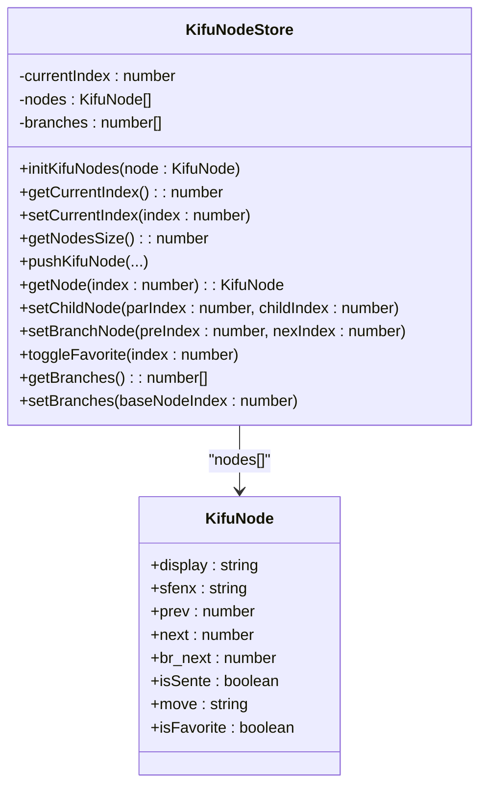
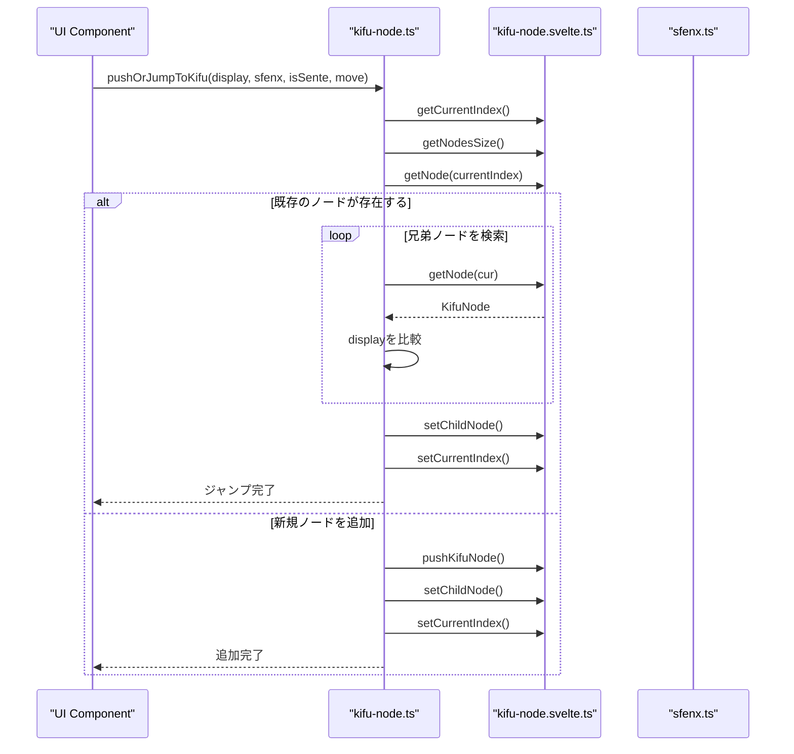
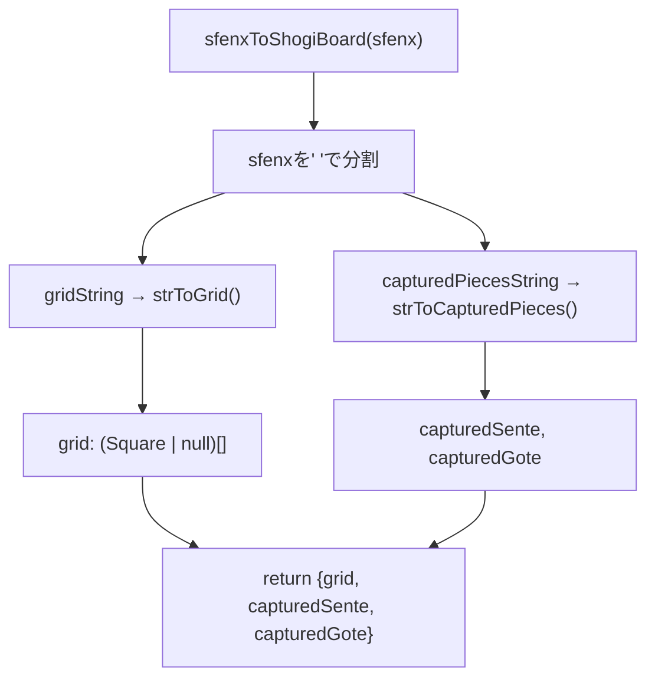
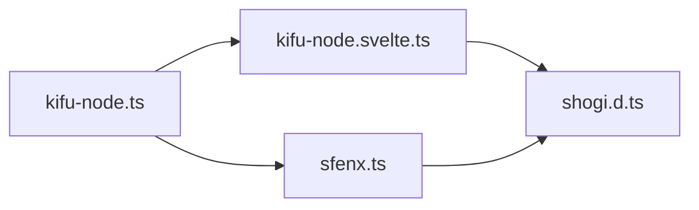

# Kifu Node System

<cite>
**このドキュメントで参照されるファイル**   
- [kifu-node.ts](file://src/handler/kifu-node.ts)
- [kifu-node.svelte.ts](file://src/store/kifu-node.svelte.ts)
- [shogi.d.ts](file://src/types/shogi.d.ts)
- [sfenx.ts](file://src/domain/sfenx.ts)
</cite>

## 目次

1. [はじめに](#はじめに)
2. [プロジェクト構造](#プロジェクト構造)
3. [コアコンポーネント](#コアコンポーネント)
4. [アーキテクチャ概要](#アーキテクチャ概要)
5. [詳細なコンポーネント分析](#詳細なコンポーネント分析)
6. [依存関係分析](#依存関係分析)
7. [トラブルシューティングガイド](#トラブルシューティングガイド)
8. [結論](#結論)

## はじめに

Kifu Node Systemは、将棋の棋譜を管理・操作するためのコアシステムです。このシステムは、指し手の履歴をノードとして木構造で表現し、分岐やお気に入りの手、手番の管理を可能にします。SFENX形式の文字列を用いて局面を保存・復元し、ユーザーが棋譜を自由に探索できるように設計されています。本ドキュメントでは、その目的、実装詳細、APIインターフェース、統合パターン、実用例およびトラブルシューティングについて解説します。

## プロジェクト構造

Kifu Node Systemは、SvelteとTypeScriptを用いたフロントエンドアプリケーションの一部として構成されています。主に`src/handler`、`src/store`、`src/domain`、`src/types`のディレクトリに分散して実装されています。

```mermaid
graph TB
subgraph "ハンドラー"
H[kifu-node.ts]
end
subgraph "ストア"
S[kifu-node.svelte.ts]
end
subgraph "ドメイン"
D[sfenx.ts]
end
subgraph "型定義"
T[shogi.d.ts]
end
H --> S : "ノード操作"
H --> D : "SFENX変換"
S --> T : "KifuNode型"
D --> T : "PieceType, Square型"
```

**図の出典**

- [kifu-node.ts](file://src/handler/kifu-node.ts)
- [kifu-node.svelte.ts](file://src/store/kifu-node.svelte.ts)
- [sfenx.ts](file://src/domain/sfenx.ts)
- [shogi.d.ts](file://src/types/shogi.d.ts)

**このセクションの出典**

- [kifu-node.ts](file://src/handler/kifu-node.ts)
- [kifu-node.svelte.ts](file://src/store/kifu-node.svelte.ts)

## コアコンポーネント

Kifu Node Systemの中心となるコンポーネントは、棋譜ノードの状態管理を行う`kifu-node.svelte.ts`と、その操作を提供する`kifu-node.ts`です。これらはSvelteのストアパターンを用いて状態を管理し、他のコンポーネントから安全にアクセスできるように設計されています。

### 棋譜ノードのデータ構造

`KifuNode`インターフェースは、1つの局面を表すノードの構造を定義しています。

```ts
export interface KifuNode {
  display: string; // 表示用の棋譜
  sfenx: string; // SFENのような形式の文字列, 絶対的なもの
  prev: number; // 親のノード
  next: number; // 子のノード
  br_next: number; // 兄弟ノードのうち次のノード
  isSente: boolean; // 手番
  move: string; // 直前の移動文字列（例: "7g7f"） 空文字ならば初期局面
  isFavorite: boolean; // お気に入りの一手かどうか
}
```

この構造により、ノードは親ノード（`prev`）、子ノード（`next`）、および兄弟ノードの循環リスト（`br_next`）を介して木構造を形成します。`sfenx`は局面の完全な情報を含む文字列で、`display`はユーザーに表示するための可読性の高い文字列です。

**このセクションの出典**

- [shogi.d.ts](file://src/types/shogi.d.ts#L50-L64)

## アーキテクチャ概要

Kifu Node Systemは、状態管理（Store）、業務ロジック（Handler）、ドメインモデル（Domain）の3層で構成されています。ストアはSvelteのリアクティブ変数を用いて状態を保持し、ハンドラーはそのストアを操作する関数群を提供します。ドメイン層はSFENX形式の文字列と内部データ構造の相互変換を行います。

```mermaid
graph TD
A[UI Component] --> B[kifu-node.ts]
B --> C[kifu-node.svelte.ts]
B --> D[sfenx.ts]
C --> E[(nodes: KifuNode[])]
D --> F[pieceTypeToCharMap]
D --> G[charToPieceTypeMap]
```

**図の出典**

- [kifu-node.ts](file://src/handler/kifu-node.ts)
- [kifu-node.svelte.ts](file://src/store/kifu-node.svelte.ts)
- [sfenx.ts](file://src/domain/sfenx.ts)

## 詳細なコンポーネント分析

### ストアの分析: kifu-node.svelte.ts

このファイルは、棋譜ノードの配列と現在のインデックスを管理する中心的なストアです。Svelteの`$state`を用いてリアクティブに状態を保持します。

#### 主要な関数

- `initKifuNodes(node)`: 初期ノードを設定し、配列を初期化します。
- `pushKifuNode(...)`: 新しいノードを配列に追加します。
- `setChildNode(parIndex, childIndex)`: 親ノードの子ノードを設定します。
- `setBranchNode(preIndex, nexIndex)`: 兄弟ノードのリンクを設定します。
- `setBranches(baseNodeIndex)`: 指定されたノードから分岐するすべての兄弟ノードのインデックスを`branches`配列に設定します。



**図の出典**

- [kifu-node.svelte.ts](file://src/store/kifu-node.svelte.ts#L1-L77)
- [shogi.d.ts](file://src/types/shogi.d.ts#L50-L64)

**このセクションの出典**

- [kifu-node.svelte.ts](file://src/store/kifu-node.svelte.ts#L1-L77)

### ハンドラーの分析: kifu-node.ts

このファイルは、外部から棋譜ノードを操作するための関数を提供します。主にUIからの呼び出しを想定しています。

#### 主要な関数

- `jumpToKifu(nodeIndex)`: 指定されたノードに移動し、その局面をUIに反映します。
- `switchBranch(nodeIndex)`: 分岐を切り替え、指定されたノードに移動します。
- `pushOrJumpToKifu(...)`: 新しい指し手を追加するか、既存の同じ指し手がある場合はそこにジャンプします。



**図の出典**

- [kifu-node.ts](file://src/handler/kifu-node.ts#L40-L82)
- [kifu-node.svelte.ts](file://src/store/kifu-node.svelte.ts)

**このセクションの出典**

- [kifu-node.ts](file://src/handler/kifu-node.ts#L1-L82)

### ドメインの分析: sfenx.ts

このファイルは、将棋の局面を表すSFENX形式の文字列と内部データ構造の間の変換を行います。

#### SFENX形式

SFENXは、標準SFENを拡張した形式で、駒台の情報を効率的に符号化しています。駒台の各駒の数は、ASCIIの'a'からのオフセットで表され、複数の駒は1文字に多重化されています（例：香と桂は1文字で管理）。



**図の出典**

- [sfenx.ts](file://src/domain/sfenx.ts#L100-L120)

**このセクションの出典**

- [sfenx.ts](file://src/domain/sfenx.ts#L1-L240)

## 依存関係分析

Kifu Node Systemは、明確な依存関係を持っています。`kifu-node.ts`（ハンドラー）は`kifu-node.svelte.ts`（ストア）と`sfenx.ts`（ドメイン）に依存しており、ストアは`shogi.d.ts`（型定義）に依存しています。この構造により、各層の責務が明確に分離され、保守性が高まっています。



**図の出典**

- [kifu-node.ts](file://src/handler/kifu-node.ts)
- [kifu-node.svelte.ts](file://src/store/kifu-node.svelte.ts)
- [sfenx.ts](file://src/domain/sfenx.ts)
- [shogi.d.ts](file://src/types/shogi.d.ts)

**このセクションの出典**

- [kifu-node.ts](file://src/handler/kifu-node.ts)
- [kifu-node.svelte.ts](file://src/store/kifu-node.svelte.ts)
- [sfenx.ts](file://src/domain/sfenx.ts)

## トラブルシューティングガイド

Kifu Node Systemの実装や使用において、以下のような問題が発生する可能性があります。

### 問題1: 分岐が正しく表示されない

**症状**: `setBranches`を呼び出した後、`branches`配列が空のまま。
**原因**: `br_next`のリンクが正しく設定されていない。特に、ループの終了条件（`cur !== baseNodeIndex`）が満たされない場合。
**解決策**: `pushOrJumpToKifu`関数内で`setBranchNode`が正しく呼び出されているか確認。`curNextIndex`が-1でない場合に`br_next`を更新しているかを確認。

### 問題2: 局面が正しく復元されない

**症状**: `jumpToKifu`を呼び出した後、盤面や駒台が期待と異なる。
**原因**: `sfenxToShogiBoard`関数でSFENX文字列の解析に失敗している。
**解決策**: SFENX文字列のフォーマットを確認。特に、駒台の8文字部分が正しく符号化されているか（'a'から始まる）を確認。

### 問題3: 同じ指し手が複数回追加される

**症状**: `pushOrJumpToKifu`を呼び出すと、既存のノードがあっても新規に追加される。
**原因**: `display`文字列の比較が厳密でない。空白や大文字小文字の違いがある可能性。
**解決策**: `display`の生成ロジックを確認し、一貫性のあるフォーマットを使用。

**このセクションの出典**

- [kifu-node.ts](file://src/handler/kifu-node.ts#L40-L82)
- [kifu-node.svelte.ts](file://src/store/kifu-node.svelte.ts#L60-L70)
- [sfenx.ts](file://src/domain/sfenx.ts#L100-L120)

## 結論

Kifu Node Systemは、将棋の棋譜を効率的に管理するための堅牢なシステムです。木構造による分岐のサポート、SFENX形式による局面の保存、Svelteのストアによるリアクティブな状態管理を組み合わせることで、ユーザーが直感的に棋譜を操作できるようにしています。本ドキュメントで解説した構造とAPIを活用することで、将棋アプリケーションの開発を効率的に行うことができます。
