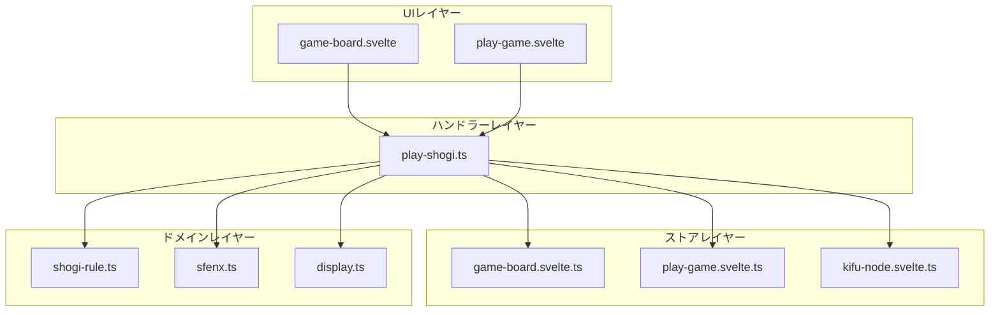
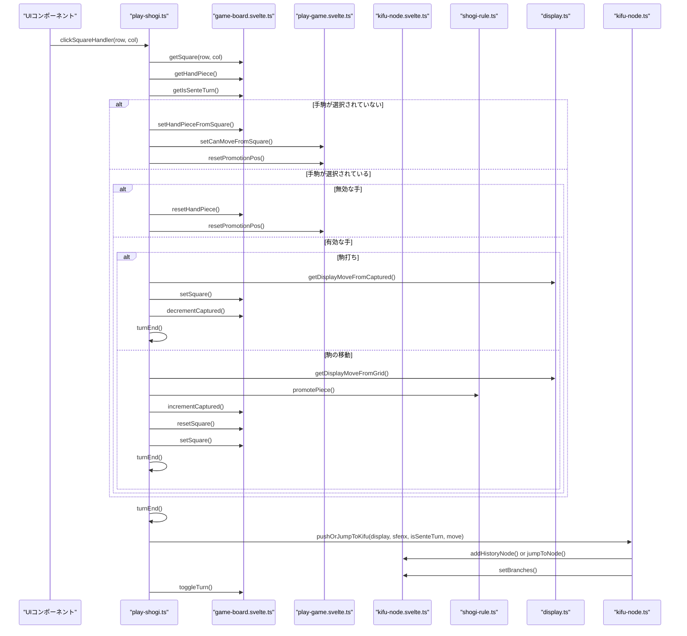
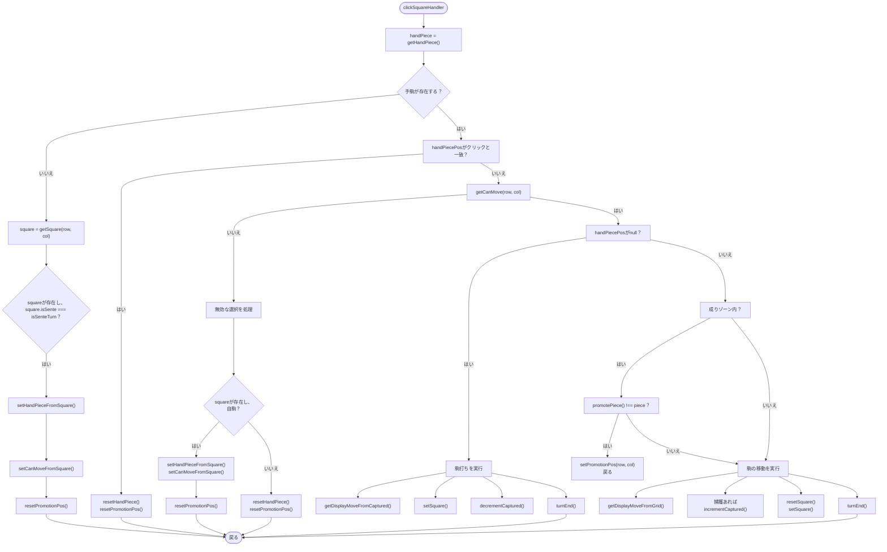
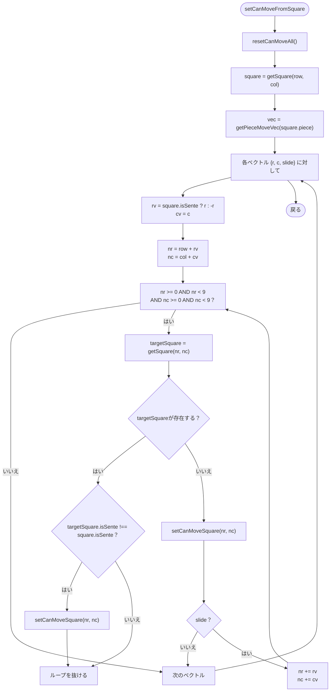
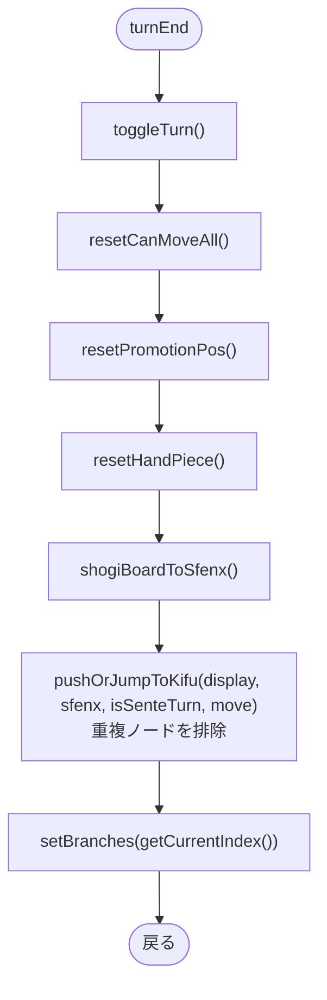
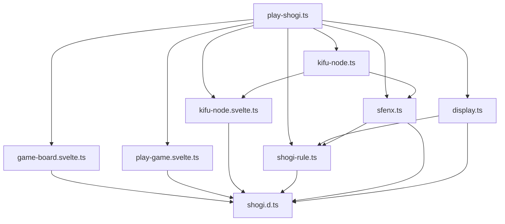

# 手を指す将棋ハンドラー

<cite>
**このドキュメントで参照されているファイル**   
- [play-shogi.ts](file://src/handler/play-shogi.ts) - *最近のコミットで更新*
- [kifu-node.ts](file://src/handler/kifu-node.ts) - *ノード重複防止ロジックを追加*
- [shogi-rule.ts](file://src/domain/shogi-rule.ts)
- [game-board.svelte.ts](file://src/store/game-board.svelte.ts)
- [play-game.svelte.ts](file://src/store/play-game.svelte.ts)
- [kifu-node.svelte.ts](file://src/store/kifu-node.svelte.ts)
- [sfenx.ts](file://src/domain/sfenx.ts)
- [display.ts](file://src/domain/display.ts)
- [shogi.d.ts](file://src/types/shogi.d.ts)
</cite>

## 更新概要

**変更内容**

- `7f48f67d87fa2b677dd701d9701d19bc44b3cd8` コミットにより、棋譜の保存処理にノード重複防止ロジックが導入
- `play-shogi.ts`の`turnEnd`関数が`pushOrJumpToKifu`に委譲され、既存の手順が重複して記録されるのを防止
- `kifu-node.ts`に`pushOrJumpToKifu`関数が追加され、分岐管理と重複排除の統合ロジックを提供
- 関連するシーケンス図および説明を更新し、新しいノード管理フローを反映
- 履歴管理の説明を拡充し、分岐作成時のノード重複防止メカニズムを詳細に解説

## 目次

1. [はじめに](#はじめに)
2. [プロジェクト構造](#プロジェクト構造)
3. [コアコンポーネント](#コアコンポーネント)
4. [アーキテクチャ概要](#アーキテクチャ概要)
5. [詳細なコンポーネント分析](#詳細なコンポーネント分析)
6. [依存関係分析](#依存関係分析)
7. [パフォーマンスに関する考慮事項](#パフォーマンスに関する考慮事項)
8. [トラブルシューティングガイド](#トラブルシューティングガイド)
9. [結論](#結論)

## はじめに

このドキュメントは、SvelteShogiアプリケーションにおける`play-shogi.ts`ハンドラモジュールの包括的な分析を提供します。このモジュールは、将棋盤上のユーザーインタラクションを管理する中心的なコーディネーターとして機能し、駒の選択、手の妥当性検証、成りの決定、ゲーム状態の更新を処理します。複数のストアおよびドメインロジックモジュールと統合することで、アプリケーション全体で一貫した状態を維持します。本ドキュメントは、ユーザー入力から永続的なゲーム状態の変更に至るまでの完全なイベントライフサイクルを説明し、リアクティブパターン、ドメインルールの適用、エラーハンドリングに重点を置いています。特に、最新の更新により導入された棋譜ノードの重複防止機構についても詳細に解説します。

## プロジェクト構造

SvelteShogiプロジェクトは、ドメインロジック、状態管理、ユーザーインタラクション処理の間で明確な関心の分離を持つモジュール構造を採用しています。コアコンポーネントは、以下のディレクトリに整理されています。

- **domain**: 将棋のルール、表記変換、表示フォーマットに関するビジネスロジックを含む
- **handler**: ユーザーインタラクションロジックとゲームフロー制御を実装
- **store**: Svelteの`$state`システムを使用してリアクティブな状態を管理
- **types**: 型安全性のためのTypeScriptインターフェースと型を定義
- **test**: 単体および統合テストを含む

`play-shogi.ts`ハンドラは、UIイベントと基盤となるゲーム状態の橋渡しとして機能し、複数のストアとの協調により一貫したアプリケーション動作を保証します。



**図の出典**

- [play-shogi.ts](file://src/handler/play-shogi.ts)
- [game-board.svelte.ts](file://src/store/game-board.svelte.ts)
- [play-game.svelte.ts](file://src/store/play-game.svelte.ts)
- [kifu-node.svelte.ts](file://src/store/kifu-node.svelte.ts)
- [shogi-rule.ts](file://src/domain/shogi-rule.ts)
- [sfenx.ts](file://src/domain/sfenx.ts)
- [display.ts](file://src/domain/display.ts)

**このセクションの出典**

- [play-shogi.ts](file://src/handler/play-shogi.ts)
- [project_structure](file://project_structure)

## コアコンポーネント

`play-shogi.ts`モジュールには、ユーザーインタラクションを処理する3つの主要なエクスポート関数が含まれています。`clickSquareHandler`、`clickCapturedHandler`、`clickPromotionHandler`です。これらの関数は、ストアと協調してゲーム状態の遷移を管理します。モジュールは、ドメインロジックファイルからユーティリティをインポートし、駒の移動パターン、成りロジック、二歩などの特殊制限を含む将棋ルールに従って手の妥当性を検証します。

ハンドラは、`handPiece`という概念を通じて選択状態を維持します。これは、盤上から選択された駒または打つ準備ができた捕獲駒を表します。この状態は`game-board.svelte.ts`ストアで管理され、ユーザーに表示される有効な手に影響を与えます。`play-game.svelte.ts`の`canMove`状態は、どのマスが有効な移動先として強調表示されるかを制御します。モジュールは、`display.ts`と統合されており、標準的な将棋記譜による手の表記を生成することで、ユーザーエクスペリエンスを向上させます。

**このセクションの出典**

- [play-shogi.ts](file://src/handler/play-shogi.ts#L0-L270)
- [game-board.svelte.ts](file://src/store/game-board.svelte.ts)
- [play-game.svelte.ts](file://src/store/play-game.svelte.ts)
- [display.ts](file://src/domain/display.ts)

## アーキテクチャ概要

アプリケーションは、ユーザーのインタラクションがシステム全体に自動的に伝播するリアクティブアーキテクチャパターンに従っています。`play-shogi.ts`ハンドラはコントローラーレイヤーとして機能し、UIコンポーネントからのイベントを受信して、複数のストアにまたがる更新を調整します。最新の更新により、棋譜の履歴ノードが重複して生成されるのを防ぐため、`turnEnd`関数内の履歴追加処理が`kifu-node.ts`の`pushOrJumpToKifu`に委譲されました。



**図の出典**

- [play-shogi.ts](file://src/handler/play-shogi.ts)
- [game-board.svelte.ts](file://src/store/game-board.svelte.ts)
- [play-game.svelte.ts](file://src/store/play-game.svelte.ts)
- [kifu-node.svelte.ts](file://src/store/kifu-node.svelte.ts)
- [kifu-node.ts](file://src/handler/kifu-node.ts)
- [shogi-rule.ts](file://src/domain/shogi-rule.ts)
- [display.ts](file://src/domain/display.ts)

## 詳細なコンポーネント分析

### clickSquareHandlerの分析

`clickSquareHandler`関数は、将棋盤上のすべてのマスクリックイベントを処理し、駒の選択、手の妥当性検証、実行を実装する包括的なステートマシンを備えています。この関数は、現在の選択状態とゲームコンテキストに基づいて意思決定ツリーに従います。



**図の出典**

- [play-shogi.ts](file://src/handler/play-shogi.ts#L128-L229)
- [display.ts](file://src/domain/display.ts)

**このセクションの出典**

- [play-shogi.ts](file://src/handler/play-shogi.ts#L128-L229)
- [display.ts](file://src/domain/display.ts#L56-L74)

### setCanMoveFromSquareの実装

`setCanMoveFromSquare`関数は、将棋の移動ルールに基づいて選択された駒のすべての有効な手を計算します。`shogi-rule.ts`の`getPieceMoveVec`関数を使用して各駒の移動パターンを決定し、これらのベクトルを現在の盤面状態に適用して到達可能なマスを特定します。



**図の出典**

- [play-shogi.ts](file://src/handler/play-shogi.ts#L45-L75)

**このセクションの出典**

- [play-shogi.ts](file://src/handler/play-shogi.ts#L45-L75)
- [shogi-rule.ts](file://src/domain/shogi-rule.ts#L0-L55)

### setCanMoveFromCapturedの実装

`setCanMoveFromCaptured`関数は、捕獲された駒の有効な打点を処理し、二歩（同じ筋に2枚の歩）、および端筋や最終段への歩・香・桂の打ちの制限など、将棋の特殊な打ちルールを実装します。

```mermaid
flowchart TD
Start([setCanMoveFromCaptured]) --> SetAll["setCanMoveAll()"]
SetAll --> ResetOccupied["各マスに対して：<br>占有されていれば → resetCanMoveSquare()"]
ResetOccupied --> CheckPieceType["駒の種類で分岐"]
CheckPieceType --> Pawn{piece === "歩"？}
Pawn --> |はい| ResetLastRank["resetCanMoveSquare(0/8, *)"]
ResetLastRank --> CheckNifu["各列に対して：<br>既存の歩をチェック"]
CheckNifu --> NifuFound{同じ列に他の歩がいる？}
NifuFound --> |はい| ResetColumn["resetCanMoveSquare(*, c)"]
NifuFound --> |いいえ| Continue["次の列"]
CheckPieceType --> Lance{piece === "香"？}
Lance --> |はい| ResetLastRankLance["resetCanMoveSquare(0/8, *)"]
CheckPieceType --> Knight{piece === "桂"？}
Knight --> |はい| ResetLastTwoRanks["resetCanMoveSquare(0/8, *)<br>resetCanMoveSquare(1/7, *)"]
CheckPieceType --> Other["追加制限なし"]
ResetColumn --> Continue
Continue --> CheckNifu
ResetLastRankLance --> End
ResetLastTwoRanks --> End
Other --> End([戻る])
```

**図の出典**

- [play-shogi.ts](file://src/handler/play-shogi.ts#L77-L126)

**このセクションの出典**

- [play-shogi.ts](file://src/handler/play-shogi.ts#L77-L126)
- [shogi-rule.ts](file://src/domain/shogi-rule.ts)

### turnEnd関数の分析

`turnEnd`関数は、各手の後に一貫したゲーム状態の更新を保証する、手後のクリーンアップおよび状態遷移ロジックをカプセル化します。手番の切り替え、状態のリセット、履歴の記録を処理します。この関数は、displayモジュールによって生成された書式化された手の表記を含むdisplay文字列パラメータを受け取ります。最新の更新により、履歴ノードの重複を防ぐため、`pushKifuNode`の呼び出しが`kifu-node.ts`の`pushOrJumpToKifu`に置き換えられました。



**図の出典**

- [play-shogi.ts](file://src/handler/play-shogi.ts#L111-L126)
- [kifu-node.ts](file://src/handler/kifu-node.ts#L30-L82)
- [display.ts](file://src/domain/display.ts)

**このセクションの出典**

- [play-shogi.ts](file://src/handler/play-shogi.ts#L111-L126)
- [kifu-node.ts](file://src/handler/kifu-node.ts#L30-L82)
- [sfenx.ts](file://src/domain/sfenx.ts)
- [display.ts](file://src/domain/display.ts)

## 依存関係分析

`play-shogi.ts`モジュールは、システム内の他のコンポーネントに対して明確に定義された依存関係を持ち、循環参照を防ぐ明確な依存階層に従っています。最近の更新により、手の将棋表記を生成するための`display.ts`モジュールへの依存に加え、棋譜ノードの重複防止処理のための`kifu-node.ts`への依存が追加されました。



**図の出典**

- [play-shogi.ts](file://src/handler/play-shogi.ts)
- [kifu-node.ts](file://src/handler/kifu-node.ts)
- [game-board.svelte.ts](file://src/store/game-board.svelte.ts)
- [play-game.svelte.ts](file://src/store/play-game.svelte.ts)
- [kifu-node.svelte.ts](file://src/store/kifu-node.svelte.ts)
- [shogi-rule.ts](file://src/domain/shogi-rule.ts)
- [sfenx.ts](file://src/domain/sfenx.ts)
- [display.ts](file://src/domain/display.ts)
- [shogi.d.ts](file://src/types/shogi.d.ts)

**このセクションの出典**

- [play-shogi.ts](file://src/handler/play-shogi.ts)
- [kifu-node.ts](file://src/handler/kifu-node.ts)
- [package.json](file://package.json)

## パフォーマンスに関する考慮事項

`play-shogi.ts`の実装は、ほとんどの操作でO(n)の複雑性を示しており、nは盤のサイズ（81マス）です。手の妥当性検証アルゴリズムは、不要な計算を最小限に抑えるように最適化されています。

- **駒の移動計算**: O(m×s)、mは移動ベクトルの数、sは最大スライド距離
- **歩の打ち検証（二歩）**: 列ごとにO(9)、完全な盤面スキャンで最悪O(81)
- **状態更新**: 直接インデックスを使用するため、ほとんどのストア操作でO(1)

Svelteのリアクティブストアの使用により、UI更新が効率的かつ必要に応じてのみ発生することが保証されます。`setCanMoveAll()`および`resetCanMoveAll()`関数は、基盤となる配列を直接操作するためO(1)時間で動作し、対象を絞った更新はO(1)インデックスを使用します。

メモリ使用量は、データをコンポーネント間で複製するのではなく、中央集権的なストアで状態を維持することで最適化されています。履歴システムは、前後へのポインタを持つ連結リスト構造を使用しており、盤面表現を複製せずにゲーム状態を効率的にナビゲートできます。表記ロジックの統合は、妥当な手が確認された後でのみ表記生成が発生するため、パフォーマンスに大きな影響を与えません。`pushOrJumpToKifu`による重複防止は、既存のノードを線形探索するためO(k)の複雑性を持ちますが、実際の使用状況ではkが小さいため実用上問題ありません。

## トラブルシューティングガイド

`play-shogi.ts`モジュールの一般的な問題は、状態の同期、無効な手の検証、または将棋ルール実装のエッジケースに関連しています。

**このセクションの出典**

- [play-shogi.ts](file://src/handler/play-shogi.ts)
- [shogi-rule.ts](file://src/domain/shogi-rule.ts)
- [display.ts](file://src/domain/display.ts)
- [kifu-node.ts](file://src/handler/kifu-node.ts)

### 無効な選択状態

**問題**: 手駒の状態がUIと不一致になる  
**解決策**: `resetHandPiece()`がすべての終了パスで呼び出されていることを確認します。ハンドラは、同じマスを2回クリックしたり、無効な選択を行ったりした場合など、複数の場所で手駒の状態を正しくリセットします。

### 手の妥当性検証エラー

**問題**: 有効な手が強調表示されない、または無効な手が許可される  
**解決策**: `setCanMoveFromSquare`が後手（Gote）駒に対して方向を正しく反転していることを確認します。実装では`square.isSente ? r : -r`を使用してこれを正しく処理しています。

### 成りロジックのバグ

**問題**: 成りダイアログが不正に表示される  
**解決策**: 条件`isSenteTurn ? handPiecePos.row < 3 || row < 3 : handPiecePos.row > 5 || row > 5`は、両プレイヤーの成りゾーンを正しく識別します。`promotePiece`関数が成り可能な駒に対して異なる駒を返すことを確認してください。

### 二歩ルールの適用

**問題**: 同じ筋に複数の歩が許可される  
**解決策**: `setCanMoveFromCaptured`関数は、打ちを許可する前に各列に既存の歩があるかどうかをスキャンすることで二歩を実装しています。`resetCanMoveSquare(r, c)`が、既存の歩がある列のすべての行に対して呼び出されていることを確認してください。

### 表記表記の問題

**問題**: 手の表記が正しくない、または欠落している  
**解決策**: `display.ts`の`getDisplayMoveFromCaptured`および`getDisplayMoveFromGrid`関数は、適切な将棋表記を生成します。グリッド状態が正しく渡され、最後の位置が「同」表記のために適切に追跡されていることを確認してください。

### 棋譜ノードの重複

**問題**: 同じ手順が複数回記録され、分岐が正しく形成されない  
**解決策**: `turnEnd`関数は`pushOrJumpToKifu`を呼び出し、現在のノードの次のノード群を探索して`display`表記が一致する既存ノードにジャンプします。`kifu-node.ts`の`pushOrJumpToKifu`関数が正しく実装されていることを確認し、`setBranchNode`と`setChildNode`が分岐構造を適切に維持していることを検証してください。

## 結論

`play-shogi.ts`ハンドラモジュールは、ユーザーインタラクションを包括的に処理する堅牢な将棋ゲームロジックを提供します。複数のストアと協調して、一貫したゲーム状態を維持しながら、駒の移動、成り、特殊な打ち制限などの複雑な将棋ルールを確実に適用します。最近の表記ロジックの統合に加え、`kifu-node.ts`への処理委譲により、棋譜の重複を防止する分岐管理機能が強化されました。コードは、関心の明確な分離、リアクティブな状態管理、徹底的なエラーハンドリングという優れたアーキテクチャの実践を示しています。実装は、線形のイベントフローにより初心者にとってもアクセスしやすく、一方でリアクティブパターンと状態調整メカニズムについての技術的深さを上級開発者に提供しています。
