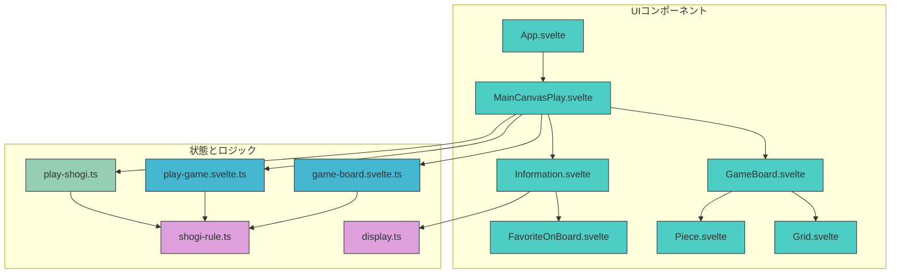

# プロジェクト概要

<cite>
**このドキュメントで参照されるファイル**   
- [App.svelte](file://src/App.svelte#L1-L31)
- [MainCanvasPlay.svelte](file://src/ui/main-canvas/MainCanvasPlay.svelte#L1-L319)
- [GameBoard.svelte](file://src/ui/main-canvas/game-board/GameBoard.svelte#L1-L213)
- [Grid.svelte](file://src/ui/main-canvas/game-board/Grid.svelte#L1-L159)
- [Piece.svelte](file://src/ui/main-canvas/game-board/Piece.svelte#L1-L108)
- [Information.svelte](file://src/ui/main-canvas/information/Information.svelte#L1-L27)
- [FavoriteOnBoard.svelte](file://src/ui/main-canvas/information/FavoriteOnBoard.svelte#L1-L82)
- [main.ts](file://src/main.ts#L1-L10)
- [shogi.d.ts](file://src/types/shogi.d.ts)
- [play-game.svelte.ts](file://src/store/play-game.svelte.ts)
- [game-board.svelte.ts](file://src/store/game-board.svelte.ts)
- [play-shogi.ts](file://src/handler/play-shogi.ts)
- [shogi-rule.ts](file://src/domain/shogi-rule.ts)
- [display.ts](file://src/domain/display.ts)
- [package.json](file://package.json) - *Supabaseの依存関係追加*
- [supabase/config.toml](file://supabase/config.toml) - *Supabaseの構成ファイル追加*
</cite>

## 更新概要
**変更内容**   
- Supabaseのローカル開発環境対応に伴い、`package.json`と`supabase/config.toml`の追加を反映
- プロジェクト構造セクションにバックエンド統合の記述を追加
- 関連ファイルの参照リストを更新

## 目次
1. [プロジェクト概要](#プロジェクト概要)
2. [プロジェクト構造](#プロジェクト構造)
3. [コアコンポーネント](#コアコンポーネント)
4. [アーキテクチャ概要](#アーキテクチャ概要)
5. [詳細なコンポーネント分析](#詳細なコンポーネント分析)
6. [状態管理とリアクティブプログラミング](#状態管理とリアクティブプログラミング)
7. [ゲームロジックとルール適用](#ゲームロジックとルール適用)
8. [ユーザーインタラクションとイベントフロー](#ユーザーインタラクションとイベントフロー)
9. [ビジュアルデザインとUIコンポーネント](#ビジュアルデザインとUIコンポーネント)
10. [結論](#結論)

## プロジェクト構造

SvelteShogiプロジェクトは、Svelte 5、TypeScript、Viteを使用して構築されたWebベースのインタラクティブな将棋ゲームです。プロジェクトは、ドメインロジック、UIコンポーネント、状態管理、イベント処理の関心事を分離する、クリーンでモジュール化された構造を採用しています。

ディレクトリ構造は以下の通りです：
- `src/domain`: 将棋の記法（SFEN）や表示フォーマットに関する、コアゲームロジック、ルール検証、ユーティリティ関数を含む
- `src/handler`: ゲームプレイメカニクスや棋譜（きふ）ナビゲーションのイベントハンドラーを実装
- `src/store`: ボード構成や手の有効性など、リアクティブなゲーム状態を管理するSvelteストアを格納
- `src/types`: 将棋ドメインモデルのTypeScriptインターフェースと型を定義
- `src/ui`: メインキャンバス、棋譜履歴、ゲームボード、情報オーバーレイなど、機能領域別に整理されたSvelteコンポーネントを含む
- ルートレベルのファイルには、Vite、Svelte、TypeScript、パッケージ管理の構成が含まれる

この分離により、保守性、テスト性、スケーラビリティが確保され、Svelteのリアクティビティシステムを効果的に活用できます。

**図の出典**
- [App.svelte](file://src/App.svelte#L1-L31)
- [MainCanvasPlay.svelte](file://src/ui/main-canvas/MainCanvasPlay.svelte#L1-L319)
- [GameBoard.svelte](file://src/ui/main-canvas/game-board/GameBoard.svelte#L1-L213)
- [Grid.svelte](file://src/ui/main-canvas/game-board/Grid.svelte#L1-L159)
- [Piece.svelte](file://src/ui/main-canvas/game-board/Piece.svelte#L1-L108)
- [Information.svelte](file://src/ui/main-canvas/information/Information.svelte#L1-L27)
- [FavoriteOnBoard.svelte](file://src/ui/main-canvas/information/FavoriteOnBoard.svelte#L1-L82)
- [game-board.svelte.ts](file://src/store/game-board.svelte.ts)
- [play-game.svelte.ts](file://src/store/play-game.svelte.ts)
- [play-shogi.ts](file://src/handler/play-shogi.ts)
- [shogi-rule.ts](file://src/domain/shogi-rule.ts)
- [display.ts](file://src/domain/display.ts)

**このセクションの出典**
- [App.svelte](file://src/App.svelte#L1-L31)
- [MainCanvasPlay.svelte](file://src/ui/main-canvas/MainCanvasPlay.svelte#L1-L319)
- [package.json](file://package.json) - *Supabaseの依存関係追加*
- [supabase/config.toml](file://supabase/config.toml) - *Supabaseの構成ファイル追加*