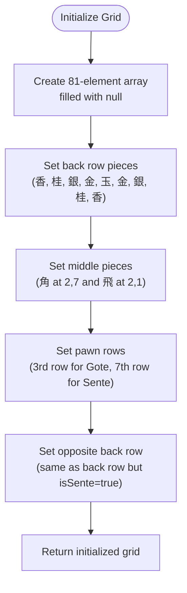
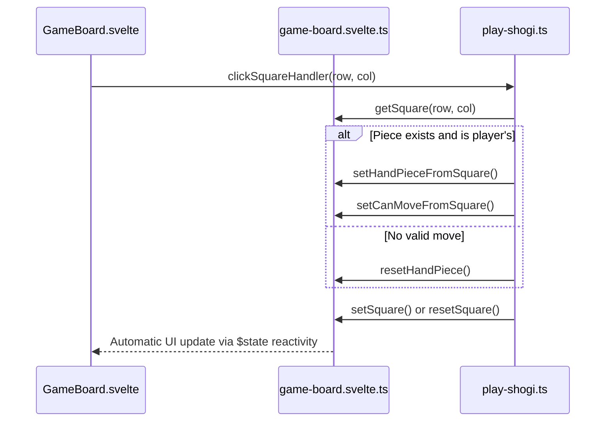
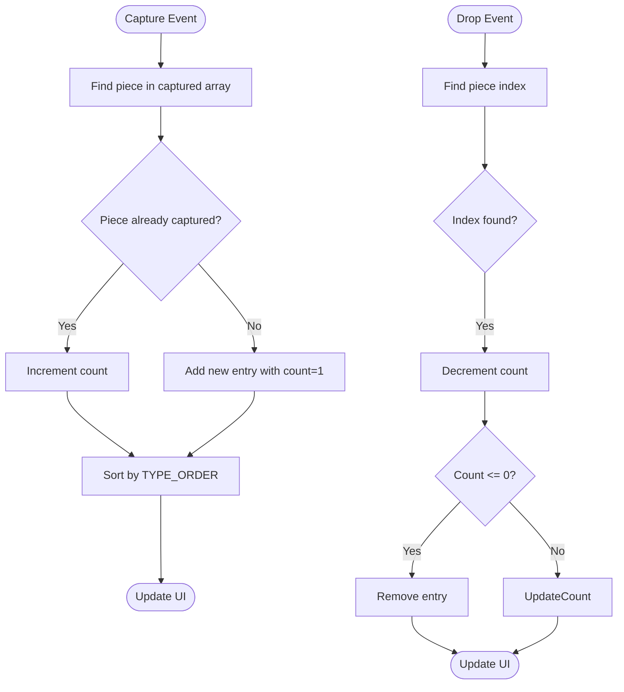
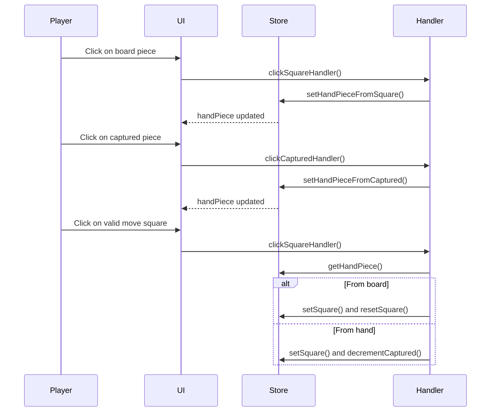
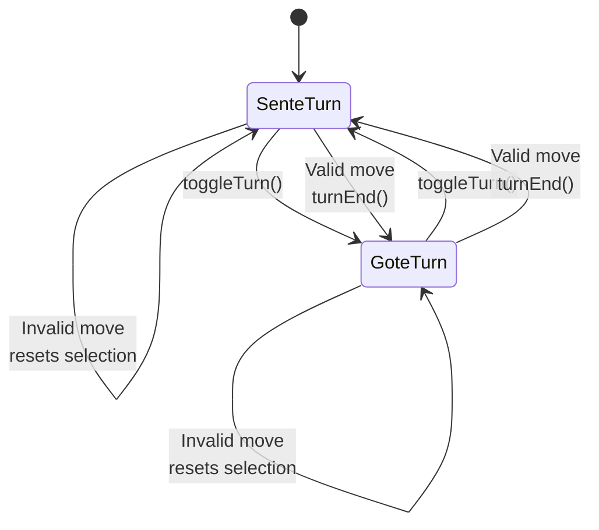
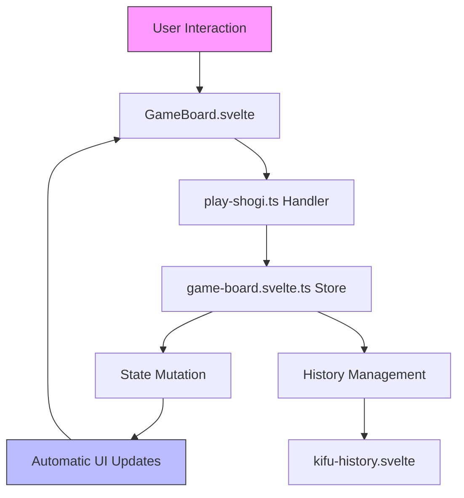
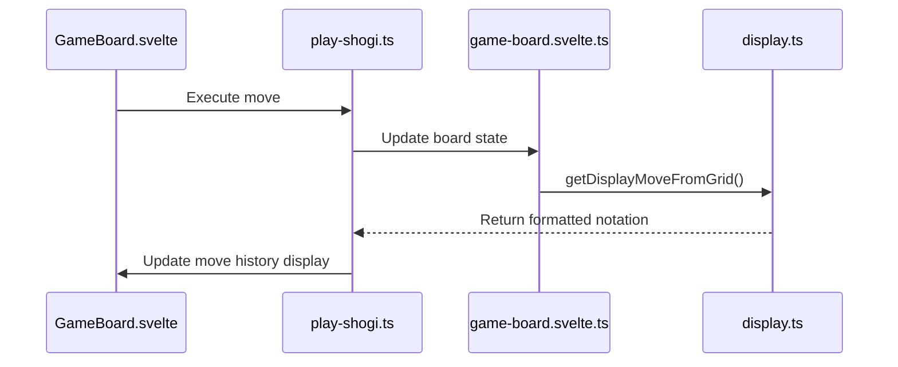

# Game Board Store

<cite>
**Referenced Files in This Document**   
- [game-board.svelte.ts](file://src/store/game-board.svelte.ts) - *Updated in recent commit*
- [display.ts](file://src/domain/display.ts) - *Added in recent commit*
- [display.test.ts](file://src/test/domain/display.test.ts) - *Added in recent commit*
- [play-shogi.ts](file://src/handler/play-shogi.ts)
- [GameBoard.svelte](file://src/ui/main-canvas/game-board/GameBoard.svelte)
</cite>

## Update Summary
**Changes Made**   
- Added new section on display notation integration
- Updated references to include newly added display-related files
- Enhanced documentation to reflect test coverage for move notation logic
- Added sources for new test and domain files related to display functionality

## Table of Contents
1. [Introduction](#introduction)
2. [Core State Management with $state](#core-state-management-with-state)
3. [Grid Initialization and Board Setup](#grid-initialization-and-board-setup)
4. [Square Access and Mutation Functions](#square-access-and-mutation-functions)
5. [Captured Pieces Management System](#captured-pieces-management-system)
6. [Hand Piece Selection Mechanism](#hand-piece-selection-mechanism)
7. [Turn State Management](#turn-state-management)
8. [Integration with Game Logic and UI Components](#integration-with-game-logic-and-ui-components)
9. [Performance and Reactivity Considerations](#performance-and-reactivity-considerations)
10. [Common Issues and Error Prevention](#common-issues-and-error-prevention)
11. [Display Notation Integration](#display-notation-integration)

## Introduction
The `game-board.svelte.ts` store is the central state management module for the SvelteShogi application, responsible for maintaining the complete game board state including piece positions, captured pieces, and turn information. This document provides a comprehensive analysis of its architecture and functionality, focusing on how it leverages Svelte 5's `$state` for reactivity, manages the 9x9 Shogi board, and integrates with the game's UI and business logic components.

**Section sources**
- [game-board.svelte.ts](file://src/store/game-board.svelte.ts#L1-L166)

## Core State Management with $state
The game-board store utilizes Svelte 5's `$state` primitive to create reactive state variables that automatically trigger UI updates when modified. This approach provides fine-grained reactivity without requiring manual subscription management.

The store maintains three primary state variables:
- `grid`: A reactive array representing the 9x9 game board
- `capturedSente` and `capturedGote`: Reactive arrays tracking pieces captured by each player
- `handPiece`: A reactive reference to the currently selected piece
- `isSenteTurn`: A boolean reactive variable indicating the current turn

```typescript
let grid: (Square | null)[] = $state(initGrid());
let capturedSente: { piece: PieceType; num: number }[] = $state([]);
let capturedGote: { piece: PieceType; num: number }[] = $state([]);
let handPiece: HandPieceFrom | null = $state(null);
let isSenteTurn = $state(true);
```

This implementation ensures that any component consuming these values will automatically re-render when the state changes, providing efficient and predictable reactivity.

**Section sources**
- [game-board.svelte.ts](file://src/store/game-board.svelte.ts#L35-L36)
- [game-board.svelte.ts](file://src/store/game-board.svelte.ts#L74-L75)
- [game-board.svelte.ts](file://src/store/game-board.svelte.ts#L136-L137)
- [game-board.svelte.ts](file://src/store/game-board.svelte.ts#L152-L153)

## Grid Initialization and Board Setup
The store initializes the game board to the standard Shogi starting position using the `initGrid()` function, which creates a 9x9 array (81 elements) indexed by row and column.



**Diagram sources**
- [game-board.svelte.ts](file://src/store/game-board.svelte.ts#L2-L33)

The initialization process follows the standard Shogi setup:
- Back row (row 0): 香-桂-銀-金-玉-金-銀-桂-香 (Gote)
- Row 1: 飛 at column 1, 角 at column 7 (Gote)
- Row 2: 9 pawns (歩) across all columns (Gote)
- Row 6: 9 pawns (歩) across all columns (Sente)
- Row 7: 飛 at column 1, 角 at column 7 (Sente)
- Back row (row 8): 香-桂-銀-金-玉-金-銀-桂-香 (Sente)

Each square is represented as an object with `piece` (PieceType) and `isSente` (boolean) properties, or null for empty squares.

**Section sources**
- [game-board.svelte.ts](file://src/store/game-board.svelte.ts#L2-L33)

## Square Access and Mutation Functions
The store provides a comprehensive API for accessing and modifying the game board state, ensuring consistent and type-safe interactions with the grid.

### Access Functions
```typescript
export function getSquare(row: number, col: number): Square | null {
  return grid[row * 9 + col];
}

export function getGrid(): (Square | null)[] {
  return grid;
}
```

### Mutation Functions
```typescript
export function setSquare(
  row: number,
  col: number,
  piece: PieceType,
  isSente: boolean
) {
  grid[row * 9 + col] = { piece, isSente };
}

export function resetSquare(row: number, col: number) {
  grid[row * 9 + col] = null;
}

export function setGrid(newGrid: (Square | null)[]) {
  grid = newGrid;
}
```

These functions use the formula `row * 9 + col` to convert 2D coordinates to a 1D array index, enabling efficient access to any board position. The mutation functions integrate directly with Svelte's reactivity system through `$state`, ensuring that UI components automatically update when the board state changes.



**Diagram sources**
- [game-board.svelte.ts](file://src/store/game-board.svelte.ts#L37-L58)
- [play-shogi.ts](file://src/handler/play-shogi.ts#L128-L173)
- [GameBoard.svelte](file://src/ui/main-canvas/game-board/GameBoard.svelte#L1-L212)

**Section sources**
- [game-board.svelte.ts](file://src/store/game-board.svelte.ts#L37-L64)

## Captured Pieces Management System
The store maintains separate arrays for pieces captured by each player (`capturedSente` and `capturedGote`), with a sophisticated sorting and tracking system.

### Sorting Mechanism
The `TYPE_ORDER` constant defines the display order for captured pieces:

```typescript
const TYPE_ORDER: Record<PieceType, number> = {
  歩: 1,
  香: 2,
  桂: 3,
  銀: 4,
  金: 5,
  角: 6,
  飛: 7,
  玉: 8,
  と: 9,
  杏: 10,
  圭: 11,
  全: 12,
  馬: 13,
  竜: 14,
};
```

### Increment/Decrement Logic
When a piece is captured, the `incrementCaptured` function updates the appropriate player's captured pieces array:

```typescript
export function incrementCaptured(piece: PieceType, isSente: boolean) {
  const found = isSente 
    ? capturedSente.find((p) => p.piece === piece)
    : capturedGote.find((p) => p.piece === piece);
  if (found) {
    found.num += 1;
  } else {
    (isSente ? capturedSente : capturedGote).push({ piece, num: 1 });
  }
  (isSente ? capturedSente : capturedGote).sort(
    (a, b) => TYPE_ORDER[a.piece] - TYPE_ORDER[b.piece]
  );
}
```

When a captured piece is dropped onto the board, `decrementCaptured` reduces the count:

```typescript
export function decrementCaptured(piece: PieceType, isSente: boolean) {
  const index = isSente
    ? capturedSente.findIndex((p) => p.piece === piece)
    : capturedGote.findIndex((p) => p.piece === piece);
  if (index !== -1) {
    (isSente ? capturedSente : capturedGote)[index].num -= 1;
    if ((isSente ? capturedSente : capturedGote)[index].num <= 0) {
      (isSente ? capturedSente : capturedGote).splice(index, 1);
    }
  }
}
```

This implementation ensures that captured pieces are always displayed in the correct order and that empty entries are automatically removed.



**Diagram sources**
- [game-board.svelte.ts](file://src/store/game-board.svelte.ts#L66-L103)
- [game-board.svelte.ts](file://src/store/game-board.svelte.ts#L105-L127)

**Section sources**
- [game-board.svelte.ts](file://src/store/game-board.svelte.ts#L66-L127)

## Hand Piece Selection Mechanism
The store implements a sophisticated hand piece selection system that tracks whether a piece is selected from the board or from captured pieces.

### Selection Functions
```typescript
export function setHandPieceFromSquare(
  piece: PieceType,
  isSente: boolean,
  position: { row: number; col: number } | null
) {
  handPiece = { piece, isSente, position };
}

export function setHandPieceFromCaptured(piece: PieceType, isSente: boolean) {
  handPiece = { piece, isSente, position: null };
}

export function resetHandPiece() {
  handPiece = null;
}
```

### UI Integration Example
When a player selects a piece from the board:
```typescript
// In play-shogi.ts
if (square && square.isSente === isSenteTurn) {
  setHandPieceFromSquare(square.piece, square.isSente, { row, col });
  setCanMoveFromSquare(row, col);
}
```

When a player selects a captured piece to drop:
```typescript
// In play-shogi.ts
setHandPieceFromCaptured(piece, isSente);
setCanMoveFromCaptured(piece, isSente);
```

The `position` property in `HandPieceFrom` distinguishes between board pieces (with position) and captured pieces (with null position), enabling different behavior in the game logic.



**Diagram sources**
- [game-board.svelte.ts](file://src/store/game-board.svelte.ts#L129-L145)
- [play-shogi.ts](file://src/handler/play-shogi.ts#L128-L173)
- [play-shogi.ts](file://src/handler/play-shogi.ts#L175-L229)

**Section sources**
- [game-board.svelte.ts](file://src/store/game-board.svelte.ts#L129-L145)
- [play-shogi.ts](file://src/handler/play-shogi.ts#L128-L229)

## Turn State Management
The store manages turn state with a simple but effective reactive variable and associated functions:

```typescript
let isSenteTurn = $state(true);

export function getIsSenteTurn(): boolean {
  return isSenteTurn;
}

export function toggleTurn() {
  isSenteTurn = !isSenteTurn;
}

export function setIsSenteTurn(isSente: boolean) {
  isSenteTurn = isSente;
}
```

The turn state is integrated into the game flow through the `turnEnd` function in `play-shogi.ts`:

```typescript
function turnEnd(display: string, move: string) {
  toggleTurn();
  resetCanMoveAll();
  resetPromotionPos();
  resetHandPiece();
  // ... history management
}
```

This ensures that after each valid move, the turn automatically switches to the opponent, and all temporary state (possible moves, promotion prompts, selected pieces) is cleared.



**Diagram sources**
- [game-board.svelte.ts](file://src/store/game-board.svelte.ts#L152-L165)
- [play-shogi.ts](file://src/handler/play-shogi.ts#L77-L126)

**Section sources**
- [game-board.svelte.ts](file://src/store/game-board.svelte.ts#L152-L165)
- [play-shogi.ts](file://src/handler/play-shogi.ts#L77-L126)

## Integration with Game Logic and UI Components
The game-board store serves as the central state hub, integrating with both game logic handlers and UI components.

### Integration with play-shogi Handler
The `play-shogi.ts` handler imports and uses store functions extensively:

```typescript
import {
  getSquare,
  setSquare,
  resetSquare,
  getGrid,
  incrementCaptured,
  decrementCaptured,
  getHandPiece,
  setHandPieceFromSquare,
  setHandPieceFromCaptured,
  resetHandPiece,
  getIsSenteTurn,
  toggleTurn,
  getCaptured,
} from "@/store/game-board.svelte";
```

The handler coordinates the complete move sequence:
1. Process user input via `clickSquareHandler` or `clickCapturedHandler`
2. Validate moves and update possible move indicators
3. Execute moves by calling store mutation functions
4. Update turn state and history

### Integration with GameBoard.svelte Component
The `GameBoard.svelte` component consumes store state reactively:

```typescript
<script lang="ts">
  import { getSquare, getCaptured, getHandPiece } from '@/store/game-board.svelte';
  
  let handPiece = $derived(getHandPiece());
</script>

{#each {length: 9}, row}
  {#each {length: 9}, col}
    {@const square = getSquare(row, col)}
    {#if square}
      <Piece character={square.piece} />
    {/if}
  {/each}
{/each}
```

The component uses Svelte's `$derived` to create a reactive reference to the current hand piece, ensuring automatic updates when the selection changes.



**Diagram sources**
- [play-shogi.ts](file://src/handler/play-shogi.ts#L1-L48)
- [GameBoard.svelte](file://src/ui/main-canvas/game-board/GameBoard.svelte#L1-L212)
- [game-board.svelte.ts](file://src/store/game-board.svelte.ts#L1-L166)

**Section sources**
- [play-shogi.ts](file://src/handler/play-shogi.ts#L1-L269)
- [GameBoard.svelte](file://src/ui/main-canvas/game-board/GameBoard.svelte#L1-L212)

## Performance and Reactivity Considerations
The store implementation demonstrates several performance-conscious design decisions:

### Efficient Reactivity with $state
By using Svelte 5's `$state`, the store achieves fine-grained reactivity without the overhead of proxies or change detection cycles. When a state variable is modified, only the components that depend on that specific state are updated.

### Array Immutability Patterns
While the grid array is mutable, the store follows patterns that minimize unnecessary re-renders:
- Direct array element assignment (`grid[index] = value`) triggers reactivity
- Array methods like `push()` and `splice()` on captured pieces arrays are used judiciously
- The `sort()` operation on captured pieces is performed immediately after modification to maintain consistent state

### Memory Efficiency
The 9x9 grid is stored as a flat array of 81 elements, which is more memory-efficient than a 2D array structure. The indexing formula `row * 9 + col` provides O(1) access to any board position.

### Optimization Opportunities
Potential improvements include:
- Implementing batch updates for multiple piece movements
- Adding memoization for frequently computed values
- Using object pooling for temporary state objects

The current implementation strikes a good balance between simplicity and performance for a Shogi game.

**Section sources**
- [game-board.svelte.ts](file://src/store/game-board.svelte.ts#L1-L166)

## Common Issues and Error Prevention
The store design prevents several common issues in game state management:

### Stale Reference Prevention
By using `$state` for all reactive variables, the store ensures that components always have access to the current state, eliminating stale reference problems that can occur with manual state management.

### Incorrect Piece Placement
The `setSquare` and `resetSquare` functions provide a single, controlled way to modify the board state, preventing invalid placements. The integration with `play-shogi.ts` ensures that moves are validated before being applied.

### Turn Management Errors
The `toggleTurn` function in `turnEnd` ensures that turns are always switched after a valid move, preventing situations where a player could make multiple consecutive moves.

### Captured Pieces Integrity
The `incrementCaptured` and `decrementCaptured` functions maintain data integrity by:
- Automatically sorting pieces after modification
- Removing entries when count reaches zero
- Preventing negative counts through validation

These safeguards ensure that the game state remains consistent throughout gameplay.

**Section sources**
- [game-board.svelte.ts](file://src/store/game-board.svelte.ts#L1-L166)
- [play-shogi.ts](file://src/handler/play-shogi.ts#L77-L126)

## Display Notation Integration
The game-board store integrates with the display system through the `display.ts` domain module, which generates proper Shogi notation for moves. This integration ensures that move history displays follow standard Shogi notation conventions.

### Move Notation Logic
The `getDisplayMoveFromGrid` function in `display.ts` analyzes the board state to determine the appropriate notation:

```typescript
export function getDisplayMoveFromGrid(
  grid: (Square | null)[],
  from: { row: number; col: number },
  to: { row: number; col: number },
  lastPos: { row: number; col: number } | null
): string {
  const fromSquare = grid[from.row * 9 + from.col];
  // ... notation logic
}
```

### Notation Rules Implementation
The system implements standard Shogi notation rules:
- Uses kanji numbers (一, 二, 三) for row notation
- Uses zenkaku numbers (１, ２, ３) for column notation
- Adds directional indicators (上, 寄, 引, 左, 右, 直) when multiple pieces of the same type can reach the destination
- Handles special cases for promoted pieces and disambiguation

### Test Coverage
The display functionality is thoroughly tested in `display.test.ts`, covering various scenarios:
- Multiple pieces of same type moving to same square
- Directional disambiguation (上, 寄, 引)
- Horizontal disambiguation (左, 右, 直)
- Special cases for sliding pieces (飛, 角, 竜, 馬)



**Diagram sources**
- [display.ts](file://src/domain/display.ts#L76-L154)
- [display.test.ts](file://src/test/domain/display.test.ts#L0-L1091)

**Section sources**
- [display.ts](file://src/domain/display.ts#L1-L154)
- [display.test.ts](file://src/test/domain/display.test.ts#L0-L1139)
- [play-shogi.ts](file://src/handler/play-shogi.ts#L1-L48)