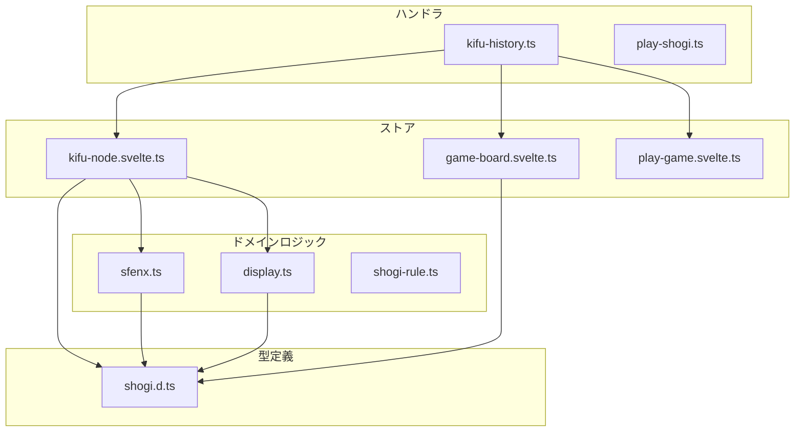
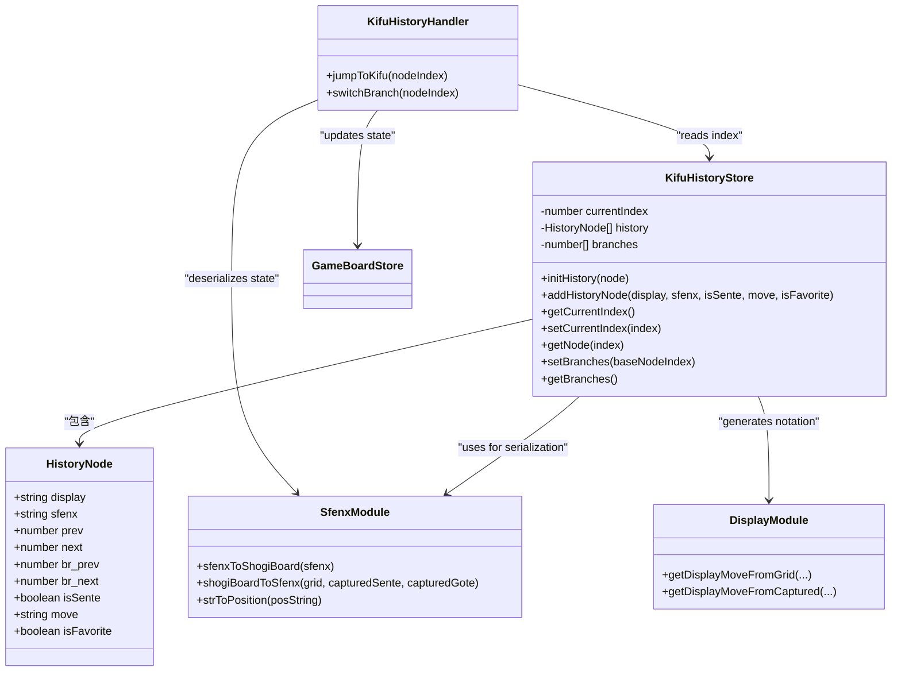
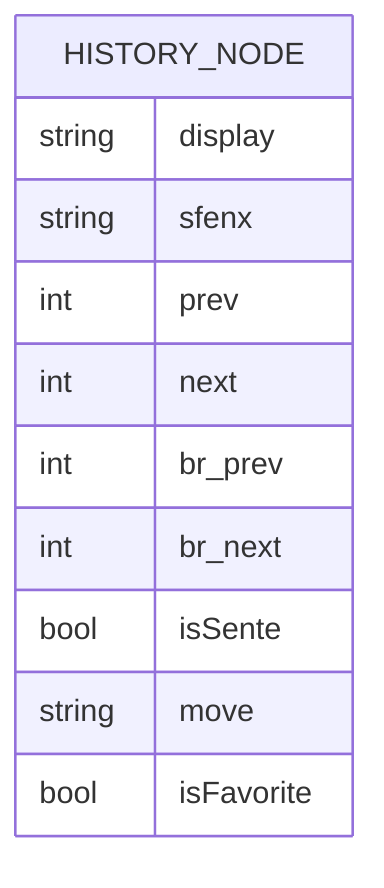
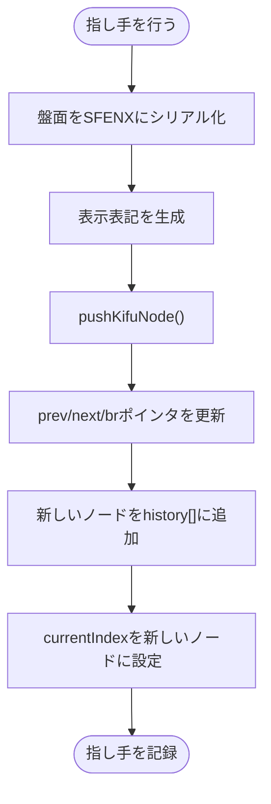
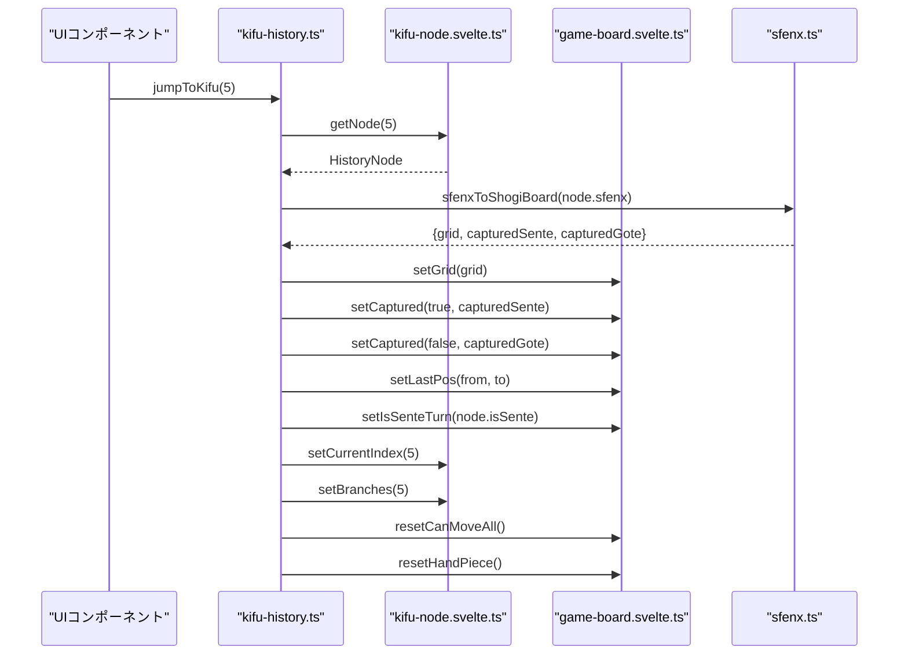
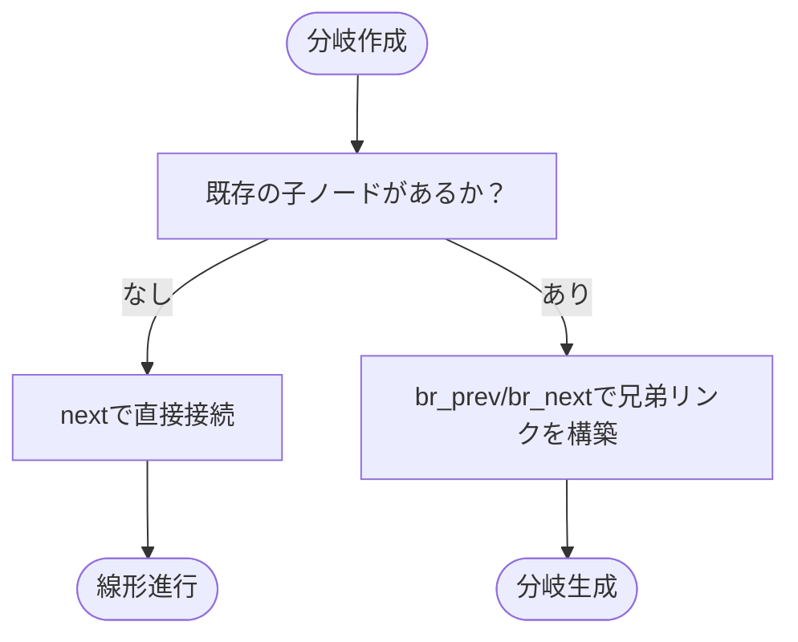
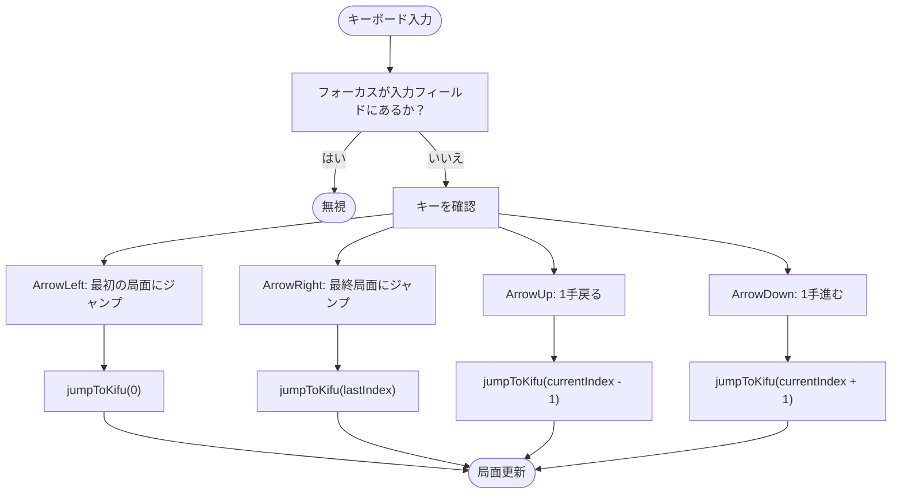
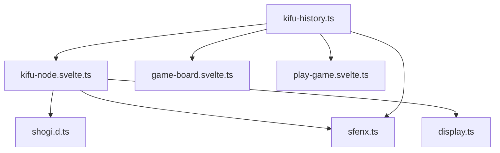

# 棋譜履歴ストア

<cite>
**このドキュメントで参照されるファイル**   
- [kifu-node.svelte.ts](file://src/store/kifu-node.svelte.ts#L1-L82)
- [shogi.d.ts](file://src/types/shogi.d.ts#L64-L74)
- [kifu-history.ts](file://src/handler/kifu-history.ts#L1-L49)
- [sfenx.ts](file://src/domain/sfenx.ts#L1-L240)
- [display.ts](file://src/domain/display.ts#L1-L155)
- [KifuHistory.svelte](file://src/ui/kifu-history/KifuHistory.svelte#L1-L227)
</cite>

## 更新概要

**更新内容**

- 分岐機能の実装に伴い、`setBranches` 関数と分岐構造の初期化ロジックを追加
- 分岐作成時のノードリンク構築ロジックを実装し、分岐の切り替えを可能にした
- `kifu-node.svelte.ts` と `kifu-history.ts` に分岐関連の関数を追加
- 分岐の可視化と切り替えに関するUI/UXの説明を追加

## 目次

1. [はじめに](#はじめに)
2. [プロジェクト構成](#プロジェクト構成)
3. [コアコンポーネント](#コアコンポーネント)
4. [アーキテクチャ概要](#アーキテクチャ概要)
5. [詳細なコンポーネント分析](#詳細なコンポーネント分析)
6. [依存関係分析](#依存関係分析)
7. [パフォーマンスに関する考慮事項](#パフォーマンスに関する考慮事項)
8. [トラブルシューティングガイド](#トラブルシューティングガイド)
9. [結論](#結論)

## はじめに

**SvelteShogi** の **棋譜履歴ストア** は、将棋ゲームの指し手履歴（棋譜）を管理し、ユーザーがゲームのタイムラインを前後に移動できるようにする役割を担っています。このストアは、各局面のSFEN形式のゲーム状態、人間が読みやすい指し手表記、ナビゲーションポインタ（prev/next）を保持する `HistoryNode` オブジェクトの配列として実装されています。本ドキュメントでは、ストアのアーキテクチャ、機能、他のコンポーネントとの統合、およびパフォーマンス特性について詳細に分析します。指し手の記録方法、ナビゲーションの仕組み、アプリケーション全体での状態の一貫性の維持方法について説明します。特に、最新の更新により実装された**分岐機能**についても詳しく解説します。

## プロジェクト構成

SvelteShogiプロジェクトは、ドメイン、ハンドラ、ストア、型定義によって整理されたモジュール構造を採用しています。棋譜履歴システムは複数のディレクトリにまたがっています：

- **`src/store/`**: `kifu-node.svelte.ts` や `game-board.svelte.ts` などのリアクティブな状態ストアを含む
- **`src/handler/`**: 棋譜タイムラインのナビゲーションや分岐切り替えなど、ビジネスロジックを実装
- **`src/domain/`**: SFENXシリアライゼーションや指し手表記の生成など、コアゲームロジックを実装
- **`src/types/`**: `HistoryNode` などのTypeScriptインターフェースを定義

この分離により、ストアは状態を管理し、ハンドラはアクションを調整し、ドメインモジュールはゲームルールとデータ変換をカプセル化するという明確な責務が保たれます。



**図の出典**

- [kifu-node.svelte.ts](file://src/store/kifu-node.svelte.ts#L1-L82)
- [kifu-history.ts](file://src/handler/kifu-history.ts#L1-L49)
- [sfenx.ts](file://src/domain/sfenx.ts#L1-L240)
- [display.ts](file://src/domain/display.ts#L1-L155)
- [shogi.d.ts](file://src/types/shogi.d.ts#L64-L74)

**このセクションの出典**

- [kifu-node.svelte.ts](file://src/store/kifu-node.svelte.ts#L1-L82)
- [project_structure](file://#L1-L20)

## コアコンポーネント

棋譜履歴システムは以下の3つの主要コンポーネントを中心に構成されています：

1. **`HistoryNode`**: 特定の指し手におけるゲームのスナップショットを表す
2. **`kifu-node.svelte.ts`**: 履歴配列と現在位置、分岐構造を管理
3. **`jumpToKifu()` / `switchBranch()`**: 履歴ノードから盤面状態を復元または分岐を切り替えるハンドラ関数

これらのコンポーネントは協調して、非線形ナビゲーションを可能にし、将来の分岐（例：変化）をサポートし、一貫したユーザー体験を維持します。

**このセクションの出典**

- [kifu-node.svelte.ts](file://src/store/kifu-node.svelte.ts#L1-L82)
- [shogi.d.ts](file://src/types/shogi.d.ts#L64-L74)
- [kifu-history.ts](file://src/handler/kifu-history.ts#L1-L49)

## アーキテクチャ概要

棋譜履歴システムは、ゲームタイムラインを表現するために配列とリンク構造を組み合わせたハイブリッド構造を使用しています。各 `HistoryNode` は、線形ナビゲーションのための前後ポインタ（`prev`, `next`）と、将来の分岐サポートのための兄弟ポインタ（`br_prev`, `br_next`）を含んでいます。ストアはタイムライン内の現在位置を追跡するために `currentIndex` を維持しています。

指し手が行われると、以下の情報を含む新しいノードが追加されます：

- シリアライズされた盤面状態（`sfenx`）
- 人間が読みやすい指し手表記（`display`）
- ナビゲーションメタデータ

ナビゲーションは、`currentIndex` を更新し、`jumpToKifu` ハンドラを通じてゲーム盤を同期することで処理されます。また、分岐の存在を検出するための `branches` 配列が導入され、`setBranches` 関数によって現在ノードから到達可能な分岐ノードが管理されます。



**図の出典**

- [kifu-node.svelte.ts](file://src/store/kifu-node.svelte.ts#L1-L82)
- [shogi.d.ts](file://src/types/shogi.d.ts#L64-L74)
- [kifu-history.ts](file://src/handler/kifu-history.ts#L1-L49)
- [sfenx.ts](file://src/domain/sfenx.ts#L1-L240)
- [display.ts](file://src/domain/display.ts#L1-L155)

## 詳細なコンポーネント分析

### HistoryNode データ構造

`HistoryNode` インターフェースは、タイムライン内の各指し手の構造を定義しています。技術的データとユーザー向けデータの両方を含みます：

**:display**  
日本式将棋表記による人間が読みやすい指し手（例：「☗７六歩」）。`display.ts` によって生成されます。

**:sfenx**  
盤面、持ち駒、手番を含む完全なゲーム状態を符号化したコンパクトで決定論的な文字列。逆シリアル化に使用されます。

**:prev / :next**  
親ノードと子ノードを指すインデックス。線形または木構造の履歴を形成します。

**:br_prev / :br_next**  
潜在的な指し手の変化（分岐サポート）のための兄弟ポインタ。分岐の循環構造を表現します。

**:isSente**  
指し手を行ったプレイヤー（先手/後手）を示します。

**:move**  
指し手の代数表記（例：「7g7f」）。盤面上での直前の指し手の強調表示に使用されます。

**:isFavorite**  
ユーザーがマークしたお気に入りの指し手のフラグ。



**図の出典**

- [shogi.d.ts](file://src/types/shogi.d.ts#L64-L74)

**このセクションの出典**

- [shogi.d.ts](file://src/types/shogi.d.ts#L64-L74)

### 棋譜履歴ストアの実装

ストアはSvelteの `$state` をリアクティビティのために使用し、以下の状態を維持しています：

- `history`: `HistoryNode` オブジェクトの配列
- `currentIndex`: タイムライン内の現在位置
- `branches`: 現在のノードから到達可能な分岐ノードのインデックス配列

主な関数：

- **`initHistory(node)`**: 開始局面でタイムラインを初期化
- **`pushKifuNode()`**: 新しい指し手を履歴に追加
- **`setBranches()`**: 現在ノードからの分岐構造を再構築
- **`getBranches()`**: 現在の分岐ノードリストを取得

#### 新しい指し手の追加

プレイヤーが指し手を行うと：

1. 現在の盤面状態が `shogiBoardToSfenx()` を使用してSFENXにシリアル化されます。
2. `getDisplayMoveFromGrid()` または `getDisplayMoveFromCaptured()` を通じて人間が読みやすい表記が生成されます。
3. `pushKifuNode()` は新しい `HistoryNode` を作成し、リンクを更新し、`currentIndex` を進めます。
4. 既存の子ノードがある場合、そのノードとの兄弟リンク（`br_prev`, `br_next`）が構築されます。

例：

```ts
pushKifuNode(
  "☗７六歩",
  "lnsgkgsnl/1r5b1/ppppppppp/9/9/9/PPPPPPPPP/1B5R1/LNSGKGSNL w -aeg -aeg",
  true,
  "7g7f"
);
```

これにより、後でゲーム状態を完全に復元できるようになります。



**図の出典**

- [kifu-node.svelte.ts](file://src/store/kifu-node.svelte.ts#L30-L82)
- [sfenx.ts](file://src/domain/sfenx.ts#L200-L240)
- [display.ts](file://src/domain/display.ts#L100-L155)

**このセクションの出典**

- [kifu-node.svelte.ts](file://src/store/kifu-node.svelte.ts#L30-L82)

### ナビゲーションシステム

ユーザーはキーボードの矢印キーまたはUIコントロールを使用してタイムラインをナビゲートできます。`jumpToKifu(nodeIndex)` ハンドラは以下の処理を行います：

1. ターゲットの `HistoryNode` を取得
2. `sfenx` を逆シリアル化して盤面と持ち駒を復元
3. `game-board` ストアを更新
4. 直前の指し手を強調表示（該当する場合）
5. 手番を更新し、一時的なUI状態をリセット
6. `setBranches(nodeIndex)` を呼び出して分岐構造を更新

例：

```ts
jumpToKifu(5); // 6手目（0インデックス）にゲームを復元
```

これにより、指し手を再計算することなくシームレスな状態復元が保証されます。



**図の出典**

- [kifu-history.ts](file://src/handler/kifu-history.ts#L1-L49)
- [kifu-node.svelte.ts](file://src/store/kifu-node.svelte.ts#L20-L25)
- [sfenx.ts](file://src/domain/sfenx.ts#L150-L200)

**このセクションの出典**

- [kifu-history.ts](file://src/handler/kifu-history.ts#L1-L49)

#### 分岐の管理と切り替え

**新機能：分岐の作成と切り替え**
`kifu-node.svelte.ts` では、`pushKifuNode` 関数が既存の子ノードがある場合に、新しいノードと既存ノードの間に兄弟リンクを構築するようになりました。これにより、分岐（変化）が可能になります。

`setBranches(baseNodeIndex)` 関数は、指定されたノードを起点として、`br_next` ポインタをたどって循環する分岐ノードのリストを構築します。このリストはUIで分岐の存在を可視化するために使用されます。

`switchBranch(nodeIndex)` ハンドラは、分岐ノードに移動する際に呼び出され、親ノードの `next` ポインタを更新して、その分岐を「現在の進行中」の経路に設定します。



**図の出典**

- [kifu-node.svelte.ts](file://src/store/kifu-node.svelte.ts#L40-L55)
- [kifu-history.ts](file://src/handler/kifu-history.ts#L45-L49)

#### グローバルキーナビゲーション

**変更点：左右矢印キーによる初期・最終局面へのジャンプ**
`KifuHistory.svelte` では、グローバルキーハンドラが実装され、UI外からのキーボード操作でも履歴ナビゲーションが可能になりました。特に、左右矢印キーはそれぞれ初期局面と最終局面に瞬時ジャンプする機能を追加しています。

- **`ArrowLeft`**: 最初のノード（`ids[0]`）にジャンプ
- **`ArrowRight`**: 最後のノード（`ids[ids.length - 1]`）にジャンプ
- **`ArrowUp` / `ArrowDown`**: 1手前の局面または1手先の局面に移動

このグローバルハンドラは、入力フィールドにフォーカスがない場合にのみ有効となり、ユーザー体験を損なわないように設計されています。



**図の出典**

- [KifuHistory.svelte](file://src/ui/kifu-history/KifuHistory.svelte#L1-L227) - _グローバルキーハンドラ実装_
- [kifu-node.svelte.ts](file://src/store/kifu-node.svelte.ts#L1-L82) - _currentIndexの参照_

**このセクションの出典**

- [KifuHistory.svelte](file://src/ui/kifu-history/KifuHistory.svelte#L1-L227)
- [kifu-node.svelte.ts](file://src/store/kifu-node.svelte.ts#L1-L82)

## 依存関係分析

棋譜履歴システムは、正常に機能するために複数のモジュールに依存しています：



- **`shogi.d.ts`**: `HistoryNode` インターフェースを定義
- **`sfenx.ts`**: 状態のシリアル化/逆シリアル化に不可欠
- **`display.ts`**: ユーザーフレンドリーな指し手表記を生成
- **`game-board.svelte.ts`**: 状態復元のターゲット
- **`play-game.svelte.ts`**: 一時的なUI状態（例：直前の指し手の強調）を管理

循環依存は存在せず、保守性が保たれています。

**図の出典**

- [kifu-node.svelte.ts](file://src/store/kifu-node.svelte.ts#L1-L82)
- [kifu-history.ts](file://src/handler/kifu-history.ts#L1-L49)

**このセクションの出典**

- [kifu-node.svelte.ts](file://src/store/kifu-node.svelte.ts#L1-L82)
- [kifu-history.ts](file://src/handler/kifu-history.ts#L1-L49)

## パフォーマンスに関する考慮事項

- **メモリ使用量**: 各 `HistoryNode` は完全なSFENX文字列（約100～150バイト）を格納します。100手のゲームでは約10～15KBとなり、無視できる程度です。
- **不変性**: ノードは作成後に変更されないため、破損を防ぎ、安全なナビゲーションを可能にします。
- **スケーラビリティ**: 極端に長いゲーム（1000手以上）の場合、履歴の刈り取り（例：10手ごとに1つだけ保持）を実装可能。
- **リアクティビティ**: Svelteの細粒度リアクティビティにより、`currentIndex` の変更時に影響を受けるコンポーネントのみが更新されます。

通常の使用条件下では、パフォーマンスのボトルネックは予想されません。

## トラブルシューティングガイド

一般的な問題とその解決策：

**:履歴の非同期化**  
症状：盤面状態が表示されている指し手と一致しない。  
原因：ストア外での手動状態変更。  
対処：ナビゲーションには常に `jumpToKifu()` を使用。

**:無効なSFENXエラー**  
症状：`sfenxToShogiBoard()` が失敗。  
原因：破損した履歴ノード。  
対処：履歴に追加する前にSFENXを検証。

**:範囲外ナビゲーション**  
症状：`getNode()` がインデックスエラーをスロー。  
原因：無効な `currentIndex`。  
対処：インデックスを `[0, history.length - 1]` の範囲内に制限。

**:表示表記の不正**  
症状：指し手が「☗打」のまま「☗７六歩」とならない。  
原因：`grid` または `lastPos` 入力の不正。  
対処：`getDisplayMoveFromGrid()` に正しいパラメータを確実に渡す。

**:分岐の表示が更新されない**  
症状：分岐を作成したが、UIに反映されない。  
原因：`jumpToKifu` 時に `setBranches` が呼び出されていない。  
対処：`jumpToKifu` 内で `setBranches` を呼び出すように修正。

**このセクションの出典**

- [kifu-node.svelte.ts](file://src/store/kifu-node.svelte.ts#L1-L82)
- [kifu-history.ts](file://src/handler/kifu-history.ts#L1-L49)
- [sfenx.ts](file://src/domain/sfenx.ts#L1-L240)
- [display.ts](file://src/domain/display.ts#L1-L155)

## 結論

棋譜履歴ストアは、将棋ゲームのタイムラインを管理するための堅牢でスケーラブルなソリューションです。不変な履歴ノード、効率的なSFENXシリアル化、シームレスなUI統合を組み合わせることで、信頼性の高いナビゲーションと状態復元を実現しています。その設計は、分岐変化や詳細な分析といった将来の拡張をサポートしています。今回の更新により、**分岐の作成と切り替え**という重要な機能が実装され、将棋の解析や学習における柔軟性が大幅に向上しました。ストア、ハンドラ、ドメインロジック間の責務分離により、保守性とテスト性が確保されています。最小限のメモリオーバーヘッドと優れたリアクティビティにより、長いゲームでもスムーズなユーザー体験を提供します。
