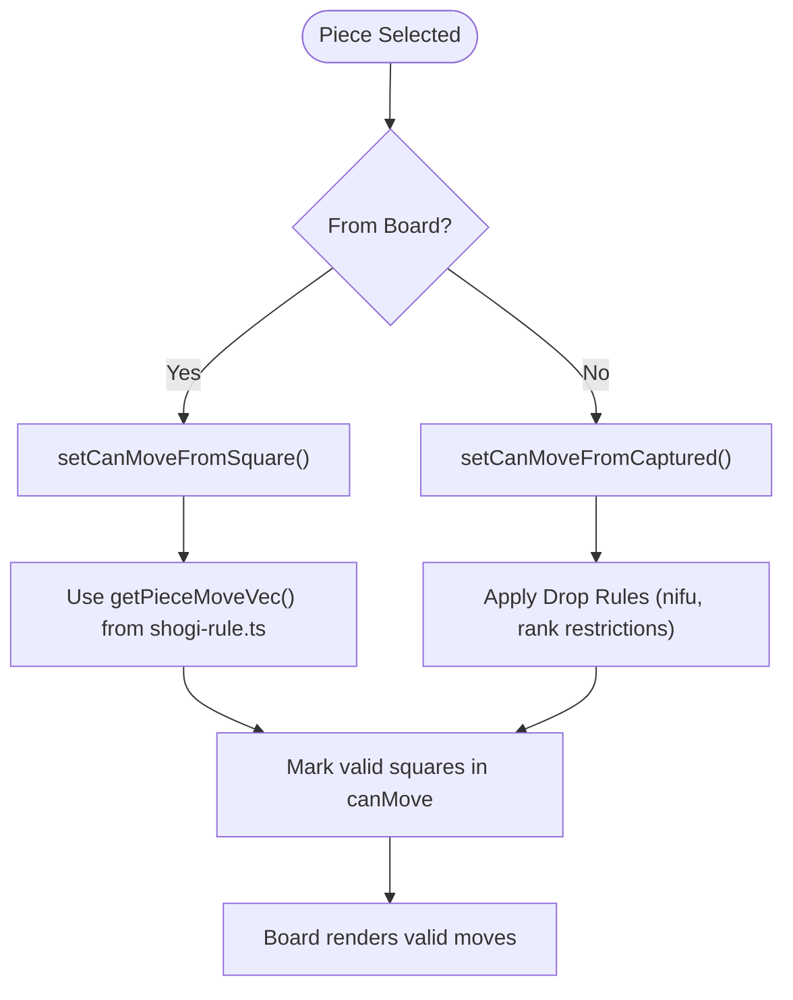
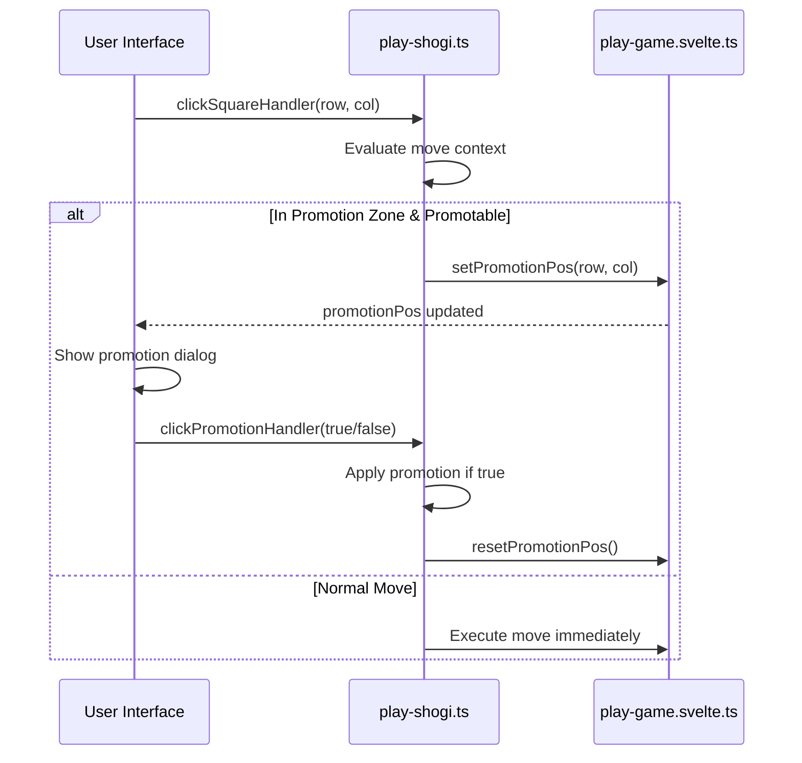
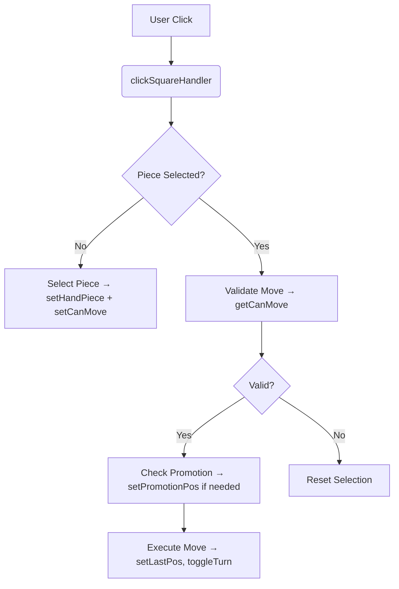

# Play Game Store

<cite>
**Referenced Files in This Document**   
- [play-game.svelte.ts](file://src/store/play-game.svelte.ts)
- [game-board.svelte.ts](file://src/store/game-board.svelte.ts)
- [shogi-rule.ts](file://src/domain/shogi-rule.ts)
- [play-shogi.ts](file://src/handler/play-shogi.ts)
</cite>

## Table of Contents
1. [Introduction](#introduction)
2. [Core State Management](#core-state-management)
3. [Valid Moves Calculation](#valid-moves-calculation)
4. [Promotion State Management](#promotion-state-management)
5. [Last Move Tracking](#last-move-tracking)
6. [Integration with Play Shogi Handler](#integration-with-play-shogi-handler)
7. [Reactivity and Consistency](#reactivity-and-consistency)
8. [Best Practices and Potential Issues](#best-practices-and-potential-issues)

## Introduction
The **Play Game Store** is a Svelte state management module responsible for handling gameplay-specific UI states in a Shogi (Japanese chess) application. It manages visual feedback such as valid move indicators, promotion prompts, and last move highlights. This store does not contain business logic but serves as a reactive interface layer between user interactions, the game board state, and domain rules. It leverages Svelte's `$state` for reactivity and works in coordination with other stores and handlers to ensure a seamless user experience during gameplay.

**Section sources**
- [play-game.svelte.ts](file://src/store/play-game.svelte.ts#L0-L48)

## Core State Management
The `play-game.svelte.ts` store maintains three primary reactive state variables using Svelte’s `$state`:

- **`canMove`**: A boolean array of length 81 (9x9 board) indicating which squares are valid targets for the currently selected piece.
- **`promotionPos`**: An optional object holding the row and column where a promotion decision is required.
- **`lastPos`**: An optional object storing the position of the most recently executed move for visual highlighting.

These states are encapsulated with getter and setter functions to maintain clean access patterns and ensure reactivity across components.

```mermaid
classDiagram
class PlayGameStore {
+Array<boolean> canMove
+{row : number, col : number} | null promotionPos
+{row : number, col : number} | null lastPos
+getCanMove(row, col) boolean
+setCanMoveSquare(row, col)
+resetCanMoveSquare(row, col)
+setCanMoveAll()
+resetCanMoveAll()
+getPromotionPos() {row, col} | null
+setPromotionPos(row, col)
+resetPromotionPos()
+getLastPos() {row, col} | null
+setLastPos(row, col)
+resetLastPos()
}
```

**Diagram sources**
- [play-game.svelte.ts](file://src/store/play-game.svelte.ts#L0-L48)

**Section sources**
- [play-game.svelte.ts](file://src/store/play-game.svelte.ts#L0-L48)

## Valid Moves Calculation
The `canMove` array is dynamically updated based on the current selection of a piece—either from the board or from captured pieces (hand). When a piece is selected:

1. The `resetCanMoveAll()` function clears all previous valid move indicators.
2. Depending on whether the selected piece is from the board or hand:
   - For board pieces: `setCanMoveFromSquare(row, col)` computes valid moves using movement vectors defined in `shogi-rule.ts`.
   - For captured pieces: `setCanMoveFromCaptured(piece, isSente)` determines valid drop positions with special constraints (e.g., no duplicate pawns, illegal drops on final ranks).

Movement logic uses directional vectors (`r`, `c`) and handles sliding pieces (like Bishop or Rook) by iterating until blocked. Opponent pieces can be captured (marked valid), while same-side pieces block movement.



**Diagram sources**
- [play-game.svelte.ts](file://src/store/play-game.svelte.ts#L0-L48)
- [play-shogi.ts](file://src/handler/play-shogi.ts#L45-L75)
- [shogi-rule.ts](file://src/domain/shogi-rule.ts#L0-L55)

**Section sources**
- [play-game.svelte.ts](file://src/store/play-game.svelte.ts#L0-L48)
- [play-shogi.ts](file://src/handler/play-shogi.ts#L45-L75)

## Promotion State Management
Promotion in Shogi occurs when a piece enters, moves within, or exits the promotion zone (the last three rows from the player's perspective). The store tracks this via `promotionPos`.

When a move originates from or lands in the promotion zone and involves a promotable piece (e.g., Pawn, Lance, Knight), the handler checks:

```ts
if (isSenteTurn ? handPiecePos.row < 3 || row < 3 : handPiecePos.row > 5 || row > 5) {
  const promotedPiece = promotePiece(handPiece.piece);
  if (promotedPiece !== handPiece.piece) {
    setPromotionPos(row, col);
    return;
  }
}
```

This triggers the UI to display a promotion dialog. The `clickPromotionHandler(getPromote)` then finalizes the move, applying promotion if chosen, and updates the board accordingly.



**Diagram sources**
- [play-shogi.ts](file://src/handler/play-shogi.ts#L175-L229)
- [play-game.svelte.ts](file://src/store/play-game.svelte.ts#L15-L24)

**Section sources**
- [play-shogi.ts](file://src/handler/play-shogi.ts#L175-L229)
- [play-game.svelte.ts](file://src/store/play-game.svelte.ts#L15-L24)

## Last Move Tracking
To enhance user experience, the most recent move is visually highlighted on the board using the `lastPos` state.

After any successful move:
```ts
setLastPos(row, col);
```
This updates the `lastPos` state, which the board component uses to highlight the destination square. During navigation through move history (e.g., via `jumpToKifu`), this state is synchronized or reset accordingly.

When viewing historical positions, `setLastPos()` is called if a move exists, otherwise `resetLastPos()` clears the highlight.

**Section sources**
- [play-game.svelte.ts](file://src/store/play-game.svelte.ts#L26-L35)
- [play-shogi.ts](file://src/handler/play-shogi.ts#L120-L121)
- [kifu-history.ts](file://src/handler/kifu-history.ts#L28-L30)

## Integration with Play Shogi Handler
The `play-shogi.ts` handler orchestrates game logic and acts as the central coordinator between UI events and state updates. It imports functions from `play-game.svelte.ts` to manage transient UI states.

Key integration points:
- `clickSquareHandler`: Updates `canMove`, `promotionPos`, and `lastPos` based on game rules.
- `clickCapturedHandler`: Enables dropping captured pieces by setting valid drop zones.
- `clickPromotionHandler`: Finalizes moves with optional promotion.

This separation ensures that domain logic resides in handlers, while UI state remains in stores, promoting modularity and testability.



**Diagram sources**
- [play-shogi.ts](file://src/handler/play-shogi.ts#L0-L270)
- [play-game.svelte.ts](file://src/store/play-game.svelte.ts#L0-L48)

**Section sources**
- [play-shogi.ts](file://src/handler/play-shogi.ts#L0-L270)

## Reactivity and Consistency
Svelte’s reactivity model ensures that changes to `$state` variables automatically propagate to the UI. The store avoids race conditions by:
- Resetting states (`canMove`, `promotionPos`, `handPiece`) at the end of each turn.
- Using atomic operations within handler functions.
- Ensuring all state updates occur synchronously within event handlers.

Because `canMove`, `promotionPos`, and `lastPos` are derived from user actions and game state—not computed from other stores—they remain consistent without requiring `$derived`.

Potential issues like invalid move rendering or missed promotion prompts are mitigated by:
- Comprehensive validation in `clickSquareHandler`.
- Clear reset policies after each move.
- Strict type checking and error throws for invalid states.

**Section sources**
- [play-game.svelte.ts](file://src/store/play-game.svelte.ts#L0-L48)
- [play-shogi.ts](file://src/handler/play-shogi.ts#L0-L270)

## Best Practices and Potential Issues
### Best Practices
- **Encapsulate State Access**: All state mutations go through exported functions, preventing direct manipulation.
- **Separation of Concerns**: UI state (`play-game.svelte.ts`) is separate from game state (`game-board.svelte.ts`) and history (`kifu-history.svelte.ts`).
- **Reactive Simplicity**: Avoids overuse of `$derived`; instead relies on imperative updates triggered by user actions.
- **Error Handling**: Critical assumptions (e.g., non-null squares) are validated with descriptive errors.

### Potential Issues
- **Race Conditions in Rapid Clicks**: Though unlikely due to synchronous execution, rapid inputs could cause unexpected behavior. Debouncing or disabling input during transitions is recommended.
- **Memory Leaks**: Long-lived subscriptions are not present, but ensure components unsubscribe from stores if needed.
- **Invalid Drop Logic**: Pawn drop rules (`nifu`) are correctly implemented, but edge cases (e.g., checkmate with illegal drop) should be validated at the domain level.

By adhering to these practices, the store maintains high reliability and responsiveness, essential for a smooth Shogi gameplay experience.

**Section sources**
- [play-game.svelte.ts](file://src/store/play-game.svelte.ts#L0-L48)
- [play-shogi.ts](file://src/handler/play-shogi.ts#L0-L270)
- [game-board.svelte.ts](file://src/store/game-board.svelte.ts#L0-L165)