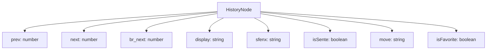
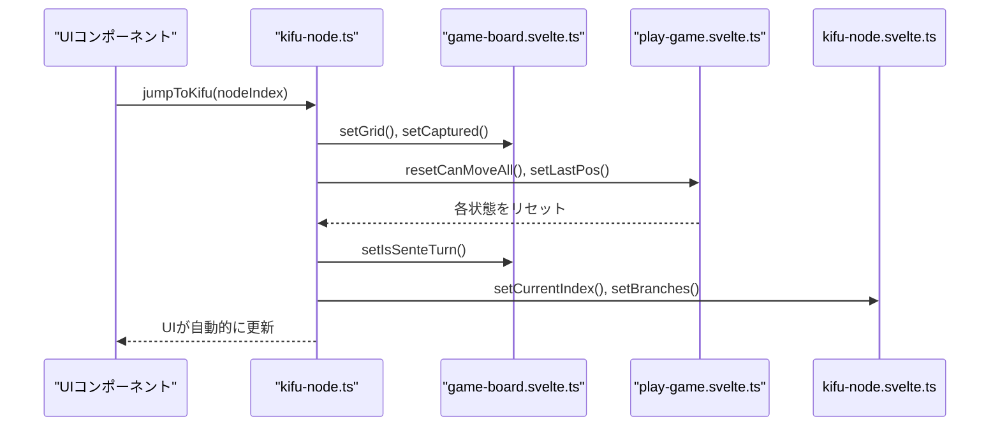
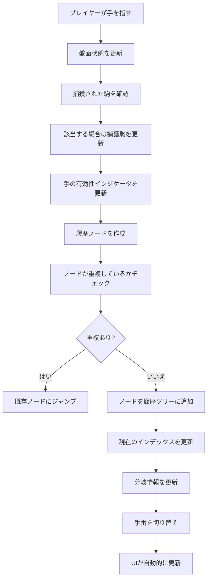
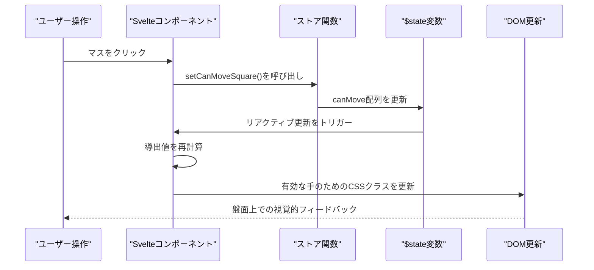

# 状態管理

<cite>
**このドキュメントで参照されるファイル**   
- [game-board.svelte.ts](file://src/store/game-board.svelte.ts)
- [play-game.svelte.ts](file://src/store/play-game.svelte.ts)
- [kifu-node.svelte.ts](file://src/store/kifu-node.svelte.ts)
- [shogi.d.ts](file://src/types/shogi.d.ts)
- [kifu-node.ts](file://src/handler/kifu-node.ts)
- [KifuHistory.svelte](file://src/ui/kifu-history/KifuHistory.svelte) - *最近のコミットで更新*
- [KifuBranch.svelte](file://src/ui/kifu-history/KifuBranch.svelte) - *分岐機能追加により新規追加*
</cite>

## 更新概要

**変更内容**

- `kifu-node.svelte.ts` にノードの重複防止機能を実装し、`pushOrJumpToKifu` 関数を追加
- 棋譜ノードの兄弟管理（`br_next`）のロジックを強化し、既存ノードとの重複を検出してナビゲーションを最適化
- `kifu-node.ts` ハンドラに `pushOrJumpToKifu` 関数を追加し、手の追加時に重複をチェックして既存ノードにジャンプするように変更
- 分岐管理の `setBranches` 関数のロジックを明確化し、ループ構造の正しさを保証
- 既存の `jumpToKifu` と `switchBranch` の動作との整合性を維持しつつ、新機能を統合
- 棋譜ノードの双方向リンク構造（`br_next`）の説明をコード実装に基づいて正確化

## 目次

1. [はじめに](#はじめに)
2. [コア状態ストア](#コア状態ストア)
3. [$stateと$derivedによるリアクティビティ](#stateとderivedによるリアクティビティ)
4. [ストア間の相互作用とデータフロー](#ストア間の相互作用とデータフロー)
5. [手の実行と履歴管理](#手の実行と履歴管理)
6. [UIリアクティビティチェーン](#uiリアクティビティチェーン)
7. [ベストプラクティスとアンチパターン](#ベストプラクティスとアンチパターン)
8. [よくある問題と解決策](#よくある問題と解決策)

## はじめに

SvelteShogiアプリケーションは、Svelte 5の組み込みリアクティビティプリミティブ（特に `$state` および `$derived`）を使用してリアクティブな状態管理システムを実装しています。このアプローチにより、外部の状態管理ライブラリを必要とせずに、アプリケーション全体で効率的かつ細粒度の高いリアクティビティを提供します。状態システムは、将棋ゲームの異なる側面を管理する3つの専用ストアに分割されています：盤面状態、ゲームプレイロジック、および手の履歴です。このモジュール設計により、関心の分離が保たれると同時に、ストア間の明確に定義された相互作用を通じて一貫性が維持されます。

**セクションのソース**

- [game-board.svelte.ts](file://src/store/game-board.svelte.ts#L1-L165)
- [play-game.svelte.ts](file://src/store/play-game.svelte.ts#L1-L49)
- [kifu-node.svelte.ts](file://src/store/kifu-node.svelte.ts#L1-L82)

## コア状態ストア

### 盤面ストア

`game-board.svelte.ts` ストアは、駒の位置や捕獲された駒を含む将棋盤の物理状態を管理します。`$state` を使用して、盤面グリッド、両プレイヤー（先手と後手）の捕獲駒、および手番情報をリアクティブ変数として作成します。

```typescript
let grid: (PlayerPiece | null)[] = $state(initGrid());
let capturedSente: { piece: PieceType; num: number }[] = $state([]);
let capturedGote: { piece: PieceType; num: number }[] = $state([]);
let isSenteTurn = $state(true);
```

このストアは、マス目の取得・設定、捕獲駒の管理、現在のプレイヤーの手番の追跡を行う関数を提供します。`initGrid()` 関数は、すべての駒が初期位置にある初期将棋盤の構成をセットアップします。

**セクションのソース**

- [game-board.svelte.ts](file://src/store/game-board.svelte.ts#L35-L103)

### ゲームプレイストア

`play-game.svelte.ts` ストアは、有効な手やユーザーのインタラクションを決定するゲームプレイ状態を扱います。どのマスが移動可能か、成りの位置、最後に動かした駒の位置を追跡します。

```typescript
let canMove = $state(Array(81).fill(false));
let promotionPos = $state(null) as { row: number; col: number } | null;
let lastPos = $state(null) as { row: number; col: number } | null;
```

このストアは、ユーザー入力とゲームロジックの中間として機能し、有効な手や成りの機会といった特別なゲーム状態についての視覚的フィードバックを提供します。

**セクションのソース**

- [play-game.svelte.ts](file://src/store/play-game.svelte.ts#L1-L49)

### 棋譜履歴ストア

`kifu-node.svelte.ts` ストアは、分岐とナビゲーションをサポートして手の履歴（棋譜）を管理します。リンクされたノードを使用してツリー構造を実装し、ゲームプレイのバリエーションをサポートします。

```typescript
let currentIndex: number = $state(-1);
let nodes: KifuNode[] = $state([]);
let branches: number[] = $state([]);
```

各 `KifuNode` には、SFENX形式の表現、手の記法、親・子・兄弟ノードへのナビゲーションポインタを含む特定のゲーム状態に関する情報が含まれます。`branches` 配列は、現在の局面から分岐しているすべてのノードのインデックスを保持し、UIでの分岐表示に使用されます。この構造により、手の取り消し・やり直しや、代替手順の探索といった機能が可能になります。



**図のソース**

- [kifu-node.svelte.ts](file://src/store/kifu-node.svelte.ts#L1-L82)
- [shogi.d.ts](file://src/types/shogi.d.ts#L50-L75)

**セクションのソース**

- [kifu-node.svelte.ts](file://src/store/kifu-node.svelte.ts#L1-L82)
- [shogi.d.ts](file://src/types/shogi.d.ts#L50-L75)

## $stateと$derivedによるリアクティビティ

### 状態の宣言と初期化

Svelte 5の `$state` マクロは、変更時に自動的に更新をトリガーするリアクティブ変数を作成します。SvelteShogiでは、ストア内のすべての状態変数の宣言にこれを使用しています：

```typescript
let grid: (PlayerPiece | null)[] = $state(initGrid());
let canMove = $state(Array(81).fill(false));
let currentIndex: number = $state(-1);
```

これらの変数が提供されたセッタ関数を通じて更新されると、Svelteは変更を自動的に追跡し、依存する値やUIコンポーネントを更新します。

### 導出状態のパターン

提供されたコードでは明示的に示されていませんが、Svelte 5の `$derived` はリアクティブ状態に基づいて値を計算するために使用されます。たとえば、有効な手は現在の盤面状態と手番から導出できます：

```typescript
// $derived使用の概念例
let validMoves = $derived(() => {
  const currentGrid = getGrid();
  const currentTurn = getIsSenteTurn();
  return calculateValidMoves(currentGrid, currentTurn);
});
```

このパターンにより、依存関係が変更されるたびに計算値が自動的に更新され、手動での更新呼び出しをせずに一貫性が保たれます。

**セクションのソース**

- [game-board.svelte.ts](file://src/store/game-board.svelte.ts#L35-L165)
- [play-game.svelte.ts](file://src/store/play-game.svelte.ts#L1-L49)

## ストア間の相互作用とデータフロー

### 駒の選択と有効な手

プレイヤーが盤上で駒を選択すると、アプリケーションは複数のストアにわたって状態を更新します。このフローはUIコンポーネントから始まり、ストア間を調整するハンドラ関数を呼び出します：



**図のソース**

- [kifu-node.ts](file://src/handler/kifu-node.ts#L54-L82)
- [game-board.svelte.ts](file://src/store/game-board.svelte.ts#L35-L165)
- [play-game.svelte.ts](file://src/store/play-game.svelte.ts#L1-L49)
- [kifu-node.svelte.ts](file://src/store/kifu-node.svelte.ts#L1-L82)

**セクションのソース**

- [kifu-node.ts](file://src/handler/kifu-node.ts#L54-L82)

### 手番管理

手番システムは、盤面ストアの `isSenteTurn` リアクティブ変数によって管理されます。有効な手が実行された後、手番は切り替えられます：

```typescript
export function toggleTurn() {
  isSenteTurn = !isSenteTurn;
}
```

この変更は、依存するすべてのコンポーネントに自動的に伝播し、現在のプレイヤーの手番を反映してUIを更新します。リアクティビティシステムにより、`toggleTurn()` が呼び出されると、手番情報を表示するすべてのコンポーネントが即座に更新されます。

## 手の実行と履歴管理

### 手を指す

プレイヤーが手を指すと、アプリケーションは3つのストアすべてにわたって調整されたシーケンスに従います：



**図のソース**

- [kifu-node.svelte.ts](file://src/store/kifu-node.svelte.ts#L1-L82)
- [kifu-node.ts](file://src/handler/kifu-node.ts#L54-L82)

`kifu-node.svelte.ts` の `pushKifuNode` 関数は、現在のゲーム状態を持つ新しい `KifuNode` を作成し、履歴ツリー内で適切にリンクします：

```typescript
export function pushKifuNode(
  display: string,
  sfenx: string,
  prev: number,
  br_next: number,
  isSente: boolean,
  move: string,
  isFavorite: boolean
) {
  nodes.push({
    display,
    sfenx,
    prev,
    next: -1,
    br_next,
    isSente,
    move,
    isFavorite,
  });
}
```

**セクションのソース**

- [kifu-node.svelte.ts](file://src/store/kifu-node.svelte.ts#L23-L42)

### 履歴のナビゲーション

履歴システムは、現在のインデックスを使用してゲームツリーをナビゲートします：

```typescript
export function getCurrentIndex(): number {
  return currentIndex;
}

export function setCurrentIndex(index: number) {
  currentIndex = index;
}
```

現在のインデックスが変更されると、選択された履歴ノードのSFENX文字列からゲーム状態を再構築でき、取り消し、やり直し、バリエーションの探索といった機能が可能になります。また、`jumpToKifu` 関数は、任意のノードに移動するための統一されたインターフェースを提供します。

```typescript
export function jumpToKifu(nodeIndex: number) {
  setCurrentNode(nodeIndex);
  setIsSenteTurn(getNode(nodeIndex).isSente);
  setBranches(nodeIndex);
}
```

**分岐の切り替え**は、`switchBranch` 関数によって処理されます。これは `jumpToKifu` とは異なり、親ノードの子ノードポインタを更新することで、分岐の「選択」を実現します。

```typescript
export function switchBranch(nodeIndex: number) {
  setCurrentNode(nodeIndex);
  if (nodeIndex !== 0) setChildNode(getNode(nodeIndex).prev, nodeIndex);
}
```

**ノードの重複防止**は、`pushOrJumpToKifu` 関数によって実現されます。この関数は、新しい手を追加する前に、既存の兄弟ノードに同じ `display` 値のノードがないかをチェックし、存在すればそのノードにジャンプします。

```typescript
export function pushOrJumpToKifu(
  display: string,
  sfenx: string,
  isSente: boolean,
  move: string
) {
  const currentIndex = getCurrentIndex();
  const curNextIndex = getNode(currentIndex).next;
  if (curNextIndex !== -1) {
    let cur = curNextIndex;
    do {
      const node = getNode(cur);
      if (node.display === display) {
        setChildNode(currentIndex, cur);
        setCurrentIndex(cur);
        return;
      }
      cur = node.br_next;
    } while (cur !== curNextIndex);
  }
  // 重複なし → 新規追加
  const newIndex = getNodesSize();
  let br_next = newIndex;
  if (curNextIndex !== -1) {
    br_next = getNode(curNextIndex).br_next;
    setBranchNode(curNextIndex, newIndex);
  }
  pushKifuNode(display, sfenx, currentIndex, br_next, isSente, move, false);
  setChildNode(currentIndex, newIndex);
  setCurrentIndex(newIndex);
}
```

**セクションのソース**

- [kifu-node.svelte.ts](file://src/store/kifu-node.svelte.ts#L1-L82)
- [kifu-node.ts](file://src/handler/kifu-node.ts#L54-L82)

## UIリアクティビティチェーン

### 状態更新からUIレンダリングまで

SvelteShogiのリアクティビティチェーンは、状態更新からUIレンダリングまでの明確なパスに従います：



**図のソース**

- [play-game.svelte.ts](file://src/store/play-game.svelte.ts#L1-L49)
- [game-board.svelte.ts](file://src/store/game-board.svelte.ts#L35-L165)

Svelte 5のリアクティビティの主な利点は、この一連の処理が自動的に行われる点です。`$state` 変数が更新されると、Svelteはその状態に依存するコンポーネントを追跡し、効率的に更新することでDOM操作を最小限に抑えます。

### 自動依存関係の追跡

Svelteのリアクティビティシステムは、状態変数とコンポーネント間の依存関係を自動的に追跡します。たとえば、コンポーネントで `getCanMove(row, col)` が呼び出された場合：

```typescript
export function getCanMove(row: number, col: number): boolean {
  return canMove[row * 9 + col];
}
```

Svelteは、コンポーネントが `canMove` 配列に依存していることを記録します。`setCanMoveSquare()` が配列を変更すると、Svelteはどのコンポーネントを更新する必要があるかを正確に把握し、非常に効率的なレンダリングを実現します。

## ベストプラクティスとアンチパターン

### 適切な状態更新パターン

SvelteShogiの実装は、状態管理のベストプラクティスに従っています：

**直接のミューテーションを避ける**: 配列を直接変更するのではなく、適切な更新関数を使用します：

```typescript
// 良い例：専用関数を使用
export function incrementCaptured(piece: PieceType, isSente: boolean) {
  const found = isSente
    ? capturedSente.find((p) => p.piece === piece)
    : capturedGote.find((p) => p.piece === piece);
  if (found) {
    found.num += 1; // このミューテーションは$stateによって追跡される
  } else {
    (isSente ? capturedSente : capturedGote).push({ piece, num: 1 });
  }
  // 捕獲駒を種類順にソート
  (isSente ? capturedSente : capturedGote).sort(
    (a, b) => TYPE_ORDER[a.piece] - TYPE_ORDER[b.piece]
  );
}
```

**構造化された状態更新**: 状態の変更は、意図を説明する適切な名前の関数にカプセル化され、コードの保守性を高め、エラーを減らします。

### 避けるべきアンチパターン

Svelteのリアクティビティを使用する際は、以下のアンチパターンを避けてください：

1. **ストア関数のバイパス**: コンポーネントからストア変数を直接変更すると、カプセル化が破られ、状態の変更を追跡しにくくなります。

2. **命令型の状態管理**: setTimeoutやその他の非同期パターンを使用して状態を更新すると、競合状態や一貫性のないUIが発生する可能性があります。

3. **$stateの過剰使用**: すべての変数がリアクティブである必要はありません。UIに影響を与えるか、コンポーネント間で共有される状態のみが `$state` を使用するべきです。

**セクションのソース**

- [game-board.svelte.ts](file://src/store/game-board.svelte.ts#L105-L165)

## よくある問題と解決策

### 古い状態の防止

リアクティブシステムでよく発生する問題の一つは、コンポーネントが古くなった値を読み取る「古い状態」です。SvelteShogiはこれを以下で防止しています：

1. **同期的な更新**: 状態の更新は同期的であり、関数が返されたときには状態が確実に更新されていることが保証されます。

2. **適切な依存関係の順序**: アプリケーションは、盤面状態の更新が手の有効性計算の前に行われるように、状態の更新が正しい順序で行われることを保証します。

3. **アトミックな操作**: 関連する状態の変更は、単一の関数内でグループ化され、中間的な不整合状態を防ぎます。

### 状態の問題のデバッグ

SvelteShogiで状態管理の問題をデバッグする際は、開発者は以下の手順を踏むべきです：

1. **ストア関数の呼び出しを確認**: 正しいストア関数が正しいパラメータで呼び出されているかを検証します。

2. **状態変数を検査**: ブラウザの開発者ツールを使用して、`$state` 変数の現在の値を検査します。

3. **更新チェーンをトレース**: ユーザーの操作からストアの更新、UIのレンダリングまでのフローを追跡し、どこでチェーンが途切れているかを特定します。

モジュール化されたストア設計により、各ストアが明確な責任と明確なインターフェースを持つため、デバッグが容易になります。

**セクションのソース**

- [game-board.svelte.ts](file://src/store/game-board.svelte.ts#L1-L165)
- [play-game.svelte.ts](file://src/store/play-game.svelte.ts#L1-L49)
- [kifu-node.svelte.ts](file://src/store/kifu-node.svelte.ts#L1-L82)
- [kifu-node.ts](file://src/handler/kifu-node.ts#L1-L82)
- [KifuHistory.svelte](file://src/ui/kifu-history/KifuHistory.svelte#L1-L225)
- [KifuBranch.svelte](file://src/ui/kifu-history/KifuBranch.svelte#L1-L100)
