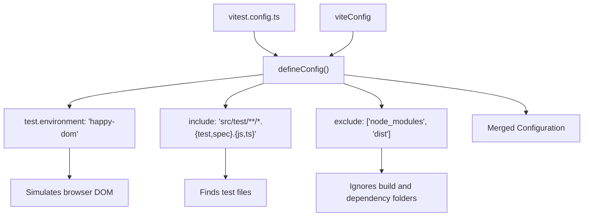
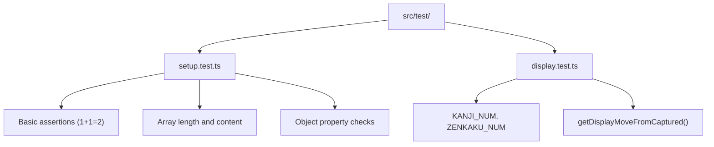
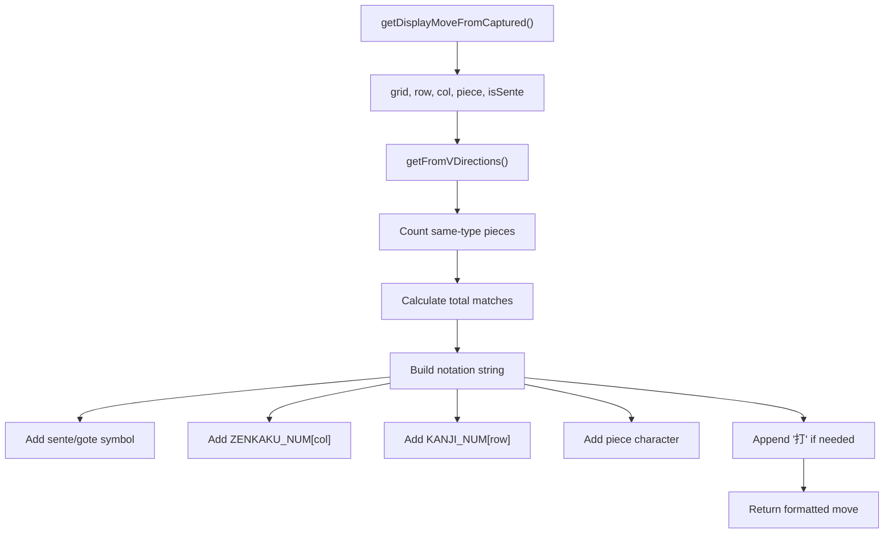
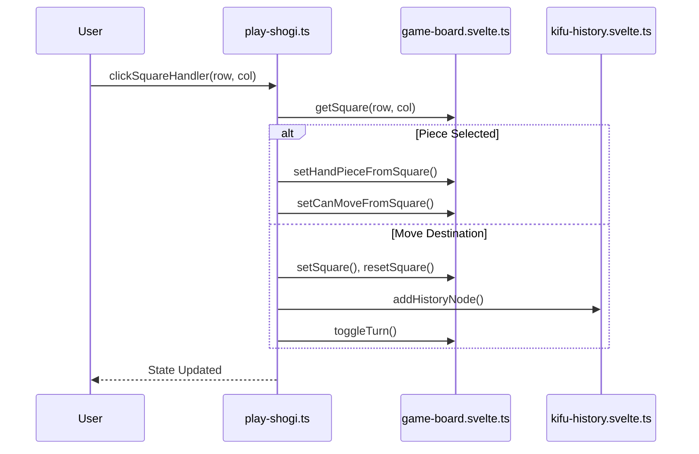

# Testing Strategy

<cite>
**Referenced Files in This Document**   
- [vitest.config.ts](file://vitest.config.ts)
- [src/test/display.test.ts](file://src/test/display.test.ts)
- [src/test/setup.test.ts](file://src/test/setup.test.ts)
- [src/domain/display.ts](file://src/domain/display.ts)
- [src/domain/shogi-rule.ts](file://src/domain/shogi-rule.ts)
- [src/handler/play-shogi.ts](file://src/handler/play-shogi.ts)
</cite>

## Table of Contents
1. [Testing Strategy](#testing-strategy)
2. [Test Environment Setup](#test-environment-setup)
3. [Test Structure and Organization](#test-structure-and-organization)
4. [Unit Testing Domain Logic](#unit-testing-domain-logic)
5. [Component and Handler Testing](#component-and-handler-testing)
6. [Running Tests and Coverage](#running-tests-and-coverage)
7. [Testing Challenges in Game Applications](#testing-challenges-in-game-applications)

## Test Environment Setup

The SvelteShogi project uses **Vitest** as its primary testing framework, providing a fast and modern test runner compatible with the Vite ecosystem. To simulate a browser-like environment without requiring a full browser, the project leverages **Happy DOM**, a lightweight JavaScript DOM implementation optimized for testing and server-side rendering.

The test environment is configured in `vitest.config.ts`, which merges the base Vite configuration with Vitest-specific settings. This ensures consistency between development and testing environments while enabling features such as module resolution and environment mocking.



**Diagram sources**
- [vitest.config.ts](file://vitest.config.ts#L1-L13)

**Section sources**
- [vitest.config.ts](file://vitest.config.ts#L1-L13)

### Key Configuration Options

- **Environment**: `"happy-dom"` provides sufficient DOM APIs for Svelte component testing without the overhead of a full browser.
- **Test File Inclusion**: Only files under `src/test/` with `.test.ts` or `.spec.ts` extensions are executed.
- **Exclusions**: The `node_modules` and `dist` directories are excluded to prevent unintended test discovery.

This setup enables fast, reliable unit and integration tests that closely mimic client-side behavior while remaining efficient for continuous integration pipelines.

## Test Structure and Organization

Tests are organized within the `src/test/` directory, following a modular structure that aligns with the application’s domain and handler logic. Each test file focuses on specific functionality, making it easier to maintain and extend test coverage.

Currently, two primary test files exist:
- `setup.test.ts`: Verifies basic test infrastructure and assertion capabilities.
- `display.test.ts`: Tests domain-level functions related to move notation formatting.



**Diagram sources**
- [src/test/setup.test.ts](file://src/test/setup.test.ts#L1-L20)
- [src/test/display.test.ts](file://src/test/display.test.ts#L1-L50)

**Section sources**
- [src/test/setup.test.ts](file://src/test/setup.test.ts#L1-L20)
- [src/test/display.test.ts](file://src/test/display.test.ts#L1-L50)

### Test Suite Hierarchy

Each test file uses `describe()` blocks to group related functionality, with individual test cases defined using `it()`. This hierarchical structure improves readability and isolates concerns.

For example, in `display.test.ts`:
```ts
describe("Display Functions", () => {
  describe("Constants", () => {
    it("should have correct KANJI_NUM array", () => { ... });
  });

  describe("getDisplayMoveFromCaptured", () => {
    it("should create correct display for captured piece move", () => { ... });
  });
});
```

This pattern allows developers to run subsets of tests during development and clearly understand which component or function is being validated.

## Unit Testing Domain Logic

Domain logic in SvelteShogi resides in the `src/domain/` folder and includes core game rules and display formatting. These pure functions are ideal candidates for unit testing due to their deterministic behavior and lack of side effects.

### Testing Move Notation Generation

The `getDisplayMoveFromCaptured()` function generates Japanese-style shogi move notation when placing a captured piece on the board. It considers:
- Player color (sente/gote)
- Target position (row, column)
- Piece type
- Whether ambiguity disambiguation is needed

```ts
expect(result).toContain("☗"); // Sente symbol
expect(result).toContain("５"); // Zenkaku column
expect(result).toContain("五"); // Kanji row
expect(result).toContain("歩"); // Piece type
```

These assertions verify that the output string correctly combines all required elements according to standard shogi notation conventions.

### Testing Constants and Data Structures

The `display.ts` module defines two key arrays:
- `KANJI_NUM`: Kanji numerals from "一" to "九"
- `ZENKAKU_NUM`: Full-width ASCII numerals

These are tested to ensure correct length and element ordering, preventing regressions in display logic that depends on index-based lookups.



**Diagram sources**
- [src/domain/display.ts](file://src/domain/display.ts#L100-L155)
- [src/test/display.test.ts](file://src/test/display.test.ts#L30-L50)

**Section sources**
- [src/domain/display.ts](file://src/domain/display.ts#L100-L155)
- [src/test/display.test.ts](file://src/test/display.test.ts#L30-L50)

## Component and Handler Testing

While current tests focus on domain logic, the architecture supports testing Svelte stores and event handlers through dependency injection and state inspection.

### Store Interaction Testing

Svelte stores such as `game-board.svelte.ts`, `play-game.svelte.ts`, and `kifu-history.svelte.ts` encapsulate application state. Functions in `play-shogi.ts` interact with these stores to:
- Update board state
- Manage turn flow
- Track move history
- Handle promotions

Although no direct store tests exist yet, the handler functions can be tested by:
1. Mocking store accessors and mutators
2. Verifying expected state transitions
3. Asserting correct history node creation

### Example: Testing Move Execution

A comprehensive test for `clickSquareHandler()` would:
- Simulate selecting a piece
- Validate available moves via `setCanMoveFromSquare()`
- Execute a move
- Confirm:
  - Board state updated
  - Turn toggled
  - History node added
  - Promotion state reset

Such tests require mocking the store functions but enable verification of complex game logic.



**Diagram sources**
- [src/handler/play-shogi.ts](file://src/handler/play-shogi.ts#L1-L270)
- [src/store/game-board.svelte.ts](file://src/store/game-board.svelte.ts)
- [src/store/kifu-history.svelte.ts](file://src/store/kifu-history.svelte.ts)

**Section sources**
- [src/handler/play-shogi.ts](file://src/handler/play-shogi.ts#L1-L270)

## Running Tests and Coverage

Tests can be executed using the npm scripts defined in `package.json`. Common commands include:

```bash
# Run all tests
npm run test

# Run tests in watch mode during development
npm run test:watch

# Generate coverage report
npm run test:coverage
```

Vitest provides built-in code coverage via `c8`, which analyzes which lines of code are executed during testing. The configuration in `vitest.config.ts` ensures that only source files in `src/` are included in reports, excluding test and build files.

### Achieving Good Test Coverage

To ensure high-quality tests:
- **Cover edge cases**: e.g., pawn drop restrictions (nifu), promotion zones
- **Test both players**: validate behavior for both sente (black) and gote (white)
- **Validate state transitions**: ensure game state evolves correctly after each move
- **Use parameterized tests**: reduce duplication when testing similar scenarios

Example of a future test case:
```ts
describe("Pawn Drop Rules", () => {
  it("should prevent nifu (double pawn in same column)", () => {
    // Setup: existing pawn in column
    // Attempt second pawn drop
    // Expect: move not allowed
  });
});
```

## Testing Challenges in Game Applications

Game applications like SvelteShogi present unique testing challenges due to complex state management and user interaction sequences.

### State Transition Testing

Shogi involves intricate state dependencies:
- Board position
- Captured pieces
- Turn ownership
- Move history
- Promotion eligibility

Testing these requires careful setup of initial states and validation of post-move conditions. One approach is to use SFEN (Shogi Forsyth-Edwards Notation) strings to initialize board positions deterministically.

### User Interaction Flows

The game relies on multi-step interactions:
1. Click a piece → highlight valid moves
2. Click destination → execute move (or prompt for promotion)
3. Click promotion button → confirm or cancel

These flows must be tested as sequences rather than isolated actions. Vitest supports asynchronous testing, enabling simulation of user click chains.

### Mocking Strategies

Effective testing requires mocking:
- **Svelte stores**: Replace reactive stores with test doubles
- **DOM elements**: Happy DOM handles most cases, but custom elements may need stubbing
- **Event handlers**: Verify callbacks are registered and invoked correctly

Example mock setup:
```ts
// Mock store functions
vi.mock("@/store/game-board.svelte", () => ({
  getSquare: vi.fn(),
  setSquare: vi.fn(),
  // ... other mocks
}));
```

By addressing these challenges systematically, the test suite can evolve into a robust safety net for future development.