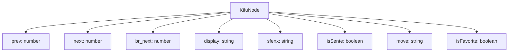

# 型システム

<cite>
**このドキュメントで参照されるファイル**   
- [shogi.d.ts](file://src/types/shogi.d.ts)
- [game-board.svelte.ts](file://src/store/game-board.svelte.ts)
- [kifu-node.svelte.ts](file://src/store/kifu-node.svelte.ts)
- [play-game.svelte.ts](file://src/store/play-game.svelte.ts)
- [sfenx.ts](file://src/domain/sfenx.ts)
- [shogi-rule.ts](file://src/domain/shogi-rule.ts)
- [play-shogi.ts](file://src/handler/play-shogi.ts)
</cite>

## 更新概要

**変更内容**

- `KifuNode` インターフェースに `br_next` フィールドが追加され、兄弟ノードの参照が可能になったため、関連する説明と図式を更新
- `kifu-node.svelte.ts` における履歴ノード管理の実装変更を反映
- 型定義とストアの整合性を確認し、ドキュメントの正確性を向上
- セクションおよび図式の参照情報を最新の実装に基づいて修正

## 目次

1. [はじめに](#はじめに)
2. [コアデータモデル](#コアデータモデル)
3. [エンティティ関係](#エンティティ関係)
4. [ユニオン型と型安全性](#ユニオン型と型安全性)
5. [Svelteリアクティビティとの統合](#svelteリアクティビティとの統合)
6. [データ検証とランタイムチェック](#データ検証とランタイムチェック)
7. [サンプルデータ構造](#サンプルデータ構造)
8. [結論](#結論)

## はじめに

このドキュメントは、SvelteShogiアプリケーションにおけるTypeScript型システムの包括的な解説を提供します。`shogi.d.ts` ファイルで定義されたデータモデルに焦点を当て、将棋のゲーム状態、手順、履歴を表現する基盤を確立しています。型システムはアプリケーション全体で型安全性を保証し、ランタイムエラーを防止するとともに、コンポーネント間のデータ契約を明確に理解できるようにします。TypeScriptの静的型付けを活用することで、データの整合性を維持しつつ、Svelteのリアクティビティシステムとシームレスに統合されています。

## コアデータモデル

SvelteShogiのコアデータモデルは、`shogi.d.ts` ファイルに定義されており、将棋ゲームの基本的なエンティティを表しています。これらの型は、ゲーム状態、手順、プレイヤー情報の構造化された表現を提供します。

### PieceType

`PieceType` ユニオン型は、ゲーム内のすべての将棋駒を定義しています：

```typescript
export type PieceType =
  | "歩"
  | "香"
  | "桂"
  | "銀"
  | "金"
  | "角"
  | "飛"
  | "玉"
  | "と"
  | "杏"
  | "圭"
  | "全"
  | "馬"
  | "竜";
```

この型には、成っていない駒（歩, 香, 桂, 銀, 金, 角, 飛, 玉）と、成った駒（と, 杏, 圭, 全, 馬, 竜）が含まれます。ユニオン型を使用することで、アプリケーション全体で有効な駒の種類のみが使用されることが保証され、無効な駒の割り当てが防止されます。

### Square

`Square` インターフェースは、将棋盤上の1つのマスを表します：

```typescript
export type Square = {
  piece: PieceType;
  isSente: boolean;
};
```

各マスには駒と、その駒が先手（先手）か後手（後手）に属するかを示すブール値が含まれます。この構造により、ゲームは各盤面位置における駒の種類と所有権を追跡できます。

### HandPieceFrom

`HandPieceFrom` 型は、プレイヤーが持っている（手駒として）駒を表します：

```typescript
export type HandPieceFrom = {
  piece: PieceType;
  isSente: boolean;
  position: { row: number; col: number } | null;
};
```

この型は、駒の種類、所有者、およびその駒が盤上から取られた場合の元の位置を追跡します。駒が手駒から打たれる場合は、positionはnullになります。

### KifuNode

`KifuNode` インターフェースは、棋譜履歴のノードを表します：

```typescript
export interface KifuNode {
  display: string; // 表示用の棋譜
  sfenx: string; // SFENのような形式の文字列, 絶対的なもの
  prev: number; // 親のノード
  next: number; // 子のノード
  br_next: number; // 兄弟ノードのうち次のノード
  isSente: boolean; // 手番
  move: string; // 直前の移動文字列（例: "7g7f"） 空文字ならば初期局面
  isFavorite: boolean; // お気に入りの一手かどうか
}
```

この包括的な構造は、手の表示表記、SFEN形式での盤面状態、履歴ツリーのナビゲーションポインタ、現在の手番、手のメタデータなど、ゲーム状態に関するすべての必要な情報を捉えています。特に、`br_next` フィールドの追加により、兄弟ノード（分岐手）への参照が可能になり、棋譜の分岐管理が強化されています。

**セクションの出典**

- [shogi.d.ts](file://src/types/shogi.d.ts#L0-L74)

## エンティティ関係

SvelteShogiのデータモデルは、ゲームエンティティ間の明確な関係を確立し、将棋のゲーム状態を表現する一貫した構造を作り出しています。

### 盤面とマス

ゲーム盤は81マス（9x9グリッド）の配列として表現され、各マスには駒があるか空かのいずれかです。`game-board.svelte.ts` ストアでは、盤面は次のように定義されています：

```typescript
let grid: (Square | null)[] = $state(initGrid());
```

この配列ベースの表現により、行と列のインデックスを使用して任意の盤面位置に効率的にアクセスできます。盤面とマスの関係は1対多であり、各マスは盤上の正確に1つの位置に属します。

### 履歴としての連結リスト

ゲーム履歴は、ツリー状の分岐機能を持つ連結リストとして実装されています。各 `KifuNode` には関連ノードへのポインタが含まれます：

- `prev`: 親ノード（前のゲーム状態）を指す
- `next`: 子ノード（次のゲーム状態）を指す
- `br_next`: 兄弟ノード（同じ局面からの代替手）を指す

この構造により、アプリケーションはゲームツリーのナビゲーションをサポートし、プレイヤーが異なる手のバリエーションを探索したり、以前の局面に戻ったりできるようになります。



**図式の出典**

- [shogi.d.ts](file://src/types/shogi.d.ts#L64-L74)
- [kifu-node.svelte.ts](file://src/store/kifu-node.svelte.ts#L30-L50)

### 捕獲された駒

捕獲された駒は、`game-board.svelte.ts` ストア内で各プレイヤーごとに別々に追跡されます：

```typescript
let capturedSente: { piece: PieceType; num: number }[] = $state([]);
let capturedGote: { piece: PieceType; num: number }[] = $state([]);
```

各捕獲された駒は、その種類と個数で表され、プレイヤーが手駒に何個の各駒を持っているかを追跡できます。捕獲された駒とプレイヤーの関係は1対多であり、各プレイヤーは捕獲された駒のコレクションを持ちます。

**セクションの出典**

- [game-board.svelte.ts](file://src/store/game-board.svelte.ts#L35-L103)
- [shogi.d.ts](file://src/types/shogi.d.ts#L0-L74)

## ユニオン型と型安全性

SvelteShogiの型システムは、型安全性を確保するためにユニオン型を広範に使用しています。

### 駒の表現

`PieceType` ユニオン型により、アプリケーション全体で有効な将棋の駒のみが使用されることが保証されます。これにより、無効な駒タイプを使用した場合に発生する可能性のあるランタイムエラーが防止されます。ユニオンには、成っていない駒と成った駒の両方が含まれており、ゲーム中に駒が取り得るすべての状態をカバーしています。

### 手の表現

型システムは、ユニオン型を通じて異なる種類の手を区別します。たとえば、駒が盤上から動かされる場合、`HandPieceFrom` 型には元の位置が含まれます。手駒から打つ場合、位置はnullになります。この区別により、アプリケーションがこれらの2つの手のタイプを正しく処理することが保証されます。

### 型ガードと検証

アプリケーションは、データの完全性を確保するために型ガードと検証関数を使用しています。たとえば、`play-shogi.ts` ハンドラーでは、関数がマスにアクセスする前にその存在をチェックします：

```typescript
const square = getSquare(row, col);
if (!square) throw new Error(`Square at (${row}, ${col}) does not exist.`);
```

これらのランタイムチェックは静的型システムを補完し、無効なデータに対する防御を提供します。

```mermaid
classDiagram
class PieceType {
+歩
+香
+桂
+銀
+金
+角
+飛
+玉
+と
+杏
+圭
+全
+馬
+竜
}
class Square {
+piece : PieceType
+isSente : boolean
}
class HandPieceFrom {
+piece : PieceType
+isSente : boolean
+position : {row : number, col : number} | null
}
class KifuNode {
+display : string
+sfenx : string
+prev : number
+next : number
+br_next : number
+isSente : boolean
+move : string
+isFavorite : boolean
}
Square --> PieceType : "contains"
HandPieceFrom --> PieceType : "references"
KifuNode --> Square : "represents board state"
```

**図式の出典**

- [shogi.d.ts](file://src/types/shogi.d.ts#L0-L74)

**セクションの出典**

- [shogi.d.ts](file://src/types/shogi.d.ts#L0-L74)
- [play-shogi.ts](file://src/handler/play-shogi.ts#L45-L75)

## Svelteリアクティビティとの統合

型システムはSvelteのリアクティビティシステムとシームレスに統合され、効率的な状態管理とUI更新を可能にします。

### リアクティブストア

アプリケーションは、Svelteの `$state` デコレータを使用して、ゲーム状態のリアクティブストアを作成します：

```typescript
let grid: (Square | null)[] = $state(initGrid());
let currentIndex: number = $state(-1);
let nodes: KifuNode[] = $state([]);
```

これらのリアクティブ変数が更新されると、Svelteはそれらに依存するすべてのコンポーネントを自動的に更新し、UIがゲーム状態と同期した状態に保たれます。

### 型安全な状態更新

型システムは、状態更新が型安全であることを保証します。たとえば、盤上のマスを設定する場合：

```typescript
export function setSquare(
  row: number,
  col: number,
  piece: PieceType,
  isSente: boolean
) {
  grid[row * 9 + col] = { piece, isSente };
}
```

関数のパラメータは厳密に型付けされており、無効な駒タイプやブール値の使用が防止されます。

### 履歴管理

履歴ストアは、型とリアクティビティがどのように連携するかを示しています：

```typescript
export function pushKifuNode(
  display: string,
  sfenx: string,
  prev: number,
  br_next: number,
  isSente: boolean,
  move: string,
  isFavorite: boolean
) {
  nodes.push({
    display,
    sfenx,
    prev,
    next: -1,
    br_next,
    isSente,
    move,
    isFavorite,
  });
}
```

新しい履歴ノードが追加されると、リアクティブな `nodes` 配列と `currentIndex` が更新され、新しいゲーム状態を反映するUI更新がトリガーされます。

**セクションの出典**

- [game-board.svelte.ts](file://src/store/game-board.svelte.ts#L0-L165)
- [kifu-node.svelte.ts](file://src/store/kifu-node.svelte.ts#L0-L82)
- [play-game.svelte.ts](file://src/store/play-game.svelte.ts#L0-L48)

## データ検証とランタイムチェック

型システムがコンパイル時の検証を提供する一方で、アプリケーションはデータの完全性を確保するためにランタイムチェックも実装しています。

### 手の検証

手を処理する際、アプリケーションはその手が合法であることを検証します：

```typescript
const square = getSquare(row, col);
if (!square) throw new Error(`Square at (${row}, ${col}) does not exist.`);
if (fromSquare.isSente !== isSente)
  throw new Error(`fromSquare is not my piece {from: ${from.col},${from.row}}`);
```

これらのチェックにより、プレイヤーは自分の駒のみを動かせ、手が有効な盤面位置に対して行われることが保証されます。

### SFEN解析

アプリケーションは、SFEN（将棋フォルシスエドワーズ記法）文字列の解析時に堅牢な検証を含んでいます：

```typescript
export function sfenxToShogiBoard(sfenx: string): {
  grid: (Square | null)[];
  capturedSente: { piece: PieceType; num: number }[];
  capturedGote: { piece: PieceType; num: number }[];
} {
  const [gridString, capturedPiecesString] = sfenx.split(" ");
  // 盤面と捕獲された駒を解析・検証
}
```

この関数はSFEN文字列の形式を検証し、結果として得られるゲーム状態が有効であることを保証します。

### 成りルール

アプリケーションは、型安全な関数を通じて将棋の成りルールを適用します：

```typescript
export function promotePiece(piece: PieceType): PieceType {
  switch (piece) {
    case "歩":
      return "と";
    case "香":
      return "杏";
    case "桂":
      return "圭";
    case "銀":
      return "全";
    case "角":
      return "馬";
    case "飛":
      return "竜";
    default:
      return piece; // 金と玉は成らない
  }
}
```

この関数は、成り得る駒のみが成り、正しい駒の種類に成ることを保証します。

**セクションの出典**

- [sfenx.ts](file://src/domain/sfenx.ts#L67-L138)
- [shogi-rule.ts](file://src/domain/shogi-rule.ts#L51-L104)
- [play-shogi.ts](file://src/handler/play-shogi.ts#L231-L269)

## サンプルデータ構造

以下の例は、型システムを使用した有効なゲーム状態を示しています：

### 初期盤面状態

```typescript
const initialGrid: (Square | null)[] = Array(81).fill(null);
// 先手駒を設定（盤面の下部）
initialGrid[9 * 8 + 0] = { piece: "香", isSente: true };
initialGrid[9 * 8 + 1] = { piece: "桂", isSente: true };
initialGrid[9 * 8 + 2] = { piece: "銀", isSente: true };
initialGrid[9 * 8 + 3] = { piece: "金", isSente: true };
initialGrid[9 * 8 + 4] = { piece: "玉", isSente: true };
initialGrid[9 * 8 + 5] = { piece: "金", isSente: true };
initialGrid[9 * 8 + 6] = { piece: "銀", isSente: true };
initialGrid[9 * 8 + 7] = { piece: "桂", isSente: true };
initialGrid[9 * 8 + 8] = { piece: "香", isSente: true };
initialGrid[9 * 7 + 1] = { piece: "角", isSente: true };
initialGrid[9 * 7 + 7] = { piece: "飛", isSente: true };
for (let i = 0; i < 9; i++) {
  initialGrid[9 * 6 + i] = { piece: "歩", isSente: true };
}

// 後手駒を設定（盤面の上部）
initialGrid[0] = { piece: "香", isSente: false };
initialGrid[1] = { piece: "桂", isSente: false };
initialGrid[2] = { piece: "銀", isSente: false };
initialGrid[3] = { piece: "金", isSente: false };
initialGrid[4] = { piece: "玉", isSente: false };
initialGrid[5] = { piece: "金", isSente: false };
initialGrid[6] = { piece: "銀", isSente: false };
initialGrid[7] = { piece: "桂", isSente: false };
initialGrid[8] = { piece: "香", isSente: false };
initialGrid[9 + 1] = { piece: "角", isSente: false };
initialGrid[9 + 7] = { piece: "飛", isSente: false };
for (let i = 0; i < 9; i++) {
  initialGrid[9 * 2 + i] = { piece: "歩", isSente: false };
}
```

### 棋譜履歴の例

```typescript
// 初期局面
const initialNode: KifuNode = {
  display: "開始",
  sfenx: "lnsgkgsnl/1r5b1/ppppppppp/9/9/9/PPPPPPPPP/1B5R1/LNSGKGSNL w - - 0 1",
  prev: -1,
  next: -1,
  br_next: -1,
  isSente: true,
  move: "",
  isFavorite: false,
};

// 1手目：先手が7六歩と進める
const move1Node: KifuNode = {
  display: "☗７六歩",
  sfenx: "lnsgkgsnl/1r5b1/ppppppppp/9/9/9/PPPPPPPPP/1B5R1/LNSGKGSNL w - - 0 1",
  prev: 0,
  next: -1,
  br_next: -1,
  isSente: false,
  move: "7g7f",
  isFavorite: false,
};
```

### 捕獲された駒の例

```typescript
const capturedPieces: { piece: PieceType; num: number }[] = [
  { piece: "歩", num: 2 },
  { piece: "香", num: 1 },
  { piece: "角", num: 1 },
];
```

これらの例は、型システムがゲーム状態が有効かつ一貫していることを保証する方法を示しています。

**セクションの出典**

- [game-board.svelte.ts](file://src/store/game-board.svelte.ts#L0-L33)
- [kifu-node.svelte.ts](file://src/store/kifu-node.svelte.ts#L0-L82)
- [sfenx.ts](file://src/domain/sfenx.ts#L140-L179)

## 結論

SvelteShogiの型システムは、将棋のゲーム状態を表現し、データの完全性を確保するための堅牢な基盤を提供します。TypeScriptのユニオン型、インターフェース、強力な型付けを活用することで、アプリケーションは多くの一般的なランタイムエラーを防止し、コンポーネント間で明確なデータ契約を提供します。Svelteのリアクティビティシステムとの統合により、効率的な状態管理とUI更新が可能になります。コンパイル時の型チェックとランタイム検証の組み合わせにより、アプリケーションはゲームプレイを通じてデータの完全性を維持します。この包括的な型システムにより、開発者は自信を持って貢献でき、型システムが潜在的なエラーの多くをバグになる前に検出してくれることを知ることができます。
