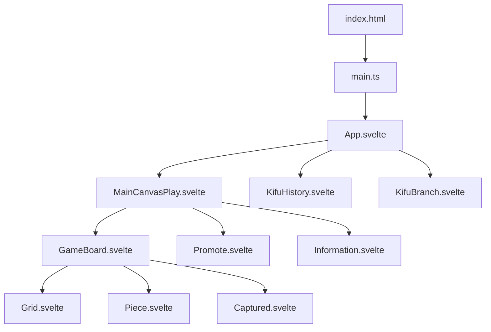
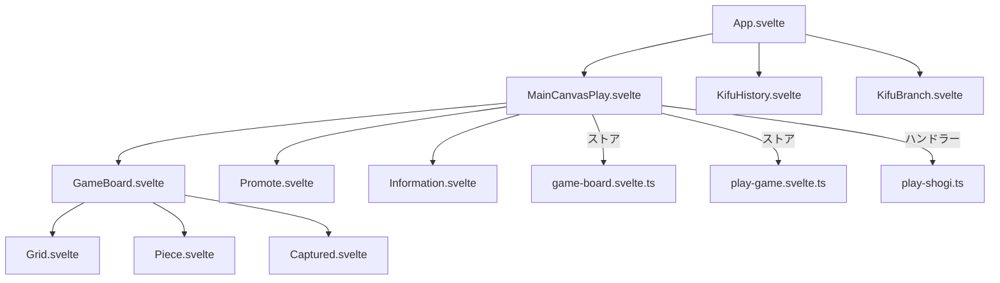
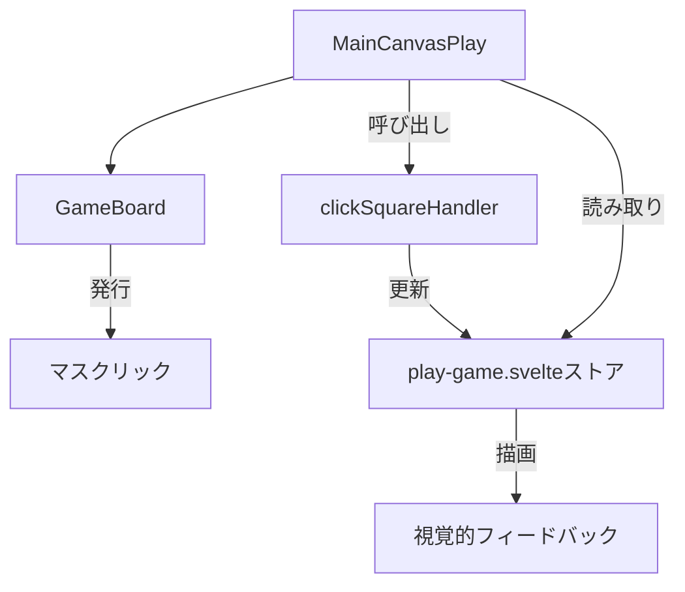

# UI コンポーネント

<cite>
**このドキュメントで参照されるファイル**   
- [index.html](file://index.html)
- [main.ts](file://src/main.ts)
- [App.svelte](file://src/App.svelte)
- [MainCanvasPlay.svelte](file://src/ui/main-canvas/MainCanvasPlay.svelte)
- [GameBoard.svelte](file://src/ui/main-canvas/game-board/GameBoard.svelte)
- [KifuHistory.svelte](file://src/ui/kifu-history/KifuHistory.svelte)
- [KifuBranch.svelte](file://src/ui/kifu-history/KifuBranch.svelte)
- [app.css](file://src/app.css)
</cite>

## 更新概要
**変更内容**   
- `KifuBranch.svelte`に自動スクロール機能が追加され、現在の分岐が常に可視領域に表示されるようになったことを記載
- `KifuHistory.svelte`と`KifuBranch.svelte`にキーボード操作のヒント（`<kbd>`タグ）が追加され、ユーザーに操作方法を視覚的に提示するようになったことを反映
- `KifuHistory.svelte`において、分岐のあるノードに「+」記号が表示されるようになったことを明記
- キーボード操作後のフォーカス管理が改善され、`containerRef.focus()`により意図しないフォーカスの保持を防ぐようになったことを記録
- 影響を受けるセクションの参照ファイルに更新履歴を明記

## 目次
1. [はじめに](#はじめに)
2. [プロジェクト構成](#プロジェクト構成)
3. [コアコンポーネント](#コアコンポーネント)
4. [アーキテクチャ概要](#アーキテクチャ概要)
5. [詳細なコンポーネント分析](#詳細なコンポーネント分析)
6. [スタイリングと視覚的フィードバック](#スタイリングと視覚的フィードバック)
7. [コンポーネントの状態とインタラクション](#コンポーネントの状態とインタラクション)
8. [アクセシビリティとレスポンシブデザイン](#アクセシビリティとレスポンシブデザイン)
9. [結論](#結論)

## はじめに
本ドキュメントは、SvelteとTypeScriptで構築された将棋アプリケーション「SvelteShogi」のUIアーキテクチャについて包括的に解説します。初期化プロセス、コンポーネント階層、スタイリング戦略、インタラクションパターンを詳細に記述し、開発者がUIを理解し、カスタマイズまたは拡張できるように支援します。既存のデザインシステムとの整合性を保ちながら開発を進められるよう、実装パターンを明確に示します。

## プロジェクト構成
SvelteShogiプロジェクトは、ドメイン、ハンドラー、ストア、UIコンポーネントによってモジュール化された構造を採用しています。エントリーポイントは`index.html`であり、`main.ts`を読み込んでSvelteアプリケーションを初期化します。主要なUIコンポーネントは`src/ui/`以下に配置され、`main-canvas`（将棋盤）や`kifu-history`（棋譜履歴）といった論理的なモジュールに分かれています。状態管理はストアが担当し、ユーザー操作はハンドラーが処理し、ゲームルールはドメイン層が担います。



**図の出典**
- [index.html](file://index.html#L0-L13)
- [main.ts](file://src/main.ts#L0-L9)
- [App.svelte](file://src/App.svelte#L0-L30)

**セクションの出典**
- [index.html](file://index.html#L0-L13)
- [main.ts](file://src/main.ts#L0-L9)
- [App.svelte](file://src/App.svelte#L0-L30)

## コアコンポーネント
SvelteShogiのコアUIコンポーネントは`main.ts`により初期化され、`App.svelte`コンポーネントをDOMにマウントします。`App.svelte`はルートコンポーネントとして、`MainCanvasPlay.svelte`（ゲームプレイ用）と`KifuHistory.svelte`（棋譜記録用）、`KifuBranch.svelte`（棋譜分岐表示用）を統合するレイアウトを担当します。これらのコンポーネントはSvelteのコンポーネントシステムを用いて構成されており、モジュール化と再利用性を実現しています。

**セクションの出典**
- [main.ts](file://src/main.ts#L0-L9)
- [App.svelte](file://src/App.svelte#L0-L30)

## アーキテクチャ概要
UIアーキテクチャは、高レベルのコンポーネントが特定のサブコンポーネントに描画とインタラクションを委譲する階層的構成を採用しています。`MainCanvasPlay.svelte`コンポーネントは、将棋盤、成り選択、情報表示を統合するコンテナとして機能します。Svelteストアとイベントハンドラーを活用して、指し手の妥当性や直前の手の表示といった視覚的フィードバックを調整します。



**図の出典**
- [App.svelte](file://src/App.svelte#L0-L30)
- [MainCanvasPlay.svelte](file://src/ui/main-canvas/MainCanvasPlay.svelte#L0-L318)
- [GameBoard.svelte](file://src/ui/main-canvas/game-board/GameBoard.svelte#L0-L212)

## 詳細なコンポーネント分析

### App.svelte: ルートレイアウトの統括
`App.svelte`コンポーネントは、将棋盤と棋譜履歴、分岐表示を横並びに配置するためのトップレベルレイアウトを定義します。`MainCanvasPlay.svelte`および`KifuHistory.svelte`、`KifuBranch.svelte`をインポート・インスタンス化し、主なUI構造を確立します。

```svelte
<main>
  <div class="container">
    <GameCanvas />
    <div class="subcanvas">
      <KifuHistory />
      <KifuBranch />
    </div>
  </div>
</main>
```

`.container`クラスはCSS Flexboxを使用してコンポーネントを水平方向に配置し、将棋盤側が柔軟に拡縮し、棋譜履歴・分岐側は固定幅で表示されます。

**セクションの出典**
- [App.svelte](file://src/App.svelte#L0-L30)

### MainCanvasPlay.svelte: ゲームインターフェースの中核
`MainCanvasPlay.svelte`は、ゲームプレイの中心となるコンポーネントで、将棋盤、指し手の妥当性チェック、視覚的フィードバックレイヤーを統合します。`GameBoard.svelte`から取得したDOM参照を用いて、指し手のインジケーターや成り選択の位置を計算します。

主な機能:
- **状態管理**: `relativeSquarePositions`などのリアクティブ変数に`$state`および`$derived`を使用
- **視覚的オーバーレイ**: `.cannot-move-square`、`.last-move`、`.promotion-square`などのdivを絶対位置で動的に描画
- **イベント処理**: `play-shogi.ts`からインポートしたハンドラーにクリックイベントを委譲



**図の出典**
- [MainCanvasPlay.svelte](file://src/ui/main-canvas/MainCanvasPlay.svelte#L0-L318)

**セクションの出典**
- [MainCanvasPlay.svelte](file://src/ui/main-canvas/MainCanvasPlay.svelte#L0-L318)

### GameBoard.svelte: インタラクティブな将棋盤レンダラー
`GameBoard.svelte`は`Grid`コンポーネントを使用して9x9の将棋盤を描画し、計算された位置に`Piece`コンポーネントをオーバーレイします。`reverse`プロパティにより盤面の反転をサポートし、駒の向きや配置順序に影響を与えます。

このコンポーネントは`bind:this`を使用してマス目と捕獲駒のDOM要素を取得し、親コンポーネントにおける視覚的フィードバックレイヤーの正確な座標計算を可能にします。

```svelte
<div class="game-board" bind:this={gameBoardElement}>
  <Grid bind:squareElements={squareElements} />
  {#if squareElements.length > 0}
    <div class="pieces-layer">
      {#each {length: 9}, row}
        {#each {length: 9}, col}
          <div class="piece-wrapper" style="top: {y}px; left: {x}px;">
            <Piece reverse={pieceIsSente} />
          </div>
        {/each}
      {/each}
    </div>
  {/if}
</div>
```

**セクションの出典**
- [GameBoard.svelte](file://src/ui/main-canvas/game-board/GameBoard.svelte#L0-L212)

## スタイリングと視覚的フィードバック
アプリケーションはハイブリッドなスタイリング手法を採用しています：
- **グローバルスタイル**: `app.css`で基本のタイポグラフィとレイアウトを定義
- **スコープ付きスタイル**: Svelteのスタイルスコープ機能を使用したコンポーネント固有のCSS

視覚的フィードバックは絶対位置のレイヤーdivで実装されています：
- **直前の手のインジケーター**: 最新の指し手に緑色のオーバーレイ
- **無効な手のブロッキング**: 駒が動けないマスに半透明の赤色レイヤー
- **成り選択のプロンプト**: 成りゾーンに入った際に暗色オーバーレイと`Promote`コンポーネントを表示

これらのオーバーレイはDOMのバウンディング矩形から導出される相対座標を使用して配置され、レイアウト変更に関わらず正確な位置合わせが保証されます。

```css
.last-move {
  position: absolute;
  background-color: rgba(0, 255, 0, 0.2);
  z-index: 5;
}
```

**セクションの出典**
- [MainCanvasPlay.svelte](file://src/ui/main-canvas/MainCanvasPlay.svelte#L0-L318)
- [app.css](file://src/app.css)

## コンポーネントの状態とインタラクション
コンポーネントは以下の状態に応じて反応します：
- **選択状態**: `Piece.svelte`の`isHanded`プロパティが駒選択時にtrueになる
- **ホバー状態**: 明示的に実装されていないが、CSSの`:hover`で拡張可能
- **無効状態**: 無効な手は`pointer-events: none`により視覚的にブロックされ、非インタラクティブになる

ユーザーインタラクションはコールバックプロパティで処理されます：
- `clickSquareHandler`: 将棋盤のマスがクリックされたときに発火
- `clickCapturedHandler`: 打つ駒を選択するためのイベント
- `clickPromotionHandler`: 成りの可否を確定またはキャンセル

これらのハンドラーは`play-shogi.ts`で定義され、ストアと連携してゲーム状態を更新します。

**セクションの出典**
- [MainCanvasPlay.svelte](file://src/ui/main-canvas/MainCanvasPlay.svelte#L0-L318)
- [GameBoard.svelte](file://src/ui/main-canvas/game-board/GameBoard.svelte#L0-L212)
- [play-shogi.ts](file://src/handler/play-shogi.ts)

## アクセシビリティとレスポンシブデザイン
UIはレスポンシブ設計されており、flexboxと相対単位を使用して異なる画面サイズに適応します。将棋盤は比例的にスケーリングされ、CSSメディアクエリ（記載なし）により狭い画面では縦積みレイアウトに切り替わります。

アクセシビリティに関する考慮事項：
- **キーボードナビゲーション**: 上下左右の矢印キーで棋譜履歴を操作可能。左右矢印キーは初期・最終局面への移動に使用。入力フィールド以外ではグローバルに有効。
- **スクリーンリーダー対応**: ARIAラベルをインタラクティブ要素に追加可能
- **色のコントラスト**: オーバーレイは半透明で、下層コンテンツを隠さないよう配慮
- **フォーカスリング**: `KifuHistory.svelte`、`Captured.svelte`、`Grid.svelte`、`Promote.svelte`の各コンポーネントで`:focus`時のoutlineを`none`に設定し、視覚的デザインの一貫性を向上
- **分岐操作のキーボードサポート**: スペースキーで次の棋譜分岐に移動可能。入力フィールドにフォーカスがない限り、アプリケーションのどこからでも操作可能。
- **キーボード操作のヒント表示**: `KifuHistory.svelte`と`KifuBranch.svelte`に`<kbd>`タグによるキーボード操作のヒントが追加され、ユーザーが操作方法を容易に理解できるようになった。

UIを拡張する開発者は、一貫したフォーカスインジケーターを維持し、すべてのインタラクティブ要素がキーボードからアクセス可能であることを保証すべきです。

**セクションの出典**
- [App.svelte](file://src/App.svelte#L0-L30)
- [MainCanvasPlay.svelte](file://src/ui/main-canvas/MainCanvasPlay.svelte#L0-L318)
- [KifuHistory.svelte](file://src/ui/kifu-history/KifuHistory.svelte) - *最近のコミットで更新*
- [KifuBranch.svelte](file://src/ui/kifu-history/KifuBranch.svelte) - *新規追加*
- [Captured.svelte](file://src/ui/main-canvas/game-board/Captured.svelte) - *最近のコミットで更新*
- [Grid.svelte](file://src/ui/main-canvas/game-board/Grid.svelte) - *最近のコミットで更新*
- [Piece.svelte](file://src/ui/main-canvas/game-board/Piece.svelte) - *最近のコミットで更新*
- [Promote.svelte](file://src/ui/main-canvas/game-board/Promote.svelte) - *最近のコミットで更新*

### KifuHistory.svelte: 棋譜履歴の表示と操作
`KifuHistory.svelte`コンポーネントは、棋譜の履歴を一列表示し、現在の手の位置に自動でスクロールする機能を備えています。`$effect`ブロック内で`getCurrentIndex()`の変更を監視し、`scrollIntoView`でスムーズにスクロールします。

また、キーボード操作（↑↓キー）で履歴を移動でき、現在の手にフォーカスを当てるようになっています。`tabindex="-1"`が不要な要素に適用され、キーボードナビゲーションの挙動が最適化されています。

お気に入りの手には星マーク（★）が表示され、現在の手の位置に限りクリックでトグル可能。星の色は通常時と選択時で変化し、視覚的に区別されます。

さらに、左右矢印キーによる初期・最終局面への移動機能が追加されました。左矢印キーで初期局面、右矢印キーで最終局面に移動可能です。これらの操作はグローバルキーハンドラにより実装されており、入力フィールドにフォーカスがない限り、アプリケーションのどこからでも操作できます。

**分岐の可視化**: 分岐のあるノードには「+」記号が表示され、視覚的に分岐の存在を示します。これは`node.br_next !== id`の条件でレンダリングされます。

**フォーカス管理の改善**: キーボード操作後に`containerRef.focus()`を呼び出すことで、フォーカスが意図せず他の要素に移動しないようにし、操作の安定性を向上させています。

```svelte
<div
  class="kifu-history"
  role="listbox"
  tabindex="0"
  bind:this={containerRef}
  onkeydown={handleKeyDown}
>
  {#each ids as id, index}
    <div
      class="kifu-history-item"
      class:current={id === getCurrentIndex()}
      role="button"
      tabindex="-1"
      aria-current={id === getCurrentIndex() ? "true" : undefined}
      onclick={() => jumpToKifu(id)}
    >
      <div class="kifu-history-item-display">{node.display}</div>
      {#if index != 0}
        <div
          class="kifu-history-item-favorite"
          class:favorite={node.isFavorite}
          role="button"
          tabindex="-1"
          onclick={id === getCurrentIndex() ? () => toggleFavorite(id) : undefined}
        >
          <div class="kifu-history-item-favorite-content">★</div>
        </div>
        <div class="has-branch-flg">
          {#if node.br_next !== id}
            <div class="has-branch-flg-content">＋</div>
          {/if}
        </div>
      {/if}
    </div>
  {/each}
</div>
```

**セクションの出典**
- [KifuHistory.svelte](file://src/ui/kifu-history/KifuHistory.svelte#L0-L244) - *最近のコミットで更新*

### KifuBranch.svelte: 棋譜分岐の表示と操作
`KifuBranch.svelte`コンポーネントは、現在の局面から分岐している棋譜の選択肢を表示し、ユーザーが分岐を切り替えることを可能にします。各分岐は独立した手順として表示され、現在の手の分岐位置に「+」マークが表示されます。

主な機能:
- **分岐の可視化**: `getBranches()`ストア関数を使用して分岐ノードを取得し、一覧表示
- **分岐切り替え**: クリックまたはEnterキーで分岐を切り替え
- **グローバルキーボード操作**: スペースキーで次の分岐に移動。入力フィールドにフォーカスがない限り、アプリケーションのどこからでも操作可能
- **現在の分岐の強調表示**: `current`クラスで現在選択中の分岐を視覚的に強調
- **自動スクロール**: `$effect`ブロックにより、現在の分岐が常に可視領域に表示されるよう自動スクロールが行われます。
- **キーボード操作のヒント**: 画面上に`<kbd>Space</kbd>`のヒントが表示され、ユーザーが操作方法を容易に理解できます。

```svelte
<div class="kifu-branch">
  <div class="kifu-branch-keyboard-hint">
    <kbd>Space</kbd>
  </div>
  <div class="kifu-branch-list" role="listbox" bind:this={containerRef}>
    {#each getBranches() as id, index}
      {@const node = getNode(id)}
      <div
        class="kifu-branch-item"
        class:current={id === getCurrentIndex()}
        role="button"
        tabindex="-1"
        aria-current={id === getCurrentIndex() ? "true" : undefined}
        onclick={() => switchBranch(id)}
        onkeydown={(e) => {
          if (e.key === "Enter" || e.key === " ") {
            switchBranch(id);
          }
        }}
      >
        <div class="kifu-branch-item-favorite">
          {#if node.isFavorite}
            <div class="kifu-branch-item-favorite-content">★</div>
          {/if}
        </div>
        <div class="kifu-branch-item-display">
          {node.display}
        </div>
      </div>
    {/each}
  </div>
</div>
```

**セクションの出典**
- [KifuBranch.svelte](file://src/ui/kifu-history/KifuBranch.svelte#L0-L124) - *新規追加*

## 結論
SvelteShogiのUIアーキテクチャは、コンポーネントの合成、リアクティブな状態管理、レイヤー化された視覚的フィードバックによる関心の分離を明確に実現しています。Svelteのリアクティビティとスコープ付きスタイリングを活用することで、レスポンシブでインタラクティブなゲームプレイ体験を実現しています。開発者は、状態バインディング、イベント処理、視覚レイヤーの既存パターンに従うことで、コードベース全体で一貫性を保ちながらUIを拡張できます。